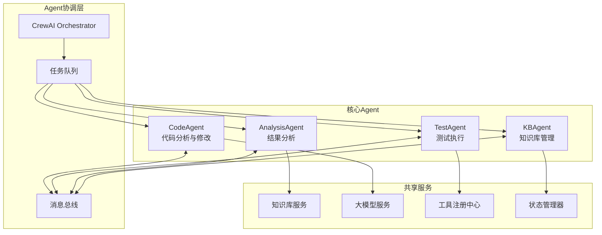
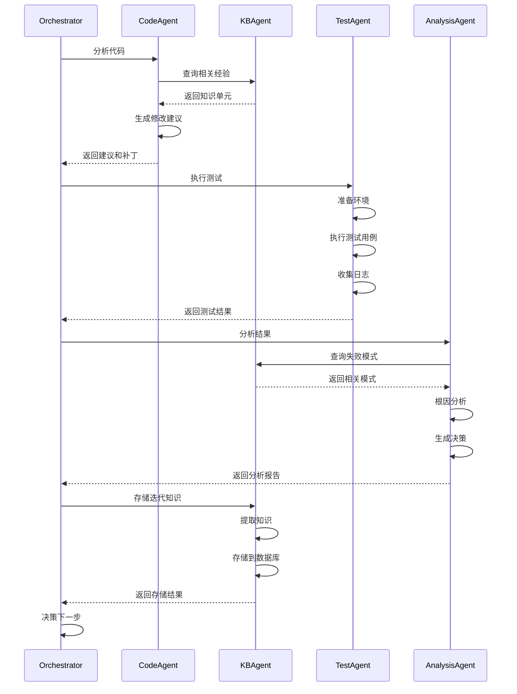

# AI驱动固件智能测试系统 — Agent详细设计（AGENT_DESIGN）

> 文档版本：v1.0
>
> 目标：定义系统中各Agent的详细设计，包括职责、能力、工具库、接口、通信协议与协作机制。
>
> 基于：Phase 1 任务1-4 Agent和状态机设计

---

## 1. Agent架构总览

### 1.1 Agent设计原则

本系统采用**多Agent协作架构**，基于CrewAI框架实现，遵循以下设计原则：

- **单一职责**：每个Agent专注于特定领域的任务
- **自主决策**：Agent具备独立的决策能力和工具库
- **协作通信**：通过标准化协议进行Agent间通信
- **知识增强**：所有Agent都可以访问统一的知识库
- **可扩展性**：支持新Agent类型的快速接入
- **可观测性**：所有Agent行为可审计、可追溯

### 1.2 Agent体系结构



### 1.3 Agent基础接口

所有Agent必须实现统一的基础接口：

```python
from abc import ABC, abstractmethod
from typing import Dict, Any, List, Optional
from pydantic import BaseModel, Field
from datetime import datetime
import uuid

class AgentCapability(BaseModel):
    """Agent能力定义"""
    name: str
    description: str
    input_schema: Dict[str, Any]
    output_schema: Dict[str, Any]
    constraints: Optional[Dict[str, Any]] = None

class AgentMetadata(BaseModel):
    """Agent元数据"""
    agent_id: str = Field(default_factory=lambda: str(uuid.uuid4()))
    agent_type: str
    version: str
    capabilities: List[AgentCapability]
    created_at: datetime = Field(default_factory=datetime.now)
    status: str = "initialized"

class Task(BaseModel):
    """任务定义"""
    task_id: str = Field(default_factory=lambda: str(uuid.uuid4()))
    task_type: str
    description: str
    input_data: Dict[str, Any]
    context: Dict[str, Any] = {}
    priority: int = 5
    timeout: int = 3600
    created_at: datetime = Field(default_factory=datetime.now)

class TaskResult(BaseModel):
    """任务结果"""
    task_id: str
    agent_id: str
    status: str  # 'success', 'failed', 'partial', 'timeout'
    output_data: Dict[str, Any]
    metrics: Dict[str, float] = {}
    error_message: Optional[str] = None
    execution_time: float
    completed_at: datetime = Field(default_factory=datetime.now)

class AgentBase(ABC):
    """Agent基础抽象类"""
    
    def __init__(self, config: Dict[str, Any]):
        self.config = config
        self.metadata = self._initialize_metadata()
        self.tools = self._initialize_tools()
        self.llm = self._initialize_llm()
        self.knowledge_base = self._initialize_knowledge_base()
        
    @abstractmethod
    def _initialize_metadata(self) -> AgentMetadata:
        """初始化Agent元数据"""
        pass
    
    @abstractmethod
    def _initialize_tools(self) -> Dict[str, Any]:
        """初始化Agent工具库"""
        pass
    
    @abstractmethod
    async def process(self, task: Task) -> TaskResult:
        """处理任务的主入口"""
        pass
    
    @abstractmethod
    def get_capabilities(self) -> List[AgentCapability]:
        """返回Agent的能力列表"""
        pass
    
    @abstractmethod
    async def communicate(self, message: 'AgentMessage') -> 'AgentMessage':
        """与其他Agent通信"""
        pass
    
    async def validate_input(self, task: Task) -> bool:
        """验证输入数据"""
        # 基础验证逻辑
        return True
    
    async def log_activity(self, activity: str, data: Dict[str, Any]):
        """记录活动日志"""
        # 日志记录逻辑
        pass
```

---

## 2. CodeAgent详细设计

### 2.1 职责定义

**CodeAgent**是系统中的代码智能专家，负责所有与代码相关的分析、理解和修改任务。

**核心职责**：
- **代码解析与分析**：使用Tree-sitter等工具解析C/C++代码，理解代码结构
- **问题诊断**：基于静态分析和AI推理，识别潜在问题和优化点
- **修改建议生成**：根据需求和测试结果，生成代码修改建议
- **代码实现**：自动实现代码修改并生成可应用的补丁
- **代码审查**：确保修改后的代码符合项目规范和最佳实践

**设计目标**：
- 高准确率的问题识别（目标：>85%）
- 可应用的代码建议（目标：>70%可直接应用）
- 符合项目代码规范和风格
- 可追溯的修改记录

### 2.2 核心能力

```yaml
能力1 - 代码解析与理解:
  描述: 解析C/C++代码并构建语义理解
  工具:
    - Tree-sitter C/C++解析器
    - Clang AST分析器
    - 符号表构建器
    - 依赖关系分析器
  输入: 源代码文件路径列表
  输出: 代码结构分析报告
  
能力2 - 静态分析:
  描述: 执行静态代码分析，发现潜在问题
  工具:
    - clang-tidy
    - cppcheck
    - 自定义规则引擎
  输入: 代码分析报告
  输出: 问题列表（含严重性、位置、建议）
  
能力3 - AI辅助诊断:
  描述: 使用大模型进行深度代码理解和问题诊断
  工具:
    - 大模型API（支持代码理解）
    - 提示工程模板
    - 上下文增强（RAG）
  输入: 代码片段 + 问题描述
  输出: 诊断报告和修改方向
  
能力4 - 代码修改生成:
  描述: 生成可应用的代码修改
  工具:
    - 代码生成模板
    - Git diff生成器
    - 代码格式化工具
  输入: 修改建议 + 目标代码
  输出: Git patch文件
  
能力5 - 代码审查:
  描述: 审查生成的代码修改
  工具:
    - 编译检查
    - 风格检查
    - 逻辑一致性检查
  输入: 修改后的代码
  输出: 审查报告
```

### 2.3 数据结构

```python
from dataclasses import dataclass
from typing import List, Dict, Optional, Set
from enum import Enum

class IssueType(Enum):
    """问题类型"""
    MEMORY_LEAK = "memory_leak"
    NULL_POINTER = "null_pointer"
    BUFFER_OVERFLOW = "buffer_overflow"
    RACE_CONDITION = "race_condition"
    LOGIC_ERROR = "logic_error"
    PERFORMANCE_ISSUE = "performance_issue"
    CODE_SMELL = "code_smell"
    STYLE_VIOLATION = "style_violation"

class IssueSeverity(Enum):
    """问题严重性"""
    CRITICAL = "critical"
    HIGH = "high"
    MEDIUM = "medium"
    LOW = "low"
    INFO = "info"

@dataclass
class CodeLocation:
    """代码位置"""
    file_path: str
    line_start: int
    line_end: int
    column_start: Optional[int] = None
    column_end: Optional[int] = None
    function_name: Optional[str] = None
    
@dataclass
class CodeIssue:
    """代码问题"""
    issue_id: str
    issue_type: IssueType
    severity: IssueSeverity
    location: CodeLocation
    title: str
    description: str
    evidence: List[str]
    related_issues: List[str] = None
    suggested_fix: Optional[str] = None
    confidence: float = 0.0

@dataclass
class CodeMetrics:
    """代码度量"""
    lines_of_code: int
    cyclomatic_complexity: int
    cognitive_complexity: int
    function_count: int
    class_count: int
    comment_ratio: float
    test_coverage: Optional[float] = None

@dataclass
class CodeAnalysis:
    """代码分析结果"""
    analysis_id: str
    target_files: List[str]
    issues: List[CodeIssue]
    metrics: CodeMetrics
    dependencies: Dict[str, List[str]]
    complexity_score: float
    maintainability_index: float
    recommendations: List[str]
    timestamp: datetime

@dataclass
class CodeSuggestion:
    """代码修改建议"""
    suggestion_id: str
    issue_id: Optional[str]
    change_type: str  # 'fix', 'optimize', 'refactor', 'feature'
    priority: int  # 1-10
    title: str
    description: str
    rationale: str
    code_before: str
    code_after: str
    affected_files: List[str]
    estimated_impact: str  # 'high', 'medium', 'low'
    confidence: float
    requires_test: bool = True

@dataclass
class PatchResult:
    """补丁生成结果"""
    patch_id: str
    suggestions: List[str]  # suggestion_ids
    patch_content: str
    files_modified: Dict[str, str]  # file_path -> change_summary
    lines_added: int
    lines_removed: int
    build_status: str  # 'success', 'failed', 'not_tested'
    build_output: Optional[str] = None
    test_suggestions: List[str] = None
    created_at: datetime = None
```

### 2.4 工具库实现

```python
from tree_sitter import Language, Parser
import subprocess
from pathlib import Path

class CodeAgent(AgentBase):
    """代码分析与修改专家"""
    
    def _initialize_metadata(self) -> AgentMetadata:
        return AgentMetadata(
            agent_type="CodeAgent",
            version="1.0.0",
            capabilities=self.get_capabilities()
        )
    
    def _initialize_tools(self) -> Dict[str, Any]:
        return {
            'code_parser': TreeSitterCodeParser(),
            'static_analyzer': ClangStaticAnalyzer(),
            'dependency_analyzer': DependencyAnalyzer(),
            'patch_generator': GitPatchGenerator(),
            'test_generator': TestCaseGenerator(),
            'code_formatter': CodeFormatter(),
            'build_tester': BuildTester(),
        }
    
    async def process(self, task: Task) -> TaskResult:
        """处理代码相关任务"""
        start_time = datetime.now()
        
        try:
            task_type = task.task_type
            
            if task_type == "analyze_code":
                result = await self.analyze_code(
                    task.input_data.get("file_paths"),
                    task.context
                )
            elif task_type == "generate_suggestions":
                result = await self.generate_suggestions(
                    task.input_data.get("analysis"),
                    task.input_data.get("requirements"),
                    task.context
                )
            elif task_type == "implement_changes":
                result = await self.implement_changes(
                    task.input_data.get("suggestions"),
                    task.context
                )
            else:
                raise ValueError(f"Unsupported task type: {task_type}")
            
            execution_time = (datetime.now() - start_time).total_seconds()
            
            return TaskResult(
                task_id=task.task_id,
                agent_id=self.metadata.agent_id,
                status="success",
                output_data=result,
                execution_time=execution_time
            )
            
        except Exception as e:
            execution_time = (datetime.now() - start_time).total_seconds()
            return TaskResult(
                task_id=task.task_id,
                agent_id=self.metadata.agent_id,
                status="failed",
                output_data={},
                error_message=str(e),
                execution_time=execution_time
            )
    
    async def analyze_code(self, file_paths: List[str], 
                          context: Dict[str, Any]) -> Dict[str, Any]:
        """分析代码并生成分析报告"""
        
        # 1. 解析代码结构
        parsed_files = []
        for file_path in file_paths:
            parsed = await self.tools['code_parser'].parse_file(file_path)
            parsed_files.append(parsed)
        
        # 2. 静态分析
        static_issues = await self.tools['static_analyzer'].analyze(file_paths)
        
        # 3. 依赖分析
        dependencies = await self.tools['dependency_analyzer'].analyze(file_paths)
        
        # 4. 计算代码度量
        metrics = await self._calculate_metrics(parsed_files)
        
        # 5. AI辅助分析（使用知识增强）
        enhanced_context = await self.enhance_with_knowledge(
            f"Analyzing code in files: {', '.join(file_paths)}",
            context
        )
        
        ai_insights = await self._ai_analyze(
            parsed_files, static_issues, enhanced_context
        )
        
        # 6. 综合分析结果
        analysis = CodeAnalysis(
            analysis_id=str(uuid.uuid4()),
            target_files=file_paths,
            issues=static_issues + ai_insights.get('issues', []),
            metrics=metrics,
            dependencies=dependencies,
            complexity_score=metrics.cyclomatic_complexity / len(file_paths),
            maintainability_index=self._calculate_maintainability(metrics),
            recommendations=ai_insights.get('recommendations', []),
            timestamp=datetime.now()
        )
        
        return {"analysis": analysis}
    
    async def generate_suggestions(self, analysis: CodeAnalysis,
                                 requirements: str,
                                 context: Dict[str, Any]) -> Dict[str, Any]:
        """基于分析结果生成修改建议"""
        
        suggestions = []
        
        # 1. 为每个高优先级问题生成修复建议
        critical_issues = [
            issue for issue in analysis.issues 
            if issue.severity in [IssueSeverity.CRITICAL, IssueSeverity.HIGH]
        ]
        
        for issue in critical_issues:
            # 检索相关知识
            knowledge_query = f"{issue.issue_type.value}: {issue.description}"
            relevant_knowledge = await self.retrieve_relevant_knowledge(
                knowledge_query, context
            )
            
            # 生成修改建议
            suggestion = await self._generate_fix_suggestion(
                issue, relevant_knowledge, context
            )
            suggestions.append(suggestion)
        
        # 2. 基于需求生成优化建议
        if requirements:
            optimization_suggestions = await self._generate_optimization_suggestions(
                analysis, requirements, context
            )
            suggestions.extend(optimization_suggestions)
        
        # 3. 排序建议（按优先级和置信度）
        suggestions.sort(
            key=lambda s: (s.priority, s.confidence), 
            reverse=True
        )
        
        return {"suggestions": suggestions}
    
    async def implement_changes(self, suggestions: List[CodeSuggestion],
                              context: Dict[str, Any]) -> Dict[str, Any]:
        """实现代码修改并生成补丁"""
        
        # 1. 选择要实现的建议（基于置信度和优先级）
        selected_suggestions = [
            s for s in suggestions 
            if s.confidence > 0.7 and s.priority >= 7
        ]
        
        if not selected_suggestions:
            selected_suggestions = suggestions[:3]  # 至少选择前3个
        
        # 2. 应用修改
        modified_files = {}
        for suggestion in selected_suggestions:
            for file_path in suggestion.affected_files:
                if file_path not in modified_files:
                    modified_files[file_path] = []
                modified_files[file_path].append(suggestion)
        
        # 3. 生成补丁
        patch_content = await self.tools['patch_generator'].generate_patch(
            modified_files, selected_suggestions
        )
        
        # 4. 格式化代码
        formatted_patch = await self.tools['code_formatter'].format_patch(
            patch_content
        )
        
        # 5. 测试构建
        build_result = await self.tools['build_tester'].test_build(
            formatted_patch, context.get('build_config')
        )
        
        # 6. 生成测试建议
        test_suggestions = await self.tools['test_generator'].generate_tests(
            selected_suggestions
        )
        
        patch_result = PatchResult(
            patch_id=str(uuid.uuid4()),
            suggestions=[s.suggestion_id for s in selected_suggestions],
            patch_content=formatted_patch,
            files_modified={
                file: f"Applied {len(suggs)} changes"
                for file, suggs in modified_files.items()
            },
            lines_added=build_result.get('lines_added', 0),
            lines_removed=build_result.get('lines_removed', 0),
            build_status=build_result.get('status', 'not_tested'),
            build_output=build_result.get('output'),
            test_suggestions=test_suggestions,
            created_at=datetime.now()
        )
        
        return {"patch": patch_result}
    
    def get_capabilities(self) -> List[AgentCapability]:
        """返回Agent的能力列表"""
        return [
            AgentCapability(
                name="analyze_code",
                description="分析C/C++代码，识别问题和优化机会",
                input_schema={
                    "file_paths": "List[str]",
                    "context": "Dict[str, Any]"
                },
                output_schema={
                    "analysis": "CodeAnalysis"
                }
            ),
            AgentCapability(
                name="generate_suggestions",
                description="基于分析结果生成代码修改建议",
                input_schema={
                    "analysis": "CodeAnalysis",
                    "requirements": "str",
                    "context": "Dict[str, Any]"
                },
                output_schema={
                    "suggestions": "List[CodeSuggestion]"
                }
            ),
            AgentCapability(
                name="implement_changes",
                description="实现代码修改并生成补丁",
                input_schema={
                    "suggestions": "List[CodeSuggestion]",
                    "context": "Dict[str, Any]"
                },
                output_schema={
                    "patch": "PatchResult"
                }
            )
        ]
```

---

## 3. TestAgent详细设计

### 3.1 职责定义

**TestAgent**负责测试环境的管理和测试执行，是系统与各种测试环境交互的桥梁。

**核心职责**：
- **环境管理**：准备、配置和清理测试环境（QEMU/目标板）
- **测试执行**：在指定环境中执行测试用例和测试计划
- **日志收集**：收集测试日志、系统日志和性能数据
- **状态监控**：监控测试环境和测试执行状态
- **结果汇总**：汇总测试结果并生成结构化报告

**设计目标**：
- 支持多种测试环境的统一抽象
- 高可靠性的测试执行（自动重试、错误恢复）
- 完整的日志收集和结果追溯
- 资源的高效管理和清理

### 3.2 核心能力

```yaml
能力1 - 测试环境管理:
  描述: 管理多种测试环境的生命周期
  环境类型:
    - QEMU虚拟化环境
    - BMC控制的目标板
    - 树莓派开发板
    - Windows脚本环境
  操作:
    - 环境初始化
    - 固件加载
    - 环境启动
    - 环境清理
    
能力2 - 测试用例执行:
  描述: 执行测试用例并监控状态
  支持:
    - 单个测试用例
    - 测试套件
    - 并行测试
    - 条件测试
  监控:
    - 执行状态
    - 资源使用
    - 超时控制
    - 错误检测
    
能力3 - 日志与数据收集:
  描述: 收集测试相关的所有数据
  收集内容:
    - 串口输出
    - 系统日志
    - 性能指标
    - 错误日志
    - 环境快照
    
能力4 - 环境适配:
  描述: 适配不同类型的测试环境
  适配器:
    - QEMUAdapter
    - BMCAdapter
    - RaspberryPiAdapter
    - WindowsScriptAdapter
  统一接口:
    - setup/cleanup
    - execute_test
    - collect_logs
```

### 3.3 数据结构

```python
from enum import Enum
from dataclasses import dataclass, field
from typing import List, Dict, Optional, Any

class TestEnvironmentType(Enum):
    """测试环境类型"""
    QEMU = "qemu"
    BMC_BOARD = "bmc_board"
    RASPBERRY_PI = "raspberry_pi"
    WINDOWS_SCRIPT = "windows_script"

class TestStatus(Enum):
    """测试状态"""
    PENDING = "pending"
    RUNNING = "running"
    PASSED = "passed"
    FAILED = "failed"
    TIMEOUT = "timeout"
    ERROR = "error"
    SKIPPED = "skipped"

@dataclass
class TestConfig:
    """测试配置"""
    environment_type: TestEnvironmentType
    firmware_image: str
    test_suite: str
    test_cases: List[str]
    timeout: int = 3600
    retry_count: int = 3
    parallel: bool = False
    resources: Dict[str, Any] = field(default_factory=dict)
    network_config: Optional[Dict[str, Any]] = None
    storage_config: Optional[Dict[str, Any]] = None

@dataclass
class TestCase:
    """测试用例"""
    case_id: str
    name: str
    description: str
    command: str
    expected_output: Optional[str] = None
    timeout: int = 300
    prerequisites: List[str] = field(default_factory=list)
    cleanup_commands: List[str] = field(default_factory=list)

@dataclass
class TestPlan:
    """测试计划"""
    test_id: str
    name: str
    description: str
    test_cases: List[TestCase]
    config: TestConfig
    metadata: Dict[str, Any] = field(default_factory=dict)

@dataclass
class TestAssertion:
    """测试断言结果"""
    assertion_id: str
    test_case: str
    assertion_type: str  # 'equals', 'contains', 'matches', 'custom'
    expected: Any
    actual: Any
    status: str  # 'pass', 'fail'
    message: str
    timestamp: datetime = field(default_factory=datetime.now)

@dataclass
class TestCaseResult:
    """单个测试用例结果"""
    case_id: str
    status: TestStatus
    start_time: datetime
    end_time: datetime
    duration: float
    output: str
    error: Optional[str] = None
    assertions: List[TestAssertion] = field(default_factory=list)
    artifacts: Dict[str, str] = field(default_factory=dict)

@dataclass
class TestResult:
    """完整测试结果"""
    test_id: str
    execution_id: str
    environment: TestEnvironmentType
    status: TestStatus
    start_time: datetime
    end_time: datetime
    duration: float
    
    # 测试用例结果
    test_case_results: List[TestCaseResult] = field(default_factory=list)
    
    # 日志和输出
    console_logs: List[str] = field(default_factory=list)
    system_logs: List[str] = field(default_factory=list)
    error_logs: List[str] = field(default_factory=list)
    
    # 性能数据
    performance_metrics: Dict[str, float] = field(default_factory=dict)
    
    # 环境信息
    environment_snapshot: Dict[str, Any] = field(default_factory=dict)
    
    # 统计信息
    total_cases: int = 0
    passed_cases: int = 0
    failed_cases: int = 0
    skipped_cases: int = 0
```

### 3.4 TestAgent实现

```python
class TestAgent(AgentBase):
    """测试执行专家"""
    
    def _initialize_metadata(self) -> AgentMetadata:
        return AgentMetadata(
            agent_type="TestAgent",
            version="1.0.0",
            capabilities=self.get_capabilities()
        )
    
    def _initialize_tools(self) -> Dict[str, Any]:
        return {
            'qemu_adapter': QEMUAdapter,
            'bmc_adapter': BMCAdapter,
            'pi_adapter': RaspberryPiAdapter,
            'windows_adapter': WindowsScriptAdapter,
            'log_collector': LogCollector(),
            'performance_monitor': PerformanceMonitor(),
            'resource_manager': ResourceManager(),
        }
    
    async def process(self, task: Task) -> TaskResult:
        """处理测试相关任务"""
        start_time = datetime.now()
        
        try:
            task_type = task.task_type
            
            if task_type == "execute_test_plan":
                result = await self.execute_test_plan(
                    task.input_data.get("test_plan"),
                    task.context
                )
            elif task_type == "setup_environment":
                result = await self.setup_environment(
                    task.input_data.get("config"),
                    task.context
                )
            elif task_type == "cleanup_environment":
                result = await self.cleanup_environment(
                    task.input_data.get("environment_id"),
                    task.context
                )
            else:
                raise ValueError(f"Unsupported task type: {task_type}")
            
            execution_time = (datetime.now() - start_time).total_seconds()
            
            return TaskResult(
                task_id=task.task_id,
                agent_id=self.metadata.agent_id,
                status="success",
                output_data=result,
                execution_time=execution_time
            )
            
        except Exception as e:
            execution_time = (datetime.now() - start_time).total_seconds()
            return TaskResult(
                task_id=task.task_id,
                agent_id=self.metadata.agent_id,
                status="failed",
                output_data={},
                error_message=str(e),
                execution_time=execution_time
            )
    
    async def execute_test_plan(self, test_plan: TestPlan,
                               context: Dict[str, Any]) -> Dict[str, Any]:
        """执行测试计划"""
        
        # 1. 设置测试环境
        adapter_class = self.tools[f"{test_plan.config.environment_type.value}_adapter"]
        environment = adapter_class(test_plan.config)
        
        setup_success = await environment.initialize()
        if not setup_success:
            raise Exception(f"Failed to initialize {test_plan.config.environment_type}")
        
        # 2. 执行测试
        test_result = await environment.execute_test(test_plan)
        
        # 3. 收集日志
        logs = await environment.collect_logs()
        test_result.console_logs = logs.get('console', [])
        test_result.system_logs = logs.get('system', [])
        test_result.error_logs = logs.get('error', [])
        
        # 4. 收集性能指标
        metrics = await self.tools['performance_monitor'].collect_metrics(
            environment.context.environment_id
        )
        test_result.performance_metrics = metrics
        
        # 5. 清理环境（可选）
        if context.get('auto_cleanup', True):
            await environment.cleanup()
        
        return {"test_result": test_result}
    
    def get_capabilities(self) -> List[AgentCapability]:
        """返回Agent的能力列表"""
        return [
            AgentCapability(
                name="execute_test_plan",
                description="在指定环境中执行测试计划",
                input_schema={
                    "test_plan": "TestPlan",
                    "context": "Dict[str, Any]"
                },
                output_schema={
                    "test_result": "TestResult"
                }
            ),
            AgentCapability(
                name="setup_environment",
                description="准备测试环境",
                input_schema={
                    "config": "TestConfig",
                    "context": "Dict[str, Any]"
                },
                output_schema={
                    "environment_id": "str"
                }
            )
        ]
```

---

## 4. AnalysisAgent详细设计

### 4.1 职责定义

**AnalysisAgent**是系统的智能分析专家，负责测试结果的深度分析和决策建议。

**核心职责**：
- **结果解析**：解析和结构化测试结果
- **失败归因**：分析失败原因，定位根本问题
- **模式识别**：识别重复出现的问题模式
- **趋势分析**：分析历史数据，发现趋势和规律
- **决策建议**：基于分析结果提供可操作的建议

**设计目标**：
- 高准确率的失败归因（目标：>80%）
- 可操作的决策建议
- 支持多维度分析（时间、空间、关联）
- 持续学习和改进

### 4.2 核心能力

```yaml
能力1 - 结果聚合与统计:
  描述: 聚合测试结果并生成统计报告
  功能:
    - 结果汇总
    - 通过率计算
    - 失败分类
    - 性能统计
    
能力2 - 失败模式匹配:
  描述: 识别已知的失败模式
  模式库:
    - 内存泄漏模式
    - 时序问题模式
    - 资源竞争模式
    - 配置错误模式
    - 硬件问题模式
  匹配算法:
    - 规则匹配
    - 特征匹配
    - 语义匹配
    
能力3 - 根因分析:
  描述: 深度分析失败的根本原因
  方法:
    - 日志分析
    - 堆栈跟踪
    - 时序分析
    - 关联分析
    - AI辅助推理
    
能力4 - 决策引擎:
  描述: 生成下一步行动建议
  决策类型:
    - 继续迭代
    - 终止流程
    - 人工介入
    - 调整策略
    - 知识记录
```

### 4.3 数据结构

```python
@dataclass
class AnalysisContext:
    """分析上下文"""
    iteration_number: int
    previous_iterations: List[Dict[str, Any]]
    product_line: Dict[str, str]
    analysis_config: Dict[str, Any]
    knowledge_base_context: Dict[str, Any]

@dataclass
class AggregatedResults:
    """聚合结果"""
    total_tests: int
    passed_tests: int
    failed_tests: int
    skipped_tests: int
    pass_rate: float
    failures: List['TestFailure']
    performance_summary: Dict[str, float]
    execution_time: float

@dataclass
class TestFailure:
    """测试失败信息"""
    test_case_id: str
    failure_type: str
    error_message: str
    stack_trace: Optional[str]
    logs: List[str]
    timestamp: datetime
    environment: str

@dataclass
class FailurePattern:
    """失败模式"""
    pattern_id: str
    pattern_name: str
    description: str
    indicators: List[str]
    typical_causes: List[str]
    recommended_actions: List[str]

@dataclass
class MatchedPattern:
    """匹配的失败模式"""
    pattern: FailurePattern
    confidence: float
    evidence: List[str]
    matched_failures: List[str]

@dataclass
class RootCause:
    """根本原因"""
    cause_id: str
    cause_type: str
    description: str
    evidence: List[str]
    affected_tests: List[str]
    confidence: float
    suggested_fixes: List[str]

@dataclass
class Decision:
    """决策"""
    action: str  # 'continue', 'finalize', 'escalate', 'retry'
    reason: str
    confidence: float
    next_steps: List[str]
    estimated_success_probability: Optional[float] = None

@dataclass
class AnalysisReport:
    """分析报告"""
    report_id: str
    execution_id: str
    summary: AggregatedResults
    matched_patterns: List[MatchedPattern]
    root_causes: List[RootCause]
    recommendations: List[str]
    decision: Decision
    confidence_score: float
    requires_human_intervention: bool
    timestamp: datetime
```

### 4.4 AnalysisAgent实现

```python
class AnalysisAgent(AgentBase):
    """结果分析专家"""
    
    def _initialize_metadata(self) -> AgentMetadata:
        return AgentMetadata(
            agent_type="AnalysisAgent",
            version="1.0.0",
            capabilities=self.get_capabilities()
        )
    
    def _initialize_tools(self) -> Dict[str, Any]:
        return {
            'pattern_matcher': FailurePatternMatcher(),
            'root_cause_analyzer': RootCauseAnalyzer(),
            'decision_engine': DecisionEngine(),
            'log_parser': LogParser(),
            'trend_analyzer': TrendAnalyzer(),
        }
    
    async def analyze_test_results(self, test_results: List[TestResult],
                                  context: AnalysisContext) -> AnalysisReport:
        """分析测试结果并生成报告"""
        
        # 1. 聚合结果
        aggregated = await self._aggregate_results(test_results)
        
        # 2. 模式匹配
        patterns = await self.tools['pattern_matcher'].match(
            aggregated.failures
        )
        
        # 3. 根因分析
        root_causes = await self.tools['root_cause_analyzer'].analyze(
            aggregated, patterns, context
        )
        
        # 4. 生成建议
        recommendations = await self._generate_recommendations(
            aggregated, patterns, root_causes, context
        )
        
        # 5. 决策生成
        decision = await self.tools['decision_engine'].make_decision(
            aggregated, root_causes, context
        )
        
        # 6. 计算置信度
        confidence = await self._calculate_confidence(
            patterns, root_causes, decision
        )
        
        report = AnalysisReport(
            report_id=str(uuid.uuid4()),
            execution_id=test_results[0].execution_id if test_results else "unknown",
            summary=aggregated,
            matched_patterns=patterns,
            root_causes=root_causes,
            recommendations=recommendations,
            decision=decision,
            confidence_score=confidence,
            requires_human_intervention=self._requires_human(decision, confidence),
            timestamp=datetime.now()
        )
        
        return report
    
    def get_capabilities(self) -> List[AgentCapability]:
        """返回Agent的能力列表"""
        return [
            AgentCapability(
                name="analyze_test_results",
                description="分析测试结果并生成决策建议",
                input_schema={
                    "test_results": "List[TestResult]",
                    "context": "AnalysisContext"
                },
                output_schema={
                    "report": "AnalysisReport"
                }
            )
        ]
```

---

## 5. KBAgent详细设计

### 5.1 职责定义

**KBAgent**是系统的知识管理专家，负责知识的沉淀、检索和应用。

**核心职责**：
- **知识提取**：从迭代过程中提取有价值的知识
- **知识存储**：将知识结构化存储到向量和关系数据库
- **知识检索**：基于查询检索相关的历史知识
- **知识增强**：为其他Agent提供知识增强支持
- **知识维护**：维护知识质量、去重、更新

**设计目标**：
- 高效的知识检索（<100ms）
- 高相关性的检索结果（>0.8相似度）
- 完整的知识追溯
- 支持多产品线隔离

### 5.2 核心能力

```yaml
能力1 - 知识提取:
  描述: 从迭代记录中提取知识
  提取内容:
    - 问题描述
    - 解决方案
    - 测试结果
    - 经验教训
    - 关键决策
    
能力2 - 知识存储:
  描述: 结构化存储知识
  存储方式:
    - 向量数据库（Qdrant）
    - 关系数据库（PostgreSQL）
    - 文件系统
  索引:
    - 语义向量索引
    - 产品线索引
    - 标签索引
    - 时间索引
    
能力3 - 知识检索:
  描述: 多模态知识检索
  检索方式:
    - 向量相似度搜索
    - 关键词搜索
    - 过滤检索
    - 混合检索
  重排序:
    - 相关性重排
    - 时效性重排
    - 置信度重排
    
能力4 - 知识增强:
  描述: 为Agent提供知识支持
  增强方式:
    - 上下文增强
    - 提示增强
    - 案例提供
    - 经验参考
```

### 5.3 数据结构

```python
@dataclass
class KnowledgeUnit:
    """知识单元"""
    id: str
    title: str
    summary: str
    content: Dict[str, Any]
    metadata: 'KnowledgeMetadata'
    created_at: datetime
    updated_at: datetime

@dataclass
class KnowledgeMetadata:
    """知识元数据"""
    product_line: Dict[str, str]
    tags: List[str]
    confidence_score: float
    usage_count: int
    success_rate: float
    issue_type: str
    severity: str
    source: str

@dataclass
class RetrievalContext:
    """检索上下文"""
    agent_type: str
    task_type: str
    product_line: Optional[Dict[str, str]]
    max_results: int
    filters: Dict[str, Any]
    confidence_threshold: float

@dataclass
class IterationRecord:
    """迭代记录"""
    iteration_id: str
    code_changes: List[Dict[str, Any]]
    test_results: List[TestResult]
    analysis: AnalysisReport
    decision: Decision
    timestamp: datetime
```

### 5.4 KBAgent实现

```python
class KBAgent(AgentBase):
    """知识库管理专家"""
    
    def _initialize_tools(self) -> Dict[str, Any]:
        return {
            'vector_store': QdrantClient(),
            'metadata_store': PostgreSQLClient(),
            'embedding_service': EmbeddingService(),
            'knowledge_processor': KnowledgeProcessor(),
            'query_router': QueryRouter(),
        }
    
    async def retrieve_knowledge(self, query: str,
                                context: RetrievalContext) -> List[KnowledgeUnit]:
        """检索相关知识"""
        
        # 1. 查询向量化
        query_vector = await self.tools['embedding_service'].embed(query)
        
        # 2. 向量搜索
        similar_units = await self.tools['vector_store'].search(
            query_vector=query_vector,
            limit=context.max_results,
            filters=context.filters
        )
        
        # 3. 获取完整元数据
        enriched_units = []
        for unit in similar_units:
            metadata = await self.tools['metadata_store'].get_knowledge_unit(unit.id)
            enriched_units.append(KnowledgeUnit(**unit.dict(), metadata=metadata))
        
        # 4. 重排序
        reranked_units = await self._rerank_results(
            query, enriched_units, context
        )
        
        return reranked_units[:context.max_results]
    
    async def store_iteration_knowledge(self, iteration: IterationRecord) -> str:
        """存储迭代知识"""
        
        # 从迭代记录中提取知识
        knowledge_units = await self.tools['knowledge_processor'].extract_knowledge(
            iteration
        )
        
        # 存储到数据库
        stored_ids = []
        for unit in knowledge_units:
            # 生成向量
            vector = await self.tools['embedding_service'].embed(
                f"{unit.title} {unit.summary}"
            )
            
            # 存储到向量数据库
            await self.tools['vector_store'].store(unit.id, vector, unit.metadata)
            
            # 存储到关系数据库
            await self.tools['metadata_store'].store_knowledge_unit(unit)
            
            stored_ids.append(unit.id)
        
        return stored_ids
```

---

## 6. Agent通信协议

### 6.1 消息定义

```python
from enum import Enum
from dataclasses import dataclass
from typing import Dict, Any, Optional
import asyncio
import uuid

class MessageType(Enum):
    """消息类型"""
    TASK_REQUEST = "task_request"
    TASK_RESPONSE = "task_response"
    STATUS_UPDATE = "status_update"
    ERROR_NOTIFICATION = "error_notification"
    KNOWLEDGE_QUERY = "knowledge_query"
    KNOWLEDGE_RESPONSE = "knowledge_response"
    HEARTBEAT = "heartbeat"

class MessagePriority(Enum):
    """消息优先级"""
    HIGH = 1
    NORMAL = 5
    LOW = 10

@dataclass
class AgentMessage:
    """Agent消息"""
    message_id: str = field(default_factory=lambda: str(uuid.uuid4()))
    sender_id: str
    receiver_id: str
    message_type: MessageType
    payload: Dict[str, Any]
    timestamp: datetime = field(default_factory=datetime.now)
    correlation_id: Optional[str] = None
    priority: MessagePriority = MessagePriority.NORMAL
    timeout: int = 30
    
    def to_dict(self) -> Dict[str, Any]:
        """转换为字典"""
        return {
            "message_id": self.message_id,
            "sender_id": self.sender_id,
            "receiver_id": self.receiver_id,
            "message_type": self.message_type.value,
            "payload": self.payload,
            "timestamp": self.timestamp.isoformat(),
            "correlation_id": self.correlation_id,
            "priority": self.priority.value,
            "timeout": self.timeout
        }
```

### 6.2 通信总线

```python
class AgentCommunicationBus:
    """Agent通信总线"""
    
    def __init__(self):
        self.subscribers: Dict[str, List[callable]] = {}
        self.message_queue = asyncio.PriorityQueue()
        self.running = False
        self.message_history = []
        
    async def subscribe(self, agent_id: str, callback: callable):
        """订阅消息"""
        if agent_id not in self.subscribers:
            self.subscribers[agent_id] = []
        self.subscribers[agent_id].append(callback)
        
    async def unsubscribe(self, agent_id: str, callback: callable):
        """取消订阅"""
        if agent_id in self.subscribers:
            self.subscribers[agent_id].remove(callback)
    
    async def publish(self, message: AgentMessage):
        """发布消息"""
        await self.message_queue.put((message.priority.value, message))
        self.message_history.append(message)
        
    async def start(self):
        """启动消息处理"""
        self.running = True
        asyncio.create_task(self._message_processor())
        
    async def stop(self):
        """停止消息处理"""
        self.running = False
        
    async def _message_processor(self):
        """消息处理器"""
        while self.running:
            try:
                priority, message = await asyncio.wait_for(
                    self.message_queue.get(), timeout=1.0
                )
                
                # 分发消息给订阅者
                if message.receiver_id in self.subscribers:
                    for callback in self.subscribers[message.receiver_id]:
                        try:
                            await asyncio.wait_for(
                                callback(message),
                                timeout=message.timeout
                            )
                        except asyncio.TimeoutError:
                            print(f"Message {message.message_id} timeout")
                        except Exception as e:
                            print(f"Error processing message: {str(e)}")
                            
            except asyncio.TimeoutError:
                continue
            except Exception as e:
                print(f"Message processor error: {str(e)}")
    
    async def request_response(self, message: AgentMessage, 
                             timeout: int = 30) -> AgentMessage:
        """请求-响应模式"""
        correlation_id = message.correlation_id or str(uuid.uuid4())
        message.correlation_id = correlation_id
        
        # 创建响应等待器
        response_future = asyncio.Future()
        
        async def response_handler(response_msg: AgentMessage):
            if response_msg.correlation_id == correlation_id:
                response_future.set_result(response_msg)
        
        # 订阅响应
        await self.subscribe(message.sender_id, response_handler)
        
        try:
            # 发送请求
            await self.publish(message)
            
            # 等待响应
            response = await asyncio.wait_for(response_future, timeout=timeout)
            return response
            
        finally:
            # 取消订阅
            await self.unsubscribe(message.sender_id, response_handler)
```

### 6.3 通信协议示例

```python
# CodeAgent请求KBAgent检索知识
async def code_agent_query_knowledge():
    """CodeAgent查询知识示例"""
    
    message = AgentMessage(
        sender_id="CodeAgent-001",
        receiver_id="KBAgent-001",
        message_type=MessageType.KNOWLEDGE_QUERY,
        payload={
            "query": "memory leak in device initialization",
            "context": {
                "product_line": {"soc_type": "ARM64"},
                "max_results": 5
            }
        },
        priority=MessagePriority.HIGH
    )
    
    response = await communication_bus.request_response(message, timeout=10)
    
    if response.message_type == MessageType.KNOWLEDGE_RESPONSE:
        knowledge_units = response.payload.get("knowledge_units", [])
        return knowledge_units

# TestAgent向AnalysisAgent发送测试结果
async def test_agent_send_results():
    """TestAgent发送测试结果示例"""
    
    message = AgentMessage(
        sender_id="TestAgent-001",
        receiver_id="AnalysisAgent-001",
        message_type=MessageType.TASK_REQUEST,
        payload={
            "task_type": "analyze_test_results",
            "test_results": [test_result],
            "context": analysis_context
        }
    )
    
    await communication_bus.publish(message)
```

---

## 7. Agent工具库接口

### 7.1 代码工具库

```python
class TreeSitterCodeParser:
    """Tree-sitter代码解析器"""
    
    async def parse_file(self, file_path: str) -> Dict[str, Any]:
        """解析代码文件"""
        pass
    
    async def extract_functions(self, parsed_tree: Any) -> List[Dict[str, Any]]:
        """提取函数定义"""
        pass
    
    async def extract_symbols(self, parsed_tree: Any) -> Dict[str, Any]:
        """提取符号表"""
        pass

class ClangStaticAnalyzer:
    """Clang静态分析器"""
    
    async def analyze(self, file_paths: List[str]) -> List[CodeIssue]:
        """执行静态分析"""
        pass
    
    async def check_memory_safety(self, file_paths: List[str]) -> List[CodeIssue]:
        """检查内存安全"""
        pass

class GitPatchGenerator:
    """Git补丁生成器"""
    
    async def generate_patch(self, 
                           modified_files: Dict[str, List[CodeSuggestion]],
                           suggestions: List[CodeSuggestion]) -> str:
        """生成Git补丁"""
        pass
    
    async def apply_patch(self, patch_content: str, target_dir: str) -> bool:
        """应用补丁"""
        pass
```

### 7.2 测试工具库

```python
class QEMUAdapter:
    """QEMU环境适配器"""
    
    async def initialize(self) -> bool:
        """初始化QEMU环境"""
        pass
    
    async def execute_test(self, test_plan: TestPlan) -> TestResult:
        """执行测试"""
        pass
    
    async def collect_logs(self) -> Dict[str, str]:
        """收集日志"""
        pass
    
    async def cleanup(self) -> bool:
        """清理环境"""
        pass

class LogCollector:
    """日志收集器"""
    
    async def collect_console_logs(self, environment_id: str) -> List[str]:
        """收集控制台日志"""
        pass
    
    async def collect_system_logs(self, environment_id: str) -> List[str]:
        """收集系统日志"""
        pass
    
    async def parse_logs(self, logs: List[str]) -> Dict[str, Any]:
        """解析日志"""
        pass
```

### 7.3 分析工具库

```python
class FailurePatternMatcher:
    """失败模式匹配器"""
    
    async def match(self, failures: List[TestFailure]) -> List[MatchedPattern]:
        """匹配失败模式"""
        pass
    
    async def add_pattern(self, pattern: FailurePattern):
        """添加新模式"""
        pass

class RootCauseAnalyzer:
    """根因分析器"""
    
    async def analyze(self, 
                     aggregated: AggregatedResults,
                     patterns: List[MatchedPattern],
                     context: AnalysisContext) -> List[RootCause]:
        """分析根本原因"""
        pass
    
    async def analyze_logs(self, logs: List[str]) -> List[str]:
        """分析日志"""
        pass

class DecisionEngine:
    """决策引擎"""
    
    async def make_decision(self,
                          results: AggregatedResults,
                          root_causes: List[RootCause],
                          context: AnalysisContext) -> Decision:
        """制定决策"""
        pass
```

### 7.4 知识库工具库

```python
class QdrantClient:
    """Qdrant向量数据库客户端"""
    
    async def search(self, query_vector: List[float],
                    limit: int,
                    filters: Dict[str, Any]) -> List[Dict[str, Any]]:
        """向量搜索"""
        pass
    
    async def store(self, unit_id: str, vector: List[float],
                   metadata: Dict[str, Any]) -> str:
        """存储向量"""
        pass

class EmbeddingService:
    """向量化服务"""
    
    async def embed(self, text: str) -> List[float]:
        """文本向量化"""
        pass
    
    async def embed_batch(self, texts: List[str]) -> List[List[float]]:
        """批量向量化"""
        pass

class KnowledgeProcessor:
    """知识处理器"""
    
    async def extract_knowledge(self, 
                               iteration: IterationRecord) -> List[KnowledgeUnit]:
        """从迭代中提取知识"""
        pass
    
    async def enhance(self,
                     units: List[KnowledgeUnit],
                     context: RetrievalContext) -> List[KnowledgeUnit]:
        """增强知识单元"""
        pass
```

---

## 8. Agent协作流程

### 8.1 完整迭代流程



### 8.2 Agent间依赖关系

```yaml
CodeAgent依赖:
  - KBAgent: 查询历史代码修改经验
  - LLMService: AI辅助代码分析和生成
  - GitLabService: 代码仓库访问

TestAgent依赖:
  - ResourceManager: 测试资源分配
  - 环境适配器: 具体环境实现
  - MonitoringService: 性能监控

AnalysisAgent依赖:
  - KBAgent: 查询失败模式和历史分析
  - LogParser: 日志解析
  - TrendAnalyzer: 趋势分析

KBAgent依赖:
  - Qdrant: 向量存储和检索
  - PostgreSQL: 关系数据存储
  - EmbeddingService: 向量化
```

---

## 9. 配置与部署

### 9.1 Agent配置

```yaml
# config/agents.yaml
code_agent:
  enabled: true
  llm_model: "gpt-4"
  max_concurrent_tasks: 5
  timeout: 3600
  tools:
    tree_sitter:
      languages: ["c", "cpp"]
    clang_tidy:
      checks: ["*", "-modernize-*"]
    
test_agent:
  enabled: true
  default_environment: "qemu"
  max_concurrent_tests: 3
  timeout: 7200
  auto_cleanup: true
  adapters:
    qemu:
      image_path: "/path/to/qemu"
      memory: "2048M"
    bmc:
      connection_timeout: 30
      
analysis_agent:
  enabled: true
  confidence_threshold: 0.7
  max_iterations: 10
  pattern_matching:
    enabled: true
    min_confidence: 0.6
    
kb_agent:
  enabled: true
  vector_store:
    host: "localhost"
    port: 6333
    collection: "firmware_knowledge"
  metadata_store:
    host: "localhost"
    port: 5432
    database: "knowledge_db"
  embedding_service:
    model: "text-embedding-ada-002"
    dimension: 1536
```

### 9.2 部署架构

```yaml
部署方式:
  - Docker容器化部署
  - Kubernetes编排
  - 独立进程部署

资源配置:
  CodeAgent:
    CPU: 2核
    Memory: 4GB
    GPU: 可选
  
  TestAgent:
    CPU: 4核
    Memory: 8GB
    
  AnalysisAgent:
    CPU: 2核
    Memory: 4GB
    
  KBAgent:
    CPU: 2核
    Memory: 8GB

扩展性:
  - 支持水平扩展（增加Agent实例）
  - 支持垂直扩展（增加单实例资源）
  - 支持动态负载均衡
```

---

## 10. 监控与可观测性

### 10.1 Agent指标

```python
class AgentMetrics:
    """Agent度量指标"""
    
    # 性能指标
    task_execution_time: Dict[str, List[float]]
    task_success_rate: Dict[str, float]
    task_failure_rate: Dict[str, float]
    
    # 资源指标
    cpu_usage: float
    memory_usage: float
    active_tasks: int
    
    # 业务指标
    total_tasks_processed: int
    knowledge_queries: int
    communication_count: int
    
    def to_prometheus_format(self) -> str:
        """转换为Prometheus格式"""
        pass
```

### 10.2 日志规范

```python
import structlog

logger = structlog.get_logger()

# Agent活动日志
logger.info(
    "task_started",
    agent_id="CodeAgent-001",
    task_id="task-123",
    task_type="analyze_code"
)

# Agent错误日志
logger.error(
    "task_failed",
    agent_id="TestAgent-001",
    task_id="task-456",
    error="Environment initialization failed",
    stack_trace=trace
)
```

---

**文档版本**：v1.0  
**创建日期**：2026-01-27  
**维护者**：AI Agent  
**下次更新**：根据实现反馈更新
