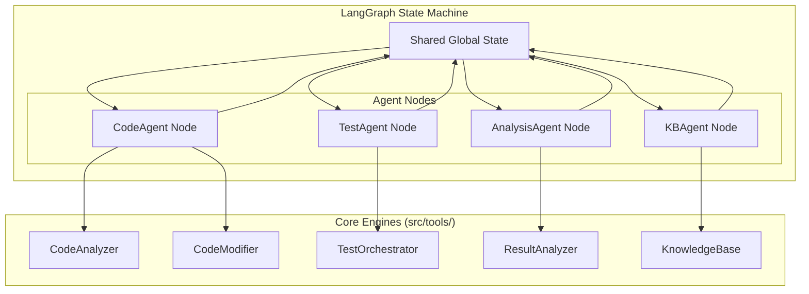
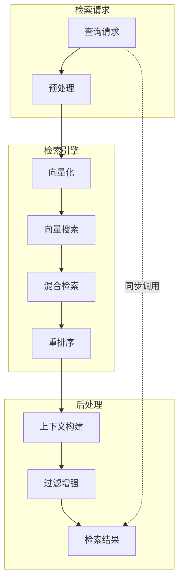

# AI驱动固件智能测试系统 — Agent详细设计（AGENT_DESIGN）

> 文档版本：v2.0
>
> 目标：定义系统中各Agent的详细设计，包括职责、能力、底层引擎封装、状态机接口与协作机制。
>
> 基于：ARCHITECTURE_V2.md (LangGraph架构) & DETAILED_DESIGN_V2.md

---

## 1. Agent架构总览

### 1.1 设计原则

本系统采用 **LangGraph** 作为编排框架，Agent不再是独立的异步消息处理者，而是 **状态机（State Graph）中的节点（Node）**。

- **Engine-Driven**：每个Agent是对底层核心引擎（Core Engine）的封装和调度。
- **State-Based**：Agent之间不直接发消息，而是通过 **共享全局状态（Global State）** 进行通信。
- **Stateless Execution**：Agent节点本身是无状态的，所有上下文存储在全局状态对象中。
- **Human-in-the-loop**：关键Agent节点支持中断和人工确认（通过LangGraph checkpointer）。

### 1.2 Agent与引擎关系



### 1.3 Agent基础接口

在LangGraph架构下，Agent本质上是一个可调用对象（Function/Runnable），接收状态，返回状态更新。

```python
from typing import TypedDict, Annotated, List, Dict, Any
from langgraph.graph import StateGraph, END

class AgentState(TypedDict):
    """全局共享状态定义"""
    task_id: str
    iteration: int

    # 代码上下文
    repo_path: str
    current_commit: str
    patch_file: str

    # 测试上下文
    test_plan: Dict[str, Any]
    test_results: List[Dict[str, Any]]

    # 分析结果
    analysis_report: Dict[str, Any]
    next_action: str

    # 错误与消息
    messages: List[str]
    errors: List[str]

class BaseAgent:
    """Agent基类"""
    def __init__(self, config: Dict[str, Any]):
        self.config = config
        self._initialize_engine()

    def _initialize_engine(self):
        """初始化底层引擎"""
        pass

    async def __call__(self, state: AgentState) -> AgentState:
        """LangGraph节点入口"""
        pass
```

---

## 2. CodeAgent详细设计

### 2.1 职责定义

**CodeAgent** 封装了 `CodeAnalyzer` 和 `CodeModifier` 两个核心引擎的能力。它是状态机中负责"代码理解"和"代码变更"的节点。

**核心职责**：
- **Code Analysis Phase**：调用 `CodeAnalyzer` 分析代码结构、依赖和潜在问题。
- **Patch Generation Phase**：调用 `CodeModifier` 基于AI建议生成补丁。
- **Patch Application Phase**：应用补丁并验证语法/编译（预编译）。

### 2.2 核心能力与工具映射

| 能力 | 底层引擎 | 方法调用 | 状态输入 | 状态输出 |
|------|---------|----------|----------|----------|
| 代码分析 | CodeAnalyzer | `analyze_files()` | `repo_path`, `file_list` | `analysis_report` |
| 依赖分析 | CodeAnalyzer | `get_dependencies()` | `repo_path` | `dependency_graph` |
| 补丁生成 | CodeModifier | `generate_patch()` | `analysis_report`, `suggestion` | `patch_content` |
| 补丁应用 | CodeModifier | `apply_patch()` | `patch_content` | `current_commit` |

### 2.3 核心逻辑实现 (伪代码)

```python
class CodeAgent:
    def __init__(self):
        self.analyzer = CodeAnalyzer()
        self.modifier = CodeModifier()

    async def analyze_node(self, state: AgentState) -> AgentState:
        """分析节点逻辑"""
        repo_path = state['repo_path']
        files = self._identify_changed_files(repo_path)

        # 调用引擎
        analysis_result = await self.analyzer.analyze(repo_path, files)

        # 更新状态
        return {
            "analysis_report": analysis_result,
            "messages": [f"Analyzed {len(files)} files"]
        }

    async def modification_node(self, state: AgentState) -> AgentState:
        """修改节点逻辑"""
        suggestion = state['analysis_report'].get('suggestion')

        # 调用引擎生成补丁
        patch = await self.modifier.generate_patch(suggestion)

        # 此时只生成不应用，等待人工确认或下一步
        return {
            "patch_file": patch,
            "next_action": "review_patch"
        }
```

---

## 3. TestAgent详细设计

### 3.1 职责定义

**TestAgent** 封装了 `TestOrchestrator` 引擎。负责环境的生命周期管理和测试用例的调度执行。

**核心职责**：
- **Environment Setup**：准备QEMU或物理板环境。
- **Test Execution**：执行测试计划。
- **Log Collection**：收集所有产物（串口日志、系统日志）。

### 3.2 核心能力与工具映射

| 能力 | 底层引擎 | 方法调用 | 状态输入 | 状态输出 |
|------|---------|----------|----------|----------|
| 环境准备 | TestOrchestrator | `setup_env()` | `config`, `firmware_path` | `env_status` |
| 测试执行 | TestOrchestrator | `run_test_plan()` | `test_plan` | `raw_test_results` |
| 日志归档 | TestOrchestrator | `collect_artifacts()` | `task_id` | `artifact_paths` |

### 3.3 核心逻辑实现 (伪代码)

```python
class TestAgent:
    def __init__(self):
        self.orchestrator = TestOrchestrator()

    async def execute_node(self, state: AgentState) -> AgentState:
        """测试执行节点"""
        test_plan = state.get('test_plan')

        # 1. 准备环境
        await self.orchestrator.setup_environment("qemu") # 或从配置读取

        # 2. 执行测试
        results = await self.orchestrator.run_plan(test_plan)

        # 3. 收集产物
        artifacts = await self.orchestrator.collect_artifacts()

        return {
            "test_results": results,
            "messages": [f"Executed {len(results)} tests"],
            "artifacts": artifacts
        }
```

---

## 4. AnalysisAgent详细设计

### 4.1 职责定义

**AnalysisAgent** 封装了 `ResultAnalyzer` 引擎。它是系统的"大脑"，负责根据测试结果决定下一步行动（继续修复、增加测试、还是结束任务）。

**核心职责**：
- **Failure Analysis**：解析测试日志，提取错误特征。
- **Root Cause Analysis**：结合代码变更和错误日志，通过RAG检索知识库，推断根因。
- **Decision Making**：输出 `next_action`，控制状态机流转。

### 4.2 核心能力与工具映射

| 能力 | 底层引擎 | 方法调用 | 状态输入 | 状态输出 |
|------|---------|----------|----------|----------|
| 结果解析 | ResultAnalyzer | `parse_logs()` | `artifact_paths` | `structured_logs` |
| 根因分析 | ResultAnalyzer | `analyze_root_cause()` | `structured_logs`, `diff` | `root_cause_report` |
| 决策生成 | ResultAnalyzer | `decide_next_step()` | `root_cause`, `iteration` | `next_action` |

### 4.3 核心逻辑实现 (伪代码)

```python
class AnalysisAgent:
    def __init__(self):
        self.result_analyzer = ResultAnalyzer()

    async def analyze_node(self, state: AgentState) -> AgentState:
        """结果分析节点"""
        results = state['test_results']

        # 1. 如果全通过
        if all(r['status'] == 'passed' for r in results):
            return {"next_action": "finish", "messages": ["All tests passed"]}

        # 2. 如果有失败，进行分析
        analysis = await self.result_analyzer.analyze(results)

        # 3. 决策
        # 如果迭代次数未超限且有明确修复建议 -> fix
        # 否则 -> escalate (人工介入)
        action = "fix" if state['iteration'] < 5 else "escalate"

        return {
            "analysis_report": analysis,
            "next_action": action
        }
```

---

## 5. KBAgent详细设计

### 5.1 职责定义

**KBAgent** 负责与 RAG 系统交互，封装了向量数据库的操作。它通常作为辅助节点被其他Agent调用，或在流程结束时运行以沉淀知识。

**核心职责**：
- **Retrieval**：响应 CodeAgent 和 AnalysisAgent 的检索请求。
- **Knowledge Capture**：在任务结束时，将成功的 Iteration Record 写入知识库。

### 5.2 接口设计

KBAgent 可以作为独立节点，也可以作为工具函数被其他 Agent 在内部调用。在 V2 架构中，推荐作为 **Tool** 使用，但在状态机中保留 **KnowledgeCapture** 节点用于知识沉淀。

```python
class KBAgent:
    def __init__(self):
        self.vector_db = QdrantClient()

    async def capture_node(self, state: AgentState) -> AgentState:
        """知识沉淀节点"""
        if state['next_action'] == 'finish':
            # 提取本次任务的关键信息
            knowledge_unit = self._extract_knowledge(state)
            await self.vector_db.add(knowledge_unit)
            return {"messages": ["Knowledge captured"]}
        return {}

### 5.3 RAG检索流程详细设计

#### 5.3.1 检索架构



#### 5.3.2 检索步骤详解

```python
class KBAgent:
    """知识库管理专家"""
    
    def __init__(self, config: KBAgentConfig):
        self.vector_db = QdrantClient(
            host=config.qdrant_host,
            port=config.qdrant_port
        )
        self.metadata_db = PostgreSQLClient(config.postgres_url)
        self.embedding_service = EmbeddingService(
            model=config.embedding_model,
            dimension=config.embedding_dim
        )
        self.reranker = CrossEncoderReranker()
        self.cache = RedisCache(config.redis_url)
    
    async def retrieve(
        self,
        query: str,
        context: RetrievalContext
    ) -> List[KnowledgeUnit]:
        """
        知识检索主流程
        
        Args:
            query: 自然语言查询
            context: 检索上下文（产品线、标签、时间范围等）
            
        Returns:
            排序后的知识单元列表
        """
        # 1. 查询预处理
        preprocessed = await self._preprocess_query(query)
        
        # 2. 查询向量化
        query_vector = await self.embedding_service.embed(preprocessed)
        
        # 3. 缓存检查（避免重复检索）
        cache_key = self._generate_cache_key(query_vector, context)
        cached = await self.cache.get(cache_key)
        if cached:
            return cached
        
        # 4. 多路检索
        results = await self._multi_modal_search(
            query_vector=query_vector,
            context=context
        )
        
        # 5. 结果重排序
        reranked = await self._rerank(query, results, context)
        
        # 6. 上下文构建
        enhanced = await self._build_context(reranked, context)
        
        # 7. 缓存结果
        await self.cache.set(cache_key, enhanced, ttl=300)
        
        return enhanced
    
    async def _preprocess_query(self, query: str) -> str:
        """查询预处理：分词、实体提取、意图识别"""
        # 实体提取
        entities = await self._extract_entities(query)
        
        # 查询扩展（添加同义词和相关术语）
        expanded = await self._expand_query(query, entities)
        
        return expanded
    
    async def _multi_modal_search(
        self,
        query_vector: List[float],
        context: RetrievalContext
    ) -> List[SearchResult]:
        """多路检索：向量 + 关键词 + 产品线过滤"""
        tasks = [
            # 向量检索
            self._vector_search(query_vector, context),
            # 关键词检索
            self._keyword_search(context.query, context),
            # 元数据筛选
            self._metadata_filter(context.filters)
        ]
        
        results = await asyncio.gather(*tasks, return_exceptions=True)
        
        # 合并结果去重
        merged = self._merge_results(results)
        
        return merged
    
    async def _rerank(
        self,
        query: str,
        results: List[KnowledgeUnit],
        context: RetrievalContext
    ) -> List[KnowledgeUnit]:
        """结果重排序：基于相关性和时效性"""
        if not results:
            return []
        
        # 使用CrossEncoder进行细粒度排序
        query_doc_pairs = [
            (query, unit.content.description) for unit in results
        ]
        scores = await self.reranker.predict(query_doc_pairs)
        
        # 融合原始分数和新分数
        scored = list(zip(results, scores))
        scored.sort(key=lambda x: x[1], reverse=True)
        
        return [unit for unit, _ in scored[:context.max_results]]
```

#### 5.3.3 检索参数配置

```python
@dataclass
class RetrievalContext:
    """检索上下文"""
    query: str
    product_line: Optional[ProductLine] = None
    tags: List[str] = None
    time_range: Optional[Tuple[datetime, datetime]] = None
    min_confidence: float = 0.5
    max_results: int = 10
    include_expired: bool = False
    
    def __post_init__(self):
        if self.tags is None:
            self.tags = []
```

### 5.4 知识沉淀机制详细设计

#### 5.4.1 沉淀触发条件

KBAgent支持多种知识沉淀触发条件：

| 触发类型 | 条件 | 优先级 | 说明 |
|----------|------|--------|------|
| 成功完成 | next_action == "finish" 且 all_passed == True | P0 | 任务完全成功 |
| 部分成功 | 修复率 > 50% 且有明确改进 | P1 | 有价值的部分成功 |
| 失败案例 | 连续N次相同失败模式 | P2 | 避免重复踩坑 |
| 人工标记 | 工程师手动标记 | P0 | 重要经验记录 |
| 定时触发 | 达到沉淀阈值（如10次相似修复） | P2 | 批量沉淀 |

#### 5.4.2 知识提取与转换

```python
async def capture_knowledge(
    self,
    state: AgentState,
    trigger_type: CaptureTrigger
) -> KnowledgeUnit:
    """
    知识沉淀主流程
    
    Args:
        state: 状态机上下文
        trigger_type: 触发类型
        
    Returns:
        创建的知识单元
    """
    # 1. 提取迭代数据
    iteration_data = self._extract_iteration_data(state)
    
    # 2. 生成知识内容
    content = self._generate_content(iteration_data)
    
    # 3. 构建元数据
    metadata = self._build_metadata(iteration_data, trigger_type)
    
    # 4. 生成向量表示
    vector = await self.embedding_service.embed(
        f"{content.title} {content.summary}"
    )
    
    # 5. 创建知识单元
    knowledge_unit = KnowledgeUnit(
        id=self._generate_id(),
        content=content,
        metadata=metadata,
        vector_embedding={
            "model": self.embedding_model,
            "dimension": self.embedding_dim,
            "vector": vector
        },
        audit={
            "created_at": datetime.utcnow().isoformat(),
            "version": "1.0",
            "source": "automated_extraction",
            "trigger_type": trigger_type.value
        }
    )
    
    # 6. 存储到数据库
    await self._store_knowledge(knowledge_unit)
    
    # 7. 更新关联关系
    await self._update_relationships(knowledge_unit, iteration_data)
    
    # 8. 触发验证流程（异步）
    await self._request_verification(knowledge_unit)
    
    return knowledge_unit

def _extract_iteration_data(self, state: AgentState) -> IterationData:
    """从状态机上下文中提取迭代数据"""
    return IterationData(
        task_id=state.get('task_id'),
        goal=state.get('task_request', {}).get('goal'),
        code_diff=state.get('patch_content'),
        files_modified=state.get('files_modified', []),
        test_results=state.get('test_results', []),
        analysis_report=state.get('analysis_report'),
        decision=state.get('next_action'),
        iteration_index=state.get('iteration', 1),
        execution_time=state.get('execution_time'),
        environment=state.get('test_environment')
    )
```

#### 5.4.3 知识验证机制

```python
async def _request_verification(self, unit: KnowledgeUnit):
    """请求知识验证（异步）"""
    # 创建验证任务
    verification_task = VerificationTask(
        knowledge_unit_id=unit.id,
        verification_type="auto",
        status="pending_verify",
        created_at=datetime.utcnow()
    )
    
    # 提交到验证队列
    await self.verification_queue.add(verification_task)
    
    # 设置知识状态为待验证
    unit.metadata.verification_status = "pending_verify"
    unit.metadata.maturity_level = 0
```

### 5.5 与其他Agent的交互协议

#### 5.5.1 交互模式

| 交互方向 | 协议类型 | 触发时机 | 数据内容 | 超时 |
|----------|----------|----------|----------|------|
| CodeAgent → KBAgent | 同步Tool调用 | 代码分析前 | 查询相似问题和历史修复 | 30s |
| TestAgent → KBAgent | 异步Tool调用 | 测试失败时 | 查询相似失败模式 | 30s |
| AnalysisAgent → KBAgent | 同步Tool调用 | 根因分析时 | 查询历史根因和修复建议 | 60s |
| 状态机 → KBAgent | 节点执行 | 任务完成后 | 沉淀知识单元 | 120s |

#### 5.5.2 数据契约

```python
@dataclass
class KnowledgeRetrievalRequest:
    """知识检索请求"""
    query: str
    agent_type: str  # "CodeAgent" / "TestAgent" / "AnalysisAgent"
    task_context: Dict[str, Any]
    filters: RetrievalFilters
    priority: int = 0  # 0=普通, 1=高优先级

@dataclass
class KnowledgeRetrievalResponse:
    """知识检索响应"""
    knowledge_units: List[KnowledgeUnit]
    total_count: int
    retrieval_time_ms: float
    warnings: List[str] = field(default_factory=list)

@dataclass
class KnowledgeCaptureRequest:
    """知识沉淀请求"""
    iteration_data: IterationData
    capture_type: CaptureType  # "auto" / "manual"
    priority: int = 0
    verification_required: bool = True
```

#### 5.5.3 错误处理

| 错误类型 | 处理策略 | 降级方案 |
|----------|----------|----------|
| 向量数据库连接失败 | 重试3次，间隔1s | 返回空列表，记录错误日志 |
| 检索超时 | 超时控制30s | 返回部分结果+警告 |
| 向量化失败 | 回退到TF-IDF | 使用关键词检索替代 |
| 存储失败 | 重试+回滚 | 异步重试队列 |

### 5.6 KBAgent配置管理

```python
@dataclass
class KBAgentConfig:
    """KBAgent配置"""
    # 向量数据库配置
    qdrant_host: str = "localhost"
    qdrant_port: int = 6333
    collection_name: str = "firmware_knowledge"
    
    # 关系数据库配置
    postgres_url: str = "postgresql://localhost/firmware_kb"
    
    # Embedding配置
    embedding_model: str = "text-embedding-ada-002"
    embedding_dim: int = 1536
    
    # 检索配置
    default_max_results: int = 10
    min_confidence_score: float = 0.5
    reranker_model: str = "cross-encoder/ms-marco-MiniLM"
    
    # 缓存配置
    redis_url: str = "redis://localhost"
    cache_ttl: int = 300  # 秒
    
    # 沉淀配置
    auto_capture_enabled: bool = True
    capture_threshold: int = 10  # 达到阈值自动沉淀
    max_pending_verification: int = 100
```

### 5.7 性能优化策略

#### 5.7.1 检索性能

- **异步预取**：在状态机执行时预取可能需要的知识
- **缓存分层**：L1（内存缓存）+ L2（Redis缓存）+ L3（向量数据库）
- **批量操作**：知识沉淀支持批量写入

#### 5.7.2 存储优化

- **向量压缩**：使用Product Quantization减少存储
- **冷热分离**：高频访问知识存储在热存储
- **自动归档**：超过1年未访问的知识自动归档

---

## 6. 安全与拒识策略

尽管架构变更为 LangGraph，Agent 的安全策略依然适用，特别是涉及 LLM 生成内容的环节。

### 6.1 System Prompt 约束

所有涉及 LLM 调用的引擎（CodeAnalyzer, ResultAnalyzer）必须在 Prompt 中包含安全约束：

1.  **禁止破坏性命令**：生成的 Shell 脚本或代码中严禁包含 `rm -rf`, `mkfs`, `dd` 等高危命令。
2.  **路径限制**：文件操作仅限于 `repo_path` 和 `workspace` 目录下。
3.  **敏感信息过滤**：日志分析时自动过滤 Password, Token, Key 等模式。

### 6.2 状态机风控检查

在 LangGraph 中，可以在关键状态转移前插入 **Guardrails**：

- **Pre-Apply Check**：在 CodeAgent 生成补丁后，应用补丁前，必须经过 `Static Analysis` 或 `Human Approval` 节点。
- **Pre-Flash Check**：如果 TestAgent 涉及刷写固件（Target Board），必须要求人工确认。

---

## 7. 配置管理

Agent 的配置不再通过复杂的 YAML 加载器动态注入，而是利用 Pydantic Settings 在初始化时加载。

```python
# config/settings.py
class CodeAgentSettings(BaseSettings):
    model_name: str = "gpt-4"
    timeout: int = 300

class AgentConfig(BaseSettings):
    code_agent: CodeAgentSettings
    test_agent: TestAgentSettings
    # ...
```

---

**文档版本**：v2.0
**更新日期**：2026-01-30
**状态**：已根据 LangGraph 架构重构
