# AI驱动固件智能测试系统 — 系统架构设计（ARCHITECTURE_V2）

> 文档版本：v2.0
>
> 目标：定义系统的整体架构，包括分层架构、Agent设计、状态机、RAG集成、测试环境和数据流设计。
>
> 基于：Phase 1 任务1-3 系统架构设计和文档化

---

## 1. 系统整体架构概览

### 1.1 架构设计原则

本系统采用**多Agent协作+状态机驱动+知识增强**的混合架构，具备以下核心特征：

- **松耦合架构**：各Agent独立设计，通过标准接口通信
- **状态驱动**：基于LangGraph的状态机确保执行流程的可控性
- **知识增强**：RAG系统为Agent决策提供历史经验和专业知识
- **环境抽象**：统一测试环境接口，支持多种硬件平台
- **可扩展性**：模块化设计支持新Agent类型和集成接口的快速接入

### 1.2 技术栈选择

```yaml
核心框架:
  - 状态机与编排: LangGraph (LangChain Ecosystem) - 作为唯一编排层
  - Agent运行时: LangChain Agents
  - RAG引擎: LangChain + Qdrant
  - 向量数据库: Qdrant
  - 关系数据库: PostgreSQL

执行环境:
  - 测试环境: QEMU + 目标板 (BMC/树莓派/Windows)
  - 代码处理: Tree-sitter (C/C++语法解析)
  - 大模型: 内网API (优先) / OpenAI API (备选)

安全机制:
  - 构建沙箱: Docker容器（无网络或受限网络）
  - 代码扫描: SAST工具（Semgrep/CodeQL）
  - 凭证管理: Secret过滤层 + Vault/环境变量引用

工程实践:
  - 配置管理: Pydantic Settings
  - 日志系统: Structlog
  - 监控: Prometheus + Grafana（可选/后续阶段）
  - CI/CD: GitLab CI
```

---

## 2. 系统分层架构

### 2.1 整体架构图

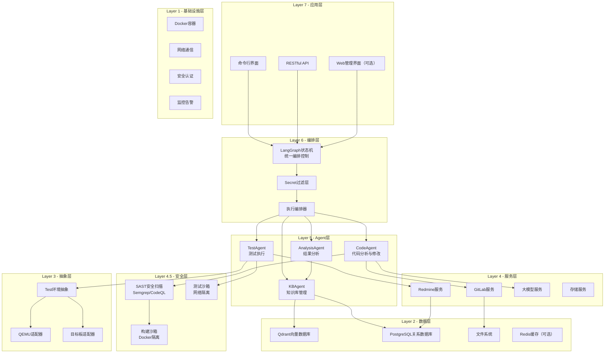

### 2.2 架构层级说明

#### Layer 1 - 基础设施层
- **Docker容器化**：确保环境一致性，支持快速部署和扩容
- **网络通信**：Agent间通信、API调用、数据库连接
- **安全认证**：API密钥管理、访问控制、审计日志
- **监控告警**：系统指标监控、健康检查、异常告警

#### Layer 2 - 数据层
- **Qdrant向量数据库**：存储知识单元的语义向量，支持高效相似度检索
- **PostgreSQL关系数据库**：存储结构化元数据，支持复杂关联查询
- **文件系统**：存储原始文档、代码片段、日志文件等大对象
- **Redis缓存（可选）**：缓存频繁访问的查询结果和中间状态，不作为闭环强依赖

#### Layer 3 - 抽象层
- **测试环境抽象**：统一不同测试环境的接口
- **QEMU适配器**：QEMU虚拟化环境的适配实现
- **目标板适配器**：真实硬件环境的适配实现

#### Layer 4 - 服务层
- **GitLab服务**：代码仓库访问、MR处理、CI状态获取
- **Redmine服务**：任务管理、缺陷跟踪、工单处理
- **大模型服务**：LLM API调用封装，支持多模型切换
- **存储服务（可选）**：文件上传下载、版本管理、备份恢复（可由文件系统/对象存储替代）

#### Layer 5 - Agent层
- **CodeAgent**：负责代码分析、修改建议生成、代码实现
- **TestAgent**：负责测试环境准备、用例执行、结果收集
- **AnalysisAgent**：负责测试结果分析、失败归因、决策建议
- **KBAgent**：负责知识库管理、经验沉淀、检索增强

#### Layer 6 - 编排层
- **LangGraph**：作为系统唯一的编排核心，基于状态机（State Graph）管理Agent的执行流程、状态流转和错误恢复。
- **执行编排器**：TestOrchestrator的具体实现，负责测试环境的生命周期管理。

#### Layer 7 - 应用层
- **命令行界面**：面向开发者的CLI工具
- **RESTful API**：面向集成的API服务
- **Web管理界面（可选）**：可视化的管理和监控界面（后续阶段）

---

## 3. Agent职责设计

### 3.1 Agent总体设计

每个Agent都遵循统一的接口规范，具备明确的职责边界和协作机制：

```python
from abc import ABC, abstractmethod
from typing import Dict, Any, List, Optional
from pydantic import BaseModel

class AgentBase(ABC):
    """Agent基础接口"""
    
    @abstractmethod
    async def process(self, task: Task) -> TaskResult:
        """处理任务的主入口"""
        pass
    
    @abstractmethod
    def get_capabilities(self) -> List[str]:
        """返回Agent的能力列表"""
        pass
    
    @abstractmethod
    async def communicate(self, message: AgentMessage) -> AgentMessage:
        """与其他Agent通信"""
        pass
```

### 3.2 CodeAgent - 代码分析与修改专家

#### 3.2.1 职责定义

CodeAgent是系统中的代码智能专家，负责：

- **代码分析**：解析C语言代码，识别潜在问题和优化点
- **修改建议**：基于问题描述和测试结果，生成代码修改建议
- **代码实现**：根据建议自动修改代码或生成补丁
- **代码质量**：确保修改后的代码符合项目规范

#### 3.2.2 核心能力

```yaml
代码解析能力:
  - C/C++语法树解析 (Tree-sitter)
  - 依赖关系分析
  - 代码结构理解
  - 跨文件引用追踪

问题诊断能力:
  - 静态分析 (clang-tidy)
  - 性能瓶颈识别
  - 内存泄漏检测
  - 竞态条件分析

修改生成能力:
  - 修复建议生成
  - 代码重构建议
  - 性能优化建议
  - 安全加固建议

代码实现能力:
  - 自动代码修改
  - 补丁生成 (git patch)
  - 测试用例补充
  - 文档更新
```

#### 3.2.3 工具库设计

```python
class CodeAgent:
    """代码分析与修改专家"""
    
    def __init__(self):
        self.tools = {
            'code_parser': TreeSitterCodeParser(),
            'static_analyzer': ClangStaticAnalyzer(),
            'dependency_analyzer': DependencyAnalyzer(),
            'patch_generator': GitPatchGenerator(),
            'test_generator': TestCaseGenerator(),
        }
    
    async def analyze_code(self, file_paths: List[str], 
                          context: str) -> CodeAnalysis:
        """分析代码并生成分析报告"""
        pass
    
    async def generate_suggestions(self, analysis: CodeAnalysis,
                                 requirements: str) -> List[CodeSuggestion]:
        """基于分析结果生成修改建议"""
        pass
    
    async def implement_changes(self, suggestions: List[CodeSuggestion],
                              target_branch: str) -> PatchResult:
        """实现代码修改并生成补丁"""
        pass
```

#### 3.2.4 输出数据结构

```python
from dataclasses import dataclass
from typing import List, Dict, Optional

@dataclass
class CodeAnalysis:
    """代码分析结果"""
    file_path: str
    issues: List[CodeIssue]
    metrics: CodeMetrics
    dependencies: List[str]
    complexity_score: float
    recommendations: List[str]

@dataclass
class CodeSuggestion:
    """代码修改建议"""
    suggestion_id: str
    issue_id: str
    change_type: str  # 'fix', 'optimize', 'refactor'
    priority: int
    description: str
    code_diff: str
    confidence: float
    estimated_impact: str

@dataclass
class PatchResult:
    """补丁生成结果"""
    patch_id: str
    patch_content: str
    files_modified: List[str]
    lines_added: int
    lines_removed: int
    build_status: str
    test_suggestions: List[str]
```

### 3.3 TestAgent - 测试执行专家

#### 3.3.1 职责定义

TestAgent负责测试环境的统一抽象和测试执行：

- **环境准备**：配置和启动测试环境（QEMU/目标板）
- **测试执行**：运行指定的测试用例和测试计划
- **结果收集**：收集测试日志、输出和性能数据
- **环境清理**：测试完成后的环境恢复和清理

#### 3.3.2 测试环境抽象

```python
from abc import ABC, abstractmethod
from enum import Enum

class TestEnvironment(Enum):
    """测试环境类型"""
    QEMU = "qemu"
    BMC_BOARD = "bmc_board"
    RASPBERRY_PI = "raspberry_pi"
    WINDOWS_SCRIPT = "windows_script"

class TestEnvironmentAdapter(ABC):
    """测试环境适配器基类"""
    
    @abstractmethod
    async def setup(self, config: TestConfig) -> bool:
        """设置测试环境"""
        pass
    
    @abstractmethod
    async def execute_test(self, test_plan: TestPlan) -> TestResult:
        """执行测试用例"""
        pass
    
    @abstractmethod
    async def collect_logs(self) -> Dict[str, str]:
        """收集测试日志"""
        pass
    
    @abstractmethod
    async def cleanup(self) -> bool:
        """清理测试环境"""
        pass

class QEMUAdapter(TestEnvironmentAdapter):
    """QEMU环境适配器"""
    
    async def setup(self, config: TestConfig) -> bool:
        # 启动QEMU实例
        # 配置网络和存储
        # 加载固件镜像
        pass
    
    async def execute_test(self, test_plan: TestPlan) -> TestResult:
        # 执行测试用例
        # 监控虚拟机状态
        # 收集串口输出
        pass

class BoardAdapter(TestEnvironmentAdapter):
    """真实硬件板适配器"""
    
    async def setup(self, config: TestConfig) -> bool:
        # 通过BMC连接目标板
        # 配置启动参数
        # 加载固件到板子
        pass
```

#### 3.3.3 测试执行流程

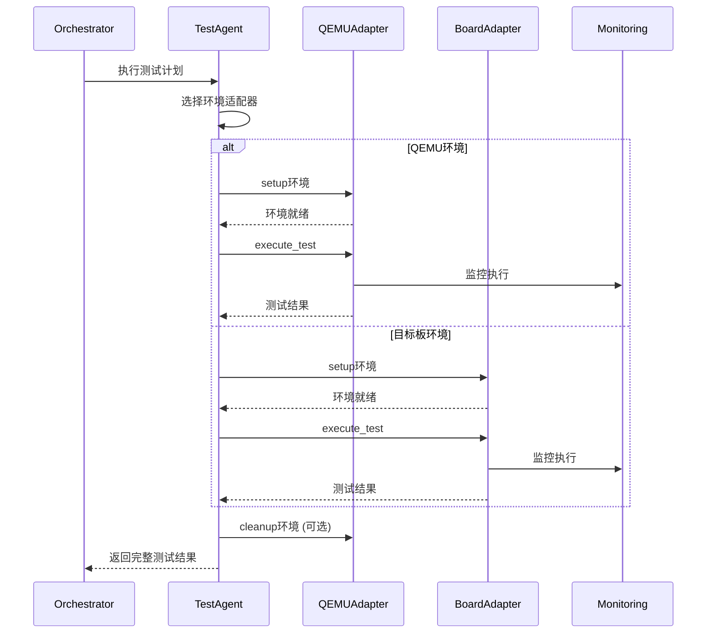

#### 3.3.4 测试结果结构

```python
@dataclass
class TestResult:
    """测试结果"""
    test_id: str
    execution_id: str
    environment: TestEnvironment
    status: TestStatus  # 'passed', 'failed', 'timeout', 'error'
    start_time: datetime
    end_time: datetime
    duration: float
    
    # 日志和输出
    console_logs: List[str]
    system_logs: List[str]
    error_logs: List[str]
    
    # 性能数据
    performance_metrics: Dict[str, float]
    
    # 测试断言结果
    assertions: List[TestAssertion]
    
    # 环境快照
    environment_snapshot: Dict[str, Any]

@dataclass
class TestAssertion:
    """测试断言结果"""
    assertion_id: str
    test_case: str
    expected: Any
    actual: Any
    status: str  # 'pass', 'fail'
    message: str
```

### 3.4 AnalysisAgent - 结果分析专家

#### 3.4.1 职责定义

AnalysisAgent是系统的智能分析专家：

- **结果解析**：解析测试结果，提取关键信息
- **失败归因**：分析失败原因，定位根本问题
- **模式识别**：识别重复出现的问题模式
- **决策建议**：基于分析结果提供下一步行动建议

#### 3.4.2 分析算法

```python
class AnalysisAgent:
    """结果分析专家"""
    
    def __init__(self):
        self.pattern_matcher = FailurePatternMatcher()
        self.cause_analyzer = RootCauseAnalyzer()
        self.decision_engine = DecisionEngine()
    
    async def analyze_test_results(self, test_results: List[TestResult],
                                 context: AnalysisContext) -> AnalysisReport:
        """分析测试结果并生成报告"""
        
        # 1. 结果聚合和统计
        aggregated = await self._aggregate_results(test_results)
        
        # 2. 失败模式匹配
        patterns = await self.pattern_matcher.match(aggregated.failures)
        
        # 3. 根因分析
        root_causes = await self.cause_analyzer.analyze(
            aggregated, patterns, context
        )
        
        # 4. 决策建议生成
        recommendations = await self.decision_engine.generate_recommendations(
            root_causes, context
        )
        
        return AnalysisReport(
            summary=aggregated,
            patterns=patterns,
            root_causes=root_causes,
            recommendations=recommendations
        )
    
    async def _aggregate_results(self, results: List[TestResult]) -> AggregatedResults:
        """聚合测试结果"""
        pass
    
    async def extract_issues(self, results: List[TestResult]) -> List[Issue]:
        """从测试结果中提取问题"""
        pass
```

#### 3.4.3 失败模式识别

```python
class FailurePatternMatcher:
    """失败模式匹配器"""
    
    def __init__(self):
        self.patterns = [
            MemoryLeakPattern(),
            TimingIssuePattern(),
            ResourceContentionPattern(),
            ConfigurationErrorPattern(),
        ]
    
    async def match(self, failures: List[TestFailure]) -> List[MatchedPattern]:
        """匹配失败模式"""
        matched_patterns = []
        
        for failure in failures:
            for pattern in self.patterns:
                if await pattern.matches(failure):
                    matched_patterns.append(MatchedPattern(
                        pattern=pattern,
                        confidence=await pattern.calculate_confidence(failure),
                        evidence=await pattern.extract_evidence(failure)
                    ))
        
        return sorted(matched_patterns, key=lambda x: x.confidence, reverse=True)
```

### 3.5 KBAgent - 知识库管理专家

#### 3.5.1 职责定义

KBAgent是系统的知识管理专家：

- **知识沉淀**：将每次迭代的经验和结果沉淀到知识库
- **知识检索**：基于问题描述检索相关的历史经验
- **知识增强**：为其他Agent提供知识支持
- **知识维护**：维护知识库的质量和一致性

#### 3.5.2 知识管理流程

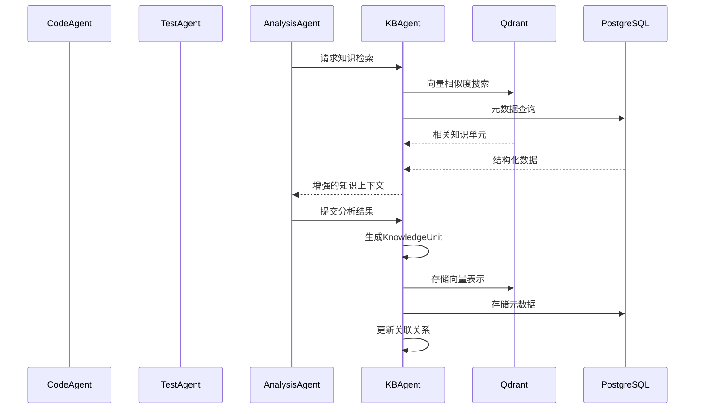

#### 3.5.3 知识检索增强

```python
class KBAgent:
    """知识库管理专家"""
    
    def __init__(self):
        self.vector_store = QdrantClient()
        self.metadata_store = PostgreSQLClient()
        self.embedding_service = EmbeddingService()
        self.knowledge_processor = KnowledgeProcessor()
    
    async def retrieve_knowledge(self, query: str, 
                               context: RetrievalContext) -> List[KnowledgeUnit]:
        """检索相关知识"""
        
        # 1. 查询向量化
        query_vector = await self.embedding_service.embed(query)
        
        # 2. 向量相似度搜索
        similar_units = await self.vector_store.search(
            query_vector=query_vector,
            limit=context.max_results,
            filters=context.filters
        )
        
        # 3. 获取元数据
        enriched_units = []
        for unit in similar_units:
            metadata = await self.metadata_store.get_knowledge_unit(unit.id)
            enriched_units.append(KnowledgeUnit(
                **unit.dict(),
                metadata=metadata
            ))
        
        # 4. 知识增强
        enhanced_units = await self.knowledge_processor.enhance(
            enriched_units, context
        )
        
        return enhanced_units
    
    async def store_iteration_knowledge(self, iteration: IterationRecord) -> str:
        """存储迭代知识"""
        # 从迭代记录中提取知识
        knowledge_units = await self.knowledge_processor.extract_knowledge(
            iteration
        )
        
        # 存储到数据库
        stored_ids = []
        for unit in knowledge_units:
            unit_id = await self.store_knowledge_unit(unit)
            stored_ids.append(unit_id)
        
        return stored_ids
```

---

## 4. LangGraph状态机高层设计

### 4.1 状态机总体设计

系统采用LangGraph实现有限状态机，确保执行流程的可控性和可追溯性：

```python
from langgraph.graph import StateGraph, END
from typing import TypedDict, Annotated
import operator

class SystemState(TypedDict):
    """系统全局状态"""
    current_task: Optional[str]
    iteration_count: int
    max_iterations: int
    code_changes: List[CodeChange]
    test_results: List[TestResult]
    analysis_reports: List[AnalysisReport]
    knowledge_units: List[KnowledgeUnit]
    error_log: List[str]
    is_completed: bool
    next_action: Optional[str]

# 状态图定义
workflow = StateGraph(SystemState)

# 添加状态节点
workflow.add_node("initialize", initialize_state)
workflow.add_node("code_analysis", code_analysis_node)
workflow.add_node("code_modification", code_modification_node)
workflow.add_node("test_setup", test_setup_node)
workflow.add_node("test_execution", test_execution_node)
workflow.add_node("result_analysis", result_analysis_node)
workflow.add_node("knowledge_update", knowledge_update_node)
workflow.add_node("decision_making", decision_making_node)
workflow.add_node("finalize", finalize_state)

# 定义状态转移边
workflow.set_entry_point("initialize")
workflow.add_edge("initialize", "code_analysis")
workflow.add_edge("code_analysis", "code_modification")
workflow.add_edge("code_modification", "test_setup")
workflow.add_edge("test_setup", "test_execution")
workflow.add_edge("test_execution", "result_analysis")
workflow.add_edge("result_analysis", "knowledge_update")
workflow.add_edge("knowledge_update", "decision_making")

# 决策节点的条件边
workflow.add_conditional_edges(
    "decision_making",
    should_continue,
    {
        "continue": "code_analysis",
        "finalize": "finalize",
        "error": END
    }
)

workflow.add_edge("finalize", END)
```

### 4.2 状态定义

```python
from enum import Enum
from datetime import datetime

class SystemStateEnum(Enum):
    """系统状态枚举"""
    INITIALIZING = "initializing"
    CODE_ANALYSIS = "code_analysis"
    CODE_MODIFICATION = "code_modification"
    TEST_SETUP = "test_setup"
    TEST_EXECUTION = "test_execution"
    RESULT_ANALYSIS = "result_analysis"
    KNOWLEDGE_UPDATE = "knowledge_update"
    DECISION_MAKING = "decision_making"
    COMPLETED = "completed"
    ERROR = "error"

@dataclass
class StateContext:
    """状态上下文"""
    state: SystemStateEnum
    timestamp: datetime
    agent_id: str
    task_id: str
    input_data: Dict[str, Any]
    output_data: Dict[str, Any]
    execution_time: float
    error_message: Optional[str] = None
```

### 4.3 状态转移图

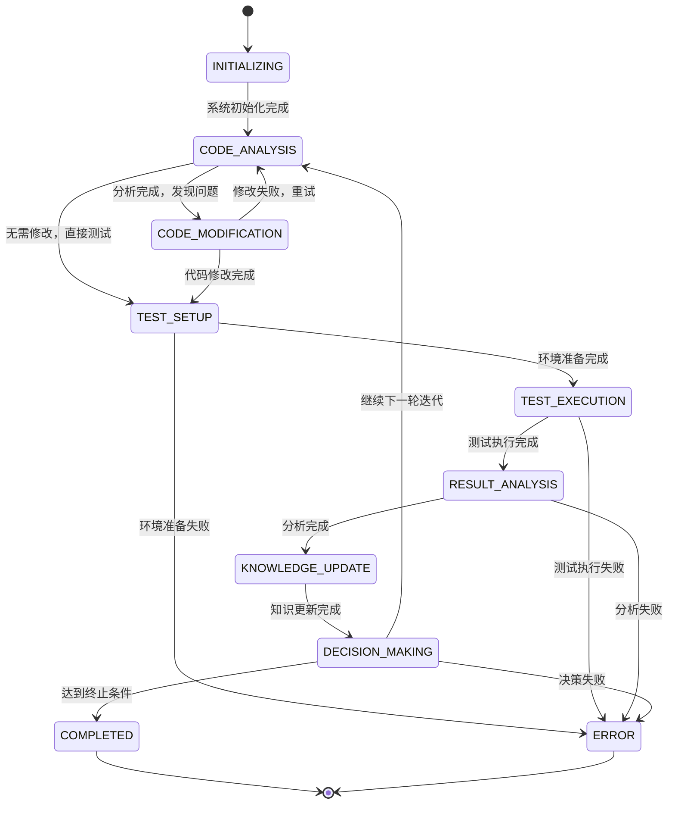

### 4.4 状态节点实现

```python
async def code_analysis_node(state: SystemState) -> SystemState:
    """代码分析节点"""
    
    # 获取输入
    task_description = state.get("current_task", "")
    
    # 调用CodeAgent进行代码分析
    code_agent = CodeAgent()
    analysis_results = await code_agent.analyze_code(
        file_paths=state.get("target_files", []),
        context=task_description
    )
    
    # 更新状态
    state["analysis_reports"].append(analysis_results)
    state["next_action"] = "determine_modification_needed"
    
    return state

async def decision_making_node(state: SystemState) -> SystemState:
    """决策节点"""
    
    # 获取当前迭代信息
    current_iteration = state["iteration_count"]
    max_iterations = state["max_iterations"]
    latest_analysis = state["analysis_reports"][-1]
    latest_test_result = state["test_results"][-1] if state["test_results"] else None
    
    # 决策逻辑
    decision = await make_decision(
        iteration=current_iteration,
        analysis=latest_analysis,
        test_result=latest_test_result,
        max_iterations=max_iterations
    )
    
    # 更新状态
    if decision.action == "continue":
        state["iteration_count"] += 1
        state["next_action"] = "continue_iteration"
    elif decision.action == "finalize":
        state["is_completed"] = True
        state["next_action"] = "finalize"
    else:
        state["next_action"] = "error"
        state["error_log"].append(decision.reason)
    
    return state

async def make_decision(iteration: int, analysis: AnalysisReport,
                      test_result: Optional[TestResult],
                      max_iterations: int) -> Decision:
    """决策逻辑"""
    
    # 检查迭代次数
    if iteration >= max_iterations:
        return Decision(
            action="finalize",
            reason=f"达到最大迭代次数 {max_iterations}"
        )
    
    # 检查是否所有测试通过
    if test_result and all(r.status == "passed" for r in [test_result]):
        return Decision(
            action="finalize",
            reason="所有测试通过，任务完成"
        )
    
    # 检查分析结果
    if analysis.confidence_score > 0.8 and analysis.recommendations:
        return Decision(
            action="continue",
            reason=f"高置信度建议可用，继续迭代 (第{iteration}次)"
        )
    
    # 检查是否需要人工介入
    if analysis.requires_human_intervention:
        return Decision(
            action="finalize",
            reason="需要人工介入，终止自动化流程"
        )
    
    # 默认继续
    return Decision(
        action="continue",
        reason="继续下一轮迭代"
    )
```

### 4.5 错误处理和恢复

```python
async def error_recovery_node(state: SystemState) -> SystemState:
    """错误恢复节点"""
    
    error_count = len(state["error_log"])
    max_error_recovery = 3
    
    if error_count >= max_error_recovery:
        # 达到最大错误恢复次数，终止流程
        state["is_completed"] = True
        state["next_action"] = "error_terminated"
        return state
    
    # 分析错误类型并尝试恢复
    latest_error = state["error_log"][-1]
    recovery_action = await analyze_error_and_recover(latest_error)
    
    if recovery_action:
        # 根据错误类型跳转到相应的恢复节点
        state["next_action"] = recovery_action
    else:
        # 无法恢复，终止流程
        state["is_completed"] = True
        state["next_action"] = "error_terminated"
    
    return state

async def analyze_error_and_recover(error: str) -> Optional[str]:
    """分析错误并返回恢复动作"""
    
    if "compilation_error" in error:
        return "code_analysis"
    elif "test_environment" in error:
        return "test_setup"
    elif "execution_timeout" in error:
        return "test_execution"
    elif "analysis_failed" in error:
        return "result_analysis"
    
    return None
```

---

## 5. LangChain RAG知识库集成

### 5.1 RAG架构设计

知识库采用检索增强生成（RAG）架构，为Agent提供历史经验和专业知识支持：

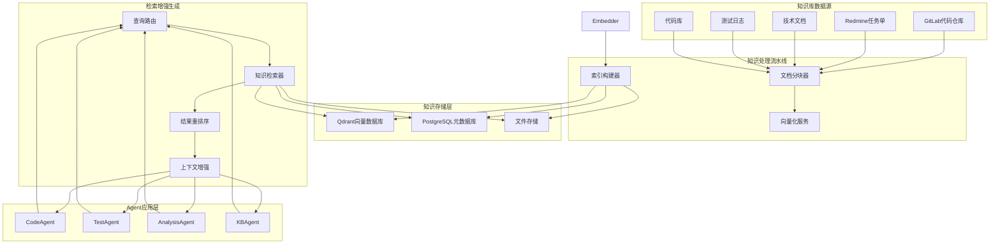

### 5.2 知识存储架构

#### 5.2.1 向量数据库设计（Qdrant）

```python
from qdrant_client import QdrantClient
from qdrant_client.http import models
from typing import List, Dict, Any

class VectorKnowledgeStore:
    """向量知识存储"""
    
    def __init__(self, host: str, port: int, collection_name: str = "firmware_knowledge"):
        self.client = QdrantClient(host=host, port=port)
        self.collection_name = collection_name
        self.vector_size = 1536  # OpenAI embedding dimension
        
    async def create_collection(self):
        """创建知识库集合"""
        collections_config = models.CollectionsCreateRequest(
            collections=[
                models.CollectionInfo(
                    name=self.collection_name,
                    vectors=models.VectorParams(
                        size=self.vector_size,
                        distance=models.Distance.COSINE
                    )
                )
            ]
        )
        await self.client.create_collections(collections_config)
    
    async def store_knowledge_unit(self, unit: KnowledgeUnit, 
                                 vector: List[float]) -> str:
        """存储知识单元"""
        
        point = models.PointStruct(
            id=unit.id,
            vector=vector,
            payload={
                "title": unit.content.title,
                "summary": unit.content.summary,
                "product_line": unit.metadata.product_line,
                "tags": unit.metadata.tags,
                "confidence_score": unit.metadata.confidence_score,
                "created_at": unit.metadata.created_at,
                "issue_type": unit.metadata.issue_type,
                "severity": unit.metadata.severity
            }
        )
        
        operation_info = await self.client.upsert(
            collection_name=self.collection_name,
            points=[point]
        )
        
        return operation_info.operation_id
    
    async def search_similar(self, query_vector: List[float], 
                            filters: Dict[str, Any],
                            limit: int = 10) -> List[KnowledgeUnit]:
        """相似度搜索"""
        
        search_result = await self.client.search(
            collection_name=self.collection_name,
            query_vector=query_vector,
            query_filter=models.Filter(
                must=[
                    models.FieldCondition(
                        key=key,
                        match=models.MatchValue(value=value)
                    ) for key, value in filters.items()
                ]
            ),
            limit=limit,
            with_payload=True,
            with_vectors=False
        )
        
        return [self._point_to_knowledge_unit(point) for point in search_result]
```

#### 5.2.2 关系数据库设计（PostgreSQL）

```sql
-- 知识单元主表
CREATE TABLE knowledge_units (
    id VARCHAR(255) PRIMARY KEY,
    title TEXT NOT NULL,
    summary TEXT,
    content JSONB NOT NULL,
    vector_id UUID REFERENCES qdrant_points(id),
    product_line JSONB,
    metadata JSONB,
    created_at TIMESTAMP WITH TIME ZONE DEFAULT NOW(),
    updated_at TIMESTAMP WITH TIME ZONE DEFAULT NOW(),
    is_active BOOLEAN DEFAULT true
);

-- 代码修改记录表
CREATE TABLE code_modifications (
    id VARCHAR(255) PRIMARY KEY,
    knowledge_unit_id VARCHAR(255) REFERENCES knowledge_units(id),
    file_path TEXT NOT NULL,
    function_name VARCHAR(255),
    language VARCHAR(50),
    original_code TEXT,
    modified_code TEXT,
    change_type VARCHAR(100),
    lines_added INTEGER DEFAULT 0,
    lines_removed INTEGER DEFAULT 0,
    created_at TIMESTAMP WITH TIME ZONE DEFAULT NOW()
);

-- 测试执行记录表
CREATE TABLE test_executions (
    id VARCHAR(255) PRIMARY KEY,
    knowledge_unit_id VARCHAR(255) REFERENCES knowledge_units(id),
    test_environment VARCHAR(100),
    test_plan JSONB,
    execution_result JSONB,
    status VARCHAR(50),
    execution_time INTEGER,
    created_at TIMESTAMP WITH TIME ZONE DEFAULT NOW()
);

-- 迭代记录表
CREATE TABLE iteration_records (
    id VARCHAR(255) PRIMARY KEY,
    knowledge_unit_id VARCHAR(255) REFERENCES knowledge_units(id),
    iteration_number INTEGER,
    code_analysis_id VARCHAR(255),
    test_execution_id VARCHAR(255),
    analysis_report_id VARCHAR(255),
    decision_made TEXT,
    next_action TEXT,
    created_at TIMESTAMP WITH TIME ZONE DEFAULT NOW()
);

-- 知识关联表
CREATE TABLE knowledge_relations (
    id VARCHAR(255) PRIMARY KEY,
    source_unit_id VARCHAR(255) REFERENCES knowledge_units(id),
    target_unit_id VARCHAR(255) REFERENCES knowledge_units(id),
    relation_type VARCHAR(100),
    confidence_score FLOAT,
    created_at TIMESTAMP WITH TIME ZONE DEFAULT NOW()
);

-- 创建索引
CREATE INDEX idx_knowledge_units_product_line ON knowledge_units USING GIN (product_line);
CREATE INDEX idx_knowledge_units_tags ON knowledge_units USING GIN (tags);
CREATE INDEX idx_code_modifications_file_path ON code_modifications(file_path);
CREATE INDEX idx_test_executions_environment ON test_executions(test_environment);
CREATE INDEX idx_knowledge_relations_type ON knowledge_relations(relation_type);
```

### 5.3 知识检索与增强

#### 5.3.1 多路检索策略

```python
from langchain.retrievers import EnsembleRetriever
from langchain.retrievers import BM25Retriever, TFIDFRetriever
from langchain.vectorstores import Qdrant
from langchain.schema import Document

class MultiModalRetriever:
    """多模态知识检索器"""
    
    def __init__(self):
        self.vector_retriever = VectorRetriever()
        self.bm25_retriever = BM25Retriever()
        self.tfidf_retriever = TFIDFRetriever()
        self.ensemble_retriever = EnsembleRetriever(
            retrievers=[self.vector_retriever, self.bm25_retriever, self.tfidf_retriever],
            weights=[0.4, 0.3, 0.3]
        )
    
    async def retrieve(self, query: str, 
                      context: RetrievalContext) -> List[KnowledgeUnit]:
        """多路检索"""
        
        # 1. 向量检索
        vector_results = await self.vector_retriever.asearch(
            query, filters=context.filters
        )
        
        # 2. 关键词检索
        keyword_results = await self.bm25_retriever.asearch(
            query, k=context.max_results
        )
        
        # 3. 语义检索
        semantic_results = await self.tfidf_retriever.asearch(
            query, k=context.max_results
        )
        
        # 4. 结果融合和重排序
        all_results = vector_results + keyword_results + semantic_results
        reranked_results = await self.rerank_results(query, all_results, context)
        
        return reranked_results[:context.max_results]
    
    async def rerank_results(self, query: str, 
                           results: List[KnowledgeUnit],
                           context: RetrievalContext) -> List[KnowledgeUnit]:
        """结果重排序"""
        
        # 使用更精确的重排序算法
        reranker = CrossEncoderReranker()
        
        # 构建查询-文档对
        query_doc_pairs = [
            (query, result.content.description) for result in results
        ]
        
        # 获取重排序分数
        scores = await reranker.predict(query_doc_pairs)
        
        # 根据分数排序
        scored_results = list(zip(results, scores))
        scored_results.sort(key=lambda x: x[1], reverse=True)
        
        return [result for result, score in scored_results]
```

#### 5.3.2 上下文增强生成

```python
class ContextualGenerator:
    """上下文增强生成器"""
    
    def __init__(self):
        self.llm = ChatOpenAI()
        self.template_manager = TemplateManager()
    
    async def generate_enhanced_context(self, query: str, 
                                      retrieved_knowledge: List[KnowledgeUnit],
                                      agent_context: Dict[str, Any]) -> str:
        """生成增强的上下文"""
        
        # 1. 构建知识上下文
        knowledge_context = await self._build_knowledge_context(retrieved_knowledge)
        
        # 2. 选择合适的提示模板
        template = self.template_manager.select_template(
            agent_type=agent_context["agent_type"],
            task_type=agent_context["task_type"]
        )
        
        # 3. 构建完整提示
        prompt = template.format(
            query=query,
            knowledge_context=knowledge_context,
            agent_context=agent_context
        )
        
        # 4. 生成增强的上下文
        enhanced_context = await self.llm.ainvoke(prompt)
        
        return enhanced_context
    
    async def _build_knowledge_context(self, knowledge_units: List[KnowledgeUnit]) -> str:
        """构建知识上下文"""
        
        context_parts = []
        
        for unit in knowledge_units:
            context_part = f"""
            知识单元ID: {unit.id}
            标题: {unit.content.title}
            摘要: {unit.content.summary}
            解决方案: {unit.content.description}
            置信度: {unit.metadata.confidence_score}
            相关性: {unit.metadata.relevance_score}
            """
            context_parts.append(context_part)
        
        return "\n".join(context_parts)
```

### 5.4 知识库与Agent集成

#### 5.4.1 Agent知识增强接口

```python
class KnowledgeEnhancedAgent:
    """支持知识增强的Agent基类"""
    
    def __init__(self, knowledge_store: KnowledgeStore):
        self.knowledge_store = knowledge_store
        self.context_window = 4000  # tokens
        self.max_knowledge_units = 5
    
    async def retrieve_relevant_knowledge(self, query: str, 
                                        context: Dict[str, Any]) -> List[KnowledgeUnit]:
        """检索相关知识"""
        
        retrieval_context = RetrievalContext(
            agent_type=self.agent_type,
            task_type=context.get("task_type"),
            product_line=context.get("product_line"),
            max_results=self.max_knowledge_units,
            filters=self._build_filters(context)
        )
        
        return await self.knowledge_store.retrieve(query, retrieval_context)
    
    async def enhance_with_knowledge(self, task_input: str,
                                  context: Dict[str, Any]) -> str:
        """使用知识增强任务输入"""
        
        # 检索相关知识
        relevant_knowledge = await self.retrieve_relevant_knowledge(task_input, context)
        
        if not relevant_knowledge:
            return task_input
        
        # 构建增强上下文
        enhanced_context = await self.knowledge_store.generate_context(
            task_input, relevant_knowledge, context
        )
        
        return enhanced_context
    
    def _build_filters(self, context: Dict[str, Any]) -> Dict[str, Any]:
        """构建检索过滤器"""
        filters = {}
        
        if context.get("product_line"):
            filters["product_line.soc_type"] = context["product_line"]["soc_type"]
        
        if context.get("tags"):
            filters["tags"] = {"$in": context["tags"]}
        
        if context.get("confidence_threshold"):
            filters["confidence_score"] = {"$gte": context["confidence_threshold"]}
        
        return filters
```

---

## 6. 测试环境抽象层

### 6.1 测试环境架构

测试环境抽象层提供统一的接口，支持多种测试环境的透明切换：

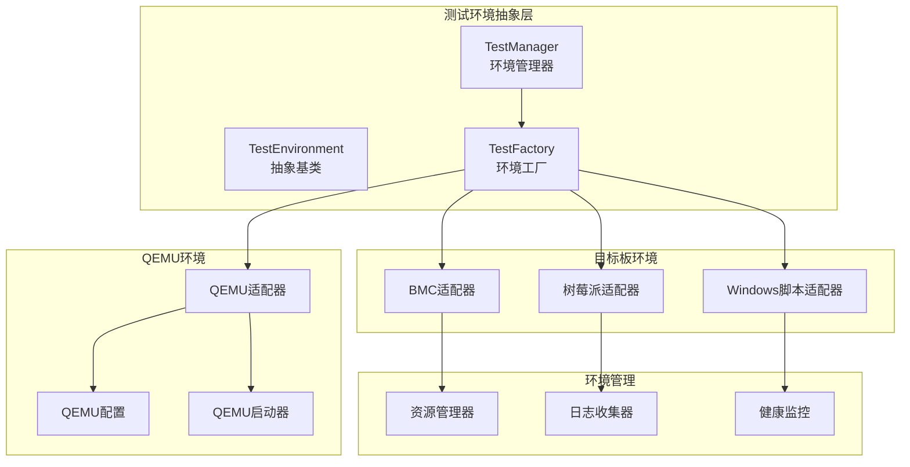

### 6.2 环境抽象接口

```python
from abc import ABC, abstractmethod
from typing import Dict, List, Optional, Any
from dataclasses import dataclass
from enum import Enum

class EnvironmentType(Enum):
    """测试环境类型"""
    QEMU = "qemu"
    BMC_BOARD = "bmc_board"
    RASPBERRY_PI = "raspberry_pi"
    WINDOWS_SCRIPT = "windows_script"

@dataclass
class TestConfig:
    """测试配置"""
    environment_type: EnvironmentType
    firmware_image: str
    test_cases: List[str]
    timeout: int = 3600
    resources: Dict[str, Any] = None
    network_config: Dict[str, Any] = None
    storage_config: Dict[str, Any] = None

@dataclass
class ExecutionContext:
    """执行上下文"""
    execution_id: str
    environment_id: str
    start_time: datetime
    config: TestConfig
    status: str = "initializing"
    logs: List[str] = None
    
    def __post_init__(self):
        if self.logs is None:
            self.logs = []

class TestEnvironment(ABC):
    """测试环境抽象基类"""
    
    def __init__(self, config: TestConfig):
        self.config = config
        self.context = ExecutionContext(
            execution_id=str(uuid.uuid4()),
            environment_id=str(uuid.uuid4()),
            start_time=datetime.now(),
            config=config
        )
    
    @abstractmethod
    async def initialize(self) -> bool:
        """初始化环境"""
        pass
    
    @abstractmethod
    async def execute_test(self, test_plan: TestPlan) -> TestResult:
        """执行测试"""
        pass
    
    @abstractmethod
    async def collect_logs(self) -> Dict[str, str]:
        """收集日志"""
        pass
    
    @abstractmethod
    async def cleanup(self) -> bool:
        """清理环境"""
        pass
    
    @abstractmethod
    async def get_status(self) -> EnvironmentStatus:
        """获取环境状态"""
        pass
```

### 6.3 QEMU环境适配器

```python
import subprocess
import asyncio
from pathlib import Path

class QEMUAdapter(TestEnvironment):
    """QEMU环境适配器"""
    
    def __init__(self, config: TestConfig):
        super().__init__(config)
        self.qemu_process = None
        self.qmp_socket = None
        self.serial_console = None
        
    async def initialize(self) -> bool:
        """初始化QEMU环境"""
        try:
            # 1. 检查QEMU可用性
            if not await self._check_qemu_availability():
                raise Exception("QEMU未安装或不可用")
            
            # 2. 创建工作目录
            work_dir = Path(f"/tmp/qemu_{self.context.environment_id}")
            work_dir.mkdir(exist_ok=True)
            
            # 3. 生成QEMU启动参数
            qemu_args = await self._generate_qemu_args(work_dir)
            
            # 4. 启动QEMU实例
            self.qemu_process = await asyncio.create_subprocess_exec(
                *qemu_args,
                stdout=asyncio.subprocess.PIPE,
                stderr=asyncio.subprocess.PIPE
            )
            
            # 5. 等待QEMU启动完成
            await asyncio.sleep(5)
            
            # 6. 建立QMP连接
            await self._setup_qmp_connection()
            
            # 7. 配置网络和存储
            await self._configure_environment(work_dir)
            
            self.context.status = "ready"
            return True
            
        except Exception as e:
            self.context.logs.append(f"QEMU初始化失败: {str(e)}")
            return False
    
    async def _generate_qemu_args(self, work_dir: Path) -> List[str]:
        """生成QEMU启动参数"""
        args = [
            "qemu-system-x86_64",
            "-m", "2048",  # 2GB内存
            "-smp", "4",   # 4核CPU
            "-drive", f"file={self.config.firmware_image},format=raw",
            "-netdev", "user,id=net0",
            "-device", "e1000,netdev=net0",
            "-serial", f"file:{work_dir}/serial.log",
            "-monitor", f"unix:{work_dir}/qmp.sock,server,nowait",
            "-nographic"
        ]
        
        # 添加CPU特定参数
        if self.config.resources.get("cpu_model"):
            args.extend(["-cpu", self.config.resources["cpu_model"]])
        
        return args
    
    async def execute_test(self, test_plan: TestPlan) -> TestResult:
        """在QEMU中执行测试"""
        
        start_time = datetime.now()
        
        try:
            # 1. 加载测试用例
            test_cases = await self._load_test_cases(test_plan)
            
            # 2. 执行测试用例
            test_results = []
            for test_case in test_cases:
                result = await self._execute_single_test(test_case)
                test_results.append(result)
            
            # 3. 收集系统日志
            logs = await self.collect_logs()
            
            end_time = datetime.now()
            duration = (end_time - start_time).total_seconds()
            
            return TestResult(
                test_id=test_plan.test_id,
                execution_id=self.context.execution_id,
                environment=EnvironmentType.QEMU,
                status="completed",
                start_time=start_time,
                end_time=end_time,
                duration=duration,
                console_logs=logs.get("console", []),
                system_logs=logs.get("system", []),
                test_results=test_results
            )
            
        except Exception as e:
            return TestResult(
                test_id=test_plan.test_id,
                execution_id=self.context.execution_id,
                environment=EnvironmentType.QEMU,
                status="failed",
                start_time=start_time,
                end_time=datetime.now(),
                error_logs=[str(e)]
            )
    
    async def _execute_single_test(self, test_case: TestCase) -> TestCaseResult:
        """执行单个测试用例"""
        
        try:
            # 发送测试命令到QEMU
            await self._send_command(test_case.command)
            
            # 等待测试完成
            await asyncio.sleep(test_case.timeout)
            
            # 获取测试结果
            result = await self._get_test_result(test_case)
            
            return TestCaseResult(
                case_id=test_case.case_id,
                status=result.status,
                output=result.output,
                assertions=result.assertions
            )
            
        except Exception as e:
            return TestCaseResult(
                case_id=test_case.case_id,
                status="failed",
                error=str(e)
            )
    
    async def collect_logs(self) -> Dict[str, str]:
        """收集QEMU日志"""
        
        logs = {}
        
        try:
            # 收集串口日志
            serial_log_path = f"/tmp/qemu_{self.context.environment_id}/serial.log"
            if Path(serial_log_path).exists():
                with open(serial_log_path, 'r') as f:
                    logs["console"] = f.read()
            
            # 收集QMP日志
            if self.qmp_socket:
                qmp_logs = await self._collect_qmp_logs()
                logs["qmp"] = qmp_logs
                
        except Exception as e:
            logs["error"] = f"日志收集失败: {str(e)}"
        
        return logs
```

### 6.4 目标板环境适配器

#### 6.4.1 BMC适配器

```python
class BMCAdapter(TestEnvironment):
    """BMC目标板适配器"""
    
    def __init__(self, config: TestConfig):
        super().__init__(config)
        self.bmc_client = None
        self.board_console = None
        
    async def initialize(self) -> bool:
        """初始化BMC环境"""
        try:
            # 1. 建立BMC连接
            self.bmc_client = BMCClient(
                host=self.config.resources["bmc_ip"],
                username=self.config.resources["bmc_user"],
                password=self.config.resources["bmc_password"]
            )
            
            await self.bmc_client.connect()
            
            # 2. 检查板子状态
            board_status = await self.bmc_client.get_board_status()
            if board_status.state != "ready":
                await self.bmc_client.power_on()
                await asyncio.sleep(30)  # 等待板子启动
            
            # 3. 建立串口连接
            self.board_console = await self.bmc_client.get_console()
            
            # 4. 上传固件镜像
            await self._upload_firmware()
            
            self.context.status = "ready"
            return True
            
        except Exception as e:
            self.context.logs.append(f"BMC初始化失败: {str(e)}")
            return False
    
    async def execute_test(self, test_plan: TestPlan) -> TestResult:
        """在目标板上执行测试"""
        
        start_time = datetime.now()
        
        try:
            # 1. 启动测试
            await self.board_console.start_test_session(test_plan.test_id)
            
            # 2. 加载测试用例
            test_cases = await self._load_test_cases(test_plan)
            
            # 3. 逐个执行测试用例
            test_results = []
            for test_case in test_cases:
                result = await self._execute_on_board(test_case)
                test_results.append(result)
            
            # 4. 收集日志
            logs = await self.collect_logs()
            
            end_time = datetime.now()
            
            return TestResult(
                test_id=test_plan.test_id,
                execution_id=self.context.execution_id,
                environment=EnvironmentType.BMC_BOARD,
                status="completed",
                start_time=start_time,
                end_time=end_time,
                console_logs=logs.get("console", []),
                system_logs=logs.get("system", []),
                test_results=test_results
            )
            
        except Exception as e:
            return TestResult(
                test_id=test_plan.test_id,
                execution_id=self.context.execution_id,
                environment=EnvironmentType.BMC_BOARD,
                status="failed",
                start_time=start_time,
                end_time=datetime.now(),
                error_logs=[str(e)]
            )
```

#### 6.4.2 树莓派适配器

```python
class RaspberryPiAdapter(TestEnvironment):
    """树莓派环境适配器"""
    
    def __init__(self, config: TestConfig):
        super().__init__(config)
        self.ssh_client = None
        
    async def initialize(self) -> bool:
        """初始化树莓派环境"""
        try:
            # 1. 建立SSH连接
            self.ssh_client = SSHClient(
                host=self.config.resources["pi_ip"],
                username=self.config.resources["pi_user"],
                password=self.config.resources.get("pi_password"),
                key_file=self.config.resources.get("pi_key_file")
            )
            
            await self.ssh_client.connect()
            
            # 2. 检查系统状态
            system_info = await self.ssh_client.run_command("uname -a")
            if "raspberry pi" not in system_info.stdout.lower():
                raise Exception("目标设备不是树莓派")
            
            # 3. 准备测试环境
            await self._setup_test_environment()
            
            self.context.status = "ready"
            return True
            
        except Exception as e:
            self.context.logs.append(f"树莓派初始化失败: {str(e)}")
            return False
```

#### 6.4.3 Windows脚本适配器

```python
class WindowsScriptAdapter(TestEnvironment):
    """Windows脚本环境适配器"""
    
    def __init__(self, config: TestConfig):
        super().__init__(config)
        self.winrm_client = None
        
    async def initialize(self) -> bool:
        """初始化Windows环境"""
        try:
            # 1. 建立WinRM连接
            self.winrm_client = WinRMClient(
                host=self.config.resources["windows_ip"],
                username=self.config.resources["windows_user"],
                password=self.config.resources["windows_password"]
            )
            
            await self.winrm_client.connect()
            
            # 2. 检查系统状态
            system_info = await self.winrm_client.run_command("systeminfo")
            if "windows" not in system_info.stdout.lower():
                raise Exception("目标设备不是Windows系统")
            
            # 3. 准备测试环境
            await self._setup_windows_test_environment()
            
            self.context.status = "ready"
            return True
            
        except Exception as e:
            self.context.logs.append(f"Windows环境初始化失败: {str(e)}")
            return False
```

### 6.5 环境管理

```python
class TestEnvironmentManager:
    """测试环境管理器"""
    
    def __init__(self):
        self.adapters: Dict[EnvironmentType, Type[TestEnvironment]] = {
            EnvironmentType.QEMU: QEMUAdapter,
            EnvironmentType.BMC_BOARD: BMCAdapter,
            EnvironmentType.RASPBERRY_PI: RaspberryPiAdapter,
            EnvironmentType.WINDOWS_SCRIPT: WindowsScriptAdapter
        }
        self.active_environments: Dict[str, TestEnvironment] = {}
        self.resource_pool = ResourcePool()
    
    async def create_environment(self, config: TestConfig) -> str:
        """创建测试环境"""
        
        # 1. 从资源池获取资源
        resources = await self.resource_pool.allocate(config.environment_type)
        
        # 2. 更新配置
        config.resources.update(resources)
        
        # 3. 创建适配器
        adapter_class = self.adapters[config.environment_type]
        environment = adapter_class(config)
        
        # 4. 初始化环境
        if not await environment.initialize():
            raise Exception(f"环境初始化失败: {config.environment_type}")
        
        # 5. 注册环境
        env_id = environment.context.environment_id
        self.active_environments[env_id] = environment
        
        return env_id
    
    async def cleanup_environment(self, environment_id: str) -> bool:
        """清理测试环境"""
        
        if environment_id not in self.active_environments:
            return False
        
        environment = self.active_environments[environment_id]
        
        try:
            # 1. 清理环境
            cleanup_result = await environment.cleanup()
            
            # 2. 释放资源
            await self.resource_pool.release(environment.config.environment_type)
            
            # 3. 从活动列表中移除
            del self.active_environments[environment_id]
            
            return cleanup_result
            
        except Exception as e:
            print(f"环境清理失败: {str(e)}")
            return False
    
    async def get_environment_status(self, environment_id: str) -> EnvironmentStatus:
        """获取环境状态"""
        
        if environment_id not in self.active_environments:
            raise Exception(f"环境不存在: {environment_id}")
        
        environment = self.active_environments[environment_id]
        return await environment.get_status()
```

---

## 7. 数据流和Agent交互流程

### 7.1 完整数据流程

系统采用事件驱动的数据流设计，确保Agent间的协作和数据的流转：

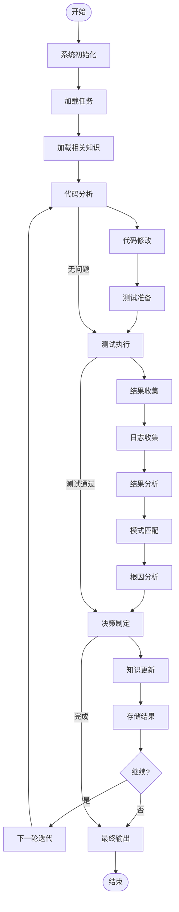

### 7.2 Agent间交互协议

```python
from enum import Enum
from dataclasses import dataclass
from typing import Dict, Any, Optional
import asyncio

class MessageType(Enum):
    """消息类型"""
    TASK_REQUEST = "task_request"
    TASK_RESPONSE = "task_response"
    STATUS_UPDATE = "status_update"
    ERROR_NOTIFICATION = "error_notification"
    KNOWLEDGE_QUERY = "knowledge_query"
    KNOWLEDGE_RESPONSE = "knowledge_response"

@dataclass
class AgentMessage:
    """Agent消息"""
    sender_id: str
    receiver_id: str
    message_type: MessageType
    payload: Dict[str, Any]
    timestamp: datetime
    correlation_id: str = None
    
    def __post_init__(self):
        if self.correlation_id is None:
            self.correlation_id = str(uuid.uuid4())

class AgentCommunicationBus:
    """Agent通信总线"""
    
    def __init__(self):
        self.subscribers: Dict[str, List[callable]] = {}
        self.message_queue = asyncio.Queue()
        self.running = False
    
    async def subscribe(self, agent_id: str, callback: callable):
        """订阅消息"""
        if agent_id not in self.subscribers:
            self.subscribers[agent_id] = []
        self.subscribers[agent_id].append(callback)
    
    async def publish(self, message: AgentMessage):
        """发布消息"""
        await self.message_queue.put(message)
    
    async def start(self):
        """启动消息处理"""
        self.running = True
        asyncio.create_task(self._message_processor())
    
    async def _message_processor(self):
        """消息处理器"""
        while self.running:
            try:
                message = await asyncio.wait_for(
                    self.message_queue.get(), timeout=1.0
                )
                
                # 分发消息给订阅者
                if message.receiver_id in self.subscribers:
                    for callback in self.subscribers[message.receiver_id]:
                        await callback(message)
                        
            except asyncio.TimeoutError:
                continue
            except Exception as e:
                print(f"消息处理错误: {str(e)}")
```

### 7.3 详细交互流程

#### 7.3.1 代码修改流程

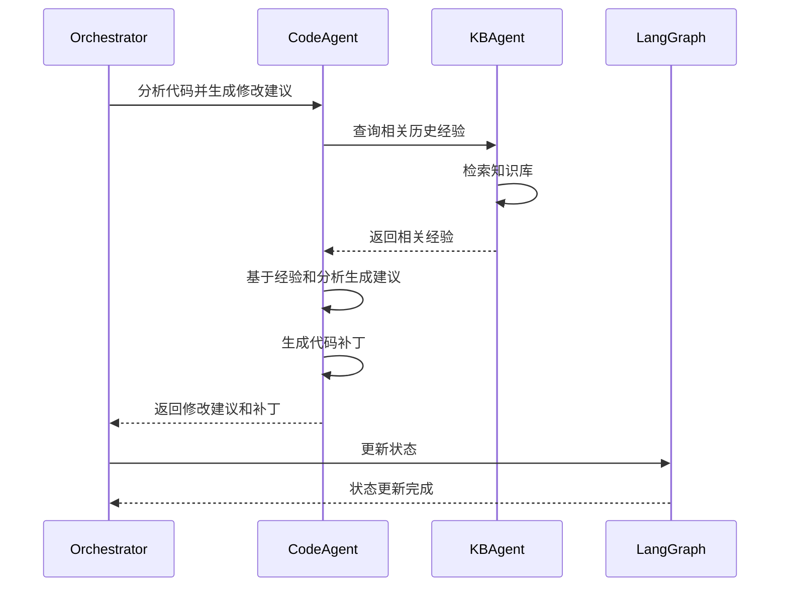

#### 7.3.2 测试执行流程

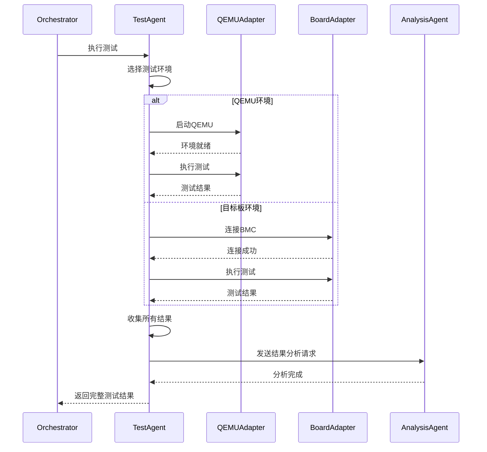

#### 7.3.3 知识更新流程

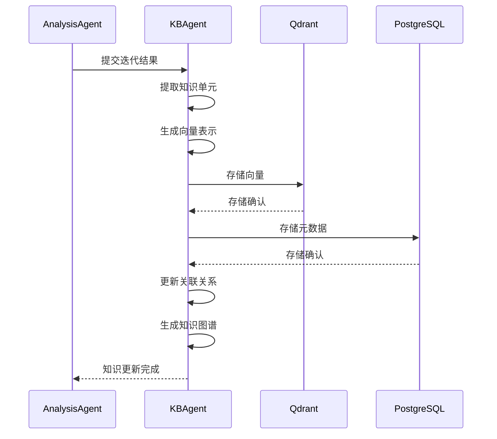

### 7.4 数据流管理

```python
class DataFlowManager:
    """数据流管理器"""
    
    def __init__(self):
        self.data_store = DataStore()
        self.flow_orchestrator = FlowOrchestrator()
        self.monitoring = DataFlowMonitoring()
    
    async def process_iteration_flow(self, iteration: IterationData) -> IterationResult:
        """处理一次迭代的完整数据流"""
        
        flow_context = FlowContext(
            iteration_id=iteration.iteration_id,
            start_time=datetime.now(),
            stages=[],
            data_flows=[]
        )
        
        try:
            # Stage 1: 数据收集和预处理
            stage1_data = await self._collect_and_preprocess_data(iteration)
            flow_context.add_stage("data_collection", stage1_data)
            
            # Stage 2: Agent处理
            stage2_results = await self._orchestrate_agent_processing(stage1_data)
            flow_context.add_stage("agent_processing", stage2_results)
            
            # Stage 3: 结果整合
            stage3_results = await self._integrate_results(stage2_results)
            flow_context.add_stage("result_integration", stage3_results)
            
            # Stage 4: 知识生成和存储
            knowledge_result = await self._generate_and_store_knowledge(stage3_results)
            flow_context.add_stage("knowledge_management", knowledge_result)
            
            # Stage 5: 决策和规划
            decision_result = await self._make_decision_and_plan(stage3_results)
            flow_context.add_stage("decision_planning", decision_result)
            
            flow_context.end_time = datetime.now()
            flow_context.status = "completed"
            
            return IterationResult(
                iteration_id=iteration.iteration_id,
                status="success",
                context=flow_context,
                results=stage3_results,
                decision=decision_result
            )
            
        except Exception as e:
            flow_context.end_time = datetime.now()
            flow_context.status = "failed"
            flow_context.error = str(e)
            
            return IterationResult(
                iteration_id=iteration.iteration_id,
                status="failed",
                context=flow_context,
                error=str(e)
            )
    
    async def _orchestrate_agent_processing(self, input_data: Dict[str, Any]) -> Dict[str, Any]:
        """编排Agent处理"""
        
        processing_tasks = []
        
        # 并行启动多个Agent
        code_task = asyncio.create_task(self._process_code_agent(input_data))
        test_task = asyncio.create_task(self._process_test_agent(input_data))
        analysis_task = asyncio.create_task(self._process_analysis_agent(input_data))
        kb_task = asyncio.create_task(self._process_kb_agent(input_data))
        
        # 等待所有Agent完成
        results = await asyncio.gather(
            code_task, test_task, analysis_task, kb_task,
            return_exceptions=True
        )
        
        return {
            "code_results": results[0],
            "test_results": results[1],
            "analysis_results": results[2],
            "kb_results": results[3]
        }
    
    async def monitor_data_flow(self, flow_context: FlowContext):
        """监控数据流"""
        
        async def monitor_stage(stage_name: str, stage_data: Any):
            # 检查数据完整性
            completeness = await self._check_data_completeness(stage_data)
            
            # 检查数据质量
            quality = await self._check_data_quality(stage_data)
            
            # 记录指标
            await self.monitoring.record_stage_metrics(
                stage_name, completeness, quality
            )
        
        # 监控每个阶段
        for stage in flow_context.stages:
            await monitor_stage(stage.name, stage.data)
```

---

## 8. 与Redmine/GitLab的集成接口

> 说明：Webhook 接入为可选增强能力，相关 REST 入口需在 API_SPEC.md 中同步维护。

### 8.1 集成架构概览

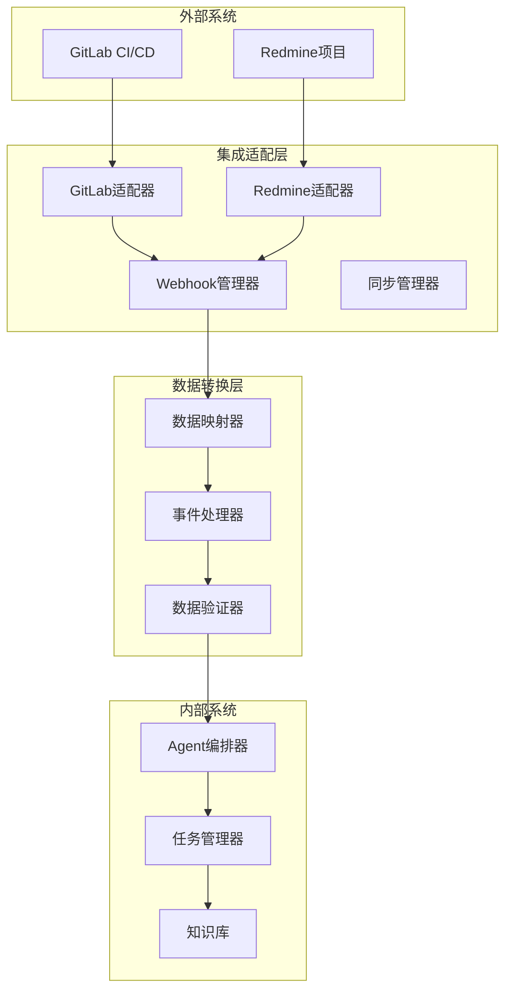

### 8.2 GitLab集成

#### 8.2.1 GitLab适配器

```python
from gitlab import Gitlab
from typing import List, Dict, Any, Optional
import httpx

class GitLabAdapter:
    """GitLab适配器"""
    
    def __init__(self, config: GitLabConfig):
        self.config = config
        self.gitlab_client = Gitlab(
            url=config.base_url,
            private_token=config.access_token
        )
        self.webhook_secret = config.webhook_secret
        
    async def create_issue_from_task(self, task: FirmwareTask) -> str:
        """从固件任务创建GitLab问题"""
        
        issue_data = {
            "title": f"[AI测试] {task.title}",
            "description": self._format_task_description(task),
            "labels": task.labels + ["ai-generated", "firmware-test"],
            "assignee_id": task.assignee_id,
            "milestone_id": task.milestone_id
        }
        
        project = self.gitlab_client.projects.get(task.project_id)
        issue = project.issues.create(issue_data)
        
        return issue.iid
    
    async def update_issue_status(self, issue_id: str, status: str, 
                                 comment: Optional[str] = None):
        """更新问题状态"""
        
        issue = self.gitlab_client.issues.get(issue_id)
        
        # 更新状态
        if status == "completed":
            issue.state_event = "close"
        elif status == "in_progress":
            issue.state = "opened"
        
        issue.save()
        
        # 添加评论
        if comment:
            note_data = {
                "body": f"[AI系统] {comment}"
            }
            issue.notes.create(note_data)
    
    async def get_mr_changes(self, mr_id: str) -> List[Dict[str, Any]]:
        """获取合并请求的变更"""
        
        mr = self.gitlab_client.mergerequests.get(mr_id)
        changes = mr.changes()
        
        modified_files = []
        for change in changes["changes"]:
            modified_files.append({
                "file_path": change["new_path"],
                "old_path": change["old_path"],
                "diff": change["diff"],
                "new_file": change["new_file"],
                "renamed_file": change["renamed_file"],
                "deleted_file": change["deleted_file"]
            })
        
        return modified_files
    
    async def create_test_pipeline(self, mr_id: str, 
                                 test_config: Dict[str, Any]) -> str:
        """创建测试流水线"""
        
        pipeline_data = {
            "ref": "main",  # 或从MR获取源分支
            "variables": {
                "MR_ID": mr_id,
                "TEST_ENVIRONMENT": test_config.get("environment"),
                "TEST_CASES": ",".join(test_config.get("test_cases", [])),
                "AI_TESTING": "true"
            }
        }
        
        project = self.gitlab_client.projects.get(test_config["project_id"])
        pipeline = project.pipelines.create(pipeline_data)
        
        return pipeline.id
    
    async def upload_test_artifacts(self, pipeline_id: str, 
                                  artifacts: List[TestArtifact]):
        """上传测试产物"""
        
        for artifact in artifacts:
            artifact_data = {
                "name": artifact.name,
                "file": artifact.content,
                "filepath": artifact.path,
                "expire_at": artifact.expire_at
            }
            
            project = self.gitlab_client.projects.get(self.config.project_id)
            project.pipelines.get(pipeline_id).artifacts.create(artifact_data)
```

#### 8.2.2 GitLab Webhook处理

```python
from fastapi import FastAPI, Request, HTTPException
import hmac
import hashlib

class GitLabWebhookHandler:
    """GitLab Webhook处理器"""
    
    def __init__(self, gitlab_adapter: GitLabAdapter):
        self.gitlab_adapter = gitlab_adapter
        self.task_dispatcher = TaskDispatcher()
        
    async def handle_webhook(self, request: Request):
        """处理GitLab webhook"""
        
        # 验证签名
        if not await self._verify_webhook_signature(request):
            raise HTTPException(status_code=401, detail="Invalid signature")
        
        payload = await request.json()
        event_type = request.headers.get("X-Gitlab-Event")
        
        try:
            if event_type == "Merge Request Hook":
                await self._handle_mr_event(payload)
            elif event_type == "Pipeline Hook":
                await self._handle_pipeline_event(payload)
            elif event_type == "Issue Hook":
                await self._handle_issue_event(payload)
            else:
                print(f"未处理的事件类型: {event_type}")
                
        except Exception as e:
            print(f"Webhook处理错误: {str(e)}")
            raise HTTPException(status_code=500, detail=str(e))
    
    async def _handle_mr_event(self, payload: Dict[str, Any]):
        """处理合并请求事件"""
        
        mr_action = payload["object_attributes"]["action"]
        
        if mr_action == "open":
            await self._trigger_ai_testing(payload)
        elif mr_action == "update":
            await self._update_testing_status(payload)
        elif mr_action == "merge":
            await self._finalize_testing(payload)
    
    async def _trigger_ai_testing(self, payload: Dict[str, Any]):
        """触发AI测试"""
        
        mr_id = str(payload["object_attributes"]["iid"])
        mr_changes = await self.gitlab_adapter.get_mr_changes(mr_id)
        
        # 分析代码变更
        task = FirmwareTask(
            source="gitlab",
            source_id=mr_id,
            type="code_analysis",
            changes=mr_changes,
            project_id=payload["project"]["id"]
        )
        
        # 分发给AI系统处理
        await self.task_dispatcher.dispatch_task(task)
```

### 8.3 Redmine集成

#### 8.3.1 Redmine适配器

```python
import requests
from requests.auth import HTTPBasicAuth

class RedmineAdapter:
    """Redmine适配器"""
    
    def __init__(self, config: RedmineConfig):
        self.config = config
        self.base_url = config.base_url.rstrip("/")
        self.auth = HTTPBasicAuth(config.api_key, "apikey")
        
    async def create_issue(self, task: FirmwareTask) -> str:
        """创建Redmine问题"""
        
        issue_data = {
            "issue": {
                "subject": f"[AI测试] {task.title}",
                "description": self._format_task_description(task),
                "project_id": task.project_id,
                "tracker_id": self._get_tracker_id(task.type),
                "priority_id": self._map_priority(task.priority),
                "status_id": 1,  # 新建
                "custom_fields": self._format_custom_fields(task)
            }
        }
        
        response = requests.post(
            f"{self.base_url}/issues.json",
            json=issue_data,
            auth=self.auth
        )
        
        if response.status_code == 201:
            issue = response.json()["issue"]
            return str(issue["id"])
        else:
            raise Exception(f"创建问题失败: {response.text}")
    
    async def update_issue_status(self, issue_id: str, status: str, 
                                notes: Optional[str] = None):
        """更新问题状态"""
        
        update_data = {"issue": {}}
        
        # 映射状态
        if status == "completed":
            update_data["issue"]["status_id"] = 5  # 已解决
        elif status == "in_progress":
            update_data["issue"]["status_id"] = 2  # 进行中
        elif status == "failed":
            update_data["issue"]["status_id"] = 3  # 反馈
        elif status == "closed":
            update_data["issue"]["status_id"] = 6  # 已关闭
        
        # 添加备注
        if notes:
            update_data["issue"]["notes"] = f"[AI系统] {notes}"
        
        response = requests.put(
            f"{self.base_url}/issues/{issue_id}.json",
            json=update_data,
            auth=self.auth
        )
        
        if response.status_code != 200:
            raise Exception(f"更新问题失败: {response.text}")
    
    async def add_test_results(self, issue_id: str, 
                             test_results: List[TestResult]):
        """添加测试结果到问题"""
        
        # 格式化测试结果
        result_text = self._format_test_results_for_redmine(test_results)
        
        update_data = {
            "issue": {
                "notes": f"AI测试结果:\n\n{result_text}",
                "custom_fields": [
                    {
                        "id": self.config.custom_field_ids["test_status"],
                        "value": "completed"
                    },
                    {
                        "id": self.config.custom_field_ids["ai_generated"],
                        "value": "true"
                    }
                ]
            }
        }
        
        response = requests.put(
            f"{self.base_url}/issues/{issue_id}.json",
            json=update_data,
            auth=self.auth
        )
        
        if response.status_code != 200:
            raise Exception(f"添加测试结果失败: {response.text}")
    
    async def attach_file(self, issue_id: str, file_path: str, 
                        file_name: str = None) -> bool:
        """附加文件到问题"""
        
        if file_name is None:
            file_name = os.path.basename(file_path)
        
        # 上传文件
        with open(file_path, 'rb') as f:
            files = {'file': (file_name, f)}
            data = {'filename': file_name}
            
            response = requests.post(
                f"{self.base_url}/uploads.json",
                files=files,
                data=data,
                auth=self.auth
            )
        
        if response.status_code != 201:
            return False
        
        token = response.json()["upload"]["token"]
        
        # 附加到问题
        update_data = {
            "issue": {
                "uploads": [{"token": token, "filename": file_name}]
            }
        }
        
        response = requests.put(
            f"{self.base_url}/issues/{issue_id}.json",
            json=update_data,
            auth=self.auth
        )
        
        return response.status_code == 200
```

#### 8.3.2 数据映射和同步

```python
class DataMapper:
    """数据映射器"""
    
    def __init__(self):
        self.field_mappings = {
            "gitlab_to_internal": self._map_gitlab_fields,
            "redmine_to_internal": self._map_redmine_fields,
            "internal_to_gitlab": self._map_to_gitlab_fields,
            "internal_to_redmine": self._map_to_redmine_fields
        }
    
    def _map_gitlab_fields(self, gitlab_data: Dict[str, Any]) -> FirmwareTask:
        """映射GitLab数据到内部任务"""
        
        return FirmwareTask(
            source="gitlab",
            source_id=str(gitlab_data["object_attributes"]["iid"]),
            title=gitlab_data["object_attributes"]["title"],
            description=gitlab_data["object_attributes"]["description"],
            type=self._infer_task_type(gitlab_data),
            priority=self._map_gitlab_priority(gitlab_data),
            project_id=gitlab_data["project"]["id"],
            author=gitlab_data["user"]["name"],
            labels=gitlab_data["labels"],
            changes=self._extract_changes(gitlab_data)
        )
    
    def _map_redmine_fields(self, redmine_data: Dict[str, Any]) -> FirmwareTask:
        """映射Redmine数据到内部任务"""
        
        issue = redmine_data["issue"]
        
        return FirmwareTask(
            source="redmine",
            source_id=str(issue["id"]),
            title=issue["subject"],
            description=issue["description"],
            type=self._map_redmine_tracker(issue["tracker"]["name"]),
            priority=self._map_redmine_priority(issue["priority"]["name"]),
            project_id=issue["project"]["id"],
            author=issue["author"]["name"],
            status=issue["status"]["name"],
            custom_fields=self._extract_custom_fields(issue)
        )
    
    def _map_to_gitlab_fields(self, task: FirmwareTask) -> Dict[str, Any]:
        """映射内部任务到GitLab格式"""
        
        return {
            "title": f"[AI测试] {task.title}",
            "description": f"AI测试任务\n\n{task.description}",
            "labels": task.labels + ["ai-generated"],
            "assignee_id": self._get_gitlab_assignee_id(task.assignee),
            "milestone_id": task.milestone_id
        }
    
    def _map_to_redmine_fields(self, task: FirmwareTask) -> Dict[str, Any]:
        """映射内部任务到Redmine格式"""
        
        return {
            "subject": f"[AI测试] {task.title}",
            "description": task.description,
            "project_id": task.project_id,
            "tracker_id": self._get_redmine_tracker_id(task.type),
            "priority_id": self._map_priority_to_redmine(task.priority),
            "custom_fields": self._format_redmine_custom_fields(task)
        }

class SynchronizationManager:
    """同步管理器"""
    
    def __init__(self, gitlab_adapter: GitLabAdapter, 
                 redmine_adapter: RedmineAdapter,
                 data_mapper: DataMapper):
        self.gitlab_adapter = gitlab_adapter
        self.redmine_adapter = redmine_adapter
        self.data_mapper = data_mapper
        self.sync_log = SyncLog()
    
    async def sync_task_status(self, internal_task: FirmwareTask, 
                             external_systems: List[str]):
        """同步任务状态到外部系统"""
        
        for system in external_systems:
            try:
                if system == "gitlab":
                    await self._sync_to_gitlab(internal_task)
                elif system == "redmine":
                    await self._sync_to_redmine(internal_task)
                    
                await self.sync_log.log_success(internal_task.id, system)
                
            except Exception as e:
                await self.sync_log.log_error(internal_task.id, system, str(e))
    
    async def _sync_to_gitlab(self, task: FirmwareTask):
        """同步到GitLab"""
        
        gitlab_format = self.data_mapper._map_to_gitlab_fields(task)
        
        if task.source == "gitlab":
            # 更新现有任务
            await self.gitlab_adapter.update_issue_status(
                task.source_id, task.status, task.notes
            )
        else:
            # 创建新任务
            gitlab_issue_id = await self.gitlab_adapter.create_issue(task)
            task.external_ids["gitlab"] = gitlab_issue_id
```

---

## 9. 安全架构设计

> 说明：本章定义系统的安全隔离机制，防止 LLM 生成的恶意代码造成安全事故。

### 9.1 安全架构概览

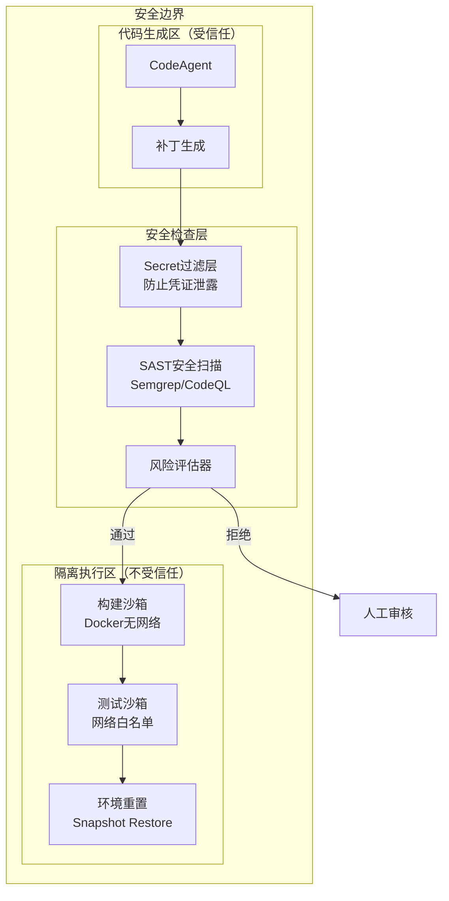

### 9.2 Secret 过滤层

```python
class SecretFilter:
    """敏感信息过滤器 - 防止凭证泄露到 LLM 上下文"""

    # 敏感模式匹配
    SECRET_PATTERNS = [
        r'(?i)(api[_-]?key|apikey)\s*[=:]\s*["\']?[\w-]{20,}',
        r'(?i)(password|passwd|pwd)\s*[=:]\s*["\']?[^\s"\']+',
        r'(?i)(token|secret|credential)\s*[=:]\s*["\']?[\w-]{20,}',
        r'(?i)bearer\s+[\w-]{20,}',
        r'-----BEGIN\s+(RSA\s+)?PRIVATE\s+KEY-----',
        r'ghp_[a-zA-Z0-9]{36}',  # GitHub Token
        r'glpat-[\w-]{20}',      # GitLab Token
    ]

    def filter_context(self, context: Dict[str, Any]) -> Dict[str, Any]:
        """过滤上下文中的敏感信息"""
        filtered = {}
        for key, value in context.items():
            if self._is_sensitive_key(key):
                filtered[key] = "[REDACTED]"
            elif isinstance(value, str):
                filtered[key] = self._mask_secrets(value)
            elif isinstance(value, dict):
                filtered[key] = self.filter_context(value)
            else:
                filtered[key] = value
        return filtered

    def _is_sensitive_key(self, key: str) -> bool:
        """检查键名是否敏感"""
        sensitive_keys = ['token', 'password', 'secret', 'api_key', 'credential']
        return any(s in key.lower() for s in sensitive_keys)

    def _mask_secrets(self, text: str) -> str:
        """遮蔽文本中的敏感信息"""
        import re
        for pattern in self.SECRET_PATTERNS:
            text = re.sub(pattern, '[REDACTED]', text)
        return text
```

### 9.3 SAST 安全扫描

```python
class SASTScanner:
    """静态应用安全测试 - 扫描 AI 生成代码中的高危操作"""

    # 高危系统调用（C语言）
    DANGEROUS_PATTERNS = {
        'command_injection': [
            r'\bsystem\s*\(',
            r'\bexec[lv]?[pe]?\s*\(',
            r'\bpopen\s*\(',
            r'\bShellExecute\w*\s*\(',
        ],
        'network_access': [
            r'\bsocket\s*\(',
            r'\bconnect\s*\(',
            r'\bbind\s*\(',
            r'\blisten\s*\(',
            r'\bcurl_easy_perform\s*\(',
        ],
        'file_system_danger': [
            r'\bunlink\s*\(',
            r'\brmdir\s*\(',
            r'\brename\s*\(.*/etc/',
            r'\bchmod\s*\(.*, 0?777\)',
        ],
        'memory_unsafe': [
            r'\bstrcpy\s*\(',
            r'\bsprintf\s*\(',
            r'\bgets\s*\(',
        ]
    }

    async def scan_patch(self, patch_content: str) -> ScanResult:
        """扫描补丁内容"""
        findings = []

        for category, patterns in self.DANGEROUS_PATTERNS.items():
            for pattern in patterns:
                matches = re.findall(pattern, patch_content)
                if matches:
                    findings.append(SecurityFinding(
                        category=category,
                        pattern=pattern,
                        matches=matches,
                        severity=self._get_severity(category)
                    ))

        # 调用外部 SAST 工具（Semgrep）
        external_findings = await self._run_semgrep(patch_content)
        findings.extend(external_findings)

        return ScanResult(
            passed=len([f for f in findings if f.severity == 'critical']) == 0,
            findings=findings,
            requires_review=len(findings) > 0
        )

    def _get_severity(self, category: str) -> str:
        severity_map = {
            'command_injection': 'critical',
            'network_access': 'high',
            'file_system_danger': 'high',
            'memory_unsafe': 'medium'
        }
        return severity_map.get(category, 'low')
```

### 9.4 构建沙箱配置

```yaml
# docker/build-sandbox.yaml
version: '3.8'
services:
  build-sandbox:
    image: firmware-build:latest
    network_mode: none  # 完全禁用网络
    security_opt:
      - no-new-privileges:true
      - seccomp:seccomp-profile.json
    read_only: true
    tmpfs:
      - /tmp:size=2G
      - /build:size=10G
    volumes:
      - type: bind
        source: ./workspace
        target: /workspace
        read_only: false
    resources:
      limits:
        cpus: '4'
        memory: 8G
      reservations:
        cpus: '2'
        memory: 4G
    environment:
      - BUILD_TIMEOUT=3600
    user: "1000:1000"  # 非 root 用户
```

### 9.5 测试沙箱配置

```yaml
# docker/test-sandbox.yaml
version: '3.8'
services:
  test-sandbox:
    image: firmware-test:latest
    networks:
      - test-network
    security_opt:
      - no-new-privileges:true
    cap_drop:
      - ALL
    cap_add:
      - NET_RAW  # QEMU 可能需要
    volumes:
      - type: bind
        source: ./artifacts
        target: /artifacts
        read_only: true
    environment:
      - TEST_TIMEOUT=7200

networks:
  test-network:
    driver: bridge
    ipam:
      config:
        - subnet: 172.28.0.0/16
    driver_opts:
      com.docker.network.bridge.enable_ip_masquerade: "false"
```

---

## 10. Claude Code Skills 集成（可选）

> 说明：Claude Code Skills 作为可选的增强能力，可在后续阶段引入以提升开发效率和代码质量。

### 9.1 集成架构概览

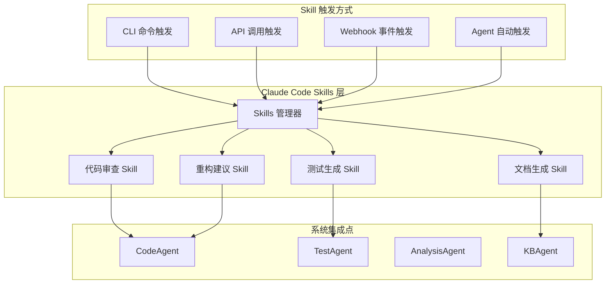

### 9.2 Skills 定义与能力

#### 9.2.1 代码审查 Skill

```python
class CodeReviewSkill:
    """代码审查 Skill - 基于 Claude Code 能力"""

    skill_id = "firmware-code-review"
    description = "针对固件代码的智能审查，识别潜在问题和优化点"

    capabilities = [
        "静态代码分析（C/C++ 特化）",
        "安全漏洞检测（缓冲区溢出、整数溢出等）",
        "固件特定模式识别（时序问题、资源泄漏）",
        "代码风格一致性检查",
        "性能瓶颈识别"
    ]

    async def execute(self, context: SkillContext) -> SkillResult:
        """执行代码审查"""
        # 1. 获取代码变更
        code_changes = context.get_code_changes()

        # 2. 调用 Claude Code 进行审查
        review_result = await self.claude_code_review(
            code_changes,
            firmware_context=context.firmware_context
        )

        # 3. 结构化输出
        return SkillResult(
            issues=review_result.issues,
            suggestions=review_result.suggestions,
            severity_summary=review_result.severity_summary
        )
```

#### 9.2.2 测试用例生成 Skill

```python
class TestGenerationSkill:
    """测试用例生成 Skill"""

    skill_id = "firmware-test-gen"
    description = "基于代码变更自动生成测试用例"

    capabilities = [
        "单元测试生成",
        "边界条件测试",
        "错误路径测试",
        "固件特定测试模式（启动序列、中断处理）"
    ]

    async def execute(self, context: SkillContext) -> SkillResult:
        """生成测试用例"""
        # 1. 分析代码结构
        code_structure = await self.analyze_code_structure(context.target_files)

        # 2. 生成测试用例
        test_cases = await self.generate_test_cases(
            code_structure,
            test_framework=context.test_framework,  # pytest, unity, etc.
            coverage_target=context.coverage_target
        )

        return SkillResult(
            test_cases=test_cases,
            coverage_estimate=self.estimate_coverage(test_cases)
        )
```

### 9.3 Skills 管理器

```python
class SkillsManager:
    """Claude Code Skills 管理器"""

    def __init__(self):
        self.registered_skills: Dict[str, Skill] = {}
        self.skill_configs: Dict[str, SkillConfig] = {}

    def register_skill(self, skill: Skill, config: SkillConfig):
        """注册 Skill"""
        self.registered_skills[skill.skill_id] = skill
        self.skill_configs[skill.skill_id] = config

    async def invoke_skill(self, skill_id: str,
                          context: SkillContext) -> SkillResult:
        """调用 Skill"""
        if skill_id not in self.registered_skills:
            raise SkillNotFoundError(f"Skill not found: {skill_id}")

        skill = self.registered_skills[skill_id]
        config = self.skill_configs[skill_id]

        # 权限检查
        if not await self._check_permissions(skill, context):
            raise PermissionDeniedError()

        # 执行 Skill
        try:
            result = await skill.execute(context)
            await self._log_skill_execution(skill_id, context, result)
            return result
        except Exception as e:
            await self._handle_skill_error(skill_id, context, e)
            raise

    def list_available_skills(self) -> List[SkillInfo]:
        """列出可用的 Skills"""
        return [
            SkillInfo(
                skill_id=skill.skill_id,
                description=skill.description,
                capabilities=skill.capabilities
            )
            for skill in self.registered_skills.values()
        ]
```

### 9.4 与 Agent 系统集成

```python
class SkillEnhancedCodeAgent(CodeAgent):
    """支持 Skills 增强的 CodeAgent"""

    def __init__(self, skills_manager: SkillsManager):
        super().__init__()
        self.skills_manager = skills_manager

    async def analyze_code_with_skills(self,
                                       file_paths: List[str],
                                       context: str) -> CodeAnalysis:
        """使用 Skills 增强的代码分析"""

        # 1. 基础代码分析
        base_analysis = await self.analyze_code(file_paths, context)

        # 2. 调用代码审查 Skill 增强
        skill_context = SkillContext(
            target_files=file_paths,
            firmware_context=context,
            base_analysis=base_analysis
        )

        review_result = await self.skills_manager.invoke_skill(
            "firmware-code-review",
            skill_context
        )

        # 3. 合并结果
        return self._merge_analysis_results(base_analysis, review_result)
```

### 9.5 Skills 配置

```yaml
# config/skills.yaml
skills:
  firmware-code-review:
    enabled: true
    auto_trigger:
      - on_code_change
      - on_mr_create
    config:
      severity_threshold: "warning"
      max_issues_per_file: 50
      custom_rules:
        - "firmware_timing_check"
        - "memory_barrier_check"

  firmware-test-gen:
    enabled: true
    auto_trigger:
      - on_code_change
    config:
      test_framework: "pytest"
      coverage_target: 0.8
      include_edge_cases: true

  firmware-doc-gen:
    enabled: false  # 后续阶段启用
    config:
      output_format: "markdown"
      include_api_docs: true
```

### 9.6 实施计划

| 阶段 | 内容 | 优先级 |
|------|------|--------|
| Phase 4 | Skills 管理器基础框架 | P1 |
| Phase 4 | 代码审查 Skill 集成 | P1 |
| Phase 5 | 测试生成 Skill 集成 | P2 |
| Phase 6 | 文档生成 Skill 集成 | P2 |

---

## 10. 总结与展望

### 9.1 架构优势

本架构设计具备以下核心优势：

1. **模块化设计**：各组件松耦合，便于维护和扩展
2. **智能协作**：多Agent系统实现专业化分工和高效协作
3. **知识驱动**：RAG系统提供历史经验和专业知识支持
4. **环境抽象**：统一的测试环境接口支持多种硬件平台
5. **流程可控**：状态机确保执行流程的可追溯性和可控制性

### 9.2 关键技术决策

1. **选择CrewAI而非直接实现多Agent**：利用成熟框架加速开发
2. **采用LangGraph而非自定义状态机**：确保状态管理的可靠性
3. **混合存储架构**：向量数据库+关系数据库+文件系统的组合
4. **事件驱动通信**：确保Agent间的松耦合协作

### 9.3 实施路线图

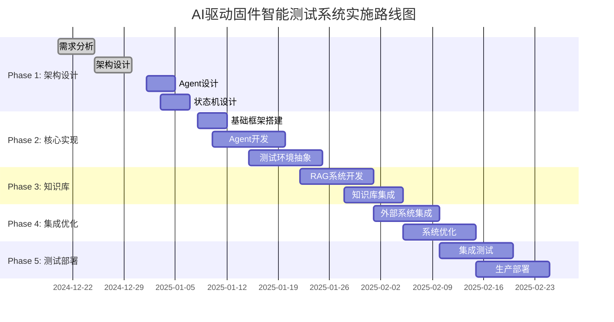

### 9.4 风险评估与应对

| 风险类型 | 风险描述 | 影响程度 | 应对策略 |
|----------|----------|----------|----------|
| 技术风险 | 大模型API稳定性 | 中等 | 多模型备选、本地化部署 |
| 集成风险 | 外部系统兼容性 | 高 | 适配器模式、分阶段集成 |
| 性能风险 | 大量Agent并发处理 | 中等 | 异步架构、资源池管理 |
| 数据风险 | 知识库质量控制 | 高 | 数据验证、人工审核机制 |

---

## 10. 文档维护

### 10.1 版本历史

| 版本 | 日期 | 修改内容 | 修改人 |
|------|------|----------|--------|
| v2.0 | 2025-01-27 | 初始架构设计文档 | AI Agent |

### 10.2 相关文档

- [需求规范](REQUIREMENTS.md) - 系统需求定义
- [知识库设计](KNOWLEDGE_SCHEMA.md) - 数据结构设计
- [Agent详细设计](AGENT_DESIGN.md) - Agent实现细节
- [状态机设计](STATE_MACHINE.md) - 状态转换逻辑
- [工作计划](WORK_PLAN_V2.md) - 项目实施计划

### 10.3 反馈渠道

如对架构设计有疑问或建议，请通过以下方式反馈：
- 项目Issue系统
- 技术讨论会议
- 设计评审文档

---

**文档结束**

*本架构设计文档为AI驱动固件智能测试系统的核心设计文档，为后续开发提供指导。*
