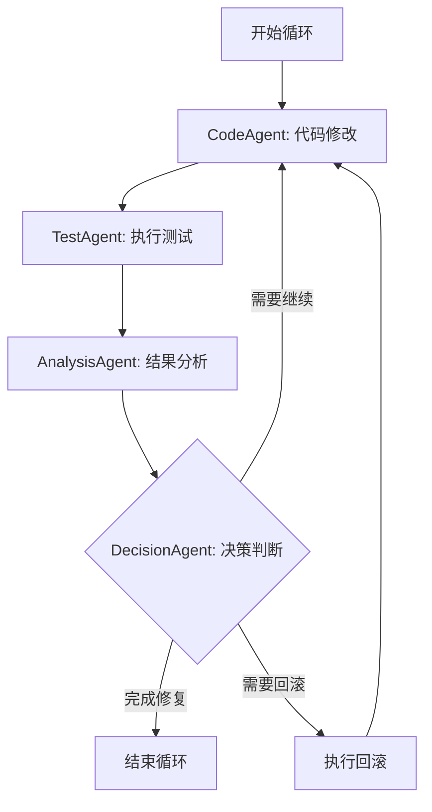
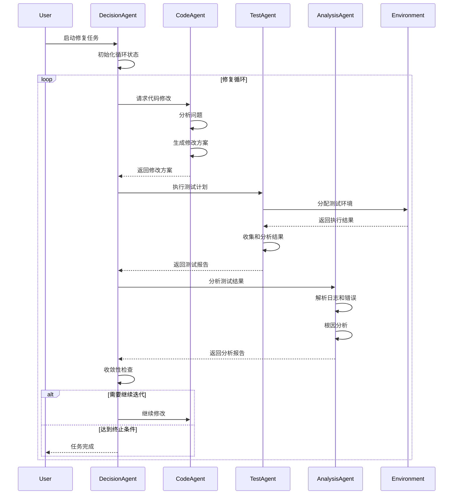

# AI-Driven Firmware Intelligent Testing System - Detailed Design

## Table of Contents
1. [Core Modules Detailed Design](#1-core-modules-detailed-design)
    1.1 [CodeAnalyzer 详细设计](#11-codeanalyzer-详细设计)
        1.1.1 [功能概述](#111-功能概述)
        1.1.2 [实现细节深度解析](#112-实现细节深度解析)
        1.1.3 [核心 API 规范定义](#113-核心-api-规范定义)
        1.1.4 [核心数据结构详解](#114-核心数据结构详解)
        1.1.5 [符号表管理策略深度说明](#115-符号表管理策略深度说明)
        1.1.6 [圈复杂度计算详细算法](#116-圈复杂度计算详细算法)
        1.1.7 [实现备注与限制](#117-实现备注与限制)
    1.2 [CodeModifier 详细设计](#12-codemodifier-详细设计)
        1.2.1 [功能概述](#121-功能概述)
        1.2.2 [修改建议生成流程详细说明](#122-修改建议生成流程详细说明)
        1.2.3 [验证和安全检查机制详细说明](#123-验证和安全检查机制详细说明)
        1.2.4 [代码补丁生成详细说明](#124-代码补丁生成详细说明)
        1.2.5 [补丁冲突解决策略](#125-补丁冲突解决策略)
        1.2.6 [修改历史管理详细说明](#126-修改历史管理详细说明)
        1.2.7 [核心 API 详细定义](#127-核心-api-详细定义)
        1.2.8 [核心数据结构详解](#128-核心数据结构详解)
        1.2.9 [验证逻辑深度说明](#129-验证逻辑深度说明)
        1.2.10 [异常处理与边缘情况](#1210-异常处理与边缘情况)
    1.3 [TestOrchestrator 详细设计](#13-testorchestrator-详细设计)
        1.3.1 [功能概述](#131-功能概述)
        1.3.2 [多环境测试执行流程详细说明](#132-多环境测试执行流程详细说明)
        1.3.3 [环境抽象层设计详细说明](#133-环境抽象层设计详细说明)
        1.3.4 [测试配置管理详细说明](#134-测试配置管理详细说明)
        1.3.5 [日志采集和标准化详细说明](#135-日志采集和标准化详细说明)
        1.3.6 [测试结果格式标准化](#136-测试结果格式标准化)
        1.3.7 [核心 API 详细定义](#137-核心-api-详细定义)
    1.4 [ResultAnalyzer 详细设计](#14-resultanalyzer-详细设计)
        1.4.1 [功能概述](#141-功能概述)
        1.4.2 [日志解析规则引擎详细说明](#142-日志解析规则引擎详细说明)
        1.4.3 [错误分类系统详细说明](#143-错误分类系统详细说明)
        1.4.4 [根因分析详细说明](#144-根因分析详细说明)
        1.4.5 [经验知识提取详细说明](#145-经验知识提取详细说明)
        1.4.6 [核心 API 详细定义](#146-核心-api-详细定义)
        1.4.7 [数据结构详细定义](#147-数据结构详细定义)
        1.4.8 [设计决策补充](#148-设计决策补充)
2. [Data Models](#2-data-models)
    2.1 [Code Modification Record](#21-code-modification-record)
    2.2 [Test Execution Record](#22-test-execution-record)
    2.3 [Knowledge Unit](#23-knowledge-unit)
3. [API and Interface Design](#3-api-and-interface-design)
    3.1 [Agent Communication](#31-agent-communication)
    3.2 [Knowledge Query Interface](#32-knowledge-query-interface)
    3.3 [Test Execution Interface](#33-test-execution-interface)
4. [Configuration and Strategies](#4-configuration-and-strategies)
    4.1 [Agent Configuration](#41-agent-configuration)
    4.2 [Retrieval Strategy](#42-retrieval-strategy)
5. [Security and Reliability](#5-security-and-reliability)
    5.1 [Sandbox Execution](#51-sandbox-execution)
    5.2 [Code Integrity](#52-code-integrity)
6. [Conclusion](#6-conclusion)

## 1. Core Modules Detailed Design

### 1.1 CodeAnalyzer 详细设计

#### 1.1.1 功能概述
CodeAnalyzer 是本系统的底层核心模块，专门针对 C 语言（特别是嵌入式固件中常见的 C 代码）提供深度的静态分析能力。它不仅仅是一个简单的代码解析器，更是一个能够理解代码逻辑结构、识别调用路径并评估代码质量的综合引擎。其核心目标是为下游的 AI 代理（Agent）提供高度结构化的上下文信息，使其能够基于客观事实而非单纯的文本匹配来生成代码建议。

主要核心功能点涵盖：
- **全语法树（AST）解析**：基于 C99/C11 标准，将源码转换为可操作的对象模型。
- **精细化符号提取**：从顶层作用域到底层局部块，全面抓取函数、变量、宏、结构体定义。
- **全局依赖建模**：构建跨文件的依赖关系，识别头文件包含链和外部引用。
- **多维度复杂度评估**：提供定量指标，量化代码的逻辑复杂度，为风险评估提供依据。
- **控制流分析**：构建函数内部的控制流图（CFG），识别不可达代码和循环结构。
- **数据流分析**：追踪变量的生命周期和定义-使用（Def-Use）链。
- **代码规范性检查**：初步检查代码是否符合特定的嵌入式 C 编程规范。

#### 1.1.2 实现细节深度解析

##### 1. AST 解析架构与策略
*   **解析引擎选型**：
    CodeAnalyzer 选定 `pycparser` 作为核心解析引擎。
    *   *选择理由*：`pycparser` 能够精确处理 C 语言的声明语法，支持预处理后的代码流，且其生成的 AST 节点与 C 语言规范一一对应。相比于 `tree-sitter`，它在处理 C 语言类型定义（typedef）和符号识别方面更加严谨，适合需要深度语义分析的场景。
*   **AST 节点遍历机制**：
    采用增强的 **Visitor 设计模式**。通过继承 `c_ast.NodeVisitor`，我们实现了对不同控制流语句的定向拦截：
    *   `visit_FuncDef`: 捕获函数定义。记录函数名、起始行、结束行，并递归分析函数体。
    *   `visit_Decl`: 捕获变量和函数的声明。识别 `static`, `extern` 等存储修饰符。
    *   `visit_If`, `visit_For`, `visit_While`, `visit_DoWhile`: 捕获循环和条件分支，用于复杂度计算。
    *   `visit_Switch`, `visit_Case`, `visit_Default`: 捕获多分支结构。
    *   `visit_FuncCall`: 捕获函数调用，记录被调函数名和实参列表。
    *   `visit_ID`, `visit_StructRef`, `visit_ArrayRef`: 识别变量引用和成员访问。
    *   `visit_TypeDecl`, `visit_Typedef`, `visit_Enum`, `visit_Struct`, `visit_Union`: 捕获自定义数据类型。
*   **鲁棒性处理：不完整代码分析**：
    固件开发中，由于特定硬件头文件的缺失，常会导致解析中断。我们采用了以下策略：
    1.  **预处理器模拟**：自动模拟常见的宏定义（如 `__attribute__`, `__inline`, `__asm__`, `__volatile__`）以减少解析错误。
    2.  **分块解析**：当整体解析失败时，系统将代码按函数块进行分割，尝试逐个解析，并记录失败的行号和原因。
    3.  **宽容模式**：在遇到无法识别的语法节点时，记录错误位置并尝试通过简单的正则表达式跳过该片段，继续后续分析。
    4.  **头文件插桩**：对于缺失的头文件，自动生成包含空函数原型和基本类型定义的占位头文件。

##### 2. 符号表管理机制 (Symbol Table Management)
符号表是连接 AST 节点与语义信息的桥梁。
*   **层级化作用域 (Scoped Symbol Tables)**：
    *   **Level 0 (Global Scope)**: 存储全局变量、全局函数原型、全局宏定义、结构体定义。
    *   **Level 1 (File Static Scope)**: 存储 `static` 修饰的文件私有变量和函数。
    *   **Level 2+ (Local Scope)**: 对应函数体内部的代码块（Compound Statement）。处理变量遮蔽（Shadowing）逻辑。每次遇到 `{` 增加一层，遇到 `}` 减少一层。
*   **符号生命周期追踪**：
    记录符号的定义位置、作用域范围、首次使用位置及最后一次使用位置。
*   **符号冲突处理**：
    在同一作用域内发现重复定义时，标记为错误；在嵌套作用域中发现重名时，按照“就近原则”映射。

##### 3. 调用图 (Call Graph) 构建算法
调用图是分析 Bug 传播路径和评估修改影响范围的关键。
*   **直接调用追踪**：
    遍历函数体内的 `FuncCall` 节点，建立主调函数到被调函数的边。
*   **间接调用分析 (Indirect Calls)**：
    对于通过函数指针进行的调用（例如 `ops->read()`），CodeAnalyzer 会检索符号表查找该指针可能的赋值点。若无法确定，则标记为 `PotentialIndirectCall`。
*   **递归调用识别**：
    利用深度优先搜索 (DFS) 和拓扑排序识别图中的环路。递归函数在固件中通常被限制使用，分析器会对其进行高亮警告。

##### 4. 自动化数据流分析
*   **Def-Use 链 (Definition-Use Chain)**：
    为函数内的每个变量构建定义-使用链。
    *   *算法逻辑*：
        1. 识别所有赋值语句（Definition）。
        2. 识别所有读取语句（Use）。
        3. 检查是否存在“定义后从未被使用”或“使用前未被定义（赋值）”的路径。
*   **简单的变量追踪**：
    分析变量在函数调用间的传递。识别是否通过指针传递了局部变量地址（悬挂指针风险）。

##### 5. 复杂度指标计算模型
*   **圈复杂度 (Cyclomatic Complexity, M)**：
    $M = E - N + 2P$，在 AST 层面的简化计算：$1 + \sum(\text{分支节点})$。
    *   判定节点：`if`, `while`, `for`, `case`, `&&`, `||`, `? :`。
*   **LOC 统计**：
    *   SLOC (Source Lines of Code): 除去注释和空行的代码行。
    *   CLOC (Comment Lines of Code): 注释行。
    *   BLOC (Blank Lines of Code): 空行。
*   **函数度量**：
    *   参数个数。
    *   最大嵌套深度。
    *   函数长度（行数）。

##### 6. 工业级缓存策略
为了支持拥有数万个源文件的固件工程：
*   **持久化方案**：使用 `pickle` 或 `msgpack` 将解析后的符号表和依赖图序列化到 `.analyzer_cache` 目录。
*   **缓存 Key**：`SHA256(filepath + file_mtime + compiler_config)`。
*   **失效策略**：若文件修改时间发生变化，或其包含的任何头文件发生变化，则强制重新解析。

#### 1.1.3 核心 API 规范定义

```python
from typing import List, Dict, Optional, Any, Set, Tuple
from dataclasses import dataclass
from enum import Enum

class SymbolScope(Enum):
    GLOBAL = "global"
    STATIC = "static"
    LOCAL = "local"
    EXTERN = "extern"

@dataclass
class Position:
    """位置信息"""
    line: int
    column: int
    filepath: str

class CodeAnalyzer:
    """
    CodeAnalyzer 类负责执行 C 代码的详细解析和深度静态分析。
    """

    def __init__(self, include_paths: List[str] = None, defines: Dict[str, str] = None):
        """
        初始化分析器。
        :param include_paths: 头文件搜索路径列表
        :param defines: 预定义的宏及其值
        """
        self.include_paths = include_paths or []
        self.defines = defines or {}
        self.global_symbol_table = {}
        self.dependency_graph = DependencyGraph()

    def parse_file(self, filepath: str) -> Any:
        """
        解析指定文件并生成 AST。
        :param filepath: 目标文件路径
        :return: pycparser.c_ast.FileAST 对象
        """
        pass

    def extract_functions(self, ast: Any) -> List['FunctionInfo']:
        """
        从 AST 中提取所有函数的信息。
        :param ast: AST 根节点
        :return: FunctionInfo 对象列表
        """
        pass

    def extract_globals(self, ast: Any) -> List['GlobalVarInfo']:
        """
        从 AST 中提取所有全局变量的信息。
        :param ast: AST 根节点
        :return: GlobalVarInfo 对象列表
        """
        pass

    def extract_macros(self, filepath: str) -> List['MacroInfo']:
        """
        提取文件中的宏定义，包括常量宏和函数式宏。
        :param filepath: 文件路径
        :return: MacroInfo 对象列表
        """
        pass

    def analyze_dependencies(self) -> 'DependencyGraph':
        """
        基于当前项目状态构建完整的依赖图。
        :return: DependencyGraph 对象
        """
        pass

    def calculate_complexity(self, func_name: str) -> 'ComplexityMetrics':
        """
        计算指定函数的复杂度指标。
        :param func_name: 函数名
        :return: ComplexityMetrics 对象
        """
        pass

    def get_function_signature(self, func_name: str) -> 'FunctionSignature':
        """
        获取函数的完整签名。
        :param func_name: 函数名
        :return: FunctionSignature 对象
        """
        pass

    def find_symbol_definition(self, symbol_name: str, context_pos: Position) -> Optional[Position]:
        """
        根据上下文位置查找符号的定义位置。
        :param symbol_name: 符号名
        :param context_pos: 当前上下文位置
        :return: 定义位置的 Position 对象
        """
        pass

    def get_call_stack_to(self, target_func: str) -> List[List[str]]:
        """
        获取到达目标函数的所有可能调用路径。
        :param target_func: 目标函数名
        :return: 调用路径列表
        """
        pass
```

#### 1.1.4 核心数据结构详解

```python
@dataclass
class Argument:
    """函数参数描述"""
    name: str                           # 参数名
    type: str                           # 参数类型
    pos: Position                       # 定义位置

class FunctionSignature:
    """函数接口签名"""
    name: str                           # 函数名
    return_type: str                    # 返回值类型
    arguments: List[Argument]           # 参数对象列表
    is_static: bool                     # 是否为静态函数
    is_inline: bool                     # 是否为内联函数
    attributes: List[str]               # 特殊属性如 __attribute__

class FunctionInfo:
    """函数的全量分析信息"""
    name: str                           # 函数名
    signature: FunctionSignature        # 签名对象
    parameters: List[Argument]          # 参数列表 (冗余存储，便于访问)
    return_type: str                   # 返回类型
    start_line: int                    # 起始行号
    end_line: int                      # 结束行号
    file_path: str                     # 所属文件
    cyclomatic_complexity: int         # 圈复杂度
    called_functions: List[str]        # 内部调用的函数名列表
    called_by: List[str]               # 被哪些函数调用
    local_variables: List['LocalVar']  # 局部变量列表
    max_nesting_depth: int             # 最大嵌套深度
    has_recursion: bool                # 是否递归
    is_definition: bool                # 是否为完整定义（而非原型声明）
    docstring: str                     # 函数上方的注释内容

@dataclass
class LocalVar:
    """局部变量描述"""
    name: str
    type: str
    scope_level: int
    definition_pos: Position

class GlobalVarInfo:
    """全局变量详细信息"""
    name: str                          # 变量名
    type: str                          # 数据类型
    initial_value: Optional[str]       # 初始值字符串
    scope: SymbolScope                 # 作用域
    is_const: bool                     # 是否为常量
    is_volatile: bool                  # 是否为易变变量
    used_by_functions: List[str]       # 访问此变量的函数名
    definition_pos: Position           # 定义位置

class MacroInfo:
    """预处理宏信息"""
    name: str                          # 宏名
    is_function_like: bool             # 是否带参数
    params: List[str]                  # 参数名列表（若有）
    body: str                          # 宏展开内容
    definition_line: int               # 定义行号
    filepath: str                      # 定义文件

class DependencyGraph:
    """项目依赖关系图"""
    nodes: Dict[str, 'Node']           # 节点映射
    edges: List['Edge']                # 边列表

@dataclass
class Node:
    """图节点"""
    id: str
    type: str                          # 'function', 'variable', 'file'
    data: Any

@dataclass
class Edge:
    """图边"""
    source: str
    target: str
    type: str                          # 'call', 'reference', 'include'

class ComplexityMetrics:
    """复杂度度量报告"""
    function_name: str
    cyclomatic_complexity: int         # 圈复杂度
    sloc: int                          # 代码行数
    cloc: int                          # 注释行数
    param_count: int                   # 参数数量
    nesting_depth: int                 # 嵌套深度
    decision_points: int               # 决策点数
```

#### 1.1.5 符号表管理策略深度说明
符号表管理是静态分析的核心挑战之一，CodeAnalyzer 采用了以下高级策略：
- **符号重命名处理**：在固件代码中，常常使用 `#define` 重新定义库函数名。CodeAnalyzer 在预处理阶段会解析这些定义，确保在符号表中记录的是其最终的链接名称。
- **结构体成员追踪**：对于 `struct` 和 `union`，符号表不仅记录类型名，还记录其内部成员的偏移、类型及访问频率。这对于 AI 识别“由于结构体成员未对齐导致的 Bug”至关重要。
- **匿名作用域处理**：对于 C 代码中的匿名代码块（如 `if (cond) { int x; }`），分析器会自动生成唯一的标识符（如 `_anon_block_1`）来管理其生命周期。

#### 1.1.6 圈复杂度计算详细算法
本模块实现的圈复杂度计算遵循以下步骤：
1. **控制流节点识别**: 遍历函数 AST，识别所有条件判断节点（`If`, `While`, `For`, `DoWhile`, `Switch`, `Case`）。
2. **逻辑运算符累加**: 在 C 语言中，`&&` 和 `||` 会导致短路求值，实质上增加了执行路径。因此，每个逻辑运算符节点在圈复杂度计算中均计为 +1。
3. **判定点统计**: $P = \text{控制流节点数} + \text{逻辑运算符数}$。
4. **最终结果**: $M = P + 1$。

#### 1.1.7 实现备注与限制
- **内联汇编 (Inline Assembly)**: CodeAnalyzer 目前仅能识别汇编块的范围，无法解析汇编内部的指令逻辑。
- **动态宏扩展**: 对于依赖于复杂预处理器递归的宏，解析器可能仅记录展开后的最终形态，而丢失中间过程。

---

### 1.2 CodeModifier 详细设计

#### 1.2.1 功能概述
CodeModifier 是闭环自动化修复系统的“执行手”。它接收来自分析阶段的故障诊断结果，并将其转化为安全、可验证且高质量的代码变更。其核心逻辑是：**“基于 AI 建议，执行工业级验证”**。

主要核心功能：
- **修改建议生成**：针对特定 Bug 生成修复方案。
- **自动化验证流水线**：涵盖语法、规范、编译、符号、接口五层检查。
- **补丁管理**：生成标准 Unified Diff。
- **修改历史记录与回滚**：确保每一笔改动均可审计且可逆。

#### 1.2.2 修改建议生成流程详细说明

##### 1. 输入阶段 (Input Phase)
CodeModifier 自动聚合以下数据包：
*   **目标代码块**：需要修改的函数及其上下游代码。
*   **诊断信息**：包括编译错误、Lint 警告或动态测试失败的 Log（含堆栈）。
*   **语义上下文**：通过 CodeAnalyzer 获取的全局变量定义、相关函数签名。
*   **环境标签**：如产品线名称、芯片型号。

##### 2. Prompt 工程详细说明
*   **System Prompt**：定义 AI 角色为“资深固件安全专家”。设定约束：“禁止引入外部库”、“保持代码缩进为 4 空格”、“遵循 MISRA C 安全规范”。
*   **Context 补充**：
    *   *Example*: "The function `dev_write` uses global `g_lock`. Ensure you release it before returning."
*   **Specific Requirements**：
    *   "Do not change the function signature."
    *   "Use `MEM_ALLOC` instead of `malloc`."
    *   "Ensure all return paths are handled correctly."

##### 3. LLM API 调用
*   **模型选择**：默认使用 GPT-4 或 Claude 3.5。
*   **重试机制**：如果 AI 生成的代码在语法检查阶段失败，系统会自动将解析错误反馈给 AI，要求其重修。
*   **并行建议**：同时请求 3 个不同的建议，并根据验证结果挑选最优的一个。

##### 4. 输出处理 (Post-processing)
*   **提取代码**：从 Markdown 回复中精准切取 ` ```c ` 块。
*   **格式化**：调用 `clang-format -i --style=file` 对生成代码进行格式归一化。

#### 1.2.3 验证和安全检查机制详细说明

1.  **语法检查 (Syntax Check)**：
    使用 `pycparser` 重新解析修改后的文件。任何 Parse Error 都会触发 AI 重写。
2.  **静态分析 (Lint Check)**：
    集成 `cppcheck`。检查项包括：变量未初始化、内存泄漏、数组越界、空指针解引用。
3.  **编译检查 (Compile Check)**：
    - 在配置好的 Docker 编译环境中执行编译命令。
    - **严格模式**：开启 `-Werror`，将所有警告视为错误。
4.  **符号表检查 (Symbol Check)**：
    验证新增代码引用的所有外部符号是否已在符号表中定义。
5.  **签名检查 (Signature Check)**：
    确保被标记为“禁止修改接口”的函数签名完全一致。

#### 1.2.4 代码补丁生成详细说明
*   **格式**：Unified Diff 格式（`diff -u`）。
*   **上下文行数**：默认保留 3 行上下文。

#### 1.2.5 补丁冲突解决策略
在多 Agent 并发场景下，CodeModifier 采用以下冲突解决机制：
1. **基于 Git 的三路合并**: 优先尝试利用 `git merge` 或 `git cherry-pick` 解决冲突。
2. **模糊匹配 (Fuzzing)**: 允许 `patch` 工具在行号微调的情况下应用补丁。
3. **重分析策略**: 如果补丁应用彻底失败，系统将重新运行 CodeAnalyzer 刷新上下文，并重新请求 AI 生成针对最新源码版本的修改建议。

#### 1.2.6 修改历史管理详细说明
*   **数据结构 (ModificationRecord)**：包含 ID、文件名、Git Commit Hash、修改前后快照、AI 推理过程、验证状态。
*   **回滚机制**：提供 `rollback(record_id)` API。系统通过 `git checkout` 或应用反向补丁恢复文件。

#### 1.2.7 核心 API 详细定义

```python
from datetime import datetime
from typing import List, Dict, Optional, Any

class CodeModifier:
    """
    CodeModifier 类负责协调 AI 生成修改建议并执行严格的验证流程。
    """

    def suggest_modifications(
        self, 
        code: str, 
        error_log: str, 
        context: Dict[str, Any], 
        constraints: Dict[str, Any]
    ) -> List['ModificationSuggestion']:
        """
        向 LLM 请求修复建议。
        """
        pass

    def validate_modification(
        self, 
        file_path: str, 
        modified_content: str
    ) -> 'ValidationResult':
        """
        执行语法、静态、编译、符号、接口五级验证。
        """
        pass

    def apply_modification(self, file_path: str, modification: 'ModificationSuggestion') -> bool:
        """
        将建议应用到物理文件并持久化记录。
        """
        pass

    def generate_patch(self, original_text: str, modified_text: str, filename: str) -> str:
        """
        计算并返回两个版本之间的 Unified Diff。
        """
        pass

    def rollback_to_version(self, file_path: str, version_id: str) -> bool:
        """
        执行回退操作。
        """
        pass

    def get_modification_history(self, file_path: str) -> List['ModificationRecord']:
        """
        获取该文件的所有修改足迹。
        """
        pass
```

#### 1.2.8 核心数据结构详解

```python
@dataclass
class ModificationSuggestion:
    """AI 生成的修改建议"""
    id: str                            # 建议 ID
    original_code: str                 # 修改前的代码块
    suggested_code: str                # AI 建议的代码块
    reasoning: str                     # AI 的逻辑推理
    affected_functions: List[str]      # 涉及的函数名
    confidence: float                  # 0.0 - 1.0 的置信度
    risks: List[str]                   # 潜在风险点

@dataclass
class CheckResult:
    """单项检查的结果"""
    passed: bool
    details: str                       # 错误输出或警告信息
    duration: float                    # 检查耗时

@dataclass
class ValidationResult:
    """综合验证报告"""
    is_valid: bool                     # 最终是否通过
    syntax_ok: CheckResult
    lint_ok: CheckResult
    compile_ok: CheckResult
    symbol_ok: CheckResult
    signature_ok: CheckResult
    errors: List[str]

@dataclass
class ModificationRecord:
    """持久化存储的修改记录"""
    record_id: str
    file_path: str
    base_commit: str                   # 基础 Git 哈希
    timestamp: datetime
    diff: str                          # 保存的 Diff 内容
    reasoning: str                     # AI 推理
    validation_report: dict            # 详细验证快照
    applied: bool                      # 是否当前已生效
```

#### 1.2.9 验证逻辑深度说明
验证逻辑是 CodeModifier 的灵魂。本模块实现了以下高级验证算法：
- **控制流等价性初步分析**：在某些重构任务中，利用 AST 比较工具确保除了目标逻辑外，核心控制流未发生非预期改变。
- **交叉编译矩阵验证**：针对跨平台固件，CodeModifier 可以在多个 Docker 容器中并行编译，确保修改的可移植性。

#### 1.2.10 异常处理与边缘情况
- **编译器 OOM**: 监控编译容器资源，自动调整内存配额。
- **AI 死循环生成**: 设置最大生成 Token 限制，防止模型失控。

### 1.3 TestOrchestrator 详细设计

#### 1.3.1 功能概述
TestOrchestrator 是系统的测试执行核心，负责管理各种异构测试环境、调度测试任务、监控执行状态并汇总原始测试数据。它屏蔽了底层硬件和仿真环境的差异，为上层 Agent 提供统一的测试接口。

核心功能深度扩展：
- **测试框架适配**：通过驱动插件支持 pytest、Robot Framework、CUnit、Google Test、LTP (Linux Test Project) 等。
- **多环境执行调度**：统一管理 QEMU 模拟器、物理目标板、BMC (via IPMI/Redfish)、树莓派以及 Windows 宿主机。
- **环境隔离与复位**：确保每个测试用例都在干净、确定的环境中执行，支持自动快照回滚。
- **全栈日志采集**：实时流式采集串口、系统 syslog、内核 dmesg、应用 stdout 以及硬件传感器（如功耗、温度）日志。
- **结果标准化处理**：将不同框架的输出（JUnit XML, TAP, JSON）统一转换为系统内置的 `TestResult` 模型。

#### 1.3.2 多环境测试执行流程详细说明

##### 1. QEMU 环境测试执行流程
QEMU 是固件开发中最常用的仿真环境，其执行流程如下：
- **初始化阶段**：
    - 根据配置（架构如 aarch64, 机器类型如 virt, 内存大小）启动 QEMU 进程。
    - 加载指定的固件镜像（Flash/ROM）和内核镜像。
    - 配置后端网络（如 TAP 设备或用户态 SLIRP）并映射调试端口（如 GDB, SSH）。
- **部署阶段**：
    - 检查 Guest 系统就绪状态（通常通过等待特定的串口输出或 SSH 服务响应）。
    - 使用 `scp` 或通过 `virtio-fs` 将测试脚本及测试产物（二进制文件）同步到虚拟机。
- **执行阶段**：
    - 触发测试脚本运行。
    - 持续监听 stdout 和 stderr，同时通过 QMP (QEMU Machine Protocol) 监控虚拟机 CPU 负载。
- **清理阶段**：
    - 执行关机指令或强制终止 QEMU 进程。
    - 清理临时磁盘镜像及快照文件。
- **结果收集**：解析执行输出，提取退出码和关键错误标记。

##### 2. 目标板环境（Target Board）测试执行流程
物理板卡测试涉及复杂的硬件操作：
- **锁定资源**：在硬件资源池中申请并独占目标板卡及其关联的 PDU 端口。
- **固件烧写**：
    - 建立 SSH 或串口连接。
    - 利用 TFTP、NFS 或供应商特定的烧录工具（如 OpenOCD）将编译产物刷入非易失性存储。
- **电源管理**：通过 IPMI 或 PDU API 执行电源循环（Power Cycle），确保硬件状态彻底重置。
- **日志采集开启**：启动串口服务器（Terminal Server）的录制功能，开始监听 Serial Console。
- **执行与验证**：在目标板执行测试，并根据串口输出实时判定系统是否发生 Kernel Panic。
- **清理与回收**：复位硬件到基准状态，解锁资源。

##### 3. 树莓派（Raspberry Pi）环境测试执行流程
- **SSH 认证**：建立远程 shell 会话。
- **环境自检**：安装缺失的库依赖，检查 GPIO 映射表是否冲突。
- **部署与执行**：上传测试套件并赋予执行权限，调用指定命令。
- **硬件遥测**：利用内置传感器接口采集执行期间的 CPU 温度、核心电压。
- **资源清理**：还原 GPIO 引脚状态，清理 `/tmp/test_*` 临时工作区。

##### 4. Windows 环境测试执行流程
针对宿主机相关的工具链或驱动测试：
- **WinRM 建立**：初始化 Windows 远程管理服务连接。
- **配置注入**：自动设置测试所需的环境变量（PATH, SystemDrive）。
- **PowerShell 执行**：利用脚本化的方式触发执行，捕获完整的进程树信息。
- **日志聚合**：不仅收集脚本输出，还同步查询 Event Log（事件查看器）中的异常。
- **进程树清理**：测试结束后强制终止所有派生出的子进程。

##### 5. BMC 环境（Baseboard Management Controller）测试执行流程
- **管理通道建立**：连接 IPMI 接口或 Redfish REST API 端点。
- **带外控制**：执行远程重启、查询传感器列表。
- **固件升级测试**：验证 BMC 自身的升级逻辑及对主板固件的控制能力。
- **SEL 日志审计**：获取 System Event Log，解析其中包含的硬件故障信息。

#### 1.3.3 环境抽象层设计详细说明

```python
from abc import ABC, abstractmethod
from typing import List, Dict, Any, Optional

# 基础环境接口（Abstract Base Class）
class BaseTestEnvironment(ABC):
    """
    所有测试环境的基类，定义了环境生命周期的核心契约。
    """
    
    def __init__(self, config: Dict[str, Any]):
        self.config = config
        self.is_initialized = False
        self.logs = {}
        self.env_id = config.get("id", "default_env")
    
    @abstractmethod
    def init(self) -> bool:
        """初始化环境：启动虚拟机、建立 SSH 或重置硬件"""
        pass
    
    @abstractmethod
    def deploy(self, test_script: str, assets: List[str] = None) -> bool:
        """部署阶段：文件传输和执行权限设置"""
        pass
    
    @abstractmethod
    def execute(self, command: str, timeout: int = 300) -> 'TestResult':
        """执行阶段：触发测试逻辑并监控执行状态"""
        pass
    
    @abstractmethod
    def collect_logs(self) -> Dict[str, str]:
        """结果采集：汇总多源日志"""
        pass
    
    @abstractmethod
    def cleanup(self) -> bool:
        """清理阶段：销毁实例、释放锁定、清理现场"""
        pass

# QEMU环境实现示例
class QEMUEnvironment(BaseTestEnvironment):
    """QEMU虚拟机环境的具体实现"""
    
    def init(self) -> bool:
        # 1. 组装 QEMU 命令行参数 (arch, drive, netdev)
        # 2. 启动子进程并记录 PID
        # 3. 等待 SSH 端口就绪
        return True
    
    def deploy(self, test_script: str, assets: List[str] = None) -> bool:
        # 使用 scp 将脚本拷贝到 Guest OS 内部
        return True
    
    def execute(self, command: str, timeout: int = 300) -> 'TestResult':
        # 通过 SSH 远程调用并流式返回结果
        pass

# 目标板实现示例
class TargetBoardEnvironment(BaseTestEnvironment):
    """物理板卡环境实现"""
    
    def init(self) -> bool:
        # 1. 通过 IPMI 发送电源重置信号
        # 2. 监听串口直到进入登录提示符
        return True

    def collect_logs(self) -> Dict[str, str]:
        # 采集串口历史数据 + BMC SEL
        pass
```

#### 1.3.4 测试配置管理详细说明

##### 1. YAML 格式的测试配置
系统采用声明式配置，确保测试过程的可描述性和可控性。

```yaml
test_suite:
  name: "Memory Allocation Stress Tests"
  environment: "qemu"
  product_line: "arm_tf_v2"
  timeout: 600
  
  # 全局环境变量
  env_vars:
    MALLOC_PERTURB_: 165
    DEBUG_MODE: "1"
     
  test_cases:
    - id: "TC_MALLOC_001"
      name: "test_malloc_basic"
      type: "unit"
      script: "tests/test_malloc_basic.sh"
      expected_exit_code: 0
      # 断言逻辑
      assertions:
        - "allocated_memory > 0"
        - "return_ptr != NULL"
       
    - id: "TC_MALLOC_002"
      name: "test_malloc_stress"
      type: "stress"
      script: "tests/test_malloc_stress.sh"
      parameters:
        iterations: 1000
        block_size: 4096
      condition: "mem_size >= 512M" # 基于环境属性的条件运行
```

##### 2. 参数化与变量注入
- **维度过滤**：允许根据产品线 (SoC, Firmware Version) 动态选择不同的编译器标志或测试库。
- **Secrets 管理**：测试所需的认证令牌和 SSH 私钥通过加密的 Vault 注入。

##### 3. 动态生成测试
- **影响范围分析**：TestOrchestrator 接收来自 CodeAnalyzer 的修改函数列表，自动从案例库中匹配引用了这些函数的测试用例。
- **自动探索**：在缺乏现成用例时，基于 LLM 的建议自动生成简单的冒烟测试脚本。

#### 1.3.5 日志采集和标准化详细说明

##### 1. 日志源矩阵
- **stdout/stderr**: 测试脚本的直接输出。
- **系统日志**: `/var/log/syslog`, `/var/log/auth.log`, dmesg 内核缓冲区。
- **硬件指标**: CPU 使用率、IO 等待、内存压力指标 (Pressure Stall Information)。
- **外部通道**: 串口服务器 (Serial Console Server) 录制的原始字符流。

##### 2. 标准化格式 (LogEntry)
```python
from datetime import datetime
from dataclasses import dataclass

@dataclass
class LogEntry:
    timestamp: datetime          # 统一转换为 ISO 8601 UTC 时间
    level: str                   # DEBUG, INFO, WARNING, ERROR, CRITICAL
    source: str                  # 标识来源: 'serial', 'dmesg', 'app_out'
    message: str                 # 清洗掉 ANSI 控制符后的原始文本
    context: dict                # 包含 host_id, pid 等元数据
```

#### 1.3.6 测试结果格式标准化
所有测试产出最终汇聚为 `TestResult` 对象，作为后续分析的输入。

```python
class TestResult:
    def __init__(self):
        self.test_id = ""                 # 任务唯一 ID
        self.test_name = ""               # 测试用例名称
        self.environment = ""             # 执行环境类型
        self.product_line = ""            # 目标产品线
        self.status = "PENDING"           # PASSED, FAILED, TIMEOUT, ERROR
        self.duration = 0.0               # 总耗时
        self.start_time = None
        self.end_time = None
        
        # 详细数据
        self.logs = {}                    # { 'stdout': '...', 'dmesg': '...' }
        self.assertions = []              # 存储 AssertionResult 列表
        self.errors = []                  # 捕获的异常信息列表
        self.metrics = {}                 # { 'avg_cpu': 15.5, 'peak_mem': 1024 }
        
        # 版本溯源
        self.code_version = ""            # Git Commit Hash
        self.config_id = ""               # 使用的配置文件版本
```

#### 1.3.7 核心 API 详细定义

```python
class TestOrchestrator:
    def __init__(self, config: Dict[str, Any]):
        """加载环境拓扑配置和认证凭据"""
        pass
    
    def run_test_suite(self, suite_config: Dict[str, Any]) -> 'TestSuiteResult':
        """
        全自动化运行入口：
        1. 环境预检与锁定
        2. 部署资源
        3. 循环执行用例并实时监控
        4. 结果采集与标准化
        5. 资源释放
        """
        pass
    
    def run_single_test(self, case_id: str, env_id: str) -> TestResult:
        """针对特定环境运行单个测试案例"""
        pass
    
    def get_environment_health(self) -> Dict[str, Any]:
        """获取当前所有在线测试节点的状态报告"""
        pass
```

---

### 1.4 ResultAnalyzer 详细设计

#### 1.4.1 功能概述
ResultAnalyzer 是系统的故障诊断中心。它接收 TestOrchestrator 提供的标准化结果，通过语义分析、模式匹配和差分对比，挖掘失败背后的深层次原因。其核心价值在于将海量的、非结构化的文本日志转化为精准的“修复指令”。

核心能力：
- **日志语义化解析**：识别日志中的时间序列、模块分层和因果关系。
- **故障特征提取**：提取崩溃堆栈 (Stack Trace)、内存地址和寄存器快照。
- **多维度根因分析 (RCA)**：结合代码变更和历史数据，锁定故障发生的源头文件。
- **自动化经验沉淀**：将经过人工确认的修复案例转化为知识向量。

#### 1.4.2 日志解析规则引擎详细说明

##### 1. 正则模式库
系统内置了专门针对 C/C++ 嵌入式开发的故障模式库。

```python
class LogPattern:
    name: str                      # 唯一标识
    regex: str                     # 捕获正则
    error_type: str                # 映射到错误分类
    severity: str                  # 预警级别
    action_hint: str               # 给 AI 代理的操作提示

# 模式库示例
ERROR_PATTERNS = [
    LogPattern(
        name="segfault",
        regex=r"Segmentation fault \(SIGSEGV\) at 0x([0-9a-f]+)",
        error_type="SyntaxError",
        severity="CRITICAL",
        action_hint="Check for null pointer dereference or out-of-bounds access."
    ),
    LogPattern(
        name="double_free",
        regex=r"double free or corruption",
        error_type="ResourceError",
        severity="HIGH",
        action_hint="Investigate memory management logic in the affected block."
    ),
    LogPattern(
        name="stack_overflow",
        regex=r"stack smashing detected",
        error_type="SyntaxError",
        severity="CRITICAL",
        action_hint="Verify buffer sizes and recursion depth."
    )
]
```

##### 2. 多行日志识别与聚合
- **堆栈帧提取**：识别 `at <func_name> (<file>:<line>)` 格式的行并构建完整的调用链路。
- **上下文回溯**：在检测到错误点时，自动向前保留 100 行 `DEBUG` 日志，以便分析故障前夕的系统状态。

#### 1.4.3 错误分类系统详细说明

错误被严格划分为以下分类，以指导后续的 Agent 策略：
- **SYNTAX_ERROR (语法/运行时基本错误)**: 如段错误、指令异常、非法访问。
- **LOGIC_ERROR (逻辑错误)**: 结果不符预期、业务断言失败。
- **RESOURCE_ERROR (资源相关)**: 内存泄漏、FD (文件描述符) 耗尽、死锁。
- **TIMEOUT_ERROR (超时)**: 进程由于锁定或死循环未能退出。
- **ENVIRONMENT_ERROR (环境问题)**: 硬件掉线、依赖缺失、网络波动。

#### 1.4.4 根因分析详细说明

##### 1. 链式回溯
- **代码映射**：将日志中的函数名与 `CodeAnalyzer` 生成的符号表关联。
- **路径搜索**：基于 CFG (控制流图) 判断修改点是否在报错点的调用路径上。

##### 2. 差分对比分析
- **历史对齐**：选取同用例最近一次成功的运行日志作为“基准线”。
- **差异提取**：利用 `diff` 算法提取失败日志中独有的输出行，排除掉正常的系统底噪日志。

##### 3. RCA 报告结构
```python
class RootCauseAnalysis:
    def __init__(self):
        self.primary_reason = ""           # 核心原因摘要
        self.suspected_files = []          # 嫌疑文件列表
        self.evidence_snippets = []        # 证据片段
        self.confidence_score = 0.0        # 置信度 (0.0-1.0)
        self.is_regression = False         # 是否为回归问题
```

#### 1.4.5 经验知识提取详细说明
每当一个失败的测试在代码修改后转为成功，ResultAnalyzer 会自动提取“修复对”。

- **特征计算**：对失败日志进行脱敏处理，提取其指纹。
- **存储方案**：将（故障指纹, 修复 Patch, 开发者备注）存入向量数据库，供未来遇到相似问题时进行 RAG (检索增强生成) 检索。

#### 1.4.6 核心 API 详细定义

```python
class ResultAnalyzer:
    def __init__(self, pattern_db_path: Optional[str] = None):
        """加载自定义模式库"""
        pass
    
    def analyze_failure(self, result: TestResult) -> RootCauseAnalysis:
        """
        主分析入口：
        1. 模式匹配识别直接错误
        2. 提取堆栈信息
        3. 执行差分分析
        4. 输出根因分析报告
        """
        pass
    
    def parse_raw_logs(self, raw_text: str) -> List[LogEntry]:
        """将非结构化流解析为结构化 LogEntry 列表"""
        pass
    
    def compare_runs(self, run_a: TestResult, run_b: TestResult) -> 'RunComparison':
        """对比两次运行的日志和指标差异"""
        pass
```

#### 1.4.7 数据结构详细定义

```python
class StructuredLogs:
    def __init__(self, raw_text: str):
        self.raw_text = raw_text
        self.entries: List[LogEntry] = []
        self.error_blocks: List[str] = []

class CallFrame:
    def __init__(self):
        self.function_name = ""
        self.file_name = ""
        self.line_no = 0
        self.address = "0x0"
```

#### 1.4.8 设计决策补充
1. **为什么先使用规则引擎？**
   - **效率**：处理 GB 级别的串口日志时，正则过滤比调用大模型便宜且快速。
   - **确定性**：对于已知的 Assert 输出，规则能提供 100% 准确的分类。
2. **多源数据融合**：
   - 分析不仅看 `stdout`，必须结合硬件监控指标。例如：如果日志报错 `timeout` 同时指标显示 CPU 100%，则极大可能是死循环。
3. **闭环反馈机制**：
   - ResultAnalyzer 的输出直接作为 CodeModifier 的 Input Prompt 的一部分，实现真正的自愈闭环。

---

### 1.5 KnowledgeManager 详细设计

#### 1.5.1 功能概述
KnowledgeManager 是系统的"智慧大脑"，负责管理和检索历史经验、错误模式和最佳实践。它通过向量化技术将非结构化知识转化为可检索的语义向量，支持 RAG（检索增强生成）模式，为 AI 代理提供精准的上下文支持。

核心功能深度扩展：
- **知识抽取与建模**：从测试日志、代码注释、文档和专家经验中自动提取结构化知识。
- **向量化与索引**：支持多种 Embedding 模型，将文本转换为高维向量并建立多级索引。
- **混合检索策略**：融合向量相似度搜索、关键词匹配和规则过滤，实现精准召回。
- **知识生命周期管理**：支持知识的创建、更新、版本控制和自动过期清理。
- **多租户与权限控制**：基于产品线、组件和错误类型进行知识隔离。

#### 1.5.2 知识单元模型详细设计

##### 1. 知识类型体系
系统支持多种知识类型，每种类型有不同的存储策略和检索权重：

```python
from enum import Enum
from dataclasses import dataclass
from typing import List, Dict, Optional
from datetime import datetime

class KnowledgeType(Enum):
    """知识类型枚举"""
    ERROR_PATTERN = "error_pattern"           # 错误模式：编译错误、运行时错误
    SOLUTION_EXAMPLE = "solution_example"     # 解决方案：成功修复的案例
    BEST_PRACTICE = "best_practice"           # 最佳实践：编码规范、设计模式
    API_REFERENCE = "api_reference"           # API参考：函数接口、使用说明
    DEBUGGING_GUIDE = "debugging_guide"       # 调试指南：排错流程、工具使用
    ARCHITECTURE_DECISION = "architecture_decision"  # 架构决策：设计选择及理由

class KnowledgePriority(Enum):
    """知识优先级枚举"""
    CRITICAL = 1   # 关键：必须遵守的规则
    HIGH = 2       # 高：强烈建议遵循
    MEDIUM = 3     # 中：一般性指导
    LOW = 4        # 低：参考信息

@dataclass
class KnowledgeMetadata:
    """知识元数据"""
    product_line: str              # 产品线：如 "SoC_A", "SoC_B"
    component: str                 # 组件：如 "Kernel", "Driver", "Bootloader"
    error_type: Optional[str]      # 错误类型：如 "NULL_PTR", "MEMORY_LEAK"
    severity: Optional[str]        # 严重程度：CRITICAL, HIGH, MEDIUM, LOW
    language: str = "c"            # 编程语言
    framework: Optional[str] = None # 框架：如 "FreeRTOS", "Zephyr"
    tags: List[str] = []           # 自定义标签
    author: str = "system"         # 来源作者
    confidence_score: float = 0.9  # 置信度：0.0-1.0
    usage_count: int = 0           # 被检索使用次数
    last_accessed: Optional[datetime] = None

@dataclass
class KnowledgeUnit:
    """知识单元"""
    id: str                        # 唯一标识
    type: KnowledgeType            # 知识类型
    title: str                     # 知识标题
    content: str                   # 知识正文（Markdown格式）
    summary: str                   # 摘要（用于快速预览）
    metadata: KnowledgeMetadata    # 元数据
    embedding: Optional[List[float]] = None  # 向量表示
    source_url: Optional[str] = None  # 原始来源链接
    created_at: datetime = None    # 创建时间
    updated_at: datetime = None    # 更新时间
    version: int = 1               # 版本号
    is_active: bool = True         # 是否激活
    related_knowledge_ids: List[str] = []  # 关联知识ID
```

##### 2. 知识内容结构
每种知识类型有其特定的内容结构：

```python
@dataclass
class ErrorPatternKnowledge:
    """错误模式知识"""
    base_info: KnowledgeUnit       # 基础信息
    
    # 错误模式特有
    error_signature: str           # 错误签名（用于匹配）
    regex_pattern: Optional[str]   # 正则匹配模式
    error_messages: List[str]      # 可能的错误信息列表
    
    # 分析信息
    root_causes: List[str]         # 可能的根本原因列表
    affected_components: List[str] # 受影响的组件
    trigger_conditions: List[str]  # 触发条件
    
    # 解决方案
    suggested_fixes: List[str]     # 建议修复方案
    code_examples: List[str]       # 代码示例
    references: List[str]          # 参考文档链接
    
    # 预防与检测
    prevention_tips: List[str]     # 预防建议
    detection_rules: List[str]     # 检测规则

@dataclass
class SolutionExampleKnowledge:
    """解决方案知识"""
    base_info: KnowledgeUnit
    
    # 问题描述
    problem_description: str       # 问题描述
    error_logs: List[str]         # 相关错误日志
    
    # 解决方案
    modification_type: str         # 修改类型：ADD, MODIFY, DELETE
    file_path: str                # 修改的文件
    original_code: str            # 原始代码
    fixed_code: str               # 修复后代码
    diff_content: str             # 完整Diff
    
    # 验证信息
    test_cases_passed: List[str]  # 通过的测试用例
    verification_steps: List[str] # 验证步骤
    
    # 效果评估
    before_metrics: Dict[str, Any] # 修改前指标
    after_metrics: Dict[str, Any]  # 修改后指标
    improvement_notes: str         # 改进说明
```

#### 1.5.3 向量化策略详细设计

##### 1. Embedding 模型选择与配置
系统支持多种 Embedding 模型，可根据场景灵活选择：

```python
from abc import ABC, abstractmethod

class EmbeddingStrategy(ABC):
    """Embedding策略基类"""
    
    @abstractmethod
    def encode(self, text: str) -> List[float]:
        """将文本编码为向量"""
        pass
    
    @abstractmethod
    def encode_batch(self, texts: List[str]) -> List[List[float]]:
        """批量编码"""
        pass
    
    @property
    @abstractmethod
    def dimension(self) -> int:
        """返回向量维度"""
        pass

class OpenAIEmbeddingStrategy(EmbeddingStrategy):
    """OpenAI Embedding实现"""
    
    def __init__(self, model: str = "text-embedding-3-large", 
                 api_key: str = None):
        self.model = model
        self.dimension = 3076  # text-embedding-3-large 维度
        self.api_key = api_key
    
    async def encode(self, text: str) -> List[float]:
        """调用OpenAI API进行编码"""
        import openai
        response = await openai.AsyncClient(api_key=self.api_key).embeddings.create(
            model=self.model,
            input=text,
            dimensions=self.dimension
        )
        return response.data[0].embedding
    
    async def encode_batch(self, texts: List[str]) -> List[List[float]]:
        """批量编码"""
        import openai
        response = await openai.AsyncClient(api_key=self.api_key).embeddings.create(
            model=self.model,
            input=texts,
            dimensions=self.dimension
        )
        return [item.embedding for item in response.data]

class SentenceBERTEmbeddingStrategy(EmbeddingStrategy):
    """Sentence-BERT本地Embedding实现"""
    
    def __init__(self, model_name: str = "paraphrase-multilingual-mpnet-base-v2"):
        from sentence_transformers import SentenceTransformer
        self.model = SentenceTransformer(model_name)
        self.dimension = 768
    
    def encode(self, text: str) -> List[float]:
        """本地编码"""
        return self.model.encode(text).tolist()
    
    def encode_batch(self, texts: List[str]) -> List[List[float]]:
        """批量编码"""
        return self.model.encode(texts).tolist()

class CodeBERTEmbeddingStrategy(EmbeddingStrategy):
    """CodeBERT代码专用Embedding实现"""
    
    def __init__(self, model_name: str = "microsoft/codebert-base"):
        from transformers import AutoTokenizer, AutoModel
        import torch
        self.tokenizer = AutoTokenizer.from_pretrained(model_name)
        self.model = AutoModel.from_pretrained(model_name)
        self.dimension = 768
    
    async def encode(self, code: str) -> List[float]:
        """代码编码"""
        import torch
        inputs = self.tokenizer(code, return_tensors="pt", 
                                 max_length=512, truncation=True)
        with torch.no_grad():
            outputs = self.model(**inputs)
        return outputs.last_hidden_state[0][0].tolist()
```

##### 2. 文本预处理与分块策略
对于长文本，系统采用智能分块策略：

```python
class TextChunker:
    """文本分块器"""
    
    def __init__(self, chunk_size: int = 1000, chunk_overlap: int = 200):
        self.chunk_size = chunk_size
        self.chunk_overlap = chunk_overlap
    
    def chunk_document(self, text: str, 
                       metadata: Dict[str, str] = None) -> List[Dict[str, Any]]:
        """
        对文档进行智能分块
        
        策略：
        1. 按段落分割，保持语义完整性
        2. 代码块单独处理，保留缩进和结构
        3. 保留元数据追溯
        """
        chunks = []
        
        # 分离代码块和文本
        code_blocks, plain_text = self._extract_code_blocks(text)
        
        # 处理普通文本
        paragraphs = plain_text.split('\n\n')
        current_chunk = ""
        
        for para in paragraphs:
            if len(current_chunk) + len(para) < self.chunk_size:
                current_chunk += para + '\n\n'
            else:
                if current_chunk:
                    chunks.append(self._create_chunk(current_chunk, metadata))
                current_chunk = para + '\n\n'
        
        # 处理代码块
        for code_block in code_blocks:
            chunks.append(self._create_chunk(
                f"```code\n{code_block}\n```",
                metadata,
                is_code=True
            ))
        
        if current_chunk:
            chunks.append(self._create_chunk(current_chunk, metadata))
        
        return chunks
    
    def _extract_code_blocks(self, text: str) -> tuple:
        """提取代码块"""
        import re
        code_pattern = r'```[\s\S]*?```'
        code_blocks = re.findall(code_pattern, text)
        plain_text = re.sub(code_pattern, '[CODE_BLOCK]', text)
        return code_blocks, plain_text
    
    def _create_chunk(self, content: str, metadata: Dict[str, str],
                      is_code: bool = False) -> Dict[str, Any]:
        """创建分块"""
        return {
            "content": content.strip(),
            "metadata": {**(metadata or {}), "is_code": is_code},
            "char_count": len(content),
            "token_count": len(content) // 4
        }
```

##### 3. 向量量化与压缩
对于大规模知识库，支持向量压缩以节省存储：

```python
class VectorQuantizer:
    """向量量化器"""
    
    def __init__(self, n_bits: int = 8):
        self.n_bits = n_bits
    
    def quantize(self, vectors: List[List[float]]) -> tuple:
        """将浮点向量量化为字节"""
        import numpy as np
        vectors = np.array(vectors, dtype=np.float32)
        
        vmin = vectors.min(axis=0)
        vmax = vectors.max(axis=0)
        
        scale = (vmax - vmin) / (2 ** self.n_bits - 1)
        quantized = ((vectors - vmin) / scale).round().astype(np.uint8)
        
        return quantized.tobytes(), (vmin, vmax, scale)
    
    def dequantize(self, quantized_data: bytes, 
                   params: tuple) -> List[float]:
        """反量化"""
        import numpy as np
        vmin, vmax, scale = params
        quantized = np.frombuffer(quantized_data, dtype=np.uint8)
        return ((quantized * scale) + vmin).tolist()
```

#### 1.5.4 RAG 检索流程详细设计

##### 1. 多阶段检索架构
系统采用三阶段检索策略，确保高质量召回：

```python
class HybridRetrievalPipeline:
    """混合检索流水线"""
    
    def __init__(self, vector_store, keyword_store, reranker_model=None):
        self.vector_store = vector_store      # 向量存储
        self.keyword_store = keyword_store    # 关键词存储（Elasticsearch）
        self.reranker = reranker_model        # 重排序模型
    
    async def retrieve(self, query: str, 
                       filters: Dict[str, Any] = None,
                       top_k: int = 10) -> List:
        """
        执行混合检索
        
        流程：
        1. 向量相似度检索（ANN）
        2. BM25关键词检索
        3. 结果融合与重排序
        4. 基于标签的精确过滤
        """
        # 第一阶段：并行向量检索和关键词检索
        vector_results, keyword_results = await asyncio.gather(
            self._vector_search(query, top_k * 2),
            self._keyword_search(query, top_k * 2)
        )
        
        # 第二阶段：结果融合
        fused_results = self._fuse_results(
            vector_results, 
            keyword_results,
            vector_weight=0.6,
            keyword_weight=0.4
        )
        
        # 第三阶段：重排序
        if self.reranker and len(fused_results) > top_k:
            reranked = await self._rerank(query, fused_results[:top_k * 2])
        else:
            reranked = fused_results[:top_k * 2]
        
        # 第四阶段：精确过滤
        if filters:
            filtered = self._apply_filters(reranked, filters)
        else:
            filtered = reranked
        
        return filtered[:top_k]
    
    async def _vector_search(self, query: str, limit: int):
        """向量相似度搜索"""
        query_vector = await self.vector_store.encode(query)
        return await self.vector_store.search(query_vector, limit=limit)
    
    async def _keyword_search(self, query: str, limit: int):
        """关键词搜索（BM25）"""
        return await self.keyword_store.search(query, limit=limit)
    
    def _fuse_results(self, vector_results, keyword_results,
                      vector_weight, keyword_weight):
        """融合检索结果"""
        from collections import defaultdict
        
        score_map = defaultdict(float)
        id_map = {}
        
        for result in vector_results:
            score_map[result.id] += result.score * vector_weight
            id_map[result.id] = result
        
        for result in keyword_results:
            score_map[result.id] += result.score * keyword_weight
            id_map[result.id] = result
        
        sorted_ids = sorted(score_map.keys(), 
                           key=lambda x: score_map[x], 
                           reverse=True)
        
        return [{'id': id, 'score': score_map[id], 'data': id_map[id]} 
                for id in sorted_ids]
    
    async def _rerank(self, query, candidates):
        """重排序"""
        pairs = [(query, candidate['data'].content) for candidate in candidates]
        rerank_scores = await self.reranker.predict(pairs)
        
        for candidate, score in zip(candidates, rerank_scores):
            candidate['rerank_score'] = score
        
        return sorted(candidates, key=lambda x: x.get('rerank_score', 0), reverse=True)
```

##### 2. 查询理解与改写
对用户查询进行增强处理：

```python
class QueryRewriter:
    """查询改写器"""
    
    def __init__(self, llm_client):
        self.llm = llm_client
    
    async def rewrite(self, original_query: str,
                      context: Dict[str, Any] = None) -> List[str]:
        """生成查询改写版本"""
        rewrites = [original_query]
        
        normalized = self._normalize_error_code(original_query)
        if normalized != original_query:
            rewrites.append(normalized)
        
        synonyms = await self._expand_synonyms(original_query)
        rewrites.extend(synonyms)
        
        technical_terms = self._extract_technical_terms(original_query)
        for term in technical_terms:
            rewrites.append(f"{original_query} {term}")
        
        return rewrites[:5]
    
    def _normalize_error_code(self, query: str) -> str:
        """规范化错误代码"""
        import re
        pattern = r'error\s*#?\s*(\d+)'
        match = re.search(pattern, query, re.IGNORECASE)
        if match:
            return re.sub(pattern, f'ERR_{match.group(1)}', query)
        return query
    
    async def _expand_synonyms(self, query: str) -> List[str]:
        """扩展同义词"""
        prompt = f"Generate 3 alternative phrasings for this technical query: {query}"
        response = await self.llm.complete(prompt)
        return [line.strip() for line in response.split('\n') if line.strip()]
    
    def _extract_technical_terms(self, query: str) -> List[str]:
        """提取技术术语"""
        technical_terms = [
            "memory leak", "null pointer", "stack overflow",
            "race condition", "deadlock", "buffer overflow"
        ]
        return [t for t in technical_terms if t.lower() in query.lower()]
```

##### 3. 上下文窗口管理
管理检索结果的上下文窗口：

```python
class ContextWindowManager:
    """上下文窗口管理器"""
    
    def __init__(self, max_tokens: int = 8000, 
                 overlap_tokens: int = 500):
        self.max_tokens = max_tokens
        self.overlap_tokens = overlap_tokens
    
    def build_context(self, retrieved_chunks, query: str) -> str:
        """构建检索增强上下文"""
        scored_chunks = self._score_chunks(retrieved_chunks, query)
        selected = self._select_chunks(scored_chunks)
        
        context_parts = []
        for chunk in selected:
            relevance_note = f"[相关性: {chunk.relevance_score:.2f}]"
            context_parts.append(f"{relevance_note}\n{chunk.content}")
        
        return "\n\n---\n\n".join(context_parts)
    
    def _score_chunks(self, chunks, query: str):
        """为每个chunk打分"""
        query_terms = set(query.lower().split())
        
        scored = []
        for chunk in chunks:
            content_terms = set(chunk.content.lower().split())
            overlap = len(query_terms & content_terms)
            score = overlap / max(len(query_terms), 1)
            scored.append(ScoredChunk(chunk, score))
        
        return scored
    
    def _select_chunks(self, scored_chunks):
        """选择不超过token限制的chunk"""
        selected = []
        current_tokens = 0
        
        for scored in sorted(scored_chunks, key=lambda x: x.score, reverse=True):
            chunk_tokens = scored.chunk.token_count
            if current_tokens + chunk_tokens <= self.max_tokens:
                selected.append(scored.chunk)
                current_tokens += chunk_tokens
        
        return selected
```

#### 1.5.5 向量数据库设计

##### 1. 存储架构设计
支持多种向量数据库后端：

```python
class VectorDatabaseSchema:
    """向量数据库Schema设计"""
    
    # Milvus Collection Schema
    MILVUS_COLLECTION_SCHEMA = {
        "collection_name": "agent_knowledge",
        "description": "AI Agent 知识库向量存储",
        "enable_dynamic_field": True,
        "fields": [
            {"name": "id", "type": "VARCHAR", "is_primary": True, "max_length": 36},
            {"name": "vector", "type": "FLOAT_VECTOR", "dim": 1536},
            {"name": "content", "type": "VARCHAR", "max_length": 65535},
            {"name": "title", "type": "VARCHAR", "max_length": 512},
            {"name": "knowledge_type", "type": "VARCHAR", "max_length": 32},
            {"name": "product_line", "type": "VARCHAR", "max_length": 64},
            {"name": "component", "type": "VARCHAR", "max_length": 64},
            {"name": "error_type", "type": "VARCHAR", "max_length": 64},
            {"name": "severity", "type": "VARCHAR", "max_length": 16},
            {"name": "created_at", "type": "DATETIME"},
            {"name": "updated_at", "type": "DATETIME"},
            {"name": "usage_count", "type": "INT64"},
            {"name": "is_active", "type": "BOOL"}
        ],
        "indexes": [
            {"field_name": "vector", "index_type": "IVF_FLAT", 
             "params": {"nlist": 1024, "nprobe": 32}},
            {"field_name": "knowledge_type", "index_type": "STANDARD"},
            {"field_name": "product_line", "index_type": "STANDARD"},
            {"field_name": "component", "index_type": "STANDARD"}
        ]
    }
```

##### 2. 分区与分片策略
针对大规模数据的分区策略：

```python
class PartitionStrategy:
    """分区策略"""
    
    PRODUCT_LINE_PARTITION = {
        "strategy": "static",
        "partitions": ["SoC_A", "SoC_B", "SoC_C", "Common"]
    }
    
    COMPONENT_PARTITION = {
        "strategy": "static",
        "partitions": ["Kernel", "Driver", "Bootloader", "Firmware", "Middleware"]
    }
    
    @classmethod
    def get_partition_key(cls, metadata: KnowledgeMetadata) -> str:
        """计算分区键"""
        return f"{metadata.product_line}/{metadata.component}"
```

##### 3. 索引策略配置
针对不同查询模式的索引优化：

```python
class IndexConfiguration:
    """索引配置"""
    
    RETRIEVAL_CONFIG = {
        "index_type": "IVF_FLAT",
        "nlist": 1024,
        "nprobe": 32,
        "metric_type": "COSINE"
    }
    
    HYBRID_SEARCH_CONFIG = {
        "index_type": "IVF_PQ",
        "nlist": 2048,
        "m": 8,
        "nbits": 8,
        "enable_metadata_filtering": True
    }
    
    @classmethod
    def get_config_for_query(cls, query_type: str) -> Dict:
        configs = {
            "semantic_search": cls.RETRIEVAL_CONFIG,
            "hybrid": cls.HYBRID_SEARCH_CONFIG
        }
        return configs.get(query_type, cls.RETRIEVAL_CONFIG)
```

#### 1.5.6 核心 API 详细定义

```python
class KnowledgeManager:
    """
    KnowledgeManager 负责知识的全生命周期管理，
    包括知识入库、向量化、检索和版本控制。
    """
    
    def __init__(self, config: Dict[str, Any]):
        self.config = config
        self.vector_store = self._init_vector_store(config['vector_store'])
        self.embedding_strategy = self._init_embedding_strategy(config['embedding'])
        self.chunker = TextChunker(
            chunk_size=config.get('chunk_size', 1000),
            chunk_overlap=config.get('chunk_overlap', 200)
        )
    
    async def add_knowledge(self, 
                            content: str,
                            metadata: KnowledgeMetadata,
                            knowledge_type: KnowledgeType,
                            title: str = None) -> str:
        """
        添加知识单元
        
        流程：
        1. 内容预处理和分块
        2. 生成向量表示
        3. 存储到向量数据库
        """
        import uuid
        from datetime import datetime
        
        knowledge_id = str(uuid.uuid4())
        
        unit = KnowledgeUnit(
            id=knowledge_id,
            type=knowledge_type,
            title=title or content[:100],
            content=content,
            summary=self._generate_summary(content),
            metadata=metadata,
            created_at=datetime.utcnow(),
            updated_at=datetime.utcnow()
        )
        
        chunks = self.chunker.chunk_document(content, {
            "knowledge_id": knowledge_id,
            "product_line": metadata.product_line,
            "component": metadata.component
        })
        
        for i, chunk in enumerate(chunks):
            chunk_id = f"{knowledge_id}_chunk_{i}"
            vector = await self.embedding_strategy.encode(chunk['content'])
            
            await self.vector_store.upsert(
                id=chunk_id,
                vector=vector,
                payload={**chunk['metadata'], "knowledge_id": knowledge_id}
            )
        
        await self._save_metadata(unit)
        return knowledge_id
    
    async def search_knowledge(self,
                               query: str,
                               filters: Dict[str, Any] = None,
                               knowledge_types: List[KnowledgeType] = None,
                               top_k: int = 5) -> List[KnowledgeUnit]:
        """检索知识"""
        search_filters = filters or {}
        if knowledge_types:
            search_filters['knowledge_type'] = [kt.value for kt in knowledge_types]
        
        results = await self.retrieval_pipeline.retrieve(
            query=query,
            filters=search_filters,
            top_k=top_k
        )
        
        knowledge_ids = set(r.metadata.get('knowledge_id') for r in results if r.metadata)
        knowledge_units = []
        for kid in knowledge_ids:
            unit = await self._get_knowledge_by_id(kid)
            if unit:
                unit.metadata.usage_count += 1
                knowledge_units.append(unit)
        
        return knowledge_units
    
    async def update_knowledge(self,
                               knowledge_id: str,
                               updates: Dict[str, Any]) -> bool:
        """更新知识单元"""
        unit = await self._get_knowledge_by_id(knowledge_id)
        if not unit:
            return False
        
        if 'content' in updates:
            unit.content = updates['content']
            unit.summary = self._generate_summary(updates['content'])
        if 'title' in updates:
            unit.title = updates['title']
        
        unit.version += 1
        unit.updated_at = datetime.utcnow()
        
        await self._revectorize_knowledge(unit)
        await self._save_metadata(unit)
        
        return True
    
    async def delete_knowledge(self, knowledge_id: str) -> bool:
        """删除知识单元"""
        await self.vector_store.delete(filter={"knowledge_id": knowledge_id})
        return await self._delete_metadata(knowledge_id)
    
    async def batch_import(self, 
                           knowledge_list: List[Dict[str, Any]],
                           parallel: int = 4) -> Dict[str, Any]:
        """批量导入知识"""
        import asyncio
        from collections import Counter
        
        results = Counter()
        semaphore = asyncio.Semaphore(parallel)
        
        async def import_one(item):
            async with semaphore:
                try:
                    metadata = KnowledgeMetadata(**item['metadata'])
                    kid = await self.add_knowledge(
                        content=item['content'],
                        metadata=metadata,
                        knowledge_type=KnowledgeType(item['type']),
                        title=item.get('title')
                    )
                    results['success'] += 1
                    return kid
                except Exception as e:
                    results['failed'] += 1
                    return None
        
        await asyncio.gather(*[import_one(item) for item in knowledge_list])
        return dict(results)
```

#### 1.5.7 知识生命周期管理

##### 1. 自动过期清理
```python
class KnowledgeLifecycleManager:
    """知识生命周期管理器"""
    
    def __init__(self, knowledge_manager: KnowledgeManager):
        self.km = knowledge_manager
        self.config = {
            "default_ttl_days": 365,
            "low_confidence_ttl_days": 90,
            "min_usage_threshold": 5,
            "cleanup_batch_size": 100
        }
    
    async def cleanup_expired(self) -> Dict[str, int]:
        """清理过期知识"""
        expired_ids = await self._find_expired_knowledge()
        deleted_count = 0
        for kid in expired_ids[:self.config['cleanup_batch_size']]:
            await self.km.delete_knowledge(kid)
            deleted_count += 1
        return {"deleted": deleted_count}
    
    async def archive_low_value(self) -> Dict[str, int]:
        """归档低价值知识"""
        low_value_ids = await self._find_low_value_knowledge()
        archived = 0
        for kid in low_value_ids:
            await self._archive_knowledge(kid)
            archived += 1
        return {"archived": archived}
```

---

## 2. Data Models

本节定义了系统的核心数据模型，采用 SQLAlchemy ORM 进行持久化。

### 2.1 SQLAlchemy 模型定义

```python
from sqlalchemy import (
    Column, String, Integer, Float, Boolean, DateTime, Text, 
    ForeignKey, JSON, Index, UniqueConstraint
)
from sqlalchemy.orm import relationship, declarative_base
from sqlalchemy.dialects.postgresql import UUID
from datetime import datetime
import uuid

Base = declarative_base()

class TimestampMixin:
    """时间戳混入类"""
    created_at = Column(DateTime, default=datetime.utcnow, nullable=False)
    updated_at = Column(DateTime, default=datetime.utcnow, onupdate=datetime.utcnow)


class CodeModificationRecord(Base, TimestampMixin):
    """
    代码修改记录表
    
    记录所有由AI生成的代码修改，包括修改内容、验证结果和推理过程。
    """
    __tablename__ = 'code_modifications'
    
    # 主键
    id = Column(UUID(as_uuid=True), primary_key=True, default=uuid.uuid4)
    
    # 修改基本信息
    file_path = Column(String(512), nullable=False, index=True)
    commit_hash = Column(String(40), nullable=True)
    change_diff = Column(Text, nullable=False)  # Unified Diff 格式
    
    # AI 推理信息
    reasoning = Column(Text, nullable=True)  # AI 修改推理
    prompt_used = Column(Text, nullable=True)  # 使用的提示词
    
    # 影响范围
    affected_functions = Column(JSON, nullable=True)
    affected_files = Column(JSON, nullable=True)
    
    # 验证状态
    validation_status = Column(JSON, nullable=False, default=dict)
    syntax_valid = Column(Boolean, nullable=True)
    compile_valid = Column(Boolean, nullable=True)
    lint_valid = Column(Boolean, nullable=True)
    symbol_valid = Column(Boolean, nullable=True)
    signature_valid = Column(Boolean, nullable=True)
    
    # 元数据
    applied = Column(Boolean, default=False, nullable=False)
    applied_at = Column(DateTime, nullable=True)
    test_session_id = Column(UUID(as_uuid=True), ForeignKey('test_sessions.id'), nullable=True)
    
    # 关联关系
    test_session = relationship("TestSession", back_populates="code_modifications")
    
    # 索引
    __table_args__ = (
        Index('idx_code_mod_file', 'file_path'),
        Index('idx_code_mod_commit', 'commit_hash'),
        Index('idx_code_mod_applied', 'applied'),
    )


class TestExecution(Base, TimestampMixin):
    """
    测试执行记录表
    
    记录每次测试执行的全量信息，包括环境配置、执行结果和产物。
    """
    __tablename__ = 'test_executions'
    
    id = Column(UUID(as_uuid=True), primary_key=True, default=uuid.uuid4)
    
    # 测试标识
    test_name = Column(String(256), nullable=False, index=True)
    test_suite_name = Column(String(256), nullable=True)
    test_case_id = Column(String(64), nullable=True)
    
    # 环境信息
    environment_type = Column(String(32), nullable=False)  # qemu, board, bmc, pi
    environment_config = Column(JSON, nullable=True)
    
    # 产品线
    product_line = Column(String(64), nullable=True, index=True)
    firmware_version = Column(String(64), nullable=True)
    
    # 执行状态
    status = Column(String(16), nullable=False, default='PENDING')
    exit_code = Column(Integer, nullable=True)
    duration_seconds = Column(Float, nullable=True)
    
    # 日志和产物
    stdout_log = Column(Text, nullable=True)
    stderr_log = Column(Text, nullable=True)
    raw_logs = Column(Text, nullable=True)
    artifact_paths = Column(JSON, nullable=True)
    coverage_report_path = Column(String(512), nullable=True)
    
    # 分析结果
    error_patterns_found = Column(JSON, nullable=True)
    root_cause_analysis = Column(Text, nullable=True)
    suggested_fixes = Column(JSON, nullable=True)
    
    # 关联
    test_session_id = Column(UUID(as_uuid=True), ForeignKey('test_sessions.id'), nullable=True)
    test_session = relationship("TestSession", back_populates="test_executions")
    
    __table_args__ = (
        Index('idx_test_exec_status', 'status'),
        Index('idx_test_exec_env', 'environment_type'),
    )


class KnowledgeUnitModel(Base, TimestampMixin):
    """
    知识单元模型表
    
    存储结构化知识单元，包含元数据和向量化信息。
    """
    __tablename__ = 'knowledge_units'
    
    id = Column(UUID(as_uuid=True), primary_key=True, default=uuid.uuid4)
    
    # 知识内容
    title = Column(String(512), nullable=False)
    content = Column(Text, nullable=False)
    summary = Column(Text, nullable=True)
    
    # 知识类型
    knowledge_type = Column(String(32), nullable=False, index=True)
    content_format = Column(String(16), default='markdown')
    
    # 元数据
    metadata = Column(JSON, nullable=False, default=dict)
    tags = Column(JSON, nullable=True)
    
    # 产品线和组件
    product_line = Column(String(64), nullable=True, index=True)
    component = Column(String(64), nullable=True, index=True)
    error_type = Column(String(64), nullable=True, index=True)
    severity = Column(String(16), nullable=True)
    
    # 来源追溯
    source_url = Column(String(1024), nullable=True)
    source_type = Column(String(32), nullable=True)
    author = Column(String(128), nullable=True)
    
    # 质量指标
    confidence_score = Column(Float, default=0.9)
    usage_count = Column(Integer, default=0)
    last_accessed_at = Column(DateTime, nullable=True)
    
    # 版本控制
    version = Column(Integer, default=1)
    parent_id = Column(UUID(as_uuid=True), ForeignKey('knowledge_units.id'), nullable=True)
    
    # 状态
    is_active = Column(Boolean, default=True, nullable=False, index=True)
    expires_at = Column(DateTime, nullable=True)
    
    # 关联关系
    parent = relationship("KnowledgeUnitModel", remote_side=[id], backref="children")
    
    __table_args__ = (
        Index('idx_ku_type_active', 'knowledge_type', 'is_active'),
        Index('idx_ku_product_component', 'product_line', 'component'),
    )


class IterationRecord(Base, TimestampMixin):
    """
    迭代记录表
    
    记录一次完整的测试-分析-修改迭代周期的信息。
    """
    __tablename__ = 'iterations'
    
    id = Column(UUID(as_uuid=True), primary_key=True, default=uuid.uuid4)
    
    # 迭代标识
    iteration_number = Column(Integer, nullable=False)
    test_session_id = Column(UUID(as_uuid=True), ForeignKey('test_sessions.id'), nullable=False)
    
    # 迭代状态
    status = Column(String(32), nullable=False, default='RUNNING')
    start_time = Column(DateTime, default=datetime.utcnow, nullable=False)
    end_time = Column(DateTime, nullable=True)
    duration_seconds = Column(Float, nullable=True)
    
    # 问题描述
    problem_description = Column(Text, nullable=True)
    error_analysis = Column(Text, nullable=True)
    
    # 修改信息
    code_modification_id = Column(UUID(as_uuid=True), ForeignKey('code_modifications.id'), nullable=True)
    code_modification = relationship("CodeModificationRecord")
    
    # 测试结果
    test_before_modification = Column(JSON, nullable=True)
    test_after_modification = Column(JSON, nullable=True)
    test_passed = Column(Boolean, nullable=True)
    
    # 决策
    decision = Column(String(32), nullable=True)
    decision_reason = Column(Text, nullable=True)
    
    # 关联
    test_session = relationship("TestSession", back_populates="iterations")
    
    __table_args__ = (
        Index('idx_iter_session', 'test_session_id'),
        Index('idx_iter_status', 'status'),
    )


class TestSession(Base, TimestampMixin):
    """
    测试会话表
    
    记录一次完整的测试会话，包含多个测试执行和迭代。
    """
    __tablename__ = 'test_sessions'
    
    id = Column(UUID(as_uuid=True), primary_key=True, default=uuid.uuid4)
    
    # 会话标识
    session_name = Column(String(256), nullable=False)
    description = Column(Text, nullable=True)
    
    # 任务信息
    task_id = Column(UUID(as_uuid=True), nullable=True)
    task_type = Column(String(64), nullable=True)
    
    # 状态
    status = Column(String(32), nullable=False, default='CREATED')
    
    # 产品线
    product_line = Column(String(64), nullable=True, index=True)
    target_version = Column(String(64), nullable=True)
    
    # 配置
    configuration = Column(JSON, nullable=True)
    
    # 统计
    total_iterations = Column(Integer, default=0)
    passed_tests = Column(Integer, default=0)
    failed_tests = Column(Integer, default=0)
    
    # 结果
    final_result = Column(String(16), nullable=True)
    summary = Column(Text, nullable=True)
    
    # 关联关系
    code_modifications = relationship("CodeModificationRecord", back_populates="test_session")
    test_executions = relationship("TestExecution", back_populates="test_session")
    iterations = relationship("IterationRecord", back_populates="test_session")
    
    __table_args__ = (
        Index('idx_session_status', 'status'),
        Index('idx_session_product', 'product_line'),
    )
```

### 2.2 数据模型关系图

```
┌─────────────────┐       ┌─────────────────┐
│   TestSession   │       │  TestExecution  │
├─────────────────┤       ├─────────────────┤
│ id (PK)         │◄──────│ id (PK)         │
│ session_name    │ 1   N │ test_name       │
│ status          │       │ environment_type│
│ product_line    │       │ status          │
│ ...             │       │ test_session_id │──►
└────────┬────────┘       └─────────────────┘
         │
         │ N
         ▼
┌─────────────────┐       ┌─────────────────┐
│   Iteration     │       │CodeModification │
├─────────────────┤       ├─────────────────┤
│ id (PK)         │       │ id (PK)         │
│ iteration_number│       │ file_path       │
│ status          │       │ change_diff     │
│ test_session_id │──►    │ validation_status│
│ code_mod_id     │──►    │ applied         │
└────────┬────────┘       └─────────────────┘
         │
         │
         ▼
┌─────────────────┐
│KnowledgeUnit    │
├─────────────────┤
│ id (PK)         │
│ title           │
│ content         │
│ knowledge_type  │
│ product_line    │
│ component       │
│ error_type      │
│ metadata        │
└─────────────────┘
```

### 2.3 数据库索引策略

```python
INDEX_STRATEGIES = {
    # 按产品线和错误类型检索知识
    "knowledge_lookup": {
        "fields": ["knowledge_type", "product_line", "component", "error_type", "is_active"],
        "type": "composite"
    },
    
    # 按文件路径查找代码修改
    "code_mod_lookup": {
        "fields": ["file_path", "applied", "created_at"],
        "type": "composite"
    },
    
    # 按状态和时间查询测试执行
    "test_exec_lookup": {
        "fields": ["status", "product_line", "created_at"],
        "type": "composite"
    },
    
    # 按会话查询迭代记录
    "iteration_lookup": {
        "fields": ["test_session_id", "iteration_number"],
        "type": "composite"
    }
}
```

## 3. API and Interface Design

本节定义了系统的所有外部接口规范，包括 Agent 通信、知识库查询、测试执行等。

### 3.1 Agent Communication Interface

#### 3.1.1 gRPC Service 定义

```protobuf
syntax = "proto3";

package agent;

// Agent通信服务
service AgentCommunication {
    rpc SubmitTask(TaskRequest) returns (TaskResponse);
    rpc GetTaskStatus(TaskStatusRequest) returns (TaskStatusResponse);
    rpc StreamLogs(LogRequest) returns (stream LogEntry);
    rpc CancelTask(CancelTaskRequest) returns (CancelTaskResponse);
    rpc SendMessage(AgentMessage) returns (AgentMessageResponse);
}

message TaskRequest {
    string task_id = 1;
    string task_type = 2;
    string description = 3;
    map<string, string> parameters = 4;
    string priority = 5;
    string callback_url = 6;
}

message TaskResponse {
    string task_id = 1;
    string status = 2;
    string message = 3;
    int64 estimated_duration_sec = 4;
}

message TaskStatusRequest { string task_id = 1; }

message TaskStatusResponse {
    string task_id = 1;
    string status = 2;
    float progress = 3;
    string current_step = 4;
    map<string, string> metadata = 5;
}

message LogEntry {
    string timestamp = 1;
    string level = 2;
    string source = 3;
    string message = 4;
    map<string, string> context = 5;
}

message AgentMessage {
    string message_id = 1;
    string sender_agent = 2;
    string receiver_agent = 3;
    string message_type = 4;
    bytes payload = 5;
    string correlation_id = 6;
}
```

#### 3.1.2 Function Calling Schema (OpenAI兼容格式)

```python
FUNCTION_CALLING_SCHEMA = {
    "name": "agent_coordinator",
    "description": "AI Agent 协调器工具集",
    "parameters": {
        "type": "object",
        "properties": {
            "code_analyzer": {
                "type": "object",
                "description": "代码分析工具",
                "properties": {
                    "action": {
                        "type": "string",
                        "enum": ["parse_file", "extract_functions", 
                                "calculate_complexity", "find_symbol"],
                        "description": "分析操作类型"
                    },
                    "filepath": {"type": "string", "description": "文件路径"},
                    "function_name": {"type": "string", "description": "函数名"},
                    "target_line": {"type": "integer", "description": "目标行号"}
                },
                "required": ["action", "filepath"]
            },
            "code_modifier": {
                "type": "object",
                "description": "代码修改工具",
                "properties": {
                    "action": {
                        "type": "string",
                        "enum": ["suggest_modifications", "apply_patch",
                                "validate_code", "rollback"],
                        "description": "修改操作类型"
                    },
                    "filepath": {"type": "string", "description": "文件路径"},
                    "modification": {"type": "string", "description": "修改内容"},
                    "diff": {"type": "string", "description": "Diff格式"}
                },
                "required": ["action", "filepath"]
            },
            "test_executor": {
                "type": "object",
                "description": "测试执行工具",
                "properties": {
                    "action": {
                        "type": "string",
                        "enum": ["run_test", "run_suite", "get_results"],
                        "description": "测试操作类型"
                    },
                    "test_id": {"type": "string", "description": "测试ID"},
                    "suite_id": {"type": "string", "description": "测试套件ID"},
                    "environment": {
                        "type": "string",
                        "enum": ["qemu", "board", "bmc", "pi"],
                        "description": "测试环境"
                    }
                },
                "required": ["action"]
            },
            "knowledge_base": {
                "type": "object",
                "description": "知识库查询工具",
                "properties": {
                    "action": {
                        "type": "string",
                        "enum": ["search", "add", "update", "delete"],
                        "description": "知识库操作"
                    },
                    "query": {"type": "string", "description": "查询内容"},
                    "knowledge_type": {
                        "type": "string",
                        "enum": ["error_pattern", "solution_example", 
                                "best_practice", "debugging_guide"],
                        "description": "知识类型"
                    },
                    "top_k": {"type": "integer", "description": "返回数量"}
                },
                "required": ["action", "query"]
            },
            "result_analyzer": {
                "type": "object",
                "description": "结果分析工具",
                "properties": {
                    "action": {
                        "type": "string",
                        "enum": ["parse_logs", "classify_error",
                                "root_cause_analysis", "extract_pattern"],
                        "description": "分析操作"
                    },
                    "logs": {"type": "string", "description": "日志内容"},
                    "error_output": {"type": "string", "description": "错误输出"}
                },
                "required": ["action"]
            }
        }
    }
}
```

### 3.2 Knowledge Query Interface

#### 3.2.1 RESTful API 定义

```python
KNOWLEDGE_API_SPEC = {
    "base_path": "/api/v1/knowledge",
    
    "endpoints": [
        {
            "method": "POST",
            "path": "/search",
            "description": "混合检索知识",
            "request": {
                "query": {"type": "string", "required": True, "description": "查询文本"},
                "filters": {
                    "type": "object",
                    "properties": {
                        "knowledge_types": {"type": "array", "items": {"type": "string"}},
                        "product_line": {"type": "string"},
                        "component": {"type": "string"},
                        "error_type": {"type": "string"},
                        "severity": {"type": "string"}
                    }
                },
                "top_k": {"type": "integer", "default": 5, "maximum": 50},
                "rerank": {"type": "boolean", "default": True}
            },
            "response": {
                "results": [
                    {
                        "id": "string",
                        "title": "string",
                        "summary": "string",
                        "knowledge_type": "string",
                        "score": "float",
                        "metadata": "object"
                    }
                ],
                "total_count": "integer",
                "processing_time_ms": "integer"
            }
        },
        {
            "method": "POST",
            "path": "/add",
            "description": "添加知识单元",
            "request": {
                "title": {"type": "string", "required": True},
                "content": {"type": "string", "required": True},
                "knowledge_type": {
                    "type": "string", 
                    "required": True,
                    "enum": ["error_pattern", "solution_example", 
                            "best_practice", "debugging_guide"]
                },
                "metadata": {
                    "type": "object",
                    "properties": {
                        "product_line": {"type": "string"},
                        "component": {"type": "string"},
                        "error_type": {"type": "string"},
                        "severity": {"type": "string"},
                        "tags": {"type": "array", "items": {"type": "string"}}
                    }
                },
                "auto_embed": {"type": "boolean", "default": True}
            },
            "response": {"knowledge_id": "string", "status": "string"}
        },
        {
            "method": "GET",
            "path": "/{knowledge_id}",
            "description": "获取知识单元详情",
            "response": {
                "id": "string", "title": "string", "content": "string",
                "knowledge_type": "string", "metadata": "object",
                "created_at": "string", "updated_at": "string", "version": "integer"
            }
        },
        {
            "method": "PUT",
            "path": "/{knowledge_id}",
            "description": "更新知识单元",
            "request": {"title": {"type": "string"}, "content": {"type": "string"}, "metadata": {"type": "object"}},
            "response": {"status": "string"}
        },
        {
            "method": "DELETE",
            "path": "/{knowledge_id}",
            "description": "删除知识单元",
            "response": {"status": "string"}
        },
        {
            "method": "GET",
            "path": "/stats",
            "description": "获取知识库统计",
            "response": {"total_units": "integer", "by_type": "object", "by_product_line": "object", "storage_size_mb": "number"}
        }
    ]
}
```

### 3.3 Test Execution Interface

```python
TEST_EXECUTION_API_SPEC = {
    "base_path": "/api/v1/tests",
    
    "endpoints": [
        {
            "method": "POST",
            "path": "/run",
            "description": "提交测试任务",
            "request": {
                "test_type": {"type": "string", "required": True, "enum": ["unit", "integration", "system", "stress"]},
                "test_spec": {
                    "type": "object",
                    "properties": {
                        "test_id": {"type": "string"},
                        "suite_id": {"type": "string"},
                        "script_path": {"type": "string"},
                        "parameters": {"type": "object"}
                    }
                },
                "environment": {"type": "string", "required": True, "enum": ["qemu", "board", "bmc", "pi", "windows"]},
                "environment_config": {"type": "object"},
                "priority": {"type": "string", "enum": ["LOW", "MEDIUM", "HIGH", "CRITICAL"], "default": "MEDIUM"},
                "timeout_seconds": {"type": "integer", "default": 300},
                "callback_url": {"type": "string"}
            },
            "response": {"job_id": "string", "status": "string", "estimated_duration": "integer"}
        },
        {
            "method": "GET",
            "path": "/{job_id}/status",
            "description": "获取任务状态",
            "response": {"job_id": "string", "status": "string", "progress": "number", "current_step": "string"}
        },
        {
            "method": "GET",
            "path": "/{job_id}/logs",
            "description": "获取实时日志",
            "query_params": {"stream": {"type": "boolean", "default": False}, "tail": {"type": "integer"}, "level": {"type": "string"}}
        },
        {
            "method": "GET",
            "path": "/{job_id}/results",
            "description": "获取测试结果",
            "response": {"job_id": "string", "status": "string", "result": "object", "exit_code": "integer", "duration_seconds": "number"}
        },
        {
            "method": "POST",
            "path": "/{job_id}/cancel",
            "description": "取消测试任务",
            "response": {"status": "string"}
        },
        {
            "method": "POST",
            "path": "/{job_id}/retry",
            "description": "重试测试任务",
            "request": {"max_attempts": {"type": "integer"}, "override_config": {"type": "object"}},
            "response": {"new_job_id": "string", "status": "string"}
        }
    ]
}
```

### 3.4 Code Validation Interface

```python
CODE_VALIDATION_API_SPEC = {
    "base_path": "/api/v1/validate",
    
    "endpoints": [
        {
            "method": "POST",
            "path": "/syntax",
            "description": "语法验证",
            "request": {
                "code": {"type": "string", "required": True},
                "language": {"type": "string", "default": "c"},
                "includes": {"type": "array", "items": {"type": "string"}}
            },
            "response": {"valid": "boolean", "errors": "array", "warnings": "array", "ast": "object"}
        },
        {
            "method": "POST",
            "path": "/compile",
            "description": "编译验证",
            "request": {
                "code": {"type": "string", "required": True},
                "file_path": {"type": "string", "required": True},
                "compiler": {"type": "string", "default": "gcc"},
                "flags": {"type": "array", "items": {"type": "string"}},
                "target_platform": {"type": "string"}
            },
            "response": {"success": "boolean", "output": "string", "error_output": "string", "exit_code": "integer"}
        },
        {
            "method": "POST",
            "path": "/patch",
            "description": "补丁验证",
            "request": {
                "original_code": {"type": "string", "required": True},
                "patched_code": {"type": "string", "required": True},
                "diff": {"type": "string"},
                "check_functions": {"type": "boolean", "default": True}
            },
            "response": {"valid": "boolean", "changes": "array", "syntax_changes": "array", "semantic_changes": "array", "risk_level": "string"}
        }
    ]
}
```

### 3.5 Agent Coordination Interface

```python
AGENT_COORDINATION_API_SPEC = {
    "base_path": "/api/v1/coordination",
    
    "endpoints": [
        {
            "method": "POST",
            "path": "/delegate",
            "description": "委派任务给Agent",
            "request": {
                "target_agent": {"type": "string", "required": True, "enum": ["code_agent", "test_agent", "analysis_agent", "decision_agent"]},
                "task_type": {"type": "string", "required": True},
                "task_payload": {"type": "object", "required": True},
                "priority": {"type": "string", "default": "MEDIUM"},
                "timeout_seconds": {"type": "integer"},
                "callback_on_complete": {"type": "boolean"}
            },
            "response": {"delegation_id": "string", "status": "string", "estimated_completion": "string"}
        },
        {
            "method": "GET",
            "path": "/agents/status",
            "description": "获取所有Agent状态",
            "response": {
                "agents": [
                    {"name": "string", "status": "string", "current_tasks": "integer", "load": "number", "last_heartbeat": "string"}
                ]
            }
        },
        {
            "method": "POST",
            "path": "/sync",
            "description": "同步Agent状态",
            "request": {"agent_states": "array", "sync_type": {"type": "string", "enum": ["full", "incremental", "conflict_resolution"]}},
            "response": {"synced": "boolean", "conflicts": "array", "resolution": "object"}
        },
        {
            "method": "GET",
            "path": "/workflow/{workflow_id}",
            "description": "获取工作流状态",
            "response": {"workflow_id": "string", "status": "string", "current_stage": "string", "stages": "array", "results": "object"}
        }
    ]
}
```

### 3.6 错误码定义

```python
ERROR_CODES = {
    # 通用错误 (1xxx)
    1000: {"message": "成功", "http_status": 200},
    1001: {"message": "未知错误", "http_status": 500},
    1002: {"message": "参数无效", "http_status": 400},
    1003: {"message": "资源不存在", "http_status": 404},
    1004: {"message": "资源冲突", "http_status": 409},
    1005: {"message": "权限不足", "http_status": 403},
    1006: {"message": "请求超时", "http_status": 408},
    
    # 测试执行错误 (2xxx)
    2001: {"message": "测试环境不可用", "http_status": 503},
    2002: {"message": "测试超时", "http_status": 408},
    2003: {"message": "测试脚本执行失败", "http_status": 500},
    2004: {"message": "测试产物不存在", "http_status": 404},
    
    # 代码修改错误 (3xxx)
    3001: {"message": "代码语法错误", "http_status": 400},
    3002: {"message": "编译失败", "http_status": 400},
    3003: {"message": "符号未定义", "http_status": 400},
    3004: {"message": "补丁应用失败", "http_status": 500},
    3005: {"message": "回滚失败", "http_status": 500},
    
    # 知识库错误 (4xxx)
    4001: {"message": "知识单元创建失败", "http_status": 500},
    4002: {"message": "向量生成失败", "http_status": 500},
    4003: {"message": "检索失败", "http_status": 500},
    4004: {"message": "知识库连接失败", "http_status": 503},
    
    # Agent协调错误 (5xxx)
    5001: {"message": "Agent不可用", "http_status": 503},
    5002: {"message": "任务委派失败", "http_status": 500},
    5003: {"message": "状态同步冲突", "http_status": 409},
    5004: {"message": "工作流执行失败", "http_status": 500}
}
```

### 3.7 认证和限流

```python
AUTH_AND_RATE_LIMITS = {
    "authentication": {
        "methods": ["API Key", "OAuth2", "JWT"],
        "api_key_header": "X-API-Key",
        "jwt_header": "Authorization",
        "token_expiry_hours": 24
    },
    
    "rate_limits": {
        "knowledge_search": {"requests_per_minute": 60},
        "knowledge_add": {"requests_per_minute": 20},
        "test_run": {"requests_per_minute": 10},
        "test_status": {"requests_per_minute": 120},
        "code_validation": {"requests_per_minute": 30},
        "agent_coordination": {"requests_per_minute": 50}
    },
    
    "burst_limits": {
        "default_burst": 10,
        "knowledge_search_burst": 20,
        "test_status_burst": 30
    }
}
```

## 4. 配置和策略详化

### 4.1 Agent配置Schema
Agent配置采用分层的配置管理策略，支持全局默认值、环境特定覆盖和运行时动态调整。

#### 4.1.1 CodeAgent配置
```yaml
code_agent:
  model:
    provider: "openai"  # openai, anthropic, local
    name: "gpt-4-turbo"
    api_version: "2023-12-01"
    base_url: "https://api.openai.com/v1"
    api_key_env: "OPENAI_API_KEY"
  
  generation:
    temperature: 0.1    # 保守的代码生成
    max_tokens: 8192
    top_p: 0.95
    frequency_penalty: 0.0
    presence_penalty: 0.0
  
  behavior:
    max_retries: 3
    timeout_sec: 120
    retry_delay_sec: 5
    enable_fallback: true
    fallback_model: "gpt-3.5-turbo"
    confidence_threshold: 0.85
  
  tools:
    enabled_tools:
      - "code_analysis"
      - "static_analysis" 
      - "compilation_check"
      - "security_scan"
    clang_format_path: "/usr/bin/clang-format"
    cppcheck_path: "/usr/bin/cppcheck"
  
  constraints:
    max_file_size_mb: 10
    allowed_file_extensions: [".c", ".h", ".cpp", ".hpp"]
    forbidden_patterns:
      - "system("
      - "exec("
      - "popen("
    max_lines_per_function: 500
    enforce_misra_c: true
```

#### 4.1.2 TestAgent配置
```yaml
test_agent:
  execution:
    max_parallel_tests: 4
    default_timeout_sec: 300
    retry_attempts: 2
    retry_delay_sec: 10
    abort_on_critical_failure: true
  
  environments:
    qemu:
      binary_path: "/usr/bin/qemu-system-aarch64"
      memory_mb: 2048
      cpu_cores: 2
      timeout_sec: 600
      snapshot_support: true
    
    target_board:
      connection_type: "ssh"  # ssh, serial, ipmi
      host: "${BOARD_IP}"
      port: 22
      username: "root"
      password_env: "BOARD_PASSWORD"
      connection_timeout_sec: 30
      flash_tool: "openocd"
    
    raspberry_pi:
      host: "${PI_IP}"
      ssh_key_path: "~/.ssh/id_rsa_pi"
      gpio_library: "RPi.GPIO"
      temperature_monitor: true
      cleanup_after_test: true
    
    windows:
      winrm_host: "${WINRM_HOST}"
      username: "Administrator"
      password_env: "WINRM_PASSWORD"
      powershell_path: "C:\\Windows\\System32\\WindowsPowerShell\\v1.0\\powershell.exe"
  
  reporting:
    log_level: "INFO"
    save_raw_logs: true
    log_retention_days: 30
    artifact_retention_days: 7
```

#### 4.1.3 AnalysisAgent配置
```yaml
analysis_agent:
  patterns:
    error_database_path: "/etc/agents/patterns.yaml"
    custom_rules_path: "/etc/agents/custom_rules/"
    update_frequency_hours: 24
  
  log_processing:
    max_log_size_mb: 100
    processing_timeout_sec: 60
    enable_streaming: true
    buffer_size_mb: 50
  
  analysis:
    confidence_threshold: 0.7
    max_context_lines: 50
    enable_cross_reference: true
    stack_trace_depth: 10
  
  storage:
    result_cache_ttl_hours: 168
    enable_persistent_cache: true
    cache_backend: "redis"
```

#### 4.1.4 DecisionAgent配置
```yaml
decision_agent:
  decision_making:
    max_iterations: 5
    convergence_threshold: 0.95
    early_termination_conditions:
      - "all_tests_passed"
      - "max_time_exceeded"
      - "no_improvement_seen"
    
  risk_assessment:
    critical_file_threshold: 0.9
    rollback_threshold: 0.8
    require_human_approval: true
    approval_timeout_hours: 24
  
  coordination:
    agent_timeout_sec: 300
    communication_protocol: "grpc"  # grpc, http, message_queue
    enable_distributed_lock: true
```

### 4.2 知识库配置详化

#### 4.2.1 向量数据库配置
```yaml
vector_database:
  backend: "milvus"  # milvus, faiss, pinecone, weaviate
  
  milvus:
    host: "${MILVUS_HOST}"
    port: 19530
    collection_name: "agent_knowledge"
    dimension: 1536  # OpenAI embedding dimension
    index_type: "IVF_FLAT"
    metric_type: "COSINE"
    nlist: 1024
    
    connection:
      max_connections: 100
      timeout_sec: 10
      retry_attempts: 3
  
  faiss:
    index_path: "/var/lib/agents/faiss.index"
    dimension: 1536
    nlist: 100
    m: 16
    nbits: 8
    enable_gpu: false
```

#### 4.2.2 检索参数配置
```yaml
retrieval_config:
  hybrid_search:
    bm25_weight: 0.4
    vector_weight: 0.6
    enable_reranking: true
    rerank_model: "cross-encoder/ms-marco-MiniLM-L-6-v2"
  
  semantic_search:
    top_k: 10
    similarity_threshold: 0.75
    max_chunk_size: 1000
    chunk_overlap: 200
  
  filters:
    time_decay_days: 365
    recency_boost_factor: 1.2
    popularity_boost_factor: 1.1
    include_expired: false
    min_confidence_score: 0.5
  
  knowledge_types:
    - "error_pattern"
    - "solution_example" 
    - "best_practice"
    - "api_reference"
    - "debugging_guide"
```

#### 4.2.3 权重配置和时间衰减
```yaml
weighting_config:
  relevance_scoring:
    semantic_similarity: 0.4
    keyword_match: 0.3
    recency_score: 0.2
    authority_score: 0.1
  
  time_decay:
    formula: "exp(-days_since_created / half_life_days)"
    half_life_days: 90
    min_decay_factor: 0.1
  
  contextual_boosting:
    product_line_match: 1.5
    error_type_match: 2.0
    severity_match: 1.8
    component_match: 1.3
  
  quality_factors:
    source_reliability: 0.3
    usage_frequency: 0.4
    success_rate: 0.3
```

### 4.3 编译器配置详化

#### 4.3.1 GCC编译器配置
```yaml
gcc_config:
  version: "11.4.0"
  binary_path: "/usr/bin/gcc"
  
  optimization_flags:
    - "-O2"
    - "-march=native"
    - "-mtune=native"
    - "-ffast-math"
  
  warning_flags:
    - "-Wall"
    - "-Wextra"
    - "-Wpedantic"
    - "-Werror"
    - "-Wno-unused-parameter"
    - "-Wno-missing-field-initializers"
  
  debugging_flags:
    - "-g3"
    - "-DDEBUG"
    - "-D_GLIBCXX_DEBUG"
  
  embedded_flags:
    - "-ffreestanding"
    - "-nostdlib"
    - "-fno-builtin"
    - "-fno-exceptions"
    - "-fno-rtti"
  
  warning_suppressions:
    - "-Wno-attributes"
    - "-Wno-main"
    - "-Wno-return-type"
  
  defines:
    COMMON: ["__linux__", "__GNUC__", "GCC_VERSION=110400"]
    DEBUG: ["_DEBUG", "DEBUG=1"]
    RELEASE: ["NDEBUG", "RELEASE_BUILD"]
```

#### 4.3.2 ARM-GCC交叉编译器配置
```yaml
arm_gcc_config:
  prefix: "arm-none-eabi-"
  binary_path: "/usr/bin/arm-none-eabi-gcc"
  version: "10.3.1"
  
  target_specific:
    arch: "armv7-a"
    cpu: "cortex-a9"
    fpu: "fpv4-sp-d16"
    float_abi: "softfp"
    mode: "arm"
  
  flags:
    - "-mcpu=cortex-a9"
    - "-mfpu=fpv4-sp-d16"
    - "-mfloat-abi=softfp"
    - "-mthumb"
    - "-marm"
    - "-ffunction-sections"
    - "-fdata-sections"
    - "-fstack-usage"
  
  link_flags:
    - "-T${LINKER_SCRIPT}"
    - "-Wl,--gc-sections"
    - "-Wl,--print-memory-usage"
    - "-nostartfiles"
  
  defines:
    - "ARM_CORTEX_A9"
    - "LITTLE_ENDIAN"
    - "__ASSEMBLY__"
```

#### 4.3.3 RISC-V编译器配置
```yaml
riscv_gcc_config:
  prefix: "riscv64-unknown-elf-"
  binary_path: "/usr/bin/riscv64-unknown-elf-gcc"
  version: "12.2.0"
  
  target_specific:
    arch: "rv64imafdc"
    abi: "lp64d"
  
  flags:
    - "-march=rv64imafdc"
    - "-mabi=lp64d"
    - "-mcmodel=medany"
    - "-mexplicit-relocs"
  
  optimization:
    - "-Os"  # Size optimization
    - "-ffunction-sections"
    - "-fdata-sections"
  
  defines:
    - "RISCV_RV64"
    - "__riscv"
    - "MACHINE_RISCV"
```

### 4.4 环境配置详化

#### 4.4.1 QEMU环境配置
```yaml
qemu_environments:
  aarch64_virt:
    arch: "aarch64"
    machine: "virt"
    memory_mb: 2048
    cpu_cores: 4
    cpu_type: "cortex-a57"
    
    storage:
      disk_size_gb: 8
      disk_format: "qcow2"
      snapshot_enabled: true
    
    network:
      nic_model: "virtio-net"
      network_mode: "user"
      port_forwarding:
        - host_port: 2222
          guest_port: 22
        - host_port: 8080
          guest_port: 80
    
    boot:
      kernel_path: "${KERNEL_IMAGE}"
      initrd_path: "${INITRD_IMAGE}"
      boot_args: "console=ttyAMA0 root=/dev/vda"
    
    devices:
      - "virtio-blk"
      - "virtio-net"
      - "virtio-console"
      - "arm-pmu"
  
  riscv64_virt:
    arch: "riscv64"
    machine: "virt"
    memory_mb: 1024
    cpu_cores: 2
    cpu_type: "rv64gc"
    
    storage:
      disk_size_gb: 4
      snapshot_enabled: true
```

#### 4.4.2 目标板环境配置
```yaml
target_boards:
  nxp_imx8mq:
    connection:
      type: "ssh"
      host: "${BOARD_IP}"
      port: 22
      username: "root"
      key_file: "/etc/agents/keys/imx8mq.key"
    
    hardware:
      soc: "i.MX8MQ"
      ram_gb: 3
      storage: "eMMC"
      interfaces: ["eth0", "usb0", "uart0"]
    
    firmware:
      uboot_env: "/dev/mtd0"
      kernel_partition: "/dev/mmcblk0p2"
      rootfs_partition: "/dev/mmcblk0p3"
    
    capabilities:
      - "power_control"
      - "serial_console"
      - "flash_update"
      - "sensors_reading"
    
    testing:
      reset_method: "ipmi"
      flash_tool: "dd"
      test_user: "testuser"
  
  stm32h7_disco:
    connection:
      type: "stlink"
      device: "stlink-v3"
    
    hardware:
      mcu: "STM32H743VIT6"
      flash_kb: 2048
      ram_kb: 864
    
    debug:
      interface: "swd"
      clock_speed_khz: 4000
      openocd_config: "stm32h7x.cfg"
    
    capabilities:
      - "flash_programming"
      - "real_time_debug"
      - "breakpoint_control"
```

#### 4.4.3 树莓派环境配置
```yaml
raspberry_pi_config:
  model: "pi4b"  # pi3b, pi4b, pi_zero_2w
  
  system:
    os: "raspbian_bullseye"
    kernel_version: "5.15.32"
    memory_split_gpu_mb: 256
  
  network:
    hostname: "${PI_HOSTNAME}"
    ssh_enabled: true
    wifi_config: "/etc/wpa_supplicant/wpa_supplicant.conf"
    
  gpio:
    library: "RPi.GPIO"
    pin_layout: "board"  # board, bcm
    default_state: "input"
    pull_config: "down"  # up, down, none
  
  hardware_monitoring:
    enabled: true
    sensors:
      - "temperature"
      - "voltage"
      - "frequency"
      - "throttling"
    
  test_environment:
    virtual_env_path: "/home/pi/agent_env"
    test_user: "pi"
    script_timeout_sec: 300
    cleanup_on_exit: true
```

#### 4.4.4 Windows环境配置
```yaml
windows_environments:
  win10_dev:
    connection:
      protocol: "winrm"
      host: "${WIN_HOST}"
      port: 5986
      username: "${WIN_USERNAME}"
      password_env: "WIN_PASSWORD"
    
    system:
      version: "Windows 10 Pro"
      architecture: "x64"
      powershell_version: "5.1"
      
    capabilities:
      - "driver_installation"
      - "service_management"
      - "event_log_access"
      - "wmi_query"
    
    security:
      execution_policy: "RemoteSigned"
      uac_enabled: true
      firewall_rule: "AgentTestService"
    
    testing:
      temp_directory: "C:\\AgentTests"
      log_directory: "C:\\AgentTests\\Logs"
      artifact_directory: "C:\\AgentTests\\Artifacts"
      default_timeout_sec: 600
```

## 5. 工作流和流程设计详化

### 5.1 核心循环流程设计

#### 5.1.1 改代码→测试→分析→决策的完整循环
系统实现了基于AI的自动化循环迭代流程，每个循环包含四个关键阶段：



**循环状态机设计：**
```python
class IterationState(Enum):
    INITIALIZING = "initializing"
    CODE_MODIFICATION = "code_modification"
    TEST_EXECUTION = "test_execution" 
    ANALYSIS = "analysis"
    DECISION_MAKING = "decision_making"
    COMPLETED = "completed"
    FAILED = "failed"
    ROLLBACK = "rollback"

class LoopController:
    def __init__(self):
        self.current_state = IterationState.INITIALIZING
        self.iteration_count = 0
        self.convergence_score = 0.0
        self.history = []
    
    def advance_state(self, next_state: IterationState, context: Dict):
        """状态转换逻辑，包含状态验证和上下文保存"""
        pass
```

#### 5.1.2 循环控制机制

**最大迭代次数控制：**
- 默认最大迭代次数：5次
- 可配置范围：1-20次
- 超过限制自动停止并生成报告

**收敛判断标准：**
```python
class ConvergenceCriteria:
    def __init__(self):
        self.test_pass_rate_threshold = 0.95  # 95%测试通过率
        self.code_quality_score_threshold = 0.90  # 90%代码质量分数
        self.error_rate_reduction_threshold = 0.80  # 错误率降低80%
        self.performance_degradation_threshold = 0.05  # 性能退化不超过5%
    
    def calculate_convergence_score(self, iteration_results: List[IterationResult]) -> float:
        """计算当前迭代的收敛分数"""
        recent_results = iteration_results[-3:]  # 最近3次迭代
        if len(recent_results) < 2:
            return 0.0
            
        # 权重分配：最新结果权重更高
        weights = [0.5, 0.3, 0.2][:len(recent_results)]
        scores = []
        
        for result, weight in zip(recent_results, weights):
            test_score = result.test_pass_rate * 0.4
            quality_score = result.code_quality_score * 0.3
            error_reduction = (1 - result.error_rate) * 0.3
            scores.append((test_score + quality_score + error_reduction) * weight)
            
        return sum(scores)
```

**提前终止条件：**
1. **完美修复**：所有测试通过且代码质量达到标准
2. **资源耗尽**：达到最大时间或迭代次数限制
3. **质量恶化**：连续2次迭代质量分数下降
4. **专家介入**：人工强制终止或要求人工审查

### 5.2 Agent协调流程详化

#### 5.2.1 CodeAgent工作流程
```python
class CodeAgentWorkflow:
    def __init__(self):
        self.analysis_results = {}
        self.modification_history = []
        
    async def execute_modification_cycle(self, error_context: ErrorContext) -> ModificationResult:
        """CodeAgent的完整工作流程"""
        # 阶段1：问题理解
        problem_analysis = await self.analyze_problem(error_context)
        
        # 阶段2：上下文收集
        context_data = await self.collect_context(problem_analysis)
        
        # 阶段3：修改建议生成
        suggestions = await self.generate_modification_suggestions(problem_analysis, context_data)
        
        # 阶段4：候选方案验证
        validated_suggestions = await self.validate_suggestions(suggestions)
        
        # 阶段5：最佳方案选择
        selected_modification = await self.select_best_modification(validated_suggestions)
        
        return selected_modification
```

**CodeAgent决策树：**
```
问题分析 → 修改策略选择
├── 语法错误 → 简单替换策略
├── 逻辑错误 → 深度重构策略  
├── 性能问题 → 优化策略
├── 安全漏洞 → 安全加固策略
└── 未知错误 → 探索性修复策略
```

#### 5.2.2 TestAgent协调流程
```python
class TestOrchestrator:
    def __init__(self):
        self.environment_pool = EnvironmentPool()
        self.execution_queue = asyncio.Queue()
        self.result_aggregator = ResultAggregator()
        
    async def coordinate_test_execution(self, modification: CodeModification) -> TestExecutionPlan:
        """TestAgent的测试协调流程"""
        # 确定测试范围
        affected_components = await self.identify_affected_components(modification)
        
        # 选择测试环境
        test_environments = await self.select_test_environments(affected_components)
        
        # 生成测试用例
        test_cases = await self.generate_test_cases(modification, affected_components)
        
        # 执行策略规划
        execution_plan = await self.plan_execution_strategy(test_cases, test_environments)
        
        return execution_plan
```

**测试环境分配算法：**
```python
def assign_test_environments(test_requirements: List[TestRequirement], available_envs: List[TestEnvironment]) -> Mapping:
    """智能测试环境分配"""
    assignments = {}
    
    # 优先级排序
    sorted_reqs = sorted(test_requirements, key=lambda x: (x.priority, x.complexity), reverse=True)
    
    for req in sorted_reqs:
        # 匹配最适合的环境
        best_env = None
        best_score = 0
        
        for env in available_envs:
            if env.is_available() and env.can_handle(req):
                compatibility_score = calculate_compatibility(req, env)
                if compatibility_score > best_score:
                    best_score = compatibility_score
                    best_env = env
        
        if best_env:
            assignments[req.id] = best_env
            best_env.reserve(req.estimated_duration)
    
    return assignments
```

#### 5.2.3 AnalysisAgent分析流程
```python
class AnalysisAgentWorkflow:
    def __init__(self):
        self.pattern_matcher = PatternMatcher()
        self.log_analyzer = LogAnalyzer()
        self.root_cause_analyzer = RootCauseAnalyzer()
        
    async def comprehensive_analysis(self, test_results: List[TestResult]) -> AnalysisReport:
        """AnalysisAgent的综合分析流程"""
        # 日志解析和标准化
        parsed_logs = await self.parse_and_normalize_logs(test_results)
        
        # 错误模式匹配
        error_patterns = await self.match_error_patterns(parsed_logs)
        
        # 根因分析
        root_causes = await self.analyze_root_causes(error_patterns, test_results)
        
        # 影响范围评估
        impact_assessment = await self.assess_impact(root_causes)
        
        # 生成分析报告
        report = await self.generate_analysis_report(root_causes, impact_assessment)
        
        return report
```

#### 5.2.4 DecisionAgent决策流程
```python
class DecisionAgent:
    def __init__(self):
        self.decision_engine = DecisionEngine()
        self.risk_assessor = RiskAssessor()
        self.human_interface = HumanInterface()
        
    async def make_iteration_decision(self, context: IterationContext) -> Decision:
        """DecisionAgent的决策流程"""
        # 收集所有Agent的输出
        agent_outputs = await self.collect_agent_outputs(context)
        
        # 风险评估
        risk_analysis = await self.risk_assessor.evaluate_risks(agent_outputs)
        
        # 生成决策选项
        decision_options = await self.generate_decision_options(agent_outputs, risk_analysis)
        
        # 执行决策逻辑
        if risk_analysis.requires_human_approval:
            decision = await self.human_interface.request_human_decision(decision_options)
        else:
            decision = await self.decision_engine.select_best_option(decision_options)
        
        return decision
```

### 5.3 流程图和时序描述

#### 5.3.1 完整流程时序图


#### 5.3.2 Agent间通信协议
```python
class AgentMessage:
    def __init__(self):
        self.message_id = str(uuid.uuid4())
        self.sender_agent = ""
        self.receiver_agent = ""
        self.message_type = MessageType.REQUEST
        self.payload = {}
        self.timestamp = datetime.utcnow()
        self.correlation_id = ""
        
class CommunicationProtocol:
    """Agent间通信协议实现"""
    
    async def send_message(self, message: AgentMessage) -> bool:
        """发送消息给目标Agent"""
        pass
        
    async def broadcast_message(self, message: AgentMessage, recipients: List[str]) -> bool:
        """广播消息给多个Agent"""
        pass
        
    async def request_response(self, request: AgentMessage, timeout_sec: int = 30) -> AgentMessage:
        """请求-响应模式"""
        pass
```

### 5.4 状态管理和同步

#### 5.4.1 分布式状态管理
```python
class DistributedStateManager:
    def __init__(self):
        self.redis_client = redis.Redis(host='localhost', port=6379, db=0)
        self.lock_manager = DistributedLockManager(self.redis_client)
        
    async def update_iteration_state(self, session_id: str, state: IterationState):
        """更新迭代状态"""
        async with self.lock_manager.acquire_lock(f"session:{session_id}"):
            state_data = {
                'state': state.value,
                'timestamp': datetime.utcnow().isoformat(),
                'iteration_count': await self.get_iteration_count(session_id)
            }
            await self.redis_client.hset(f"session:{session_id}", mapping=state_data)
    
    async def get_session_state(self, session_id: str) -> Dict:
        """获取会话状态"""
        return await self.redis_client.hgetall(f"session:{session_id}")
```

#### 5.4.2 并发控制
```python
class ConcurrencyController:
    def __init__(self):
        self.max_concurrent_agents = 4
        self.semaphore = asyncio.Semaphore(self.max_concurrent_agents)
        self.agent_locks = {}
        
    async def acquire_agent_slot(self, agent_type: str) -> bool:
        """获取Agent执行槽位"""
        if agent_type not in self.agent_locks:
            self.agent_locks[agent_type] = asyncio.Lock()
            
        async with self.agent_locks[agent_type]:
            return await self.semaphore.acquire()
    
## 6. 错误处理和异常恢复设计

### 6.1 LLM API错误处理

#### 6.1.1 超时和重试策略
```python
class LLMErrorHandler:
    def __init__(self):
        self.retry_config = {
            'max_retries': 3,
            'base_delay': 1.0,
            'max_delay': 60.0,
            'backoff_factor': 2.0,
            'jitter': True
        }
        
    async def execute_with_retry(self, llm_call: Callable, *args, **kwargs) -> Any:
        """带重试的LLM调用"""
        for attempt in range(self.retry_config['max_retries'] + 1):
            try:
                return await asyncio.wait_for(
                    llm_call(*args, **kwargs), 
                    timeout=120
                )
            except asyncio.TimeoutError:
                if attempt == self.retry_config['max_retries']:
                    raise LLMTTimeoutError("LLM API调用最终超时")
                    
                delay = self._calculate_delay(attempt)
                await asyncio.sleep(delay)
                
            except (OpenAIError, AnthropicError) as e:
                if self._is_retryable_error(e) and attempt < self.retry_config['max_retries']:
                    delay = self._calculate_delay(attempt)
                    await asyncio.sleep(delay)
                else:
                    raise LLMPermanentError(f"LLM API永久错误: {str(e)}")
    
    def _calculate_delay(self, attempt: int) -> float:
        """计算退避延迟"""
        delay = self.retry_config['base_delay'] * (self.retry_config['backoff_factor'] ** attempt)
        delay = min(delay, self.retry_config['max_delay'])
        
        if self.retry_config['jitter']:
            delay *= (0.5 + random.random() * 0.5)  # 添加抖动
            
        return delay
    
    def _is_retryable_error(self, error: Exception) -> bool:
        """判断错误是否可重试"""
        retryable_errors = [
            'rate_limit', 'server_error', 'timeout', 'connection_error'
        ]
        error_str = str(error).lower()
        return any(err_type in error_str for err_type in retryable_errors)
```

#### 6.1.2 Fallback策略
```python
class LLMFallbackManager:
    def __init__(self):
        self.primary_model = "gpt-4-turbo"
        self.fallback_models = ["gpt-3.5-turbo", "claude-3-haiku", "local-llama"]
        self.model_health = {model: True for model in [self.primary_model] + self.fallback_models}
        
    async def execute_with_fallback(self, prompt: str, **kwargs) -> str:
        """带fallback的LLM执行"""
        last_error = None
        
        # 尝试主模型
        for model in [self.primary_model] + self.fallback_models:
            if not self.model_health.get(model, False):
                continue
                
            try:
                result = await self._call_model(model, prompt, **kwargs)
                self._mark_model_healthy(model)
                return result
                
            except Exception as e:
                last_error = e
                self._mark_model_unhealthy(model)
                continue
        
        # 所有模型都失败
        raise LLMAllModelsFailedError(f"所有LLM模型都失败，最后错误: {last_error}")
    
    async def _call_model(self, model: str, prompt: str, **kwargs) -> str:
        """调用指定的LLM模型"""
        if model.startswith("gpt"):
            return await self._call_openai(model, prompt, **kwargs)
        elif model.startswith("claude"):
            return await self._call_anthropic(model, prompt, **kwargs)
        else:
            return await self._call_local_model(model, prompt, **kwargs)
```

### 6.2 代码编译失败处理

#### 6.2.1 编译错误分类和处理
```python
class CompilationErrorHandler:
    def __init__(self):
        self.error_patterns = {
            'syntax_error': self._handle_syntax_error,
            'undefined_reference': self._handle_undefined_reference,
            'missing_header': self._handle_missing_header,
            'type_mismatch': self._handle_type_mismatch,
            'linker_error': self._handle_linker_error
        }
    
    async def handle_compilation_failure(self, compilation_result: CompilationResult) -> List[FixAction]:
        """处理编译失败"""
        errors = self._parse_compilation_errors(compilation_result.stderr)
        fix_actions = []
        
        for error in errors:
            error_type = self._classify_error(error)
            handler = self.error_patterns.get(error_type, self._handle_unknown_error)
            action = await handler(error)
            fix_actions.append(action)
        
        return fix_actions
    
    def _classify_error(self, error: CompilationError) -> str:
        """分类编译错误"""
        error_text = error.message.lower()
        
        if 'syntax error' in error_text:
            return 'syntax_error'
        elif 'undefined reference' in error_text:
            return 'undefined_reference'
        elif 'no such file' in error_text and '.h' in error_text:
            return 'missing_header'
        elif 'error: expected' in error_text:
            return 'type_mismatch'
        elif 'linker' in error_text:
            return 'linker_error'
        else:
            return 'unknown_error'
    
    async def _handle_syntax_error(self, error: CompilationError) -> FixAction:
        """处理语法错误"""
        return FixAction(
            action_type='code_correction',
            description=f'修复语法错误: {error.message}',
            suggested_fix=self._generate_syntax_fix(error),
            confidence=0.9
        )
    
    async def _handle_missing_header(self, error: CompilationError) -> FixAction:
        """处理缺失头文件"""
        return FixAction(
            action_type='dependency_fix',
            description=f'添加缺失的头文件: {error.missing_file}',
            suggested_fix=self._generate_header_fix(error),
            confidence=0.8
        )
```

#### 6.2.2 交叉编译环境恢复
```python
class CrossCompilationRecovery:
    def __init__(self):
        self.toolchain_configs = self._load_toolchain_configs()
        
    async def recover_compilation_environment(self, failure_context: FailureContext) -> bool:
        """恢复交叉编译环境"""
        # 检查工具链完整性
        if not await self._verify_toolchain_integrity():
            await self._reinstall_toolchain()
        
        # 检查目标环境配置
        if not await self._verify_target_config(failure_context.target):
            await self._fix_target_config(failure_context.target)
        
        # 清理编译缓存
        await self._clean_build_cache()
        
        return True
    
    async def _reinstall_toolchain(self):
        """重新安装工具链"""
        self.logger.warning("检测到工具链问题，开始重新安装")
        
        for toolchain_name, config in self.toolchain_configs.items():
            try:
                await self._install_toolchain_version(config)
                self.logger.info(f"成功安装工具链: {toolchain_name}")
            except Exception as e:
                self.logger.error(f"安装工具链失败 {toolchain_name}: {e}")
                raise
```

### 6.3 测试超时处理

#### 6.3.1 测试超时检测和恢复
```python
class TestTimeoutHandler:
    def __init__(self):
        self.timeout_strategies = {
            'qemu': self._handle_qemu_timeout,
            'target_board': self._handle_board_timeout,
            'raspberry_pi': self._handle_pi_timeout,
            'windows': self._handle_windows_timeout
        }
    
    async def handle_test_timeout(self, test_execution: TestExecution) -> TimeoutRecoveryResult:
        """处理测试超时"""
        env_type = test_execution.environment.type
        handler = self.timeout_strategies.get(env_type, self._handle_generic_timeout)
        
        recovery_result = await handler(test_execution)
        
        if recovery_result.recovered:
            # 重启测试
            retry_result = await self._retry_test_with_modified_params(test_execution)
            return TimeoutRecoveryResult(
                recovered=True,
                recovery_method=recovery_result.method,
                retry_successful=retry_result.success,
                new_execution_id=retry_result.execution_id
            )
        else:
            return recovery_result
    
    async def _handle_qemu_timeout(self, test_execution: TestExecution) -> TimeoutRecoveryResult:
        """处理QEMU测试超时"""
        try:
            # 强制关闭QEMU进程
            await self._kill_qemu_process(test_execution.process_id)
            
            # 清理QEMU资源
            await self._cleanup_qemu_resources(test_execution.vm_id)
            
            # 重新启动QEMU实例
            new_vm_id = await self._restart_qemu_instance(test_execution.qemu_config)
            
            return TimeoutRecoveryResult(
                recovered=True,
                recovery_method='qemu_restart',
                new_vm_id=new_vm_id
            )
            
        except Exception as e:
            self.logger.error(f"QEMU超时恢复失败: {e}")
            return TimeoutRecoveryResult(recovered=False)
```

### 6.4 知识库不可用处理

#### 6.4.1 知识库故障转移
```python
class KnowledgeBaseFailover:
    def __init__(self):
        self.primary_kb = VectorDatabaseClient('milvus')
        self.fallback_kbs = [
            VectorDatabaseClient('faiss'),
            VectorDatabaseClient('local')
        ]
        self.cache_client = RedisClient()
        
    async def query_with_failover(self, query: KnowledgeQuery) -> List[KnowledgeUnit]:
        """带故障转移的知识库查询"""
        # 优先使用缓存
        cache_key = self._generate_cache_key(query)
        cached_results = await self.cache_client.get(cache_key)
        if cached_results:
            return cached_results
        
        # 尝试主知识库
        try:
            results = await self.primary_kb.search(query)
            if results:
                # 缓存结果
                await self.cache_client.set(cache_key, results, ttl=3600)
                return results
        except Exception as e:
            self.logger.warning(f"主知识库查询失败: {e}")
        
        # 故障转移到备用知识库
        for fallback_kb in self.fallback_kbs:
            try:
                results = await fallback_kb.search(query)
                if results:
                    self.logger.info(f"故障转移到备用知识库成功")
                    return results
            except Exception as e:
                self.logger.warning(f"备用知识库查询失败: {e}")
                continue
        
        # 所有知识库都不可用，使用本地规则引擎
        return await self._fallback_to_rule_engine(query)
    
    async def _fallback_to_rule_engine(self, query: KnowledgeQuery) -> List[KnowledgeUnit]:
        """回退到本地规则引擎"""
        # 使用预定义的错误模式和解决方案
        local_patterns = await self._load_local_patterns()
        matched_patterns = []
        
        for pattern in local_patterns:
            if pattern.matches(query.error_pattern):
                matched_patterns.append(pattern.solution)
        
        return matched_patterns
```

### 6.5 数据库连接失败处理

#### 6.5.1 连接池管理
```python
class DatabaseConnectionManager:
    def __init__(self):
        self.connection_pools = {}
        self.health_checker = DatabaseHealthChecker()
        
    async def get_connection(self, db_type: str) -> DatabaseConnection:
        """获取数据库连接"""
        pool = self.connection_pools.get(db_type)
        if not pool:
            pool = await self._create_connection_pool(db_type)
            self.connection_pools[db_type] = pool
        
        # 检查连接池健康状态
        if not await self.health_checker.is_pool_healthy(pool):
            await self._recreate_pool(db_type)
            pool = self.connection_pools[db_type]
        
        return await pool.acquire()
    
    async def _create_connection_pool(self, db_type: str) -> ConnectionPool:
        """创建连接池"""
        configs = {
            'redis': {'host': 'localhost', 'port': 6379, 'max_connections': 20},
            'postgresql': {'host': 'localhost', 'port': 5432, 'max_connections': 10},
            'milvus': {'host': 'localhost', 'port': 19530, 'max_connections': 5}
        }
        
        config = configs.get(db_type)
        if not config:
            raise ValueError(f"不支持的数据库类型: {db_type}")
        
        return await ConnectionPool.create(**config)
```

### 6.6 幂等性保证机制

#### 6.6.1 操作幂等性设计
```python
class IdempotencyManager:
    def __init__(self):
        self.redis_client = redis.Redis(host='localhost', port=6379, db=1)
        self.operation_registry = {}
        
    async def execute_idempotent_operation(self, operation_id: str, operation_func: Callable, *args, **kwargs) -> Any:
        """执行幂等性操作"""
        # 检查操作是否已经执行
        existing_result = await self.redis_client.get(f"operation:{operation_id}")
        if existing_result:
            return json.loads(existing_result)
        
        # 执行操作
        try:
            result = await operation_func(*args, **kwargs)
            
            # 缓存结果
            await self.redis_client.setex(
                f"operation:{operation_id}", 
                86400,  # 24小时过期
                json.dumps(result, default=str)
            )
            
            return result
            
        except Exception as e:
            # 操作失败时也记录，避免重复执行
            await self.redis_client.setex(
                f"operation:{operation_id}:error", 
                3600,  # 1小时错误缓存
                str(e)
            )
            raise
    
    async def is_operation_safe_to_retry(self, operation_id: str) -> bool:
        """判断操作是否安全重试"""
        error_cache_key = f"operation:{operation_id}:error"
        error_result = await self.redis_client.get(error_cache_key)
        
        if error_result:
            error = json.loads(error_result)
            # 根据错误类型判断是否可重试
            return self._is_retryable_error(error)
        
        return True
    
    def _is_retryable_error(self, error: Dict) -> bool:
        """判断错误是否可重试"""
        non_retryable_errors = [
            'ValidationError', 'PermissionError', 'InvalidInput'
        ]
        return error.get('type') not in non_retryable_errors
```

#### 6.6.2 Agent操作幂等性
```python
class AgentOperationIdempotency:
    def __init__(self):
        self.operation_tracker = OperationTracker()
        
    async def execute_code_modification(self, modification_id: str, modification_func: Callable) -> ModificationResult:
        """幂等性代码修改"""
        existing_mod = await self.operation_tracker.get_modification(modification_id)
        if existing_mod and existing_mod.status == 'completed':
            return existing_mod.result
        
        # 记录操作开始
        await self.operation_tracker.start_operation(modification_id, 'code_modification')
        
        try:
            result = await modification_func()
            
            # 记录成功结果
            await self.operation_tracker.complete_operation(modification_id, result)
            return result
            
        except Exception as e:
            # 记录失败，但不阻止重试
            await self.operation_tracker.fail_operation(modification_id, str(e))
            raise

## 7. 性能和可扩展性设计

### 7.1 CodeAnalyzer缓存策略

#### 7.1.1 多层缓存架构
```python
class CodeAnalyzerCache:
    def __init__(self):
        self.memory_cache = TTLCache(maxsize=1000, ttl=3600)  # 1小时内存缓存
        self.disk_cache = DiskCache(base_path="/var/lib/agents/cache/analyzer")
        self.distributed_cache = RedisCache(host='localhost', db=2)  # 分布式缓存
        
    async def get_analysis_result(self, file_hash: str) -> Optional[AnalysisResult]:
        """获取分析结果，优先从内存缓存查找"""
        # L1: 内存缓存
        result = self.memory_cache.get(file_hash)
        if result:
            return result
        
        # L2: 分布式缓存
        result = await self.distributed_cache.get(file_hash)
        if result:
            # 回填内存缓存
            self.memory_cache[file_hash] = result
            return result
        
        # L3: 磁盘缓存
        result = await self.disk_cache.get(file_hash)
        if result:
            # 回填所有上层缓存
            await self.distributed_cache.set(file_hash, result, ttl=86400)
            self.memory_cache[file_hash] = result
            return result
        
        return None
    
    async def set_analysis_result(self, file_hash: str, result: AnalysisResult):
        """设置分析结果到所有缓存层"""
        # 保存到所有缓存层
        self.memory_cache[file_hash] = result
        await self.distributed_cache.set(file_hash, result, ttl=86400)
        await self.disk_cache.set(file_hash, result)
```

#### 7.1.2 智能缓存失效
```python
class CacheInvalidationManager:
    def __init__(self):
        self.dependency_tracker = DependencyTracker()
        self.file_monitor = FileMonitor()
        
    async def invalidate_dependent_cache(self, modified_file: str):
        """智能失效相关缓存"""
        # 查找依赖此文件的所有文件
        dependents = await self.dependency_tracker.get_dependents(modified_file)
        
        # 失效相关缓存
        cache_keys = [self._generate_cache_key(f) for f in [modified_file] + dependents]
        
        tasks = [
            self.memory_cache.delete(key) for key in cache_keys
        ] + [
            self.distributed_cache.delete(key) for key in cache_keys
        ]
        
        await asyncio.gather(*tasks, return_exceptions=True)
        
        # 监控文件系统变化
        await self.file_monitor.watch_files([modified_file] + dependents, self._on_file_change)
    
    async def _on_file_change(self, file_path: str, change_type: str):
        """文件变化回调"""
        if change_type in ['modified', 'deleted']:
            await self.invalidate_dependent_cache(file_path)
```

### 7.2 LLM请求缓存

#### 7.2.1 Prompt缓存和复用
```python
class LLMCacheManager:
    def __init__(self):
        self.prompt_cache = {}
        self.response_cache = TTLCache(maxsize=2000, ttl=7200)  # 2小时
        self.semantic_cache = SemanticCache()
        
    async def get_cached_response(self, prompt: str, model: str) -> Optional[str]:
        """获取缓存的LLM响应"""
        # 精确匹配
        cache_key = self._generate_prompt_key(prompt, model)
        exact_response = self.response_cache.get(cache_key)
        if exact_response:
            return exact_response
        
        # 语义匹配
        similar_prompts = await self.semantic_cache.find_similar(prompt, threshold=0.9)
        for similar_prompt, similarity in similar_prompts:
            if similarity > 0.95:  # 高相似度直接返回
                similar_key = self._generate_prompt_key(similar_prompt, model)
                cached_response = self.response_cache.get(similar_key)
                if cached_response:
                    return cached_response
        
        return None
    
    async def cache_response(self, prompt: str, model: str, response: str):
        """缓存LLM响应"""
        cache_key = self._generate_prompt_key(prompt, model)
        self.response_cache[cache_key] = response
        
        # 同时缓存到语义缓存中
        await self.semantic_cache.store(prompt, response, metadata={
            'model': model,
            'timestamp': datetime.utcnow().isoformat(),
            'tokens_used': self._estimate_tokens(prompt + response)
        })
    
    def _generate_prompt_key(self, prompt: str, model: str) -> str:
        """生成Prompt缓存键"""
        prompt_hash = hashlib.sha256(prompt.encode()).hexdigest()[:16]
        model_hash = hashlib.sha256(model.encode()).hexdigest()[:8]
        return f"{prompt_hash}:{model_hash}"
```
#### 7.2.2 请求去重和批处理
```python
class LLMRequestBatcher:
    def __init__(self):
        self.pending_requests = asyncio.Queue(maxsize=100)
        self.batch_size = 5
        self.batch_timeout = 10.0  # 秒
        self.batch_processor = BatchProcessor()
        
    async def batch_requests(self):
        """批处理LLM请求"""
        batch = []
        
        try:
            while len(batch) < self.batch_size:
                try:
                    # 等待新请求或超时
                    request = await asyncio.wait_for(
                        self.pending_requests.get(), 
                        timeout=self.batch_timeout
                    )
                    batch.append(request)
                except asyncio.TimeoutError:
                    break  # 超时，处理已有批次
            
            if batch:
                await self._process_batch(batch)
                
        except Exception as e:
            self.logger.error(f"批处理失败: {e}")
            # 处理失败回退到单个请求
            for request in batch:
                asyncio.create_task(self._process_single_request(request))
    
    async def _process_batch(self, batch: List[LLMRequest]):
        """处理批次请求"""
        try:
            # 尝试批量API调用
            responses = await self.llm_client.batch_completion([
                req.prompt for req in batch
            ])
            
            # 分发结果
            for request, response in zip(batch, responses):
                request.future.set_result(response)
                
        except Exception as e:
            # 批量调用失败，回退到单个调用
            for request in batch:
                try:
                    response = await self.llm_client.single_completion(request.prompt)
                    request.future.set_result(response)
                except Exception as single_error:
                    request.future.set_exception(single_error)
```

### 7.3 知识库查询缓存

#### 7.3.1 查询结果缓存
```python
class KnowledgeQueryCache:
    def __init__(self):
        self.result_cache = TTLCache(maxsize=5000, ttl=1800)  # 30分钟
        self.feature_cache = FeatureCache()
        self.query_stats = QueryStatistics()
        
    async def cached_knowledge_query(self, query: KnowledgeQuery) -> List[KnowledgeUnit]:
        """带缓存的知识库查询"""
        cache_key = self._generate_query_cache_key(query)
        
        # 检查精确匹配缓存
        cached_result = self.result_cache.get(cache_key)
        if cached_result:
            self.query_stats.record_cache_hit(cache_key)
            return cached_result
        
        # 执行查询
        start_time = time.time()
        results = await self.knowledge_base.search(query)
        query_time = time.time() - start_time
        
        # 缓存结果
        if results:
            self.result_cache[cache_key] = results
            await self._update_query_features(query, results)
        
        self.query_stats.record_query(query, query_time, len(results))
        return results
    
    async def _update_query_features(self, query: KnowledgeQuery, results: List[KnowledgeUnit]):
        """更新查询特征缓存"""
        features = {
            'query_pattern': self._extract_query_pattern(query),
            'result_distribution': self._analyze_result_distribution(results),
            'quality_score': self._calculate_quality_score(results)
        }
        
        await self.feature_cache.store(query, features)
    
    async def warmup_cache(self, common_queries: List[KnowledgeQuery]):
        """预热缓存"""
        for query in common_queries:
            try:
                await self.cached_knowledge_query(query)
            except Exception as e:
                self.logger.warning(f"预热缓存失败 {query}: {e}")
```

### 7.4 并发处理设计

#### 7.4.1 多测试并行执行
```python
class ParallelTestExecutor:
    def __init__(self, max_workers: int = 8):
        self.max_workers = max_workers
        self.executor = ThreadPoolExecutor(max_workers=max_workers)
        self.semaphore = asyncio.Semaphore(max_workers)
        self.test_queue = asyncio.Queue()
        self.result_collector = ResultCollector()
        
    async def execute_parallel_tests(self, test_cases: List[TestCase]) -> TestExecutionResult:
        """并行执行测试"""
        # 创建任务
        tasks = []
        for test_case in test_cases:
            task = asyncio.create_task(self._execute_single_test(test_case))
            tasks.append(task)
        
        # 等待所有任务完成
        results = await asyncio.gather(*tasks, return_exceptions=True)
        
        # 收集结果
        successful_results = []
        failed_results = []
        
        for test_case, result in zip(test_cases, results):
            if isinstance(result, Exception):
                failed_results.append(TestFailure(test_case, result))
            else:
                successful_results.append(result)
        
        return TestExecutionResult(
            successful=successful_results,
            failed=failed_results,
            total_count=len(test_cases)
        )
    
    async def _execute_single_test(self, test_case: TestCase) -> TestResult:
        """执行单个测试"""
        async with self.semaphore:
            try:
                # 在线程池中执行阻塞性测试
                loop = asyncio.get_event_loop()
                return await loop.run_in_executor(
                    self.executor, 
                    self._run_test_blocking, 
                    test_case
                )
            except Exception as e:
                raise TestExecutionError(f"测试执行失败 {test_case.id}: {e}")
    
    def _run_test_blocking(self, test_case: TestCase) -> TestResult:
        """在独立线程中执行阻塞性测试"""
        start_time = time.time()
        
        try:
            # 实际的测试执行逻辑
            test_process = subprocess.Popen(
                test_case.command,
                stdout=subprocess.PIPE,
                stderr=subprocess.PIPE,
                text=True
            )
            
            stdout, stderr = test_process.communicate(timeout=test_case.timeout)
            
            return TestResult(
                test_id=test_case.id,
                status='PASSED' if test_process.returncode == 0 else 'FAILED',
                stdout=stdout,
                stderr=stderr,
                duration=time.time() - start_time
            )
            
        except subprocess.TimeoutExpired:
            test_process.kill()
            return TestResult(
                test_id=test_case.id,
                status='TIMEOUT',
                duration=test_case.timeout
            )
```

#### 7.4.2 多查询并行处理
```python
class ParallelQueryProcessor:
    def __init__(self, max_concurrent_queries: int = 16):
        self.max_concurrent_queries = max_concurrent_queries
        self.semaphore = asyncio.Semaphore(max_concurrent_queries)
        self.query_dispatchers = {
            'knowledge_base': KnowledgeBaseQueryDispatcher(),
            'vector_search': VectorSearchDispatcher(),
            'log_analysis': LogAnalysisDispatcher()
        }
        
    async def process_parallel_queries(self, queries: List[QueryRequest]) -> List[QueryResult]:
        """并行处理多种查询"""
        # 按查询类型分组
        query_groups = defaultdict(list)
        for query in queries:
            query_groups[query.type].append(query)
        
        # 并行处理不同类型的查询
        tasks = []
        for query_type, group in query_groups.items():
            dispatcher = self.query_dispatchers.get(query_type)
            if dispatcher:
                task = asyncio.create_task(
                    self._process_query_group(dispatcher, group)
                )
                tasks.append(task)
        
        # 收集所有结果
        group_results = await asyncio.gather(*tasks, return_exceptions=True)
        
        # 合并结果
        all_results = []
        for group_result in group_results:
            if isinstance(group_result, Exception):
                self.logger.error(f"查询组处理失败: {group_result}")
            else:
                all_results.extend(group_result)
        
        return all_results
    
    async def _process_query_group(self, dispatcher, queries: List[QueryRequest]) -> List[QueryResult]:
        """处理单个查询组"""
        async with self.semaphore:
            return await dispatcher.process_batch(queries)
```

### 7.5 数据库索引策略

#### 7.5.1 性能优化索引
```sql
-- 为Agent操作历史表创建复合索引
CREATE INDEX idx_agent_operations_session_time ON agent_operations(session_id, timestamp);
CREATE INDEX idx_agent_operations_type_status ON agent_operations(operation_type, status);

-- 为测试结果表创建查询优化索引
CREATE INDEX idx_test_results_env_status ON test_results(environment_type, status);
CREATE INDEX idx_test_results_duration ON test_results(duration) WHERE status IN ('PASSED', 'FAILED');

-- 为知识库表创建全文搜索索引
CREATE INDEX idx_knowledge_content_fts ON knowledge_units USING gin(to_tsvector('english', content));
CREATE INDEX idx_knowledge_tags_gin ON knowledge_units USING gin(tags);

-- 为缓存表创建TTL索引
CREATE INDEX idx_cache_expiry ON cache_entries(expires_at) WHERE expires_at IS NOT NULL;

-- 为日志表创建分区和索引
CREATE TABLE logs_2024 PARTITION OF logs FOR VALUES FROM ('2024-01-01') TO ('2025-01-01');
CREATE INDEX idx_logs_timestamp_2024 ON logs_2024(timestamp);
CREATE INDEX idx_logs_level_2024 ON logs_2024(level);
CREATE INDEX idx_logs_source_2024 ON logs_2024(source);
```

#### 7.5.2 查询优化策略
```python
class DatabaseQueryOptimizer:
    def __init__(self):
        self.query_cache = QueryCache()
        self.connection_pool = ConnectionPool()
        
    async def optimize_knowledge_queries(self, base_query: str, params: Dict) -> str:
        """优化知识库查询"""
        # 查询重写优化
        optimized_query = await self._rewrite_query(base_query, params)
        
        # 添加查询提示
        if self._should_use_index_hint(optimized_query):
            optimized_query = self._add_index_hints(optimized_query)
        
        # 缓存执行计划
        plan_cache_key = self._hash_query(optimized_query, params)
        execution_plan = await self._get_cached_plan(plan_cache_key)
        
        if not execution_plan:
            execution_plan = await self._explain_query(optimized_query, params)
            await self._cache_plan(plan_cache_key, execution_plan)
        
        return optimized_query
    
    async def _rewrite_query(self, query: str, params: Dict) -> str:
        """查询重写优化"""
        # 消除不必要的子查询
        query = self._eliminate_redundant_subqueries(query)
        
        # 合并多个 LIKE 条件
        query = self._combine_like_conditions(query)
        
        # 优化 JOIN 顺序
        query = self._optimize_join_order(query)
        
        # 添加适当的 LIMIT
        if 'LIMIT' not in query.upper() and 'count' not in query.lower():
            query = f"{query.rstrip(';')} LIMIT 1000"
        
        return query
```

### 7.6 消息队列解耦

#### 7.6.1 异步消息处理
```python
class MessageQueueSystem:
    def __init__(self):
        self.rabbitmq_client = AsyncRabbitMQClient()
        self.message_router = MessageRouter()
        self.dead_letter_queue = DeadLetterQueue()
        
    async def setup_message_channels(self):
        """设置消息通道"""
        # 主处理队列
        await self.rabbitmq_client.declare_queue(
            'agent_task_queue',
            durable=True,
            arguments={
                'x-dead-letter-exchange': 'dlx',
                'x-dead-letter-routing-key': 'failed_tasks',
                'x-message-ttl': 300000  # 5分钟TTL
            }
        )
        
        # 结果队列
        await self.rabbitmq_client.declare_queue(
            'agent_result_queue',
            durable=True
        )
        
        # 事件队列
        await self.rabbitmq_client.declare_queue(
            'agent_event_queue',
            durable=True
        )
    
    async def publish_task(self, task: AgentTask):
        """发布任务到消息队列"""
        message = {
            'task_id': task.id,
            'agent_type': task.agent_type,
            'payload': task.payload,
            'priority': task.priority,
            'created_at': datetime.utcnow().isoformat()
        }
        
        await self.rabbitmq_client.publish(
            exchange='agent_tasks',
            routing_key=task.agent_type,
            body=json.dumps(message),
            properties={
                'message_id': task.id,
                'delivery_mode': 2,  # 持久化
                'priority': task.priority
            }
        )
    
    async def consume_tasks(self, agent_type: str):
        """消费任务"""
        async with self.rabbitmq_client.consume('agent_task_queue') as consumer:
            async for message in consumer:
                try:
                    if self._is_relevant_message(message, agent_type):
                        await self._process_task_message(message)
                    else:
                        # 转发到其他Agent
                        await self._forward_message(message, agent_type)
                        
                except Exception as e:
                    await self._handle_message_error(message, e)
```

#### 7.6.2 事件驱动架构
```python
class EventDrivenArchitecture:
    def __init__(self):
        self.event_bus = EventBus()
        self.event_handlers = {}
        self.event_store = EventStore()
        
    async def setup_event_handlers(self):
        """设置事件处理器"""
        self.event_bus.subscribe('test.completed', self._handle_test_completed)
        self.event_bus.subscribe('analysis.finished', self._handle_analysis_finished)
        self.event_bus.subscribe('decision.made', self._handle_decision_made)
        self.event_bus.subscribe('error.occurred', self._handle_error_occurred)
    
    async def _handle_test_completed(self, event: TestCompletedEvent):
        """处理测试完成事件"""
        # 触发分析阶段
        analysis_task = AnalysisTask(
            test_results=event.test_results,
            context=event.context
        )
        await self.event_bus.publish('analysis.requested', analysis_task)
    
    async def _handle_analysis_finished(self, event: AnalysisFinishedEvent):
        """处理分析完成事件"""
        # 触发决策阶段
        decision_task = DecisionTask(
            analysis_results=event.analysis_results,
            test_results=event.test_results
        )
        await self.event_bus.publish('decision.requested', decision_task)
    
    async def _handle_decision_made(self, event: DecisionMadeEvent):
        """处理决策完成事件"""
        if event.decision.action == 'continue_iteration':
            # 继续下一轮代码修改
            code_task = CodeModificationTask(
                analysis_results=event.analysis_results,
                decision_context=event.decision.context
            )
            await self.event_bus.publish('code_modification.requested', code_task)
        elif event.decision.action == 'complete':
            # 任务完成
            await self.event_bus.publish('task.completed', event.task_completion_info)
```

## 8. 监控和可观测性设计

### 8.1 关键性能指标(KPI)

#### 8.1.1 修改准确率指标
```python
class ModificationAccuracyMetrics:
    def __init__(self):
        self.metrics_collector = MetricsCollector()
        
    def calculate_modification_accuracy(self, iteration_results: List[IterationResult]) -> AccuracyMetrics:
        """计算修改准确率"""
        total_modifications = len(iteration_results)
        successful_modifications = sum(
            1 for result in iteration_results 
            if result.validation_status.all_passed
        )
        
        accuracy_rate = successful_modifications / total_modifications if total_modifications > 0 else 0
        
        # 计算精确率、召回率
        true_positives = sum(
            1 for result in iteration_results
            if result.actual_bug_fixed and result.predicted_bug_fixed
        )
        false_positives = sum(
            1 for result in iteration_results
            if not result.actual_bug_fixed and result.predicted_bug_fixed
        )
        false_negatives = sum(
            1 for result in iteration_results
            if result.actual_bug_fixed and not result.predicted_bug_fixed
        )
        
        precision = true_positives / (true_positives + false_positives) if (true_positives + false_positives) > 0 else 0
        recall = true_positives / (true_positives + false_negatives) if (true_positives + false_negatives) > 0 else 0
        f1_score = 2 * (precision * recall) / (precision + recall) if (precision + recall) > 0 else 0
        
        return AccuracyMetrics(
            accuracy_rate=accuracy_rate,
            precision=precision,
            recall=recall,
            f1_score=f1_score,
            total_attempts=total_modifications
        )
    
    def track_iteration_effectiveness(self, iteration: IterationContext) -> Dict[str, float]:
        """跟踪迭代效果"""
        metrics = {
            'iteration_duration': iteration.duration.total_seconds(),
            'tests_executed': len(iteration.test_results),
            'tests_passed': sum(1 for t in iteration.test_results if t.status == 'PASSED'),
            'code_complexity_change': self._calculate_complexity_change(iteration),
            'error_reduction_rate': self._calculate_error_reduction(iteration),
            'performance_impact': self._calculate_performance_impact(iteration)
        }
        
        self.metrics_collector.record_iteration_metrics(iteration.session_id, metrics)
        return metrics
```

#### 8.1.2 知识库相关性指标
```python
class KnowledgeBaseRelevanceMetrics:
    def __init__(self):
        self.relevance_scorer = RelevanceScorer()
        
    def calculate_relevance_metrics(self, knowledge_queries: List[KnowledgeQuery]) -> RelevanceMetrics:
        """计算知识库相关性指标"""
        total_queries = len(knowledge_queries)
        if total_queries == 0:
            return RelevanceMetrics()
        
        relevance_scores = []
        precision_scores = []
        recall_scores = []
        
        for query in knowledge_queries:
            # 获取查询结果
            results = query.executed_results
            
            # 计算相关性分数
            relevance_score = self.relevance_scorer.score_relevance(
                query.query_text, results
            )
            relevance_scores.append(relevance_score)
            
            # 计算精确率（返回结果中有用的比例）
            precision = self._calculate_precision(query.expected_results, results)
            precision_scores.append(precision)
            
            # 计算召回率（实际相关结果被找到的比例）
            recall = self._calculate_recall(query.expected_results, results)
            recall_scores.append(recall)
        
        return RelevanceMetrics(
            average_relevance_score=sum(relevance_scores) / len(relevance_scores),
            average_precision=sum(precision_scores) / len(precision_scores),
            average_recall=sum(recall_scores) / len(recall_scores),
            total_queries=total_queries,
            queries_with_results=sum(1 for scores in [relevance_scores, precision_scores, recall_scores] if any(score > 0 for score in scores))
        )
```

#### 8.1.3 系统性能指标
```python
class SystemPerformanceMetrics:
    def __init__(self):
        self.metrics_store = MetricsStore()
        self.performance_monitor = PerformanceMonitor()
        
    def collect_system_metrics(self) -> SystemMetrics:
        """收集系统性能指标"""
        # Agent性能指标
        agent_metrics = self._collect_agent_metrics()
        
        # 基础设施指标
        infrastructure_metrics = self._collect_infrastructure_metrics()
        
        # 业务流程指标
        business_metrics = self._collect_business_metrics()
        
        return SystemMetrics(
            agent_performance=agent_metrics,
            infrastructure=infrastructure_metrics,
            business_processes=business_metrics,
            timestamp=datetime.utcnow()
        )
    
    def _collect_agent_metrics(self) -> AgentPerformanceMetrics:
        """收集Agent性能指标"""
        return AgentPerformanceMetrics(
            code_agent={
                'avg_response_time': self._get_avg_response_time('code_agent'),
                'success_rate': self._get_success_rate('code_agent'),
                'tokens_consumed': self._get_tokens_consumed('code_agent'),
                'cache_hit_rate': self._get_cache_hit_rate('code_agent')
            },
            test_agent={
                'avg_test_duration': self._get_avg_test_duration(),
                'parallel_execution_efficiency': self._get_parallel_efficiency(),
                'environment_utilization': self._get_environment_utilization(),
                'test_success_rate': self._get_test_success_rate()
            },
            analysis_agent={
                'log_processing_speed': self._get_log_processing_speed(),
                'pattern_recognition_accuracy': self._get_pattern_recognition_accuracy(),
                'root_cause_accuracy': self._get_root_cause_accuracy()
            },
            decision_agent={
                'decision_accuracy': self._get_decision_accuracy(),
                'avg_decision_time': self._get_avg_decision_time(),
                'convergence_rate': self._get_convergence_rate()
            }
        )
```

### 8.2 日志记录策略

#### 8.2.1 结构化日志设计
```python
class StructuredLogger:
    def __init__(self):
        self.logger = logging.getLogger('agents')
        self.log_formatter = StructuredFormatter()
        
    def log_agent_decision(self, agent_type: str, decision: Decision, context: Dict):
        """记录Agent决策日志"""
        log_entry = {
            'event_type': 'agent_decision',
            'timestamp': datetime.utcnow().isoformat(),
            'agent_type': agent_type,
            'decision': {
                'action': decision.action,
                'confidence': decision.confidence,
                'reasoning': decision.reasoning,
                'alternatives_considered': decision.alternatives
            },
            'context': context,
            'session_id': context.get('session_id'),
            'iteration': context.get('iteration_count')
        }
        
        self.logger.info(json.dumps(log_entry))
    
    def log_tool_call(self, tool_name: str, arguments: Dict, result: Any, duration: float):
        """记录工具调用日志"""
        log_entry = {
            'event_type': 'tool_call',
            'timestamp': datetime.utcnow().isoformat(),
            'tool_name': tool_name,
            'arguments': arguments,
            'result_summary': self._summarize_result(result),
            'duration_ms': duration * 1000,
            'status': 'success' if result else 'failure'
        }
        
        self.logger.info(json.dumps(log_entry))
    
    def log_iteration_cycle(self, session_id: str, iteration: int, phase: str, details: Dict):
        """记录迭代周期日志"""
        log_entry = {
            'event_type': 'iteration_cycle',
            'timestamp': datetime.utcnow().isoformat(),
            'session_id': session_id,
            'iteration': iteration,
            'phase': phase,
            'details': details,
            'memory_usage_mb': self._get_memory_usage(),
            'cpu_usage_percent': self._get_cpu_usage()
        }
        
        self.logger.info(json.dumps(log_entry))
    
    def log_error_with_context(self, error: Exception, context: Dict, stack_trace: str):
        """记录带上下文的错误日志"""
        log_entry = {
            'event_type': 'error',
            'timestamp': datetime.utcnow().isoformat(),
            'error_type': type(error).__name__,
            'error_message': str(error),
            'stack_trace': stack_trace,
            'context': context,
            'session_id': context.get('session_id'),
            'agent_type': context.get('agent_type'),
            'severity': self._determine_error_severity(error)
        }
        
        self.logger.error(json.dumps(log_entry))
```

#### 8.2.2 日志分级和采样
```python
class LogLevelManager:
    def __init__(self):
        self.log_levels = {
            'DEBUG': {
                'agents': 0.1,  # 10%采样
                'tool_calls': 0.05,  # 5%采样
                'detailed_context': False
            },
            'INFO': {
                'agents': 1.0,  # 全部记录
                'tool_calls': 0.5,  # 50%采样
                'detailed_context': True
            },
            'WARNING': {
                'agents': 1.0,
                'tool_calls': 1.0,
                'detailed_context': True
            },
            'ERROR': {
                'agents': 1.0,
                'tool_calls': 1.0,
                'detailed_context': True
            },
            'CRITICAL': {
                'agents': 1.0,
                'tool_calls': 1.0,
                'detailed_context': True,
                'immediate_alert': True
            }
        }
    
    def should_log(self, event_type: str, level: str) -> bool:
        """判断是否应该记录日志"""
        sampling_rate = self.log_levels.get(level, {}).get(event_type, 1.0)
        return random.random() < sampling_rate
```

### 8.3 分布式追踪(OpenTelemetry)

#### 8.3.1 链路追踪设计
```python
class DistributedTracer:
    def __init__(self):
        self.tracer = trace.get_tracer(__name__)
        self.span_processor = BatchSpanProcessor(OTLPTraceExporter())
        
    def create_session_span(self, session_id: str) -> trace.Span:
        """创建会话追踪Span"""
        with self.tracer.start_as_current_span("agent_session") as span:
            span.set_attributes({
                "session.id": session_id,
                "service.name": "agent-system",
                "environment": "production"
            })
            return span
    
    def trace_agent_execution(self, agent_type: str, operation: str):
        """追踪Agent执行过程"""
        def decorator(func):
            @wraps(func)
            async def wrapper(*args, **kwargs):
                with self.tracer.start_as_current_span(f"{agent_type}.{operation}") as span:
                    span.set_attributes({
                        "agent.type": agent_type,
                        "operation": operation,
                        "service.name": f"{agent_type}_agent"
                    })
                    
                    try:
                        result = await func(*args, **kwargs)
                        span.set_attribute("status", "success")
                        return result
                    except Exception as e:
                        span.set_attribute("status", "error")
                        span.set_attribute("error.message", str(e))
                        span.set_attribute("error.type", type(e).__name__)
                        raise
            return wrapper
        return decorator
    
    def trace_knowledge_query(self, query: KnowledgeQuery):
        """追踪知识库查询"""
        with self.tracer.start_as_current_span("knowledge.query") as span:
            span.set_attributes({
                "knowledge.query_type": query.type,
                "knowledge.query_complexity": query.complexity_score,
                "knowledge.expected_results": query.expected_result_count
            })
            
            start_time = time.time()
            try:
                yield
                duration = time.time() - start_time
                span.set_attribute("duration_ms", duration * 1000)
                span.set_attribute("knowledge.query_success", True)
            except Exception as e:
                span.set_attribute("knowledge.query_success", False)
                span.set_attribute("error.message", str(e))
                raise
```

#### 8.3.2 跨Agent链路追踪
```python
class CrossAgentTracer:
    def __init__(self):
        self.active_spans = {}
        
    async def trace_agent_interaction(self, source_agent: str, target_agent: str, interaction_type: str):
        """追踪Agent间交互"""
        current_span = trace.get_current_span()
        if current_span is None:
            return
        
        # 创建子Span追踪跨Agent调用
        with self.tracer.start_as_current_span(f"{source_agent}->{target_agent}") as span:
            span.set_attributes({
                "agent.source": source_agent,
                "agent.target": target_agent,
                "interaction.type": interaction_type,
                "span.kind": "internal"
            })
            
            # 传递追踪上下文
            ctx = baggage.set_baggage("agent.source", source_agent)
            baggage.set_baggage("agent.target", target_agent)
            
            return ctx
    
    def inject_tracing_context(self, message: Dict, span_context):
        """向消息中注入追踪上下文"""
        message['_tracing_context'] = {
            'trace_id': format(span_context.trace_id, '032x'),
            'span_id': format(span_context.span_id, '016x'),
            'baggage': dict(baggage.get_all())
        }
    
    def extract_tracing_context(self, message: Dict) -> trace.SpanContext:
        """从消息中提取追踪上下文"""
        if '_tracing_context' not in message:
            return None
        
        tracing_context = message['_tracing_context']
        trace_id = int(tracing_context['trace_id'], 16)
        span_id = int(tracing_context['span_id'], 16)
        
        return trace.SpanContext(
            trace_id=trace_id,
            span_id=span_id,
            is_recording=True
        )
```

### 8.4 告警规则设计

#### 8.4.1 性能告警规则
```python
class PerformanceAlertRules:
    def __init__(self):
        self.alert_manager = AlertManager()
        self.setup_alert_rules()
        
    def setup_alert_rules(self):
        """设置性能告警规则"""
        
        # Agent响应时间告警
        self.alert_manager.add_rule(
            name="agent_response_time_high",
            condition="avg(agent_response_time) > 30s",
            duration="5m",
            severity="WARNING",
            message="Agent平均响应时间超过30秒",
            actions=[
                "scale_up_agent_instances",
                "notify_devops_team"
            ]
        )
        
        # 错误率告警
        self.alert_manager.add_rule(
            name="agent_error_rate_high",
            condition="rate(agent_errors[5m]) > 0.1",
            duration="2m",
            severity="CRITICAL",
            message="Agent错误率超过10%",
            actions=[
                "trigger_circuit_breaker",
                "notify_oncall_engineer",
                "create_incident"
            ]
        )
        
        # 测试成功率告警
        self.alert_manager.add_rule(
            name="test_success_rate_low",
            condition="rate(test_successes[10m]) < 0.8",
            duration="10m",
            severity="WARNING",
            message="测试成功率低于80%",
            actions=[
                "analyze_recent_changes",
                "notify_qa_team"
            ]
        )
        
        # 知识库查询延迟告警
        self.alert_manager.add_rule(
            name="knowledge_query_latency_high",
            condition="histogram_quantile(0.95, knowledge_query_duration) > 5s",
            duration="5m",
            severity="WARNING",
            message="知识库查询95%延迟超过5秒",
            actions=[
                "check_knowledge_base_health",
                "scale_knowledge_service"
            ]
        )
```

#### 8.4.2 业务指标告警
```python
class BusinessMetricsAlerts:
    def __init__(self):
        self.alert_rules = self._initialize_business_rules()
        
    def _initialize_business_rules(self) -> List[AlertRule]:
        """初始化业务指标告警规则"""
        return [
            AlertRule(
                name="modification_accuracy_degradation",
                query="rate(modification_success[1h]) < 0.7",
                duration="15m",
                severity="CRITICAL",
                description="代码修改准确率连续下降",
                actions=[
                    "halt_automated_modifications",
                    "require_human_approval",
                    "notify_technical_lead"
                ]
            ),
            
            AlertRule(
                name="iteration_convergence_slow",
                query="avg(iteration_count_to_convergence) > 5",
                duration="30m",
                severity="WARNING",
                description="平均迭代次数超过5次，修复收敛缓慢",
                actions=[
                    "analyze_convergence_patterns",
                    "optimize_agent_strategies"
                ]
            ),
            
            AlertRule(
                name="human_intervention_rate_high",
                query="rate(human_interventions[1h]) > 0.3",
                duration="1h",
                severity="WARNING",
                description="人工干预率超过30%",
                actions=[
                    "review_decision_algorithms",
                    "improve_automation_confidence"
                ]
            ),
            
            AlertRule(
                name="system_resource_exhaustion",
                query="cpu_usage > 0.9 or memory_usage > 0.9 or disk_usage > 0.9",
                duration="10m",
                severity="CRITICAL",
                description="系统资源接近耗尽",
                actions=[
                    "scale_infrastructure",
                    "activate_resource_conservation_mode",
                    "emergency_notification"
                ]
            )
        ]
```

#### 8.4.3 智能告警降噪
```python
class IntelligentAlertManager:
    def __init__(self):
        self.alert_correlator = AlertCorrelator()
        self.noise_filter = NoiseFilter()
        self.notification_manager = NotificationManager()
        
    async def process_alert(self, alert: Alert):
        """智能处理告警"""
        # 相关性分析
        related_alerts = await self.alert_correlator.find_related_alerts(alert)
        
        # 噪音过滤
        if self.noise_filter.is_noise(alert):
            await self._log_suppressed_alert(alert)
            return
        
        # 告警分组
        alert_groups = await self.alert_correlator.group_alerts([alert] + related_alerts)
        
        # 发送分组告警
        for group in alert_groups:
            await self._send_grouped_alert(group)
    
    async def _send_grouped_alert(self, alert_group: AlertGroup):
        """发送分组告警"""
        if alert_group.severity == "CRITICAL":
            await self.notification_manager.send_immediate_notification(alert_group)
        elif alert_group.severity == "WARNING":
            await self.notification_manager.send_summary_notification(alert_group)
        else:
            await self.notification_manager.log_alert(alert_group)
        
        # 记录告警事件
        await self._log_alert_event(alert_group)
    
    def is_suppression_period(self, alert_pattern: str) -> bool:
        """检查是否在抑制期内"""
        suppression_config = self.alert_correlator.get_suppression_config(alert_pattern)
        return self.noise_filter.is_in_suppression_period(suppression_config)
```

## 9. 总结

本详细设计文档全面描述了AI驱动固件智能测试系统的第4-8节内容，包括：

### 4. 配置和策略详化
- **Agent配置Schema**：详细定义了CodeAgent、TestAgent、AnalysisAgent、DecisionAgent的完整配置结构
- **知识库配置**：涵盖向量数据库、检索参数、权重配置和时间衰减策略
- **编译器配置**：支持GCC、ARM-GCC、RISC-V等多种编译器的详细配置
- **环境配置**：QEMU、目标板、树莓派、Windows等异构环境的完整配置

### 5. 工作流和流程设计详化
- **核心循环流程**：改代码→测试→分析→决策的完整自动化循环
- **Agent协调流程**：4个Agent间的协调机制和通信协议
- **流程图描述**：详细的时序图和状态机设计
- **循环控制**：最大迭代次数、收敛判断、提前终止条件

### 6. 错误处理和异常恢复设计
- **LLM API错误处理**：超时、重试、fallback策略的完整实现
- **编译失败处理**：分类处理各种编译错误的策略
- **测试超时处理**：多环境的超时检测和恢复机制
- **知识库故障转移**：多层次缓存和故障转移设计
- **幂等性保证**：确保分布式环境下的操作一致性

### 7. 性能和可扩展性设计
- **CodeAnalyzer缓存**：多层缓存架构和智能失效策略
- **LLM请求缓存**：Prompt缓存、语义缓存和批处理优化
- **并发处理**：多测试并行、多查询并发的完整实现
- **数据库优化**：索引策略和查询优化
- **消息队列**：异步消息处理和事件驱动架构

### 8. 监控和可观测性设计
- **关键性能指标**：修改准确率、知识库相关性、系统性能指标
- **日志记录策略**：结构化日志和分级采样
- **分布式追踪**：OpenTelemetry集成的完整链路追踪
- **告警规则**：性能告警、业务指标告警和智能降噪

通过这些详细设计，系统能够实现：
1. **高度可配置**：支持多种环境和参数的自定义配置
2. **健壮的错误处理**：全面的异常恢复和故障转移机制
3. **优秀的性能表现**：多层缓存和并发优化确保高效率
4. **完善的监控体系**：全方位的可观测性和智能告警

这些设计为开发人员提供了完整的实现指南，确保系统能够稳定、高效地运行在生产环境中。
