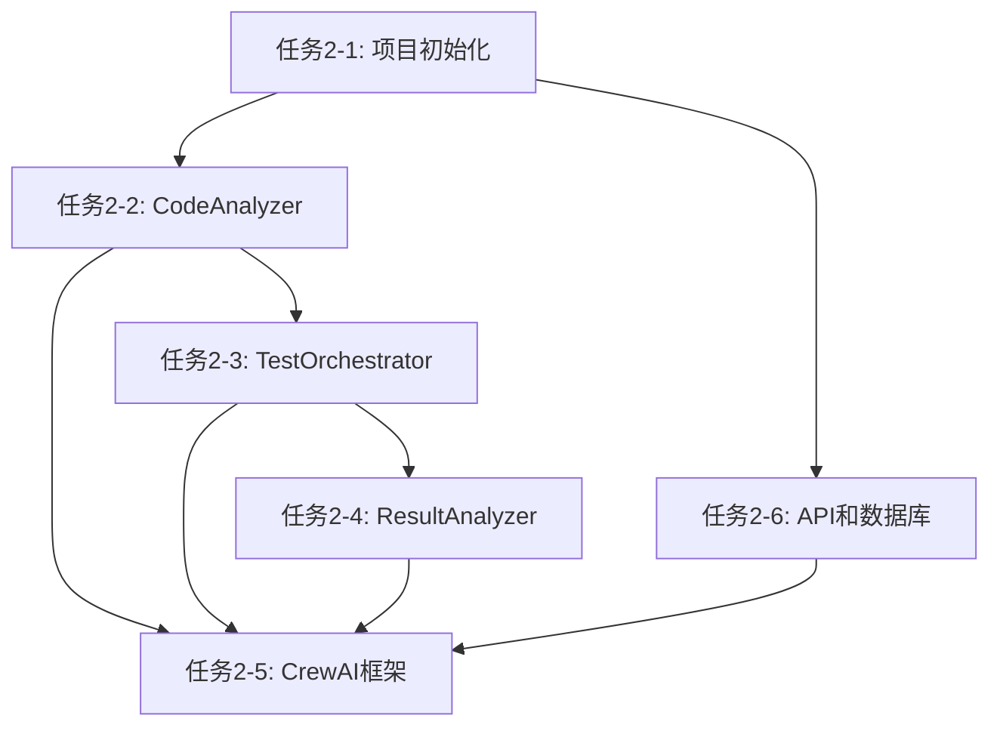

# Phase 2 任务拆分详表

## Phase 1 完成回顾

Phase 1 已成功完成全部7个关键文档，为系统开发奠定了坚实的理论基础：

**已完成文档**：
- ✅ REQUIREMENTS.md - 规范18点核心需求和验收条件
- ✅ KNOWLEDGE_SCHEMA.md - 设计知识库完整数据结构和Schema
- ✅ ARCHITECTURE_V2.md - 系统整体架构和模块设计
- ✅ AGENT_DESIGN.md - 4个核心Agent的详细设计和工具定义
- ✅ STATE_MACHINE.md - 系统状态机和转移逻辑
- ✅ WORK_PLAN_V2.md - 6个阶段的完整工作计划
- ✅ DETAILED_DESIGN_V2.md - 核心模块详细设计规格

**Phase 1 成果**：
- 明确了系统目标和需求边界
- 设计了完整的系统架构和Agent框架
- 规划了6个阶段的开发路径
- 建立了知识库的数据模型
- 定义了详细的模块接口和设计规范

**Phase 1 标志着系统设计阶段的圆满完成，为Phase 2核心模块的实现提供了完整的设计依据。**

---

## Phase 2 概述

**Phase 2 目标**：实现系统的核心执行引擎

Phase 2 是项目从设计走向实现的关键阶段，将基于Phase 1的设计文档，构建系统的核心执行框架。本阶段将实现代码分析、修改、测试、分析的核心模块，搭建CrewAI多Agent框架，并建立基础的API和数据持久化层。

**预计时间**：7-10天
**工作量估算**：400-500小时

**主要输出**：
- ✅ 可运行的代码框架和核心模块
- ✅ 完整的测试环境适配器
- ✅ CrewAI多Agent框架基础
- ✅ 基础API接口和数据库初始化
- ✅ 单元测试和集成测试

---

## 任务2-1：项目初始化与环境配置

**任务描述**：搭建项目开发环境，初始化代码仓库结构，配置必要的依赖和工具

**预计输出**：项目基础框架 + 配置文件

**实现内容**：
1. 项目结构初始化（src/, tests/, docs/, 配置文件）
2. 核心依赖安装（Tree-sitter, CrewAI, LangGraph, QEMU, Qdrant, PostgreSQL）
3. 开发环境配置（requirements.txt, black, pylint, pytest, mypy）
4. CI/CD基础配置（GitHub Actions, 自动化测试, Sphinx文档）
5. 环境变量和配置管理（.env, config.yaml, 日志系统）

**完成标准**：✅ 项目结构完整 ✅ 依赖可安装 ✅ 开发工具生效 ✅ CI/CD运行 ✅ 提交PR

**预计时间**：1-2天

---

## 任务2-2：CodeAnalyzer & CodeModifier核心模块

**任务描述**：实现代码分析器和代码修改器核心模块，提供代码理解和修改能力

**预计输出**：800-1000行代码 + 单元测试

**实现内容**：
1. CodeAnalyzer模块（Tree-sitter集成, AST构建, 符号表, 复杂度分析）
2. 静态分析工具集成（clang-tidy, cppcheck, 规则引擎）
3. CodeModifier模块（AST修改, Patch生成, 安全验证, 回滚机制）
4. 代码修改策略（最小化修改, 冲突检测, 白/黑名单）
5. AI增强接口（大模型API, 提示工程, RAG预留）

**完成标准**：✅ C/C++解析 ✅ 分析功能 ✅ 安全修改 ✅ 工具链集成 ✅ 测试覆盖率>80% ✅ 提交PR

**预计时间**：2-3天

---

## 任务2-3：TestOrchestrator与QEMU集成

**任务描述**：实现测试编排器和QEMU环境适配器，提供自动化测试执行能力

**预计输出**：1000-1200行代码 + 测试适配器

**实现内容**：
1. TestOrchestrator核心引擎（环境抽象, 任务调度, 生命周期, 资源池）
2. QEMU环境适配器（VM控制, 代码部署, 日志捕获, SSH连接）
3. 测试执行框架（用例定义, 并发测试, 结果收集, 重试机制）
4. 结果收集系统（日志格式, 产物管理, 报告生成）
5. 资源管理（互斥锁, 健康检查, 清理释放）

**完成标准**：✅ 引擎运行 ✅ QEMU适配 ✅ 部署测试 ✅ 日志解析 ✅ 集成测试 ✅ 提交PR

**预计时间**：2-3天

---

## 任务2-4：ResultAnalyzer与日志分析

**任务描述**：实现结果分析器和日志分析引擎，提供智能根因分析和决策建议

**预计输出**：900-1100行代码 + 分析规则

**实现内容**：
1. ResultAnalyzer核心引擎（日志解析, 模式匹配, 正则库, 流式处理）
2. 智能分析组件（AI分析, 模式识别, 统计工具, 异常检测）
3. 根因分析（错误链追踪, 相关性分析, 代码-测试-日志关联）
4. 决策支持系统（收敛性判断, 修改建议, 风险评估）
5. 分析报告生成（结构化报告, 可视化, 多格式导出）

**完成标准**：✅ 多格式解析 ✅ 模式匹配 ✅ 根因分析 ✅ 报告生成 ✅ 模拟测试 ✅ 提交PR

**预计时间**：2-3天

---

## 任务2-5：CrewAI多Agent框架搭建

**任务描述**：搭建CrewAI多Agent框架，实现Agent间的协作和任务编排

**预计输出**：1200-1500行代码 + Agent定义

**实现内容**：
1. CrewAI框架初始化（Crew配置, Agent基类, Task模型, LangGraph集成）
2. CodeAgent实现（分析工具, 修改工具, 审查逻辑, 执行策略）
3. TestAgent实现（环境工具, 用例生成, 结果分析, 调度策略）
4. AnalysisAgent实现（日志工具, 根因分析, 决策建议, 分析策略）
5. Agent协作机制（通信协议, 任务分发, 共享状态, 执行追踪）

**完成标准**：✅ 框架运行 ✅ 3个Agent完整 ✅ 工具集成 ✅ 协作顺畅 ✅ 端到端测试 ✅ 提交PR

**预计时间**：2-3天

---

## 任务2-6：基础API和数据库初始化

**任务描述**：实现REST API基础框架，初始化数据库和知识库系统

**预计输出**：600-800行代码 + 数据库Schema

**实现内容**：
1. REST API框架（FastAPI, 路由设计, 模型定义, 认证授权）
2. PostgreSQL初始化（连接池, 表结构, ORM, Alembic迁移）
3. Qdrant向量数据库初始化（客户端配置, 集合创建, 索引, 搜索接口）
4. API接口实现（任务接口, 分析接口, 测试接口, 查询接口）
5. 数据持久化层（数据访问层, 事务管理, 一致性检查, 性能优化）

**完成标准**：✅ FastAPI运行 ✅ PostgreSQL连接 ✅ Qdrant就绪 ✅ API可用 ✅ 集成测试 ✅ 提交PR

**预计时间**：2-3天

---

## 执行顺序和依赖关系

**关键路径**：2-1 → 2-2 → 2-3 → 2-4 → 2-5

---

## 进度追踪

| 任务 | 状态 | 预计时间 | 实际时间 | 完成时间 | PR |
|------|------|---------|---------|---------|----|
| 任务2-1 | ⏳ 待开始 | 1-2天 | - | - | - |
| 任务2-2 | ⏳ 待开始 | 2-3天 | - | - | - |
| 任务2-3 | ⏳ 待开始 | 2-3天 | - | - | - |
| 任务2-4 | ⏳ 待开始 | 2-3天 | - | - | - |
| 任务2-5 | ⏳ 待开始 | 2-3天 | - | - | - |
| 任务2-6 | ⏳ 待开始 | 2-3天 | - | - | - |

---

## Phase 2 验收标准

**功能验收**：✅ 6个任务完成 ✅ 核心模块运行 ✅ QEMU集成 ✅ Agent框架 ✅ API接口 ✅ 数据持久化

**技术验收**：✅ 单元测试>80% ✅ 集成测试通过 ✅ 代码质量 ✅ 文档完整

**Phase 3前置**：✅ 核心引擎稳定 ✅ 端到端打通 ✅ 性能基准 ✅ 接口就绪

---

## 风险与缓解

1. Tree-sitter集成 - 提前验证，备选clang AST
2. QEMU稳定性 - 模拟数据，减少依赖
3. CrewAI兼容性 - 参考示例，逐步集成
4. 多Agent协调 - 单Agent先，再扩展
5. 开发时间 - 优先核心，延后非关键
6. 测试资源 - QEMU虚拟化，降硬件需求

---

## 关键文档参考

**Phase 1设计文档**：
- REQUIREMENTS.md - 需求规格
- KNOWLEDGE_SCHEMA.md - 知识库Schema
- ARCHITECTURE_V2.md - 系统架构
- AGENT_DESIGN.md - Agent设计
- STATE_MACHINE.md - 状态机设计
- WORK_PLAN_V2.md - 工作计划
- DETAILED_DESIGN_V2.md - 详细设计

---

**创建时间**：2026-01-27
**Phase状态**：⏳ 待开始
**版本**：v1.0
