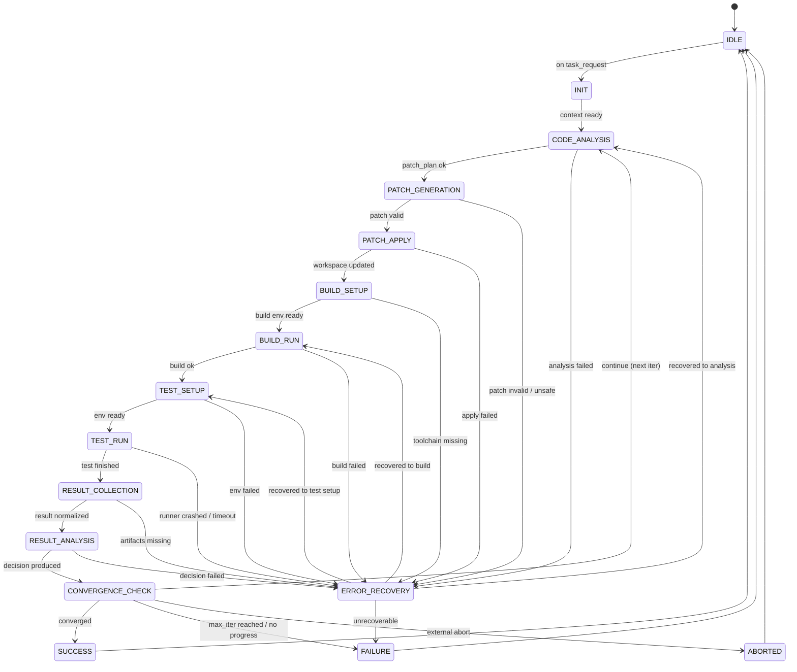
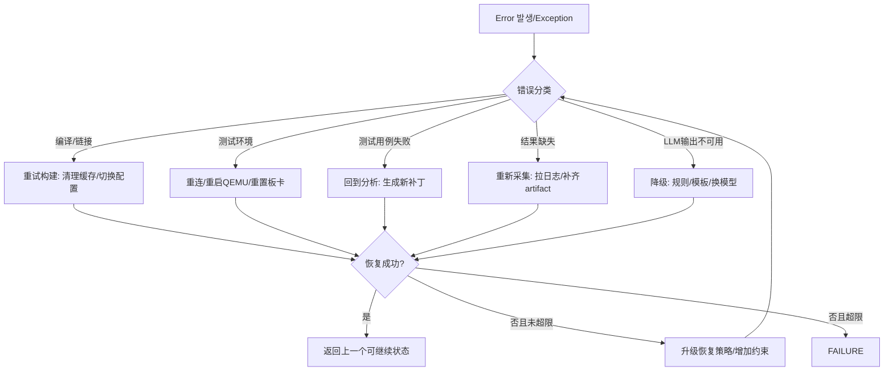

# AI驱动固件智能测试系统：状态机设计（State Machine）

> 本文定义“AI修改代码 → 启动测试 → 收集结果 → 分析决策 → 继续或收敛退出”的核心控制流。
> 面向 Phase 1：架构设计与需求分析阶段输出；实现时可用 LangGraph（推荐）或自研状态机执行。

---

## 1. 设计目标与范围

### 1.1 目标

- **可解释**：任何一次自动化循环都能明确说明“当前在哪个状态、为何转移、依据是什么”。
- **可控**：具备最大迭代次数、收敛条件、超时与熔断机制；可人工介入。
- **可恢复**：对常见故障（构建失败、测试环境异常、结果不完整、模型输出不可用等）提供恢复流程。
- **可扩展**：允许按产品线（QEMU/目标板/Windows脚本/BMC）扩展测试执行与采集方式。

### 1.2 范围

- 定义系统核心状态集合（如 `IDLE`、`CODE_ANALYSIS`、`TEST_SETUP`、`TEST_RUN` 等）。
- 定义状态之间的**转移规则/条件**与**错误恢复策略**。
- 定义**循环控制**（最大迭代次数、收敛条件、回退策略）。
- 提供 1-2 个 Mermaid 状态图。
- 提供一份可用于实现的**伪代码**。

### 1.3 非目标

- 不规定具体 LLM 供应商与 Prompt 细节。
- 不规定具体构建系统（Make/CMake/Bazel）与测试框架（pytest/ctest/自研脚本）的实现。

---

## 2. 核心概念

### 2.1 一次“迭代（Iteration）”的定义

一次迭代通常包括：

1. **代码分析**：定位问题、提取上下文、生成修改方案。
2. **代码修改**：生成补丁（diff）并应用。
3. **构建/准备环境**：准备依赖、镜像、QEMU/板卡连接、部署固件。
4. **执行测试**：运行测试用例集或回归测试。
5. **采集结果**：收集日志、崩溃转储、覆盖率、性能指标等。
6. **结果分析与决策**：判断是否收敛、是否继续、是否回滚、是否升级错误处理。

### 2.2 状态机输入/输出（抽象）

- **输入（Input）**：
  - `task_request`：外部任务请求（例如“修复某失败用例/添加回归覆盖/修复编译错误”）。
  - `repo_context`：仓库路径、分支、目标组件。
  - `test_profile`：测试环境类型（QEMU/目标板/Windows脚本）、用例集、超时、并发。
  - `constraints`：最大迭代次数、允许的风险级别、允许的文件范围、是否允许格式化等。

- **输出（Output）**：
  - `final_status`：成功/失败/中止。
  - `artifacts`：补丁、构建产物、测试报告、关键日志、知识库条目（经验数据）。
  - `decision_trace`：状态转移链路及原因（可用于审计与回放）。

### 2.3 状态机上下文（Context）

状态机需要持有一个可序列化的上下文对象（示例字段）：

- `iteration_index`：当前迭代序号（从 1 开始）。
- `max_iterations`：最大迭代次数（默认建议 10；可按任务设定）。
- `goal`：目标定义（例如“所有目标用例通过 + 无新增告警”）。
- `repo_snapshot`：当前 commit/patch 信息，用于回滚。
- `analysis`：代码/日志分析结果（结构化）。
- `patch_plan`：修改计划（文件列表、预期影响、风险）。
- `test_plan`：测试计划（用例集、环境、超时）。
- `last_build_result` / `last_test_result`：最近一次构建/测试结果。
- `error_state`：最近一次错误分类与恢复尝试次数。
- `convergence`：收敛信号（是否通过、是否无改进、是否触发熔断）。

---

## 3. 系统状态定义

本系统采用“**顶层状态机 + 若干子流程**”的形式。顶层状态覆盖端到端闭环；子状态可按实现细化。

### 3.1 顶层状态列表（建议最小集）

| 状态 | 含义 | 主要输入 | 主要输出 | 典型下一步 |
|---|---|---|---|---|
| `IDLE` | 空闲/等待任务 | `task_request` | 初始化上下文 | `INIT` |
| `INIT` | 初始化运行（加载配置、校验环境、获取 repo） | 配置/凭证 | `context` | `CODE_ANALYSIS` |
| `CODE_ANALYSIS` | 分析问题与生成修改方案 | 日志、代码、任务描述 | `analysis`、`patch_plan` | `PATCH_GENERATION` / `ERROR_RECOVERY` |
| `PATCH_GENERATION` | 生成补丁（diff）并做静态检查 | `patch_plan` | `patch`、`risk_assessment` | `PATCH_APPLY` / `ERROR_RECOVERY` |
| `PATCH_APPLY` | 应用补丁、解决冲突、生成可回滚快照 | `patch` | 更新后的工作区 | `BUILD_SETUP` |
| `BUILD_SETUP` | 构建前准备（依赖、工具链、配置） | toolchain 配置 | 构建环境就绪 | `BUILD_RUN` |
| `BUILD_RUN` | 编译/链接/打包 | 代码 | `build_result` | `TEST_SETUP` / `ERROR_RECOVERY` |
| `TEST_SETUP` | 测试环境准备（QEMU/板卡/脚本） | `test_profile` | 环境就绪 | `TEST_RUN` / `ERROR_RECOVERY` |
| `TEST_RUN` | 执行测试 | 环境、用例 | `raw_logs`、`test_exit_code` | `RESULT_COLLECTION` |
| `RESULT_COLLECTION` | 采集与结构化结果 | 日志、产物 | `test_result`、`metrics` | `RESULT_ANALYSIS` |
| `RESULT_ANALYSIS` | 判断通过/失败/回归，生成下一步策略 | `test_result`、`analysis` | `decision` | `CONVERGENCE_CHECK` |
| `CONVERGENCE_CHECK` | 收敛判断/迭代控制 | `decision`、历史记录 | `continue?` | `CODE_ANALYSIS` / `SUCCESS` / `FAILURE` / `ABORTED` |
| `ERROR_RECOVERY` | 错误分类、重试、回滚、降级 | `error_state`、异常 | `recovery_action` | 视情况返回某状态或失败 |
| `SUCCESS` | 目标达成并输出报告 | 所有产物 | 最终报告/入库 | `IDLE` |
| `FAILURE` | 失败退出（不可恢复或超过上限） | 失败原因 | 失败报告/入库 | `IDLE` |
| `ABORTED` | 外部中止（人工/超时/策略） | 中止原因 | 中止报告 | `IDLE` |

### 3.2 常用子状态（实现可选）

为提高可观测性，部分状态可细化为子状态：

- `CODE_ANALYSIS`：
  - `LOG_TRIAGE`（日志分诊）
  - `ROOT_CAUSE_HYPOTHESIS`（根因假设）
  - `CHANGE_IMPACT_ESTIMATE`（影响评估）
- `TEST_SETUP`：
  - `RESOURCE_ALLOC`（分配机器/板卡）
  - `FLASH_OR_DEPLOY`（烧录/部署）
  - `HEALTH_CHECK`（环境健康检查）
- `RESULT_COLLECTION`：
  - `FETCH_LOGS`（拉取日志）
  - `NORMALIZE`（结构化归一）
  - `ATTACH_ARTIFACTS`（绑定产物/trace）

---

## 4. 状态转移图（Mermaid）

### 4.1 顶层状态图（主闭环）

### 4.2 错误恢复子图（分类与动作）

---

## 5. 状态转移规则与条件（详细）

本节以“可实现的规则表”形式给出建议。

### 5.1 通用规则（适用于所有状态）

1. **可中止**：任意状态检测到 `abort_signal == true`，立即转移到 `ABORTED`。
2. **超时处理**：
   - 任何状态都有 `state_timeout_sec`。
   - 超时后进入 `ERROR_RECOVERY`，错误类型为 `TIMEOUT`，并记录 `timeout_state`。
3. **幂等与可回放**：
   - 状态应尽量设计为“可重试”。
   - 写操作（应用 patch、烧录）前必须有 `repo_snapshot` 或者 `artifact_snapshot`。
4. **审计与追踪**：
   - 每次转移都写入 `decision_trace`：`from_state`、`to_state`、`reason`、`evidence_refs`。
5. **安全边界**：
   - 未通过风险检查的 patch 不得进入 `PATCH_APPLY`。
   - 违反策略（修改禁区文件、引入高危 API、删除关键测试等）转入 `ERROR_RECOVERY` 并触发“降级/人工介入”。

### 5.2 `IDLE → INIT`

- 触发条件：收到 `task_request`。
- 校验：
  - `repo_url` / 本地 repo 路径可达；
  - `test_profile` 完整（至少指定环境类型与基本用例集）。
- 输出：创建 `context`，设置 `iteration_index = 1`。

### 5.3 `INIT → CODE_ANALYSIS`

- 触发条件：初始化成功。
- INIT 必做清单：
  - 加载配置（最大迭代次数、超时、允许目录）。
  - 读取目标失败信息（如果有：上一轮 CI 日志 / 用户提供 log）。
  - 建立“本轮 baseline”：`repo_snapshot.base_commit`。

### 5.4 `CODE_ANALYSIS → PATCH_GENERATION`

- 触发条件：
  - 产生 `analysis.root_cause` 或至少 `analysis.hypothesis_list`；
  - 产生 `patch_plan`（包含文件、修改点、预期效果）。
- 进入前置：
  - 如果 `iteration_index == 1` 且没有失败证据，优先生成“最小可行诊断变更”（如增加日志/断言/可观测性）。

### 5.5 `CODE_ANALYSIS → ERROR_RECOVERY`

- 触发条件：
  - 输入证据缺失（无日志、无复现路径）。
  - LLM 分析结构化输出无法解析或置信度过低。
- 恢复动作建议：
  - 触发 `RESULT_COLLECTION` 的“补采集”分支；或
  - 降级为基于规则的 triage（关键词/错误码映射）。

### 5.6 `PATCH_GENERATION → PATCH_APPLY`

- 触发条件：
  - patch 通过基本校验：
    - `diff` 可应用、无语法明显错误（可做轻量静态检查）；
    - 修改范围未越界（仅允许目录/文件）；
    - 风险评分 ≤ 阈值（例如 0.7）。
- 输出：
  - `context.patch`、`context.patch_metadata`（影响文件、行数、风险点）。

### 5.7 `PATCH_GENERATION → ERROR_RECOVERY`

- 触发条件：
  - 生成 patch 为空；
  - patch 触发安全策略（例如修改 boot 流程关键路径但无充分证据）；
  - patch 不能通过解析/应用模拟。
- 恢复动作：
  - 增加约束重新生成（“只做最小变更”“只加日志不改逻辑”）。

### 5.8 `PATCH_APPLY → BUILD_SETUP`

- 触发条件：patch 应用成功并创建回滚点。
- 必做：
  - `repo_snapshot.current_commit`（或 patch id）。
  - 记录冲突解决情况（如果有）。

### 5.9 `BUILD_SETUP → BUILD_RUN`

- 触发条件：
  - 依赖安装完成、工具链可用。
  - 生成构建配置（Debug/Release、特性开关）。
- 失败转移：工具缺失或配置不可用进入 `ERROR_RECOVERY`。

### 5.10 `BUILD_RUN → TEST_SETUP`

- 触发条件：构建成功。
- 输出：
  - `build_artifact`（固件镜像、elf、符号表等）。
- 失败转移：构建失败进入 `ERROR_RECOVERY`，并将错误分类为 `BUILD_FAILURE`。

### 5.11 `TEST_SETUP → TEST_RUN`

- 触发条件：
  - QEMU：镜像加载成功、串口/网络可用、基本心跳通过。
  - 目标板：板卡可达、电源/串口/SSH 可用、烧录成功（如需要）。
  - Windows 脚本：runner 可用、路径/依赖可用。
- 输出：
  - `test_session_id`、资源占用信息。

### 5.12 `TEST_RUN → RESULT_COLLECTION`

- 触发条件：测试进程结束（pass/fail/timeout）。
- 注意：
  - 即使测试失败也必须进入 `RESULT_COLLECTION`，以保证证据链完整。

### 5.13 `RESULT_COLLECTION → RESULT_ANALYSIS`

- 触发条件：
  - 关键日志拉取完成；
  - `test_result` 结构化完成（用例粒度、失败原因、崩溃栈）。
- 失败转移：产物缺失进入 `ERROR_RECOVERY`（错误类型 `ARTIFACT_MISSING`）。

### 5.14 `RESULT_ANALYSIS → CONVERGENCE_CHECK`

- 触发条件：
  - 生成结构化 `decision`：
    - `status`：PASS / FAIL / FLAKY / ENV_ERROR / INCONCLUSIVE
    - `next_action`：CONTINUE / RETRY / ROLLBACK / ABORT
    - `confidence`：0-1
- 注意：
  - 如果识别为“环境错误”（如网络断、板卡死机），应优先走 `ERROR_RECOVERY` 的环境恢复，而不是直接改代码。

### 5.15 `CONVERGENCE_CHECK → SUCCESS`

- 触发条件（可组合）：
  - 目标用例全部通过；
  - 无新增回归（相对 baseline）；
  - 关键指标满足阈值（如性能不下降、覆盖率不下降）；
  - `confidence >= success_threshold`（例如 0.8）。

### 5.16 `CONVERGENCE_CHECK → CODE_ANALYSIS`（继续迭代）

- 触发条件：
  - `iteration_index < max_iterations` 且
  - `decision.next_action == CONTINUE`。
- 动作：
  - `iteration_index += 1`
  - 将本轮证据（日志、diff、结果）写入知识库（可异步）。

### 5.17 `CONVERGENCE_CHECK → FAILURE`

- 触发条件（任一满足即可）：
  - `iteration_index >= max_iterations`。
  - 连续 N 次无改进（见收敛条件）。
  - 触发熔断：风险累计超阈值 / 反复回滚 / 环境不可用超过上限。

### 5.18 `ERROR_RECOVERY` 的出入规则

- 输入：
  - `error_state.type`：`BUILD_FAILURE` / `TEST_ENV_FAILURE` / `TIMEOUT` / `ARTIFACT_MISSING` / `MODEL_FAILURE` / `POLICY_VIOLATION` ...
  - `error_state.retry_count`：该类错误已尝试次数。
- 输出：
  - `recovery_action`：重试、回滚、降级、切换资源、切换策略。

- 退出条件：
  - **可恢复**：返回到“最近的可继续状态”（通常是 BUILD_RUN / TEST_SETUP / CODE_ANALYSIS）。
  - **不可恢复或超限**：进入 `FAILURE`。

---

## 6. 循环控制机制

> 说明：本节之后（错误恢复流程、伪代码示例等）为本文关键内容的一部分。
> 若你在阅读时发现文档在此处意外截断，请以仓库最新版本为准。

