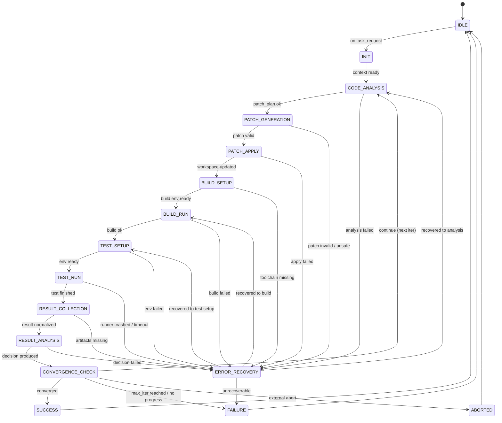

# AI驱动固件智能测试系统：状态机设计（State Machine）

> 本文定义“AI修改代码 → 启动测试 → 收集结果 → 分析决策 → 继续或收敛退出”的核心控制流。
> 面向 Phase 1：架构设计与需求分析阶段输出；实现时可用 LangGraph（推荐）或自研状态机执行。

---

## 1. 设计目标与范围

### 1.1 目标

- **可解释**：任何一次自动化循环都能明确说明“当前在哪个状态、为何转移、依据是什么”。
- **可控**：具备最大迭代次数、收敛条件、超时与熔断机制；可人工介入。
- **可恢复**：对常见故障（构建失败、测试环境异常、结果不完整、模型输出不可用等）提供恢复流程。
- **可扩展**：允许按产品线（QEMU/目标板/Windows脚本/BMC）扩展测试执行与采集方式。

### 1.2 范围

- 定义系统核心状态集合（如 `IDLE`、`CODE_ANALYSIS`、`TEST_SETUP`、`TEST_RUN` 等）。
- 定义状态之间的**转移规则/条件**与**错误恢复策略**。
- 定义**循环控制**（最大迭代次数、收敛条件、回退策略）。
- 提供 1-2 个 Mermaid 状态图。
- 提供一份可用于实现的**伪代码**。

### 1.3 非目标

- 不规定具体 LLM 供应商与 Prompt 细节。
- 不规定具体构建系统（Make/CMake/Bazel）与测试框架（pytest/ctest/自研脚本）的实现。

---

## 2. 核心概念

### 2.1 一次“迭代（Iteration）”的定义

一次迭代通常包括：

1. **代码分析**：定位问题、提取上下文、生成修改方案。
2. **代码修改**：生成补丁（diff）并应用。
3. **构建/准备环境**：准备依赖、镜像、QEMU/板卡连接、部署固件。
4. **执行测试**：运行测试用例集或回归测试。
5. **采集结果**：收集日志、崩溃转储、覆盖率、性能指标等。
6. **结果分析与决策**：判断是否收敛、是否继续、是否回滚、是否升级错误处理。

### 2.2 状态机输入/输出（抽象）

- **输入（Input）**：
  - `task_request`：外部任务请求（例如“修复某失败用例/添加回归覆盖/修复编译错误”）。
  - `repo_context`：仓库路径、分支、目标组件。
  - `test_profile`：测试环境类型（QEMU/目标板/Windows脚本）、用例集、超时、并发。
  - `constraints`：最大迭代次数、允许的风险级别、允许的文件范围、是否允许格式化等。

- **输出（Output）**：
  - `final_status`：成功/失败/中止。
  - `artifacts`：补丁、构建产物、测试报告、关键日志、知识库条目（经验数据）。
  - `decision_trace`：状态转移链路及原因（可用于审计与回放）。

### 2.3 状态机上下文（Context）

状态机需要持有一个可序列化的上下文对象（示例字段）：

- `iteration_index`：当前迭代序号（从 1 开始）。
- `max_iterations`：最大迭代次数（默认建议 10；可按任务设定）。
- `goal`：目标定义（例如“所有目标用例通过 + 无新增告警”）。
- `repo_snapshot`：当前 commit/patch 信息，用于回滚。
- `analysis`：代码/日志分析结果（结构化）。
- `patch_plan`：修改计划（文件列表、预期影响、风险）。
- `test_plan`：测试计划（用例集、环境、超时）。
- `last_build_result` / `last_test_result`：最近一次构建/测试结果。
- `error_state`：最近一次错误分类与恢复尝试次数。
- `convergence`：收敛信号（是否通过、是否无改进、是否触发熔断）。

---

## 3. 系统状态定义

本系统采用“**顶层状态机 + 若干子流程**”的形式。顶层状态覆盖端到端闭环；子状态可按实现细化。

### 3.1 顶层状态列表（建议最小集）

| 状态 | 含义 | 主要输入 | 主要输出 | 典型下一步 |
|---|---|---|---|---|
| `IDLE` | 空闲/等待任务 | `task_request` | 初始化上下文 | `INIT` |
| `INIT` | 初始化运行（加载配置、校验环境、获取 repo） | 配置/凭证 | `context` | `CODE_ANALYSIS` |
| `CODE_ANALYSIS` | 分析问题与生成修改方案 | 日志、代码、任务描述 | `analysis`、`patch_plan` | `PATCH_GENERATION` / `ERROR_RECOVERY` |
| `PATCH_GENERATION` | 生成补丁（diff）并做静态检查 | `patch_plan` | `patch`、`risk_assessment` | `PATCH_APPLY` / `ERROR_RECOVERY` |
| `PATCH_APPLY` | 应用补丁、解决冲突、生成可回滚快照 | `patch` | 更新后的工作区 | `BUILD_SETUP` |
| `BUILD_SETUP` | 构建前准备（依赖、工具链、配置） | toolchain 配置 | 构建环境就绪 | `BUILD_RUN` |
| `BUILD_RUN` | 编译/链接/打包 | 代码 | `build_result` | `TEST_SETUP` / `ERROR_RECOVERY` |
| `TEST_SETUP` | 测试环境准备（QEMU/板卡/脚本） | `test_profile` | 环境就绪 | `TEST_RUN` / `ERROR_RECOVERY` |
| `TEST_RUN` | 执行测试 | 环境、用例 | `raw_logs`、`test_exit_code` | `RESULT_COLLECTION` |
| `RESULT_COLLECTION` | 采集与结构化结果 | 日志、产物 | `test_result`、`metrics` | `RESULT_ANALYSIS` |
| `RESULT_ANALYSIS` | 判断通过/失败/回归，生成下一步策略 | `test_result`、`analysis` | `decision` | `CONVERGENCE_CHECK` |
| `CONVERGENCE_CHECK` | 收敛判断/迭代控制 | `decision`、历史记录 | `continue?` | `CODE_ANALYSIS` / `SUCCESS` / `FAILURE` / `ABORTED` |
| `ERROR_RECOVERY` | 错误分类、重试、回滚、降级 | `error_state`、异常 | `recovery_action` | 视情况返回某状态或失败 |
| `SUCCESS` | 目标达成并输出报告 | 所有产物 | 最终报告/入库 | `IDLE` |
| `FAILURE` | 失败退出（不可恢复或超过上限） | 失败原因 | 失败报告/入库 | `IDLE` |
| `ABORTED` | 外部中止（人工/超时/策略） | 中止原因 | 中止报告 | `IDLE` |

### 3.2 常用子状态（实现可选）

为提高可观测性，部分状态可细化为子状态：

- `CODE_ANALYSIS`：
  - `LOG_TRIAGE`（日志分诊）
  - `ROOT_CAUSE_HYPOTHESIS`（根因假设）
  - `CHANGE_IMPACT_ESTIMATE`（影响评估）
- `TEST_SETUP`：
  - `RESOURCE_ALLOC`（分配机器/板卡）
  - `FLASH_OR_DEPLOY`（烧录/部署）
  - `HEALTH_CHECK`（环境健康检查）
- `RESULT_COLLECTION`：
  - `FETCH_LOGS`（拉取日志）
  - `NORMALIZE`（结构化归一）
  - `ATTACH_ARTIFACTS`（绑定产物/trace）

---

## 4. 状态转移图（Mermaid）

### 4.1 顶层状态图（主闭环）



### 4.2 错误恢复子图（分类与动作）


---

## 5. 状态转移规则与条件（详细）

本节以“可实现的规则表”形式给出建议。

### 5.1 通用规则（适用于所有状态）

1. **可中止**：任意状态检测到 `abort_signal == true`，立即转移到 `ABORTED`。
2. **超时处理**：
   - 任何状态都有 `state_timeout_sec`。
   - 超时后进入 `ERROR_RECOVERY`，错误类型为 `TIMEOUT`，并记录 `timeout_state`。
3. **幂等与可回放**：
   - 状态应尽量设计为“可重试”。
   - 写操作（应用 patch、烧录）前必须有 `repo_snapshot` 或者 `artifact_snapshot`。
4. **审计与追踪**：
   - 每次转移都写入 `decision_trace`：`from_state`、`to_state`、`reason`、`evidence_refs`。
5. **安全边界**：
   - 未通过风险检查的 patch 不得进入 `PATCH_APPLY`。
   - 违反策略（修改禁区文件、引入高危 API、删除关键测试等）转入 `ERROR_RECOVERY` 并触发“降级/人工介入”。

### 5.2 `IDLE → INIT`

- 触发条件：收到 `task_request`。
- 校验：
  - `repo_url` / 本地 repo 路径可达；
  - `test_profile` 完整（至少指定环境类型与基本用例集）。
- 输出：创建 `context`，设置 `iteration_index = 1`。

### 5.3 `INIT → CODE_ANALYSIS`

- 触发条件：初始化成功。
- INIT 必做清单：
  - 加载配置（最大迭代次数、超时、允许目录）。
  - 读取目标失败信息（如果有：上一轮 CI 日志 / 用户提供 log）。
  - 建立“本轮 baseline”：`repo_snapshot.base_commit`。

### 5.4 `CODE_ANALYSIS → PATCH_GENERATION`

- 触发条件：
  - 产生 `analysis.root_cause` 或至少 `analysis.hypothesis_list`；
  - 产生 `patch_plan`（包含文件、修改点、预期效果）。
- 进入前置：
  - 如果 `iteration_index == 1` 且没有失败证据，优先生成“最小可行诊断变更”（如增加日志/断言/可观测性）。

### 5.5 `CODE_ANALYSIS → ERROR_RECOVERY`

- 触发条件：
  - 输入证据缺失（无日志、无复现路径）。
  - LLM 分析结构化输出无法解析或置信度过低。
- 恢复动作建议：
  - 触发 `RESULT_COLLECTION` 的“补采集”分支；或
  - 降级为基于规则的 triage（关键词/错误码映射）。

### 5.6 `PATCH_GENERATION → PATCH_APPLY`

- 触发条件：
  - patch 通过基本校验：
    - `diff` 可应用、无语法明显错误（可做轻量静态检查）；
    - 修改范围未越界（仅允许目录/文件）；
    - 风险评分 ≤ 阈值（例如 0.7）。
- 输出：
  - `context.patch`、`context.patch_metadata`（影响文件、行数、风险点）。

### 5.7 `PATCH_GENERATION → ERROR_RECOVERY`

- 触发条件：
  - 生成 patch 为空；
  - patch 触发安全策略（例如修改 boot 流程关键路径但无充分证据）；
  - patch 不能通过解析/应用模拟。
- 恢复动作：
  - 增加约束重新生成（“只做最小变更”“只加日志不改逻辑”）。

### 5.8 `PATCH_APPLY → BUILD_SETUP`

- 触发条件：patch 应用成功并创建回滚点。
- 必做：
  - `repo_snapshot.current_commit`（或 patch id）。
  - 记录冲突解决情况（如果有）。

### 5.9 `BUILD_SETUP → BUILD_RUN`

- 触发条件：
  - 依赖安装完成、工具链可用。
  - 生成构建配置（Debug/Release、特性开关）。
- 失败转移：工具缺失或配置不可用进入 `ERROR_RECOVERY`。

### 5.10 `BUILD_RUN → TEST_SETUP`

- 触发条件：构建成功。
- 输出：
  - `build_artifact`（固件镜像、elf、符号表等）。
- 失败转移：构建失败进入 `ERROR_RECOVERY`，并将错误分类为 `BUILD_FAILURE`。

### 5.11 `TEST_SETUP → TEST_RUN`

- 触发条件：
  - QEMU：镜像加载成功、串口/网络可用、基本心跳通过。
  - 目标板：板卡可达、电源/串口/SSH 可用、烧录成功（如需要）。
  - Windows 脚本：runner 可用、路径/依赖可用。
- 输出：
  - `test_session_id`、资源占用信息。

### 5.12 `TEST_RUN → RESULT_COLLECTION`

- 触发条件：测试进程结束（pass/fail/timeout）。
- 注意：
  - 即使测试失败也必须进入 `RESULT_COLLECTION`，以保证证据链完整。

### 5.13 `RESULT_COLLECTION → RESULT_ANALYSIS`

- 触发条件：
  - 关键日志拉取完成；
  - `test_result` 结构化完成（用例粒度、失败原因、崩溃栈）。
- 失败转移：产物缺失进入 `ERROR_RECOVERY`（错误类型 `ARTIFACT_MISSING`）。

### 5.14 `RESULT_ANALYSIS → CONVERGENCE_CHECK`

- 触发条件：
  - 生成结构化 `decision`：
    - `status`：PASS / FAIL / FLAKY / ENV_ERROR / INCONCLUSIVE
    - `next_action`：CONTINUE / RETRY / ROLLBACK / ABORT
    - `confidence`：0-1
- 注意：
  - 如果识别为“环境错误”（如网络断、板卡死机），应优先走 `ERROR_RECOVERY` 的环境恢复，而不是直接改代码。

### 5.15 `CONVERGENCE_CHECK → SUCCESS`

- 触发条件（可组合）：
  - 目标用例全部通过；
  - 无新增回归（相对 baseline）；
  - 关键指标满足阈值（如性能不下降、覆盖率不下降）；
  - `confidence >= success_threshold`（例如 0.8）。

### 5.16 `CONVERGENCE_CHECK → CODE_ANALYSIS`（继续迭代）

- 触发条件：
  - `iteration_index < max_iterations` 且
  - `decision.next_action == CONTINUE`。
- 动作：
  - `iteration_index += 1`
  - 将本轮证据（日志、diff、结果）写入知识库（可异步）。

### 5.17 `CONVERGENCE_CHECK → FAILURE`

- 触发条件（任一满足即可）：
  - `iteration_index >= max_iterations`。
  - 连续 N 次无改进（见收敛条件）。
  - 触发熔断：风险累计超阈值 / 反复回滚 / 环境不可用超过上限。

### 5.19 收敛判断 (Convergence Check)

> 详细的收敛判断算法和实现请参见第6节"收敛判断条件量化标准"。

**核心概念**:
- 收敛判断用于决定迭代循环是否应该终止
- 基于测试通过率、改进率、迭代次数等多维度指标
- 支持5种收敛类型：SUCCESS、FAILURE、PLATEAUED、TIMEOUT、CONVERGED_WITH_IMPROVEMENT

**触发时机**:
- 每次迭代完成后，在RESULT_ANALYSIS状态中调用
- 由AnalysisAgent的decide_action工具执行

**与决策引擎的关系**:
收敛判断结果直接影响next_action的选择：
- converged=True + type=SUCCESS → next_action="finish"
- converged=True + type=FAILURE → next_action="escalate"
- converged=True + type=PLATEAUED → 根据ExecutionMode决定
- converged=False → next_action="continue"

### 5.20 `ERROR_RECOVERY` 的出入规则

- 输入：
  - `error_state.type`：`BUILD_FAILURE` / `TEST_ENV_FAILURE` / `TIMEOUT` / `ARTIFACT_MISSING` / `MODEL_FAILURE` / `POLICY_VIOLATION` ...
  - `error_state.retry_count`：该类错误已尝试次数。
- 输出：
  - `recovery_action`：重试、回滚、降级、切换资源、切换策略。

- 退出条件：
  - **可恢复**：返回到“最近的可继续状态”（通常是 BUILD_RUN / TEST_SETUP / CODE_ANALYSIS）。
  - **不可恢复或超限**：进入 `FAILURE`。

---

## 6. 收敛判断条件量化标准

### 6.1 ConvergenceCriteria数据模型

为解决状态机中"无改进""收敛"等条件定义模糊的问题，设计了ConvergenceCriteria数据模型：

```python
from dataclasses import dataclass, field
from typing import Dict, List, Optional, Union, Literal
from enum import Enum
import numpy as np
from datetime import datetime, timedelta

class ConvergenceType(Enum):
    """收敛类型"""
    IMPROVEMENT_BASED = "improvement_based"     # 基于改进的收敛
    STABILITY_BASED = "stability_based"        # 基于稳定性的收敛
    THRESHOLD_BASED = "threshold_based"       # 基于阈值的收敛
    HYBRID = "hybrid"                         # 混合模式

class TestResultStatus(Enum):
    """测试结果状态"""
    PASS = "pass"
    FAIL = "fail"
    SKIP = "skip"
    ERROR = "error"

@dataclass
class ConvergenceCriteria:
    """收敛判断标准"""
    
    # 基础配置
    convergence_type: ConvergenceType = ConvergenceType.HYBRID
    max_iterations: int = 10
    timeout_minutes: int = 120
    
    # 改进阈值配置
    improvement_threshold: float = 0.05  # 5%改进阈值
    regression_threshold: float = 0.02   # 2%回归阈值
    
    # 稳定性窗口配置
    stability_window: int = 3            # 稳定性窗口大小
    stability_threshold: float = 0.03    # 稳定性阈值（3%）
    
    # 测试通过率配置
    target_pass_rate: float = 0.95       # 目标通过率95%
    min_pass_rate: float = 0.80         # 最小可接受通过率80%
    
    # 性能指标配置
    performance_degradation_threshold: float = 0.05  # 性能退化阈值
    performance_improvement_threshold: float = 0.02  # 性能改进阈值
    
    # 置信度配置
    min_confidence_score: float = 0.7
    success_confidence_threshold: float = 0.85
    
    # 质量控制
    min_test_count: int = 10            # 最小测试数量
    max_consecutive_failures: int = 3   # 最大连续失败次数
    
    # 熔断配置
    circuit_breaker_threshold: int = 5  # 熔断阈值
    circuit_breaker_timeout: int = 30  # 熔断超时（分钟）
    
    def to_dict(self) -> Dict:
        """转换为字典格式"""
        return {
            "convergence_type": self.convergence_type.value,
            "max_iterations": self.max_iterations,
            "timeout_minutes": self.timeout_minutes,
            "improvement_threshold": self.improvement_threshold,
            "regression_threshold": self.regression_threshold,
            "stability_window": self.stability_window,
            "stability_threshold": self.stability_threshold,
            "target_pass_rate": self.target_pass_rate,
            "min_pass_rate": self.min_pass_rate,
            "performance_degradation_threshold": self.performance_degradation_threshold,
            "performance_improvement_threshold": self.performance_improvement_threshold,
            "min_confidence_score": self.min_confidence_score,
            "success_confidence_threshold": self.success_confidence_threshold,
            "min_test_count": self.min_test_count,
            "max_consecutive_failures": self.max_consecutive_failures,
            "circuit_breaker_threshold": self.circuit_breaker_threshold,
            "circuit_breaker_timeout": self.circuit_breaker_timeout
        }

@dataclass
class TestResult:
    """测试结果数据"""
    timestamp: datetime
    iteration: int
    test_count: int
    pass_count: int
    fail_count: int
    skip_count: int
    error_count: int
    pass_rate: float
    execution_time: float
    performance_score: float
    confidence_score: float
    regression_detected: bool = False
    performance_degradation: float = 0.0

@dataclass
class ConvergenceAnalysis:
    """收敛分析结果"""
    is_converged: bool
    convergence_score: float  # 0-1, 越高越收敛
    improvement_trend: Literal["improving", "stable", "declining", "mixed"]
    stability_score: float    # 0-1, 越高越稳定
    confidence_level: float  # 0-1
    reasons: List[str]
    recommendations: List[str]
    
    # 详细指标
    pass_rate_trend: List[float]
    performance_trend: List[float]
    confidence_trend: List[float]
    regression_count: int
    total_improvements: int

# 预定义收敛标准
STRICT_CONVERGENCE = ConvergenceCriteria(
    convergence_type=ConvergenceType.HYBRID,
    max_iterations=15,
    improvement_threshold=0.03,    # 3%改进阈值
    stability_window=5,            # 5次迭代稳定性
    target_pass_rate=0.98,        # 98%通过率
    success_confidence_threshold=0.9
)

BALANCED_CONVERGENCE = ConvergenceCriteria(
    convergence_type=ConvergenceType.HYBRID,
    max_iterations=10,
    improvement_threshold=0.05,    # 5%改进阈值
    stability_window=3,            # 3次迭代稳定性
    target_pass_rate=0.95,        # 95%通过率
    success_confidence_threshold=0.85
)

AGGRESSIVE_CONVERGENCE = ConvergenceCriteria(
    convergence_type=ConvergenceType.IMPROVEMENT_BASED,
    max_iterations=5,
    improvement_threshold=0.02,    # 2%改进阈值
    target_pass_rate=0.90,        # 90%通过率
    success_confidence_threshold=0.8
)
```

### 6.2 收敛度评分算法

```python
class ConvergenceAnalyzer:
    """收敛分析器"""
    
    def __init__(self, criteria: ConvergenceCriteria):
        self.criteria = criteria
        self.history: List[TestResult] = []
        
    def add_test_result(self, result: TestResult):
        """添加测试结果到历史记录"""
        self.history.append(result)
        
        # 保持历史记录在合理范围内
        if len(self.history) > self.criteria.stability_window * 2:
            self.history = self.history[-self.criteria.stability_window * 2:]
    
    def analyze_convergence(self) -> ConvergenceAnalysis:
        """分析收敛性"""
        if len(self.history) < 2:
            return ConvergenceAnalysis(
                is_converged=False,
                convergence_score=0.0,
                improvement_trend="stable",
                stability_score=0.0,
                confidence_level=0.0,
                reasons=["历史数据不足"],
                recommendations=["继续执行更多迭代"],
                pass_rate_trend=[],
                performance_trend=[],
                confidence_trend=[],
                regression_count=0,
                total_improvements=0
            )
        
        # 计算各项指标
        convergence_score = self._calculate_convergence_score()
        improvement_trend = self._analyze_improvement_trend()
        stability_score = self._calculate_stability_score()
        confidence_level = self._calculate_confidence_level()
        
        # 确定收敛状态
        is_converged = self._determine_convergence(
            convergence_score, improvement_trend, stability_score, confidence_level
        )
        
        # 生成分析原因和建议
        reasons, recommendations = self._generate_analysis(
            convergence_score, improvement_trend, stability_score, confidence_level
        )
        
        # 提取趋势数据
        pass_rate_trend = [r.pass_rate for r in self.history]
        performance_trend = [r.performance_score for r in self.history]
        confidence_trend = [r.confidence_score for r in self.history]
        
        regression_count = sum(1 for r in self.history if r.regression_detected)
        total_improvements = self._count_improvements()
        
        return ConvergenceAnalysis(
            is_converged=is_converged,
            convergence_score=convergence_score,
            improvement_trend=improvement_trend,
            stability_score=stability_score,
            confidence_level=confidence_level,
            reasons=reasons,
            recommendations=recommendations,
            pass_rate_trend=pass_rate_trend,
            performance_trend=performance_trend,
            confidence_trend=confidence_trend,
            regression_count=regression_count,
            total_improvements=total_improvements
        )
    
    def _calculate_convergence_score(self) -> float:
        """计算收敛评分 (0-1)"""
        if len(self.history) < 2:
            return 0.0
        
        scores = []
        
        # 1. 通过率趋势评分
        pass_rate_score = self._evaluate_pass_rate_trend()
        scores.append(pass_rate_score)
        
        # 2. 稳定性评分
        stability_score = self._calculate_stability_score()
        scores.append(stability_score)
        
        # 3. 置信度评分
        confidence_score = self._evaluate_confidence_trend()
        scores.append(confidence_score)
        
        # 4. 性能趋势评分
        performance_score = self._evaluate_performance_trend()
        scores.append(performance_score)
        
        # 5. 回归控制评分
        regression_score = self._evaluate_regression_control()
        scores.append(regression_score)
        
        # 加权平均
        weights = [0.3, 0.25, 0.2, 0.15, 0.1]  # 各指标权重
        return sum(score * weight for score, weight in zip(scores, weights))
    
    def _evaluate_pass_rate_trend(self) -> float:
        """评估通过率趋势"""
        if len(self.history) < 2:
            return 0.0
        
        recent_results = self.history[-min(5, len(self.history)):]
        pass_rates = [r.pass_rate for r in recent_results]
        
        # 计算趋势
        if len(pass_rates) >= 3:
            # 使用线性回归计算趋势
            x = np.arange(len(pass_rates))
            slope = np.polyfit(x, pass_rates, 1)[0]
            
            # 基于斜率和最终通过率计算评分
            final_pass_rate = pass_rates[-1]
            if final_pass_rate >= self.criteria.target_pass_rate:
                trend_bonus = min(slope * 10, 0.2)  # 正向趋势加分
                return min(1.0, 0.8 + trend_bonus)
            elif final_pass_rate >= self.criteria.min_pass_rate:
                return 0.5
            else:
                return 0.2
        else:
            # 数据点不足，基于当前通过率评分
            current_rate = pass_rates[-1]
            if current_rate >= self.criteria.target_pass_rate:
                return 0.8
            elif current_rate >= self.criteria.min_pass_rate:
                return 0.5
            else:
                return 0.2
    
    def _calculate_stability_score(self) -> float:
        """计算稳定性评分"""
        if len(self.history) < self.criteria.stability_window:
            return 0.0
        
        window_results = self.history[-self.criteria.stability_window:]
        pass_rates = [r.pass_rate for r in window_results]
        
        # 计算变异系数
        mean_rate = np.mean(pass_rates)
        if mean_rate == 0:
            return 0.0
        
        std_rate = np.std(pass_rates)
        cv = std_rate / mean_rate  # 变异系数
        
        # 变异系数越小，稳定性越高
        if cv <= self.criteria.stability_threshold:
            return 1.0
        elif cv <= self.criteria.stability_threshold * 2:
            return 0.7
        elif cv <= self.criteria.stability_threshold * 3:
            return 0.4
        else:
            return 0.1
    
    def _evaluate_confidence_trend(self) -> float:
        """评估置信度趋势"""
        if len(self.history) < 2:
            return 0.0
        
        recent_confidences = [r.confidence_score for r in self.history[-3:]]
        avg_confidence = np.mean(recent_confidences)
        
        # 基于平均置信度评分
        if avg_confidence >= self.criteria.success_confidence_threshold:
            return 1.0
        elif avg_confidence >= self.criteria.min_confidence_score:
            return 0.7
        else:
            return 0.3
    
    def _evaluate_performance_trend(self) -> float:
        """评估性能趋势"""
        if len(self.history) < 2:
            return 0.0
        
        recent_performance = [r.performance_score for r in self.history[-3:]]
        
        # 检查性能退化
        max_degradation = max(r.performance_degradation for r in self.history)
        if max_degradation > self.criteria.performance_degradation_threshold:
            return 0.3  # 性能严重退化
        
        # 检查性能改进
        if len(recent_performance) >= 2:
            performance_trend = recent_performance[-1] - recent_performance[0]
            if performance_trend >= self.criteria.performance_improvement_threshold:
                return 0.9  # 性能有改进
            elif performance_trend >= -self.criteria.performance_degradation_threshold:
                return 0.7  # 性能稳定
            else:
                return 0.4  # 性能轻微退化
        
        return 0.5
    
    def _evaluate_regression_control(self) -> float:
        """评估回归控制"""
        recent_regressions = sum(1 for r in self.history[-3:] if r.regression_detected)
        
        if recent_regressions == 0:
            return 1.0
        elif recent_regressions == 1:
            return 0.6
        else:
            return 0.2
    
    def _analyze_improvement_trend(self) -> Literal["improving", "stable", "declining", "mixed"]:
        """分析改进趋势"""
        if len(self.history) < 3:
            return "stable"
        
        recent_pass_rates = [r.pass_rate for r in self.history[-5:]]
        
        # 计算趋势
        x = np.arange(len(recent_pass_rates))
        slope = np.polyfit(x, recent_pass_rates, 1)[0]
        
        if slope > self.criteria.improvement_threshold:
            return "improving"
        elif slope < -self.criteria.improvement_threshold:
            return "declining"
        elif abs(slope) <= self.criteria.improvement_threshold / 2:
            return "stable"
        else:
            return "mixed"
    
    def _calculate_confidence_level(self) -> float:
        """计算置信度等级"""
        if len(self.history) < self.criteria.stability_window:
            return 0.5
        
        # 基于历史一致性和数据质量
        recent_results = self.history[-self.criteria.stability_window:]
        
        # 检查测试数量是否充足
        avg_test_count = np.mean([r.test_count for r in recent_results])
        if avg_test_count < self.criteria.min_test_count:
            test_quality_score = 0.5
        else:
            test_quality_score = 1.0
        
        # 检查错误率
        avg_error_rate = np.mean([r.error_count / max(r.test_count, 1) for r in recent_results])
        if avg_error_rate <= 0.01:
            error_score = 1.0
        elif avg_error_rate <= 0.05:
            error_score = 0.7
        else:
            error_score = 0.3
        
        # 检查连续失败
        consecutive_failures = self._count_consecutive_failures()
        if consecutive_failures == 0:
            failure_score = 1.0
        elif consecutive_failures <= 2:
            failure_score = 0.6
        else:
            failure_score = 0.2
        
        return (test_quality_score + error_score + failure_score) / 3
    
    def _count_consecutive_failures(self) -> int:
        """计算连续失败次数"""
        consecutive = 0
        for result in reversed(self.history):
            if result.pass_rate < 0.5:  # 通过率低于50%视为失败
                consecutive += 1
            else:
                break
        return consecutive
    
    def _determine_convergence(self, 
                             convergence_score: float,
                             improvement_trend: str,
                             stability_score: float,
                             confidence_level: float) -> bool:
        """确定是否收敛"""
        current_iteration = len(self.history)
        
        # 快速收敛条件
        if (current_iteration >= 3 and 
            convergence_score >= 0.9 and 
            stability_score >= 0.8 and
            improvement_trend in ["improving", "stable"]):
            return True
        
        # 标准收敛条件
        if (current_iteration >= self.criteria.stability_window and
            convergence_score >= 0.7 and
            stability_score >= 0.6 and
            confidence_level >= 0.6):
            
            # 检查是否满足基础条件
            latest_result = self.history[-1]
            if (latest_result.pass_rate >= self.criteria.min_pass_rate and
                latest_result.confidence_score >= self.criteria.min_confidence_score):
                return True
        
        # 保守收敛条件（避免无限循环）
        if (current_iteration >= self.criteria.max_iterations * 0.8 and
            convergence_score >= 0.6 and
            stability_score >= 0.5):
            return True
        
        return False
    
    def _generate_analysis(self,
                          convergence_score: float,
                          improvement_trend: str,
                          stability_score: float,
                          confidence_level: float) -> tuple[List[str], List[str]]:
        """生成分析原因和建议"""
        reasons = []
        recommendations = []
        
        # 基于收敛评分分析
        if convergence_score >= 0.8:
            reasons.append("收敛评分良好")
        elif convergence_score >= 0.6:
            reasons.append("收敛评分一般")
        else:
            reasons.append("收敛评分较低")
            recommendations.append("需要更多改进才能收敛")
        
        # 基于改进趋势分析
        if improvement_trend == "improving":
            reasons.append("测试通过率呈改进趋势")
        elif improvement_trend == "stable":
            reasons.append("测试通过率保持稳定")
        elif improvement_trend == "declining":
            reasons.append("测试通过率呈下降趋势")
            recommendations.append("需要检查代码修改是否引入了问题")
        else:
            reasons.append("测试通过率趋势不明确")
            recommendations.append("需要更多数据来确定趋势")
        
        # 基于稳定性分析
        if stability_score >= 0.8:
            reasons.append("结果稳定性很好")
        elif stability_score >= 0.5:
            reasons.append("结果稳定性一般")
            recommendations.append("考虑增加稳定性窗口大小")
        else:
            reasons.append("结果稳定性较差")
            recommendations.append("需要重新评估测试环境和方法")
        
        # 基于置信度分析
        if confidence_level >= 0.8:
            reasons.append("分析置信度高")
        elif confidence_level >= 0.6:
            reasons.append("分析置信度中等")
        else:
            reasons.append("分析置信度较低")
            recommendations.append("增加测试用例数量以提高置信度")
        
        # 基于连续失败分析
        consecutive_failures = self._count_consecutive_failures()
        if consecutive_failures >= self.criteria.max_consecutive_failures:
            recommendations.append(f"连续{consecutive_failures}次测试失败，考虑触发熔断")
        
        return reasons, recommendations
    
    def _count_improvements(self) -> int:
        """统计改进次数"""
        improvements = 0
        if len(self.history) < 2:
            return improvements
        
        for i in range(1, len(self.history)):
            current = self.history[i]
            previous = self.history[i-1]
            
            # 通过率改进
            if current.pass_rate > previous.pass_rate + self.criteria.improvement_threshold:
                improvements += 1
            
            # 置信度改进
            if current.confidence_score > previous.confidence_score + 0.05:
                improvements += 1
        
        return improvements
```

### 6.3 收敛判断集成示例

```python
class EnhancedStateMachineOrchestrator:
    """增强的状态机编排器，集成收敛判断"""
    
    def __init__(self, criteria: ConvergenceCriteria):
        self.convergence_analyzer = ConvergenceAnalyzer(criteria)
        self.criteria = criteria
        
    async def check_convergence(self, context) -> tuple[bool, str]:
        """增强的收敛检查"""
        # 创建当前测试结果
        current_result = TestResult(
            timestamp=datetime.now(),
            iteration=context.iteration_index,
            test_count=context.test_result.get("total_tests", 0),
            pass_count=context.test_result.get("passed_tests", 0),
            fail_count=context.test_result.get("failed_tests", 0),
            skip_count=context.test_result.get("skipped_tests", 0),
            error_count=context.test_result.get("error_tests", 0),
            pass_rate=context.test_result.get("pass_rate", 0.0),
            execution_time=context.test_result.get("execution_time", 0.0),
            performance_score=context.test_result.get("performance_score", 0.5),
            confidence_score=context.decision.confidence if context.decision else 0.5,
            regression_detected=context.test_result.get("regression_detected", False),
            performance_degradation=context.test_result.get("performance_degradation", 0.0)
        )
        
        # 添加到分析器
        self.convergence_analyzer.add_test_result(current_result)
        
        # 执行收敛分析
        analysis = self.convergence_analyzer.analyze_convergence()
        
        # 记录收敛分析结果
        context.decision_trace.append({
            "timestamp": datetime.now().isoformat(),
            "type": "convergence_analysis",
            "iteration": context.iteration_index,
            "analysis": {
                "is_converged": analysis.is_converged,
                "convergence_score": analysis.convergence_score,
                "improvement_trend": analysis.improvement_trend,
                "stability_score": analysis.stability_score,
                "confidence_level": analysis.confidence_level,
                "reasons": analysis.reasons,
                "recommendations": analysis.recommendations
            }
        })
        
        # 输出分析日志
        print(f"\n=== 收敛分析 (第{context.iteration_index}次迭代) ===")
        print(f"收敛评分: {analysis.convergence_score:.3f}")
        print(f"改进趋势: {analysis.improvement_trend}")
        print(f"稳定性: {analysis.stability_score:.3f}")
        print(f"置信度: {analysis.confidence_level:.3f}")
        print(f"是否收敛: {'是' if analysis.is_converged else '否'}")
        
        if analysis.reasons:
            print("分析原因:")
            for reason in analysis.reasons:
                print(f"  - {reason}")
        
        if analysis.recommendations:
            print("建议:")
            for rec in analysis.recommendations:
                print(f"  - {rec}")
        
        # 判断是否继续
        if analysis.is_converged:
            return True, "converged"
        
        # 检查是否达到最大迭代次数
        if context.iteration_index >= self.criteria.max_iterations:
            return False, "max_iterations_reached"
        
        # 检查是否触发熔断
        if (analysis.regression_count >= self.criteria.circuit_breaker_threshold or
            self.convergence_analyzer._count_consecutive_failures() >= self.criteria.max_consecutive_failures):
            return False, "circuit_breaker_triggered"
        
        # 检查超时
        if self._check_timeout():
            return False, "timeout"
        
        return False, "continue_iteration"
    
    def _check_timeout(self) -> bool:
        """检查是否超时"""
        if not self.convergence_analyzer.history:
            return False
        
        start_time = self.convergence_analyzer.history[0].timestamp
        current_time = datetime.now()
        elapsed_minutes = (current_time - start_time).total_seconds() / 60
        
        return elapsed_minutes >= self.criteria.timeout_minutes

# 使用示例
async def example_with_convergence():
    """使用收敛判断的示例"""
    
    # 创建收敛标准
    criteria = BALANCED_CONVERGENCE
    
    # 创建状态机
    orchestrator = EnhancedStateMachineOrchestrator(criteria)
    
    # 运行任务（会包含收敛检查）
    # ...
```

---

## 7. 循环控制机制与实现伪代码

### 6.1 核心控制逻辑伪代码

以下伪代码描述了基于状态机的自动化闭环控制逻辑，实际实现建议采用 LangGraph。

```python
from dataclasses import dataclass, field
from typing import Any, Dict, List, Optional, Literal

TerminalState = Literal["SUCCESS", "FAILURE", "ABORTED"]


@dataclass
class TaskRequest:
    goal: str
    repo_path: str
    test_profile: Dict[str, Any]
    constraints: Dict[str, Any] = field(default_factory=dict)


@dataclass
class Decision:
    # status 用于表达“本轮测试结果判定”
    status: Literal["PASS", "FAIL", "FLAKY", "ENV_ERROR", "INCONCLUSIVE"]
    next_action: Literal["CONTINUE", "RETRY", "ROLLBACK", "ABORT"]
    confidence: float
    reasoning: str = ""


@dataclass
class ErrorState:
    type: str
    retry_count: int = 0
    last_failed_state: Optional[str] = None
    last_exception: Optional[Exception] = None


@dataclass
class OrchestratorContext:
    task_request: TaskRequest

    iteration_index: int = 1
    max_iterations: int = 10

    abort_signal: bool = False
    abort_reason: Optional[str] = None

    repo_snapshot: Dict[str, Any] = field(default_factory=dict)

    analysis: Optional[Dict[str, Any]] = None
    patch_plan: Optional[Dict[str, Any]] = None

    build_result: Optional[Dict[str, Any]] = None

    test_session: Optional[Any] = None
    raw_logs: Optional[List[str]] = None
    test_result: Optional[Dict[str, Any]] = None

    decision: Optional[Decision] = None

    error_state: Optional[ErrorState] = None
    last_error: Optional[Exception] = None

    decision_trace: List[Dict[str, Any]] = field(default_factory=list)


class StateMachineOrchestrator:
    async def run_task(self, task_request: TaskRequest):
        # 说明：IDLE 通常由外部调度器/队列控制。
        # 这里为了覆盖完整状态集合，在 run_task 内部显式展示 IDLE → INIT。

        context = OrchestratorContext(
            task_request=task_request,
            max_iterations=task_request.constraints.get("max_iterations", 10),
        )

        current_state: str = "IDLE"

        while current_state not in ["SUCCESS", "FAILURE", "ABORTED"]:
            if context.abort_signal:
                self.log_transition(
                    from_state=current_state,
                    to_state="ABORTED",
                    reason=f"abort_signal: {context.abort_reason}",
                    context=context,
                )
                current_state = "ABORTED"
                break

            from_state = current_state

            try:
                next_state, reason = await self.step(from_state, context)
            except Exception as e:
                context.last_error = e
                context.error_state = ErrorState(
                    type="UNHANDLED_EXCEPTION",
                    retry_count=0,
                    last_failed_state=from_state,
                    last_exception=e,
                )
                next_state = "ERROR_RECOVERY"
                reason = f"exception in {from_state}: {e}"

            self.log_transition(
                from_state=from_state,
                to_state=next_state,
                reason=reason,
                context=context,
            )
            current_state = next_state

        return await self.finalize(context, current_state)

    async def step(self, state: str, context: OrchestratorContext) -> tuple[str, str]:
        # 这部分逻辑可直接映射到 LangGraph：
        # - 每个 state 对应一个 node
        # - 返回的 next_state 对应 edge
        # - context 即 LangGraph 的共享 state

        if state == "IDLE":
            return "INIT", "on task_request"

        if state == "INIT":
            # 初始化：加载配置、校验环境、获取 repo 并建立 baseline
            await self.load_config(context)
            await self.validate_environment(context)
            await self.setup_repository(context)
            context.repo_snapshot = await self.create_snapshot()
            context.iteration_index = 1
            return "CODE_ANALYSIS", "context ready"

        if state == "CODE_ANALYSIS":
            # CodeAgent 可视作对 CodeAnalyzer + CodeModifier 的封装
            analysis = await agents.code_agent.process(
                Task(
                    type="analyze_code",
                    input={
                        "task": context.task_request.goal,
                        "repo_snapshot": context.repo_snapshot,
                        "iteration_index": context.iteration_index,
                        "previous_test_result": context.test_result,
                        "previous_build_result": context.build_result,
                    },
                )
            )
            context.analysis = analysis

            if analysis.ok and analysis.confidence >= 0.5:
                return "PATCH_GENERATION", "analysis ok"

            context.last_error = ValueError("analysis failed or low confidence")
            context.error_state = ErrorState(type="ANALYSIS_FAILURE", last_failed_state=state)
            return "ERROR_RECOVERY", "analysis failed"

        if state == "PATCH_GENERATION":
            patch_plan = await agents.code_agent.process(
                Task(
                    type="generate_patch",
                    input={
                        "analysis": context.analysis,
                        "constraints": context.task_request.constraints,
                    },
                )
            )
            context.patch_plan = patch_plan

            if patch_plan.valid:
                return "PATCH_APPLY", "patch generated"

            context.last_error = ValueError("patch invalid")
            context.error_state = ErrorState(type="POLICY_VIOLATION", last_failed_state=state)
            return "ERROR_RECOVERY", "patch invalid"

        if state == "PATCH_APPLY":
            # 应用补丁并创建回滚点
            await self.workspace.create_rollback_point()
            success = await self.workspace.apply_patch(context.patch_plan)
            if success:
                return "BUILD_SETUP", "patch applied"

            context.last_error = RuntimeError("patch apply failed")
            context.error_state = ErrorState(type="PATCH_APPLY_FAILURE", last_failed_state=state)
            return "ERROR_RECOVERY", "patch apply failed"

        if state == "BUILD_SETUP":
            # 构建前准备（依赖、工具链、配置）
            await self.install_dependencies(context)
            await self.setup_toolchain(context)
            await self.configure_build(context)
            return "BUILD_RUN", "build env ready"

        if state == "BUILD_RUN":
            build_result = await self.executor.run_build()
            context.build_result = build_result

            if build_result.success:
                return "TEST_SETUP", "build ok"

            context.last_error = RuntimeError(f"build failed: {build_result.error}")
            context.error_state = ErrorState(type="BUILD_FAILURE", last_failed_state=state)
            return "ERROR_RECOVERY", "build failed"

        if state == "TEST_SETUP":
            # 测试环境准备（QEMU/板卡/脚本）
            env = await self.test_env_manager.setup(
                env_type=context.task_request.test_profile["env_type"],
                artifacts=context.build_result.artifacts,
            )
            health = await env.health_check()
            if not health.ok:
                context.last_error = RuntimeError("test env health check failed")
                context.error_state = ErrorState(type="TEST_ENV_FAILURE", last_failed_state=state)
                return "ERROR_RECOVERY", "env failed"

            context.test_session = env
            return "TEST_RUN", "env ready"

        if state == "TEST_RUN":
            # TestAgent 负责调用 TestOrchestrator（详见 DETAILED_DESIGN_V2.md 1.3）
            raw = await agents.test_agent.process(
                Task(
                    type="run_test",
                    input={
                        "session": context.test_session,
                        "test_profile": context.task_request.test_profile,
                    },
                )
            )
            context.raw_logs = raw.logs
            return "RESULT_COLLECTION", "test finished"

        if state == "RESULT_COLLECTION":
            # 采集：补齐日志/崩溃转储/报告等，并结构化归一
            logs = await context.test_session.fetch_logs()
            artifacts = await context.test_session.fetch_artifacts()
            context.test_result = await self.result_collector.normalize(
                raw_logs=context.raw_logs,
                fetched_logs=logs,
                artifacts=artifacts,
            )
            return "RESULT_ANALYSIS", "result normalized"

        if state == "RESULT_ANALYSIS":
            # AnalysisAgent 内部可调用 ResultAnalyzer（详见 DETAILED_DESIGN_V2.md 1.4）
            decision = await agents.analysis_agent.process(
                Task(
                    type="analyze_result",
                    input={
                        "test_result": context.test_result,
                        "analysis": context.analysis,
                        "iteration_index": context.iteration_index,
                    },
                )
            )

            if not decision.valid:
                context.last_error = ValueError("decision invalid")
                context.error_state = ErrorState(type="MODEL_FAILURE", last_failed_state=state)
                return "ERROR_RECOVERY", "decision failed"

            context.decision = Decision(
                status=decision.status,
                next_action=decision.next_action,
                confidence=decision.confidence,
                reasoning=decision.reasoning,
            )
            return "CONVERGENCE_CHECK", "decision produced"

        if state == "CONVERGENCE_CHECK":
            if context.decision.next_action == "ABORT":
                context.abort_reason = context.decision.reasoning
                return "ABORTED", "decision abort"

            if context.decision.status == "PASS" and context.decision.confidence >= 0.8:
                return "SUCCESS", "converged"

            if context.iteration_index >= context.max_iterations:
                context.last_error = RuntimeError("max_iterations reached")
                return "FAILURE", "max_iterations reached"

            # 继续迭代
            context.iteration_index += 1
            await self.save_iteration_to_kb(context)
            return "CODE_ANALYSIS", "continue next iteration"

        if state == "ERROR_RECOVERY":
            # 错误恢复：分类 → 重试/回滚/降级 → 返回可继续状态或 FAILURE
            error_type = (context.error_state.type if context.error_state else "UNKNOWN")

            retry_count = context.error_state.retry_count if context.error_state else 0
            if context.error_state:
                context.error_state.retry_count += 1

            if retry_count >= 3:
                return "FAILURE", f"unrecoverable after retries: {error_type}"

            if error_type in ["BUILD_FAILURE"]:
                await self.clean_build_cache()
                return "BUILD_RUN", "retry build"

            if error_type in ["TEST_ENV_FAILURE"]:
                await self.reset_test_environment(context)
                return "TEST_SETUP", "retry env setup"

            if error_type in ["ARTIFACT_MISSING"]:
                return "RESULT_COLLECTION", "re-collect artifacts"

            if error_type in ["ANALYSIS_FAILURE", "MODEL_FAILURE"]:
                context.task_request.constraints["analysis_mode"] = "fallback"
                return "CODE_ANALYSIS", "fallback analysis"

            # 默认：回滚后回到分析
            if await self.can_rollback(context):
                await self.workspace.rollback()
                return "CODE_ANALYSIS", "rollback and re-analyze"

            return "FAILURE", f"unknown error and cannot rollback: {error_type}"

        raise RuntimeError(f"unknown state: {state}")

    def log_transition(self, from_state: str, to_state: str, reason: str, context: OrchestratorContext):
        context.decision_trace.append(
            {
                "from": from_state,
                "to": to_state,
                "reason": reason,
                "iteration_index": context.iteration_index,
            }
        )

    async def finalize(self, context: OrchestratorContext, terminal_state: TerminalState):
        # 终态统一收敛：生成最终报告 + 可选入库
        report = {
            "final_status": terminal_state,
            "iterations": context.iteration_index,
            "goal": context.task_request.goal,
            "artifacts": {
                "repo_snapshot": context.repo_snapshot,
                "build_result": context.build_result,
                "test_result": context.test_result,
                "patch_plan": context.patch_plan,
            },
            "decision_trace": context.decision_trace,
            "last_error": str(context.last_error) if context.last_error else None,
            "abort_reason": context.abort_reason,
        }

        # 可选：交给 KBAgent 做知识沉淀
        await agents.kb_agent.process(Task(type="store_run", input=report))
        return report
```

---

> 说明：本设计旨在为 Phase 2 提供清晰的逻辑指导。实现时可利用 LangGraph 的 `StateGraph` 对上述逻辑进行节点（Nodes）与边（Edges）的定义。

