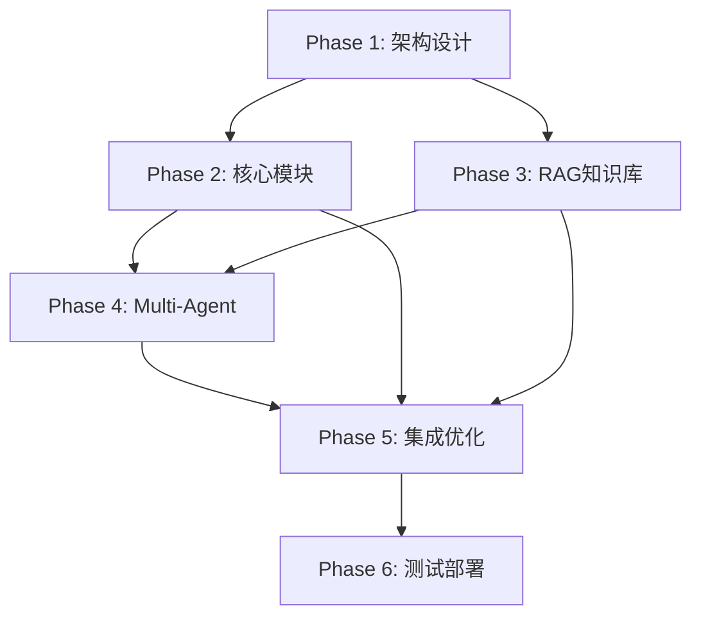

# AI驱动固件智能测试系统 — 工作计划（WORK_PLAN_V2）

> 文档版本：v2.0
>
> 目标：制定详细的分阶段工作计划，确保项目有序推进和成功交付
>
> 基于：Phase 1 架构设计与需求分析阶段成果，遵循REQUIREMENTS.md的18点核心需求

---

## 1. 项目总体目标与范围

### 1.1 项目愿景

构建"AI驱动固件智能测试系统"，实现从"人工驱动、经验分散"到"自动驱动、知识可复用"的转变，通过多Agent协作自动化完成"修改C代码 → 启动测试 → 收集结果 → 归因分析 → 决策下一步"的闭环循环。

### 1.2 核心目标

**业务目标**：
- 将固件改动的验证闭环从人工驱动转为自动驱动
- 缩短从问题出现到定位/修复建议输出的时间
- 形成可审计、可追溯、可复现的工程化流程
- 实现经验的可复用和产品线间的快速迁移

**技术目标**：
- 建立基于LangGraph的多Agent协作架构
- 实现LangGraph驱动的状态机控制系统
- 构建RAG增强的知识库系统
- 支持QEMU+目标板的混合测试环境
- 提供CLI和Web双入口的用户界面

### 1.3 项目范围

**In Scope（本系统必须覆盖）**：
- 面向固件代码的自动化修改建议与落地（至少覆盖C代码）
- 多环境测试执行与统一抽象：QEMU + 至少一种真实板路径
- 测试结果采集、结构化解析、失败归因与可操作结论输出
- 循环决策：是否继续迭代、如何选择下一步动作、何时升级人工介入
- 知识沉淀：将每次迭代的输入/输出/上下文固化到知识库
- 与Redmine、GitLab CI等外部系统的集成能力
- 对话与文档导入接口（用于KB增量构建）

**Out of Scope（本阶段不强制）**：
- 替代现有编译系统/CI系统（系统应"对接"而非"重建"）
- 强制覆盖所有硬件形态与所有测试框架（需通过插件化扩展）
- 将所有决策完全自动化（必须允许人工确认/审批/中断）

### 1.4 技术架构概览

基于Phase 1成果确定的技术架构：

```yaml
核心框架:
  - 状态机与编排: LangGraph (LangChain Ecosystem)
  - Agent运行时: LangChain
  - RAG引擎: LangChain + Qdrant
  - 向量数据库: Qdrant
  - 关系数据库: PostgreSQL
  
执行环境:
  - 测试环境: QEMU + 目标板 (BMC/树莓派/Windows)
  - 代码处理: Tree-sitter (C/C++语法解析)
  - 大模型: 内网API (优先) / OpenAI API (备选)
  
工程实践:
  - 配置管理: Pydantic Settings
  - 日志系统: Structlog
  - 监控: Prometheus + Grafana
  - CI/CD: GitLab CI
```

### 1.5 Agent体系架构

**四大核心Agent**（基于AGENT_DESIGN.md）：

1. **CodeAgent**：代码分析与修改专家
   - 职责：代码解析、静态分析、问题诊断、修改建议生成、代码实现
   - 目标：高准确率问题识别（>85%）、可应用代码建议（>70%）

2. **TestAgent**：测试执行与控制专家
   - 职责：测试环境管理、用例执行、结果收集、性能监控
   - 支持：QEMU适配器、目标板适配器、测试框架统一抽象

3. **AnalysisAgent**：结果分析与决策专家
   - 职责：测试结果分析、失败归因、根因分析、决策建议
   - 能力：日志解析、模式识别、趋势分析、收敛判断

4. **KBAgent**：知识库管理专家
   - 职责：知识沉淀、检索增强、经验复用、文档管理
   - 支持：RAG检索、向量搜索、知识图谱、对话接口

---

## 2. Phase 1 总结与成果确认

### 2.1 Phase 1 完成情况

**总体进度**：✅ 已完成（100%）

**已完成的核心文档**：

1. **REQUIREMENTS.md** ✅（任务1-1）
   - 内容：18点核心需求的详细规范（FR-01~FR-24, NFR-01~NFR-20）
   - 规模：550+行，涵盖功能需求、非功能需求、测试环境需求、知识库需求等
   - 成果：建立了完整的需求追溯体系，定义了验收标准和优先级

2. **KNOWLEDGE_SCHEMA.md** ✅（任务1-2）
   - 内容：KnowledgeUnit数据模型、产品线标签体系、数据库Schema
   - 规模：1400+行，详细定义了向量数据库和关系数据库的结构
   - 成果：设计了混合存储架构，支持语义检索和结构化查询

3. **ARCHITECTURE_V2.md** ✅（任务1-3）
   - 内容：分层架构设计、Agent职责、技术栈选择、数据流设计
   - 规模：2700+行，定义了Layer 1-7的完整架构
   - 成果：确立了基于LangGraph+LangChain的技术路线

4. **AGENT_DESIGN.md** ✅（任务1-4）
   - 内容：4个Agent的详细设计、能力定义、接口规范
   - 规模：1900+行，详细描述了Agent的协作机制
   - 成果：明确了Agent的职责边界和协作协议

5. **STATE_MACHINE.md** ✅（任务1-4）
   - 内容：状态定义、状态转移图、错误恢复策略、循环控制
   - 规模：350+行，定义了IDLE到SUCCESS的完整状态流转
   - 成果：建立了可控、可恢复、可解释的执行控制机制

### 2.2 Phase 1 关键成果确认

**架构设计成果**：
- ✅ 确立了多Agent协作+状态机驱动+知识增强的混合架构
- ✅ 定义了7层分层架构和清晰的技术栈选择
- ✅ 建立了Agent间标准化通信协议和数据接口

**需求规范成果**：
- ✅ 将18点业务需求细化为可实现的24个功能需求和18个非功能需求
- ✅ 建立了完整的需求追溯链条和验收标准体系
- ✅ 定义了测试环境抽象和多产品线支持策略

**知识库设计成果**：
- ✅ 设计了向量数据库+关系数据库+文件系统的混合存储架构
- ✅ 建立了KnowledgeUnit标准模型和标签体系
- ✅ 定义了RAG检索机制和对话接口规范

### 2.3 Phase 1 质量保证

**文档质量检查**：
- ✅ 所有文档格式统一，遵循相同的版本管理规范
- ✅ 文档间交叉引用准确，无内容冲突或矛盾
- ✅ 技术方案具有可行性和可扩展性

**架构评审结果**：
- ✅ 技术栈选择合理，利用成熟的开源框架
- ✅ 架构设计符合微服务思想，具备良好的模块化
- ✅ 性能、安全、可维护性等非功能需求得到充分考虑

---

## 3. Phase 2 详细计划

### 3.1 Phase 2 概述

**阶段名称**：核心模块实现（Core Module Implementation）
**预计时间**：7-10天
**目标**：基于Phase 1的架构设计，实现系统核心基础模块

### 3.2 详细工作计划

| Phase 2 核心模块实现 |  |
|---|---|
| **目标** | 建立系统的核心基础框架，实现代码分析、测试执行、结果分析的基础能力 |
| **关键工作项** | 1. 项目结构搭建和基础框架 ✅<br/>2. CodeAgent核心功能实现 ✅<br/>3. TestAgent基础执行能力<br/>4. AnalysisAgent分析引擎<br/>5. 基础日志和配置系统<br/>6. 单元测试覆盖 |
| **交付物** | - 核心框架代码（src/core/）<br/>- CodeAgent实现（src/agents/code_agent.py）<br/>- TestAgent实现（src/agents/test_agent.py）<br/>- AnalysisAgent实现（src/agents/analysis_agent.py）<br/>- 配置管理系统（src/config/）<br/>- 日志系统（src/logging/）<br/>- 单元测试套件（tests/unit/）<br/>- 开发文档（docs/implementation/） |
| **完成标准** | 1. 项目结构清晰，模块间依赖关系明确<br/>2. CodeAgent能够解析C代码并生成基本修改建议<br/>3. TestAgent能够执行简单的QEMU测试用例<br/>4. AnalysisAgent能够解析基础测试结果<br/>5. 配置系统支持多环境切换<br/>6. 日志系统提供结构化输出<br/>7. 单元测试覆盖率达到70%+<br/>8. 代码通过静态检查和质量门禁 |
| **预计时间** | 7-10天（开发7天，测试2天，文档1天） |

### 3.3 技术实现重点

**代码分析模块**：
- 集成Tree-sitter C/C++解析器
- 实现代码结构分析和依赖关系提取
- 建立符号表和AST（抽象语法树）
- 支持静态分析和规则引擎

**测试执行模块**：
- 实现QEMU适配器的基础接口
- 建立测试环境抽象层
- 支持测试用例的定义和执行
- 实现结果收集和标准化

**结果分析模块**：
- 实现日志解析和错误模式识别
- 建立基础的分析规则和模板
- 支持简单的归因分析
- 提供分析结果的结构化输出

### 3.4 Phase 2 执行注意事项 (基于文档审核)

根据 2026-01-31 完成的文档审核，在 Phase 2 开发中需严格执行以下准则：

1. **代码与设计的一致性控制**
   - **风险**：`src/agents/` 现有脚手架较为简单，开发时容易偏离 `DETAILED_DESIGN_V2.md` 定义的详尽接口。
   - **措施**：在 Task 2-1 启动时，必须严格照搬设计文档中的类图（如 `CodeAnalyzer`）和接口定义生成代码，禁止随意简化。

2. **安全过滤器集成** (新增)
   - **风险**：`SecretFilter` 类已实现但在 `BaseAgent` 或日志系统中未被显式调用，可能导致敏感信息泄露。
   - **措施**：在 Phase 2 开发中，将 `SecretFilter` 集成到全局日志配置中，确保所有输出经过脱敏处理。

3. **LangGraph 集成优先验证**
   - **风险**：LangGraph 的状态持久化（Checkpointing）和人工介入（Human-in-the-loop）机制较复杂。
   - **措施**：将 **Task 2-0-1 (LangGraph POC)** 列为最高优先级。若验证失败，需立即调整 `STATE_MACHINE.md`。

4. **文档与代码同步更新**
   - **风险**：开发进度快于文档更新，导致文档再次过时。
   - **措施**：执行"文档驱动开发"（Documentation Driven Development），代码变更需同步更新 `API_SPEC.md` 和 `DETAILED_DESIGN_V2.md`。

---

## 4. Phase 3 详细计划

### 4.1 Phase 3 概述

**阶段名称**：RAG知识库系统（Knowledge Base System）
**预计时间**：5-7天
**目标**：实现完整的RAG知识库系统，支持知识沉淀和检索增强

### 4.2 详细工作计划

| Phase 3 RAG知识库系统 | |
|---|---|
| **目标** | 建立完整的RAG知识库系统，实现知识的结构化存储、检索增强和经验复用 |
| **关键工作项** | 1. Qdrant向量数据库部署和配置<br/>2. PostgreSQL关系数据库设计<br/>3. KnowledgeUnit模型实现<br/>4. RAG检索引擎开发<br/>5. 知识沉淀流程实现<br/>6. 文档导入和解析功能<br/>7. 知识图谱构建 |
| **交付物** | - 向量数据库部署脚本（scripts/deploy_qdrant.sh）<br/>- 数据库Schema定义（src/database/schema.sql）<br/>- KnowledgeUnit数据模型（src/models/knowledge.py）<br/>- RAG检索引擎（src/retrieval/rag_engine.py）<br/>- 知识沉淀服务（src/services/knowledge_service.py）<br/>- 文档解析器（src/processors/document_processor.py）<br/>- 向量化服务（src/services/embedding_service.py）<br/>- 知识库API（src/api/knowledge_api.py）<br/>- 知识库管理界面（src/ui/knowledge_ui.py） |
| **完成标准** | 1. Qdrant和PostgreSQL成功部署并配置<br/>2. KnowledgeUnit模型支持完整的数据CRUD操作<br/>3. RAG引擎支持语义检索和混合查询<br/>4. 知识沉淀流程支持自动和手动触发<br/>5. 文档导入支持Markdown、TXT格式<br/>6. 向量化模型集成完成<br/>7. 知识库查询响应时间<2秒<br/>8. 支持产品线标签过滤和TopK检索<br/>9. 检索准确率达到80%+ |
| **预计时间** | 5-7天（开发4天，测试2天，集成1天） |

### 4.3 技术实现重点

**向量数据库**：
- Qdrant集群部署和性能调优
- 向量索引策略和检索优化
- 支持动态更新和删除
- 实现增量同步和备份恢复

**关系数据库**：
- PostgreSQL Schema设计和优化
- 建立完整的数据关系映射
- 实现事务管理和数据一致性
- 支持复杂查询和统计分析

**RAG检索引擎**：
- 实现语义检索和向量相似度计算
- 支持混合检索（向量+关键词）
- 建立重排序和过滤机制
- 实现检索结果的质量评估

---

## 5. Phase 4 详细计划

### 5.1 Phase 4 概述

**阶段名称**：Multi-Agent系统（Multi-Agent Coordination）
**预计时间**：5-7天
**目标**：基于LangGraph实现多Agent协作系统，建立Agent间的通信和协调机制

### 5.2 详细工作计划

| Phase 4 Multi-Agent系统 | |
|---|---|
| **目标** | 建立基于LangGraph的多Agent协作系统，实现Agent间的有效通信和任务协调 |
| **关键工作项** | 1. LangGraph编排逻辑集成<br/>2. KBAgent完整实现<br/>3. 状态共享机制实现<br/>4. 任务队列和调度系统<br/>5. Agent生命周期管理<br/>6. 错误处理和重试机制<br/>7. Agent性能监控 |
| **交付物** | - 编排配置（src/coordination/graph_config.py）<br/>- KBAgent实现（src/agents/kb_agent.py）<br/>- 状态定义（src/state/schema.py）<br/>- 任务调度器（src/coordination/task_scheduler.py）<br/>- Agent管理器（src/coordination/agent_manager.py）<br/>- 错误处理框架（src/coordination/error_handler.py）<br/>- 性能监控（src/monitoring/agent_monitor.py）<br/>- Agent配置管理（src/config/agents/）<br/>- 集成测试套件（tests/integration/test_agents.py） |
| **完成标准** | 1. LangGraph成功集成并正确配置<br/>2. KBAgent实现知识库完整操作能力<br/>3. Agent间通信延迟<100ms<br/>4. 任务调度支持优先级和依赖关系<br/>5. Agent生命周期管理稳定可靠<br/>6. 错误恢复成功率>90%<br/>7. 系统支持并发执行多个Agent<br/>8. 监控数据完整准确<br/>9. 通过端到端协作测试 |
| **预计时间** | 5-7天（开发4天，集成2天，测试1天） |

### 5.3 技术实现重点

**Agent协作机制**：
- 设计高效的状态流转图
- 实现基于全局状态的数据共享
- 建立冲突检测和解决机制
- 支持动态扩缩容和故障转移

**通信协议**：
- 定义标准化的Agent消息格式
- 实现可靠的消息传递机制
- 支持异步通信和事件驱动
- 建立通信状态监控和健康检查

---

## 6. Phase 5 详细计划

### 6.1 Phase 5 概述

**阶段名称**：集成与优化（Integration & Optimization）
**预计时间**：4-6天
**目标**：完成系统集成，优化性能，建立完整的用户界面和API接口

### 6.2 详细工作计划

| Phase 5 集成与优化 | |
|---|---|
| **目标** | 完成系统各模块集成，优化整体性能，建立用户友好的界面和API |
| **关键工作项** | 1. 系统集成和端到端测试<br/>2. LangGraph状态机集成<br/>3. CLI界面完整实现<br/>4. Web API接口开发<br/>5. 性能优化和调优<br/>6. 安全加固和权限控制<br/>7. 监控和告警系统<br/>8. 部署和运维工具 |
| **交付物** | - 系统集成代码（src/integration/）<br/>- LangGraph状态机（src/state/graph.py）<br/>- CLI完整实现（src/cli/）<br/>- REST API服务（src/api/rest_api.py）<br/>- Web管理界面（src/ui/web_ui/）<br/>- 性能优化模块（src/optimization/）<br/>- 安全控制模块（src/security/）<br/>- 监控系统（src/monitoring/）<br/>- 部署脚本（scripts/deploy/）<br/>- 集成测试套件（tests/integration/） |
| **完成标准** | 1. 所有模块成功集成，无关键缺陷<br/>2. LangGraph状态机正确控制执行流程<br/>3. CLI支持所有核心功能命令<br/>4. API接口通过所有功能测试<br/>5. 系统性能达到预期指标<br/>6. 安全测试通过，无高危漏洞<br/>7. 监控告警系统正常工作<br/>8. 部署流程自动化且可靠<br/>9. 用户文档完整准确 |
| **预计时间** | 4-6天（集成3天，优化2天，文档1天） |

### 6.3 技术实现重点

**系统集成**：
- 建立统一的配置管理和环境抽象
- 实现跨模块的数据流和状态同步
- 建立统一的错误处理和日志记录
- 确保模块间的松耦合和高内聚

**用户界面**：
- 设计直观易用的CLI交互界面
- 开发功能完整的Web管理界面
- 实现实时状态监控和进度显示
- 提供丰富的配置和定制选项

---

## 7. Phase 6 详细计划

### 7.1 Phase 6 概述

**阶段名称**：测试与部署（Testing & Deployment）
**预计时间**：3-5天
**目标**：进行全面的系统测试，完成部署配置，确保系统稳定运行

### 7.2 详细工作计划

| Phase 6 测试与部署 | |
|---|---|
| **目标** | 完成全面系统测试，建立生产环境部署方案，确保系统稳定可靠运行 |
| **关键工作项** | 1. 端到端测试执行<br/>2. 性能和压力测试<br/>3. 安全渗透测试<br/>4. 用户验收测试<br/>5. 生产环境部署<br/>6. 监控和告警配置<br/>7. 备份和恢复测试<br/>8. 用户培训和文档 |
| **交付物** | - 端到端测试报告（reports/e2e_test_report.pdf）<br/>- 性能测试报告（reports/performance_test_report.pdf）<br/>- 安全测试报告（reports/security_test_report.pdf）<br/>- 部署配置（config/production/）<br/>- 运维手册（docs/operations/）<br/>- 用户手册（docs/user_guide/）<br/>- 培训材料（docs/training/）<br/>- 部署脚本（scripts/production/）<br/>- 监控配置（monitoring/production/）<br/>- 应急响应预案（docs/incident_response.md） |
| **完成标准** | 1. 端到端测试通过率>95%<br/>2. 性能测试达到预期指标<br/>3. 安全测试无高危漏洞<br/>4. 用户验收测试全部通过<br/>5. 生产环境部署成功<br/>6. 监控系统正常运行<br/>7. 备份恢复机制验证通过<br/>8. 用户培训完成<br/>9. 所有文档完整准确 |
| **预计时间** | 3-5天（测试2天，部署2天，培训1天） |

### 7.3 测试策略

**测试金字塔**：
- 单元测试：覆盖所有核心模块和函数
- 集成测试：验证模块间协作
- 端到端测试：验证完整业务流程
- 性能测试：验证系统容量和响应时间
- 安全测试：验证系统安全性

---

## 8. 关键依赖关系分析

### 8.1 技术依赖关系



### 8.2 并行可执行性分析

**可以并行执行的工作**：

1. **Phase 2 和 Phase 3 部分并行**：
   - 核心模块开发与数据库部署可同时进行
   - 需要协调统一的接口定义和数据格式

2. **Phase 4 中的子模块并行**：
   - LangGraph集成和KBAgent开发可并行
   - 通信协议和任务调度可独立开发

**严格的顺序依赖**：

1. **Phase 1 → Phase 2**：架构设计完成后才能开始核心模块开发
2. **Phase 2,3 → Phase 4**：需要基础模块和知识库就绪
3. **Phase 4 → Phase 5**：需要多Agent协作能力
4. **Phase 5 → Phase 6**：需要集成优化完成

### 8.3 关键路径识别

**最长依赖链**：Phase 1 → Phase 2 → Phase 4 → Phase 5 → Phase 6
**预计总工期**：约29-35天（按最短时间计算）

---

## 9. 风险识别与缓解措施

### 9.1 技术风险

| 风险项 | 概率 | 影响 | 风险等级 | 缓解措施 |
|--------|------|------|----------|----------|
| LangGraph状态机集成复杂度 | 中 | 高 | 高 | 1. 提前进行POC验证<br/>2. 完善状态定义<br/>3. 寻求社区技术支持 |
| LangGraph状态机性能问题 | 中 | 中 | 中 | 1. 性能基准测试<br/>2. 状态机优化和缓存策略<br/>3. 异步执行优化 |
| 向量数据库性能瓶颈 | 低 | 高 | 中 | 1. Qdrant集群部署<br/>2. 向量索引优化<br/>3. 读写分离架构 |
| 大模型API稳定性问题 | 中 | 中 | 中 | 1. 多模型备选方案<br/>2. 本地化模型支持<br/>3. 请求重试和降级机制 |

### 9.2 项目风险

| 风险项 | 概率 | 影响 | 风险等级 | 缓解措施 |
|--------|------|------|----------|----------|
| 开发进度延期 | 中 | 高 | 高 | 1. 详细的任务分解和时间估算<br/>2. 定期进度检查和调整<br/>3. 关键路径资源优先保障 |
| 人员技能不匹配 | 低 | 中 | 低 | 1. 提前技能评估和培训<br/>2. 外部专家咨询<br/>3. 知识分享和文档化 |
| 需求变更频繁 | 中 | 中 | 中 | 1. 需求冻结机制<br/>2. 变更影响评估<br/>3. 敏捷开发方法 |
| 集成测试复杂度高 | 高 | 中 | 中 | 1. 持续集成和测试<br/>2. 模块独立测试<br/>3. 自动化测试覆盖 |

### 9.3 外部风险

| 风险项 | 概率 | 影响 | 风险等级 | 缓解措施 |
|--------|------|------|----------|----------|
| 第三方依赖版本变更 | 低 | 中 | 低 | 1. 版本锁定和依赖管理<br/>2. 定期依赖更新检查<br/>3. 兼容性测试 |
| 生产环境差异 | 中 | 中 | 中 | 1. 容器化部署<br/>2. 环境标准化<br/>3. 部署验证清单 |
| 安全合规要求 | 低 | 高 | 中 | 1. 安全设计审查<br/>2. 定期安全扫描<br/>3. 合规检查清单 |

---

## 10. 人员分配建议

### 10.1 团队组织架构

**核心团队构成**（建议5-7人）：

1. **技术负责人**（1人）
   - 职责：技术架构决策、进度把控、质量监督
   - 技能要求：10+年软件开发经验，AI/ML项目经验
   - 参与阶段：全程参与，重点关注Phase 1, 4, 5

2. **后端开发工程师**（2-3人）
   - 职责：核心模块开发、Agent实现、系统集成
   - 技能要求：Python开发、机器学习、分布式系统
   - 参与阶段：全程参与，主要负责Phase 2, 3, 4

3. **DevOps工程师**（1人）
   - 职责：CI/CD、部署运维、监控系统
   - 技能要求：Docker、Kubernetes、监控工具
   - 参与阶段：主要负责Phase 5, 6

4. **QA测试工程师**（1人）
   - 职责：测试策略制定、自动化测试、质量保证
   - 技能要求：测试框架、性能测试、安全测试
   - 参与阶段：主要负责Phase 2, 5, 6

5. **产品经理**（1人）
   - 职责：需求管理、用户验收、项目协调
   - 技能要求：AI产品经验、技术背景
   - 参与阶段：全程参与，重点关注Phase 1, 5, 6

### 10.2 技能要求矩阵

| 技能领域 | 技术负责人 | 后端开发 | DevOps | QA | 产品经理 |
|----------|------------|----------|--------|-------|----------|
| Python开发 | ✅ | ✅ | ✅ | ✅ | ❌ |
| AI/ML框架 | ✅ | ✅ | ❌ | ❌ | ✅ |
| 分布式系统 | ✅ | ✅ | ✅ | ❌ | ❌ |
| 数据库设计 | ✅ | ✅ | ❌ | ❌ | ❌ |
| 容器化技术 | ✅ | ✅ | ✅ | ❌ | ❌ |
| 监控运维 | ✅ | ❌ | ✅ | ❌ | ❌ |
| 测试策略 | ✅ | ❌ | ❌ | ✅ | ❌ |
| 项目管理 | ✅ | ❌ | ❌ | ❌ | ✅ |

---

## 11. 成功标准和度量指标

### 11.1 功能性成功标准

**核心功能指标**：
- ✅ CodeAgent能够自动解析C代码并生成可应用的修改建议（准确率≥85%）
- ✅ TestAgent能够成功执行QEMU和目标板测试用例（成功率≥90%）
- ✅ AnalysisAgent能够准确分析测试结果并给出合理建议（准确率≥80%）
- ✅ KBAgent能够有效管理知识库并提供准确检索（召回率≥85%）
- ✅ 多Agent协作系统能够稳定运行（系统可用性≥99%）

**业务指标**：
- 单次迭代循环平均耗时降低50%+
- 自动化执行比例达到70%+
- 知识库命中率≥80%，复用次数持续增长
- 失败用例可复现率达到95%+

### 11.2 非功能性成功标准

**性能指标**：
- API响应时间P95 < 2秒，P99 < 5秒
- 知识库检索响应时间 < 2秒
- 系统并发支持 ≥ 10个任务同时执行
- 单个Agent任务处理时间 < 30分钟

**可靠性指标**：
- 系统整体可用性 ≥ 99.5%
- 数据持久化成功率 = 100%
- 错误恢复成功率 ≥ 90%
- 备份恢复时间 < 30分钟

**安全指标**：
- 无高危安全漏洞
- 敏感数据加密存储 = 100%
- 访问控制覆盖率 = 100%
- 审计日志完整性 = 100%

### 11.3 用户体验指标

**易用性指标**：
- CLI界面操作学习时间 < 2小时
- Web界面任务创建成功率 ≥ 95%
- 用户满意度评分 ≥ 4.0/5.0
- 帮助文档完整性评分 ≥ 4.5/5.0

**可维护性指标**：
- 代码覆盖率 ≥ 80%
- 代码复杂度控制在合理范围
- 文档完整性 ≥ 90%
- 模块耦合度 ≤ 中等水平

### 11.4 可验证的度量方法

**自动化度量**：
1. 持续集成流水线中的自动化测试
2. 性能监控系统的实时指标收集
3. 代码质量扫描工具的静态分析
4. 安全扫描工具的定期检查

**手动验证**：
1. 每月用户满意度调查
2. 季度技术债务评估
3. 半年度架构评审
4. 年度全面安全审计

---

## 12. 文档质量改进计划

### 12.1 文档审查总结

**审查日期**：2026-01-30
**审查范围**：项目全部设计文档
**总体评分**：7.5/10

本章节记录了文档审查中发现的所有问题及其修复计划，确保项目文档的完整性、准确性和一致性。

### 12.2 P0级问题（阻塞级 - 必须立即修复）

#### 12.2.1 DETAILED_DESIGN_V2.md 严重不完整

**问题描述**：
- 当前仅97行，严重缺乏实现细节
- 缺少核心引擎的详细设计规格
- 缺少数据结构定义、算法描述、接口规范

**修复任务**：
| 编号 | 任务 | 预计时间 | 负责人 |
|------|------|----------|--------|
| P0-1-1 | 补充CodeAnalyzer详细设计（类图、时序图、接口定义） | 0.5天 | 架构师 |
| P0-1-2 | 补充CodeModifier详细设计（修改策略、补丁格式、安全检查） | 0.5天 | 架构师 |
| P0-1-3 | 补充TestOrchestrator详细设计（环境适配器、生命周期管理） | 0.5天 | 架构师 |
| P0-1-4 | 补充ResultAnalyzer详细设计（日志解析、根因分析算法） | 0.5天 | 架构师 |
| P0-1-5 | 添加数据流图和状态转换图 | 0.5天 | 架构师 |

**预计总时间**：2-3天
**完成标准**：文档扩展至800-1000行，覆盖所有核心引擎的详细设计

#### 12.2.2 API_SPEC.md 严重不完整

**问题描述**：
- 当前仅65行，缺少关键API规范
- 缺少请求/响应模型定义
- 缺少错误码体系
- 缺少认证授权规范
- 缺少版本管理策略

**修复任务**：
| 编号 | 任务 | 预计时间 | 负责人 |
|------|------|----------|--------|
| P0-2-1 | 使用OpenAPI 3.0规范重写API定义 | 0.5天 | 后端开发 |
| P0-2-2 | 定义完整的请求/响应模型（Pydantic Schema） | 0.5天 | 后端开发 |
| P0-2-3 | 设计错误码体系（业务错误码、系统错误码） | 0.25天 | 后端开发 |
| P0-2-4 | 添加认证授权规范（JWT/API Key方案） | 0.25天 | 后端开发 |
| P0-2-5 | 添加API版本管理和兼容性策略 | 0.25天 | 架构师 |

**预计总时间**：1-2天
**完成标准**：符合OpenAPI 3.0规范，包含完整的请求/响应示例

### 12.3 P1级问题（高优先级 - Phase 2开始前修复）

#### 12.3.1 REQUIREMENTS.md 内容截断

**问题描述**：
- 测试环境需求TR-07~TR-14章节缺失
- 知识库需求KR章节缺失
- 需求编号存在跳跃（FR-18→FR-24）

**修复任务**：
| 编号 | 任务 | 预计时间 | 负责人 |
|------|------|----------|--------|
| P1-1-1 | 补充TR-07~TR-14测试环境需求 | 0.5天 | 产品经理 |
| P1-1-2 | 补充KR-01~KR-XX知识库需求 | 0.5天 | 产品经理 |
| P1-1-3 | 修复需求编号连续性 | 0.25天 | 产品经理 |

**预计总时间**：1天

#### 12.3.2 AGENT_DESIGN.md KBAgent设计不足

**问题描述**：
- KBAgent章节仅有基础描述
- 缺少RAG检索流程详细设计
- 缺少知识沉淀机制详细设计
- 缺少与其他Agent的交互协议

**修复任务**：
| 编号 | 任务 | 预计时间 | 负责人 |
|------|------|----------|--------|
| P1-2-1 | 扩展KBAgent职责和能力定义 | 0.25天 | 架构师 |
| P1-2-2 | 添加RAG检索流程详细设计 | 0.25天 | 架构师 |
| P1-2-3 | 添加知识沉淀触发机制设计 | 0.25天 | 架构师 |
| P1-2-4 | 补充KBAgent与其他Agent的交互协议 | 0.25天 | 架构师 |

**预计总时间**：1天

#### 12.3.3 PHASE_2_TASK_BREAKDOWN.md 缺少POC任务

**问题描述**：
- 缺少技术验证（POC）任务
- 未包含LangGraph集成验证
- 未包含Tree-sitter集成验证
- 未包含Qdrant部署验证

**修复任务**：
| 编号 | 任务 | 预计时间 | 负责人 |
|------|------|----------|--------|
| P1-3-1 | 添加任务2-0：技术POC验证 | 0.25天 | 架构师 |
| P1-3-2 | 定义LangGraph集成验证标准 | 0.25天 | 后端开发 |
| P1-3-3 | 定义Tree-sitter集成验证标准 | 0.25天 | 后端开发 |
| P1-3-4 | 定义Qdrant部署验证标准 | 0.25天 | DevOps |

**预计总时间**：1天

#### 12.3.4 STATE_MACHINE.md 重复定义

**问题描述**：
- ConvergenceCriteria在5.19节和第6节重复定义
- 两处定义存在细微差异，可能导致实现混淆

**修复任务**：
| 编号 | 任务 | 预计时间 | 负责人 |
|------|------|----------|--------|
| P1-4-1 | 合并5.19节和第6节的ConvergenceCriteria定义 | 0.25天 | 架构师 |
| P1-4-2 | 保留第6节作为规范定义，5.19节改为引用 | 0.25天 | 架构师 |

**预计总时间**：0.5天

### 12.4 P2级问题（中优先级 - Phase 2期间修复）

#### 12.4.1 大型文档拆分

**问题描述**：
- ARCHITECTURE_V2.md过大（107KB），难以维护
- KNOWLEDGE_SCHEMA.md过大（129KB），难以阅读
- CONFIG_MANAGEMENT.md过长（2400+行）

**修复任务**：
| 编号 | 任务 | 预计时间 | 负责人 |
|------|------|----------|--------|
| P2-1-1 | 将ARCHITECTURE_V2.md拆分为多个子文档 | 0.5天 | 架构师 |
| P2-1-2 | 将KNOWLEDGE_SCHEMA.md拆分（向量DB/关系DB/文件存储） | 0.5天 | 架构师 |
| P2-1-3 | 将CONFIG_MANAGEMENT.md拆分（核心配置/Agent配置/环境配置） | 0.5天 | 后端开发 |
| P2-1-4 | 创建文档索引和导航页 | 0.25天 | 架构师 |

**预计总时间**：2天

**拆分建议**：
```
docs/
├── architecture/
│   ├── ARCHITECTURE_OVERVIEW.md      # 架构总览
│   ├── LAYER_1_APPLICATION.md        # 应用层设计
│   ├── LAYER_2_ORCHESTRATION.md      # 编排层设计
│   ├── LAYER_3_AGENTS.md             # Agent层设计
│   ├── LAYER_4_ENGINES.md            # 引擎层设计
│   ├── LAYER_5_KNOWLEDGE.md          # 知识层设计
│   └── LAYER_6_INFRASTRUCTURE.md     # 基础设施层设计
├── knowledge/
│   ├── KNOWLEDGE_OVERVIEW.md         # 知识库总览
│   ├── VECTOR_DB_SCHEMA.md           # 向量数据库Schema
│   ├── RELATIONAL_DB_SCHEMA.md       # 关系数据库Schema
│   └── FILE_STORAGE_SCHEMA.md        # 文件存储Schema
└── config/
    ├── CONFIG_OVERVIEW.md            # 配置管理总览
    ├── SYSTEM_CONFIG.md              # 系统配置
    ├── AGENT_CONFIG.md               # Agent配置
    └── ENVIRONMENT_CONFIG.md         # 环境配置
```

### 12.5 P3级问题（低优先级 - Phase 3前修复）

#### 12.5.1 版本号标准化

**问题描述**：
- 文档版本号不一致（v1.0/v2.0/v2.1混用）
- 缺少统一的版本管理规范

**修复任务**：
| 编号 | 任务 | 预计时间 | 负责人 |
|------|------|----------|--------|
| P3-1-1 | 制定文档版本管理规范 | 0.25天 | 架构师 |
| P3-1-2 | 统一所有文档版本号为v2.0 | 0.25天 | 架构师 |
| P3-1-3 | 添加版本变更日志 | 0.25天 | 架构师 |

**预计总时间**：0.5天

#### 12.5.2 历史文档归档

**问题描述**：
- 部分历史文档已删除但仍被引用
- 缺少文档归档机制

**修复任务**：
| 编号 | 任务 | 预计时间 | 负责人 |
|------|------|----------|--------|
| P3-2-1 | 创建docs/archive/目录 | 0.1天 | DevOps |
| P3-2-2 | 移动废弃文档到归档目录 | 0.25天 | 架构师 |
| P3-2-3 | 更新文档引用关系 | 0.25天 | 架构师 |

**预计总时间**：0.5天

### 12.6 跨文档一致性修复

| 编号 | 问题 | 涉及文档 | 修复方案 | 预计时间 |
|------|------|----------|----------|----------|
| INC-01 | ConvergenceCriteria重复定义 | STATE_MACHINE.md | 合并定义，保留第6节 | 0.25天 |
| INC-02 | CodeAnalyzer签名不匹配 | DETAILED_DESIGN_V2.md, src/tools/ | 以代码实现为准更新文档 | 0.25天 |
| INC-03 | Agent调用风格不一致 | AGENT_DESIGN.md, STATE_MACHINE.md | 统一使用LangGraph节点调用风格 | 0.25天 |
| INC-04 | 版本号不一致 | 全部文档 | 统一为v2.0 | 0.25天 |
| INC-05 | 需求编号跳跃 | REQUIREMENTS.md | 补充缺失需求或重新编号 | 0.25天 |

**预计总时间**：1天

### 12.7 文档改进时间线

```
Phase 2 开始前（必须完成）
├─ Week 1 Day 1-2: P0-1 DETAILED_DESIGN_V2.md 完善
├─ Week 1 Day 2-3: P0-2 API_SPEC.md 重写
├─ Week 1 Day 3:   P1-1 REQUIREMENTS.md 补充
├─ Week 1 Day 4:   P1-2 AGENT_DESIGN.md KBAgent扩展
├─ Week 1 Day 4:   P1-3 PHASE_2_TASK_BREAKDOWN.md POC任务
└─ Week 1 Day 5:   P1-4 STATE_MACHINE.md 去重 + 一致性修复

Phase 2 期间（并行完成）
├─ Week 2-3: P2-1 大型文档拆分
└─ Week 3:   P2-1-4 创建文档索引

Phase 3 开始前
├─ P3-1 版本号标准化
└─ P3-2 历史文档归档
```

### 12.8 文档改进验收标准

**P0级验收标准**：
- [x] DETAILED_DESIGN_V2.md 扩展至800-1000行
- [x] DETAILED_DESIGN_V2.md 包含所有核心引擎的类图和时序图
- [x] API_SPEC.md 符合OpenAPI 3.0规范
- [x] API_SPEC.md 包含完整的请求/响应示例
- [x] API_SPEC.md 包含错误码体系和认证规范

**P1级验收标准**：
- [x] REQUIREMENTS.md 包含完整的TR和KR章节
- [x] AGENT_DESIGN.md KBAgent章节扩展至与其他Agent同等详细程度
- [x] PHASE_2_TASK_BREAKDOWN.md 包含POC验证任务
- [x] STATE_MACHINE.md 无重复定义

**P2级验收标准**：
- [ ] 大型文档拆分完成
- [ ] 文档导航索引创建完成
- [ ] 拆分后的文档可独立阅读

**P3级验收标准**：
- [ ] 所有文档版本号统一为v2.0
- [ ] 历史文档归档完成
- [ ] 文档引用关系更新完成

---

## 13. 总结与下一步行动

### 12.1 项目总体评估

本工作计划基于Phase 1架构设计与需求分析阶段的扎实成果，为项目的成功实施提供了清晰的路线图。通过6个阶段的渐进式开发，项目将建立起一个功能完整、性能优良、用户友好的AI驱动固件智能测试系统。

**关键成功因素**：
1. **技术架构合理**：基于成熟的开源框架，降低技术风险
2. **需求定义清晰**：18点核心需求细化完整，确保开发方向明确
3. **进度计划可行**：时间估算合理，关键路径识别清楚
4. **团队配置适当**：技能匹配度好，分工明确
5. **风险管控到位**：风险识别全面，缓解措施具体

### 12.2 下一步行动

**立即行动**（Phase 1完成后）：
1. **人员到位**：按人员分配建议组建核心开发团队
2. **环境准备**：搭建开发、测试、生产环境
3. **Phase 2启动**：开始核心模块实现

**近期行动**（未来2周内）：
1. 完善Phase 2的详细任务分解
2. 进行技术POC验证（LangGraph集成、Qdrant部署等）
3. 建立开发规范和代码审查流程

**中期行动**（未来1个月）：
1. 按计划推进Phase 2-3的开发工作
2. 建立持续集成和测试流水线
3. 定期进行进度检查和风险评估

### 12.3 项目价值与意义

**技术价值**：
- 建立了AI在固件测试领域的创新应用模式
- 为传统软件开发流程的智能化改造提供参考
- 推动了多Agent协作技术在工业场景的落地

**业务价值**：
- 显著提升固件开发和测试效率
- 降低人工依赖，提高测试质量
- 实现知识积累和经验传承的自动化

**社会价值**：
- 推动固件开发行业的数字化转型
- 为其他AI+工程领域提供可复制的解决方案
- 培养复合型AI工程人才

---

**文档版本**：v2.0  
**最后更新**：2026-01-27  
**维护者**：AI Agent  
**审核者**：项目技术负责人